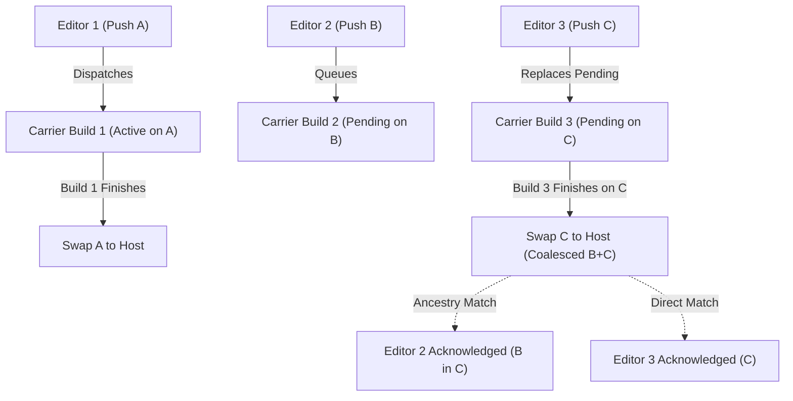

# Fleet directives — opencrabs-dev cross-role law

**Owns:** the binding owner directives that apply to EVERY opencrabs-dev lane — the `[LANE]` law every worker reads in full at spawn and at compaction reload, plus a residual of cross-cutting rulings that belong to no single role. 

**Shape after the 2026-09-18 split.** Role- and topic-scoped law no longer lives here: 25 sections were relocated byte-exact into the file that owns them, and this file keeps a pointer only — one concept, one home. Read scoped law THERE:

| Kind of law | Canonical file |
|---|---|
| sync model & rebase, seam resolution, harvest cadence / HARVEST LAW / NO-HOLD, PHOP | `upstream-merge-runbook.md` |
| editor phases, smoke procedure, carrier hotfix gates, swap-sha coverage, no auto-rollback | `editor.md` |
| upstream PR lifecycle, deep-core heads-up gate, dependent PRs law, cross-fork PR inspection, upstream issue filings | `editor-upstream-pr.md` |
| intake & assignment, dispatch hygiene, parked issues, creating new editors, night-shift cadence (Phase 3, Idle-Lane Issue Triage) | `triage.md` |
| tool-problem reports | `toolsmith.md` |
| HQ duties, cadence boundary, rule-text provenance | `hq.md` |
| Duty-6 lens briefs (A–J families + brain-scrub) | `review-lenses.md` |
| post-swap notify / fan-out vocabulary | `s2-swap-journal-spec.md` |

**Thematic index** (lens B-17/G-F9 v0.4.90 — file is flat; jump via section name). **[LANE] tag (v0.4.95):** sections every worker MUST read in full at spawn/compaction reload (editor.md/triage.md/toolsmith.md/hq.md RELOAD LAW v0.4.95). EXCEPTION (v0.4.96, lens B-F1): HQ re-reads THIS ENTIRE FILE IN FULL — it owns and rules on the directives; the other three roles may use this thematic-index minimum for non-[LANE] sections.

**Owner holds & gates:** **Owner Push Freeze — RETIRED** (see its section; now SOAKING + global DEGRADED freeze) · **Discussion links + fix-approval gate** · **Stage-entry consent** · **Guard-Flag Escalation Law** · **Full-Gate Pre-PR Testing Law** · **Docs-Only LEG1 Gate Skip** · **Owner-Dependent Smoke Legs**

**Roles & authority:** **Autonomous Priority Authority Law** · **Autonomous Editor Goal & Continuous Phase Execution Law** · **Claim Release & Superseded Plans** · **Early Claim** · **Designated Domain Affinity & Topic Context Focus Law** · **Strict Atomicity & Zero Bundling** · **PR naming convention**

**Channels & messaging:** **Telegram surface law** · **telegram_send addressing rule** · **Cross-lane message delivery discipline** · **Direct dispatch** · **Receiver-side dedupe of reload demands** · **Attribution guard** · **Unified Event Capture**

**Ships & carriers:** **Features-compat gate** · **Carrier Concurrency & Coalescence Law** · **Post-Rewrite Swap Recovery** · **Upstream PR filing — base CI gate pre-claim** · **Upstream Coding & Testing Standards** · **LLM Ergonomics & Efficiency Law**

**Smoke & dispatch:** **Out-of-Feature-Set Issues** · **Dispatch Eligibility** · **Attribution & Goal Hygiene** · **Verification during a truncated-output window is not verification** · **External lanes**

**Pulled back to fleet-directives (tier C, 2026-09-19):** **Tool logging rule** · **CI-wait discipline & actor attribution** · **Swap-head signature for rebase/synthesis/merge-derived binaries** · **Decision Rollcall** · **Inherited-claim three-pillar verification** · **Topic domain alignment & rename authority** · **HQ does not execute lane work — refuse and reroute**

**Reload & orientation:** **Post-compaction skill reload & context manifest curation** · **Every turn ends with a "what now/next?" answer** · **Explain open questions & re-anchor context** · **Daemon no-reap**

## Owner Push Freeze — RETIRED (owner order 2026-09-24 21:04Z)

**Owner order, verbatim:** *"Remove the freeze register. It's stale. Now the concepts are soaking and degraded state with global harvest freeze"* (OC DEV Factory, Triage topic, 2026-09-24T21:04Z).

The per-group register is **gone** — its `json` block, the T1–T18 / Tier-3 table, the T3 disputed-release ruling and the pre-freeze-PR ruling are all removed with this order. **Nothing reads a frozen group any more; no lane should look for one.**

**The two concepts that replace it:**

| Concept | Home | Meaning |
|---|---|---|
| **SOAKING** | `upstream-merge-runbook.md` §24-Hour Feature Soak | unchanged — a feature soaks before its harvest is staged |
| **DEGRADED = GLOBAL harvest freeze** | `SKILL.md` §MODE REGISTER | under DEGRADED **no** upstream PR group is filed without explicit owner approval — the hold is GLOBAL, not per-group |

**Why the register was stale:** its own enforcement leg never existed (the fail-loud reader was never built), its machinery leg was vacuous (`oc-harvest-dispatch-4h` disabled), and MODE=DEGRADED already performed the same hold globally — a second mechanism for one concept. Its bookkeeping was a 2026-09-18 snapshot: T9 merged by the maintainer, one release ever (T6), T3 disputed and unresolved.

**Fork issue #358 is obsoleted by this removal** — it would build the fail-loud reader for a block that no longer exists.

## Discussion links + fix-approval gate (owner 2026-08-28 14:28Z)

1. **Whenever a PR or issue is discussed, a link must be given.** Every mention of a PR or issue number — chat, reports, ledger entries, rulings — carries the full URL (or an owner/repo#N reference that resolves to one). No bare numbers: a number without a link is an unfinished sentence. If a reference cannot be resolved to a link, say so explicitly.
2. **Owner gates EVERY implementation design (owner order 2026-09-09 ~20:03Z, supersedes the fix-scoped version).** No implementation of ANY design — fix, feature, tool, refactor, process change, any size — begins code work before the owner approves the design. The design is presented to the owner in CANONICAL TERMS (the project's codified ontology — fleet-directives.md vocabulary, exact codified names, no invented shorthand; owner order 2026-09-07 09:34Z) WITH a process diagram (Mermaid, vertical; multi-actor processes get a sequenceDiagram per item 3; no backticks/angle-brackets in labels). The diagram is part of the gate: a design presented without its diagram is not presented. Implementing an unapproved or un-diagrammed design is a gate violation at any size. Owner's approval must be explicit (message or 👍 reaction); silence is NOT approval. HQ/lane work that produces a design — including Duty-4 accepted proposals that change law or tooling behavior — passes through this gate before implementation.
3. **Multi-actor processes get a sequence diagram (owner 2026-08-28 17:55Z).** Whenever the process under discussion involves SEVERAL ACTORS (roles, tools, external services, humans), the required diagram is a Mermaid `sequenceDiagram` — one participant per actor, messages as labeled arrows. A flowchart is acceptable only when the flow is genuinely single-track.
4. **Bare `#N` with fork issue numbers is forbidden on any upstream surface (owner 2026-08-31, skill v0.4.67, fork [#54](https://github.com/leshchenko1979/opencrabs/issues/54)).** Outside a code span, GitHub autolinks `#N` against adolfo's issue space — the tooltip points at the wrong repo's issue. Required form on PR/issue bodies, titles, comments: `leshchenko1979/opencrabs#N` or full URL. Code spans exempt (no autolinking inside backticks). All live upstream offenders patched 2026-08-31; sweep clean.
5. **Designs are produced PONYTAIL-LAZY (owner order 2026-09-20).** Owner, verbatim: *"you always tend to add more code, so when you produce designs for your issues, use the ponytail skill."* Every design produced for the factory passes through the `ponytail` ladder (`skills/ponytail/SKILL.md`) as its generating LENS — does this need to exist at all → stdlib → native platform feature → already-installed dependency → one line → only then the minimum code that works. A design that reaches for rung 6 without naming why rungs 1–5 fail is incomplete. This binds DESIGN PRODUCTION, not the review of already-landed work, and it does not weaken item 2: a ponytail-lazy design still goes through the owner gate with its diagram. **The owner ordered application HELD until his then-current review completes** — the artifact under review is unchanged, nothing is pruned retroactively, and the ladder governs designs produced from that point on. Raised by Toolsmith lane `2fae1230`.

**Design-gate SCOPE — mechanical repair vs design choice (HQ ruling 2026-09-19, answering Toolsmith lane `2fae1230`; owner confirmation of the split is PENDING).** Item 2 is absolute about DESIGNS; it is not a claim that every line of code needs its own diagrammed card. The lane arrived with two readings of item 2 and no rule to pick between them — (a) an HQ-dispatched work order satisfies the gate, (b) the gate is literal and lane-agnostic — and the worse half was that the ambiguity made its ALREADY-LANDED work's compliance unauditable, not merely future work uncertain. The split:

- **Mechanical repair — gate NOT triggered.** A defect fix with exactly ONE possible shape: a wrong constant, a missing match arm, an off-by-one, a mis-quoted flag, a reopened-issue override. There is no design to approve — the issue body fully specifies the change and the fix is a work order. An HQ dispatch satisfies the gate for these; proceed on dispatch and cite the issue.
- **Design choice — gate TRIGGERED, owner approval required.** Any fix whose shape is NOT forced: a HEURISTIC (wrong by construction in some inputs, and its false-positive/false-negative rate is the thing being chosen), a behavioral change, a new schema field or vocabulary token, a new default, or a choice among multiple viable options. Present the options with a recommended default, and wait.
- **The test is the OPTION COUNT, not the size of the diff.** A one-line heuristic is a design choice; a 200-line mechanical sweep is not. A lane that cannot tell which one it holds is holding a design choice — file the question and do not land the code. Live case: `leshchenko1979/opencrabs#416` is a (b) — its second leg needs a heuristic for deriving an issue's own surface, and that heuristic can produce false refusals — so it is correctly blocked on this ruling rather than started.
- **EXCEPTION — Toolsmith `tools/**` design autonomy (owner order 2026-09-20 00:32Z).** Owner, verbatim: *"I am reviewing the design right now, but I trust you enough to make your own design decisions regarding the tooling for this factory, so next time, don't ask."* The Toolsmith lane's `tools/**` design decisions — fix shapes, heuristics, new defaults, new output surfaces, DRY / module moves — need **no design gate and no open question put to the owner**. The lane decides, records the decision in its design artifact, and lands it. **Scope is exactly the `tools/**` surface and nothing else:** it does NOT extend to skill-markdown authorship (still HQ's), to daemon/carrier source (Editor territory), or to the owner-gated actions already codified in `AGENTS.md` (daemon restarts, pushes, upstream PRs, binary swaps). **Autonomy is over the DECISION, never over the RECORD** — the owner is still owed a report of what was decided and landed. This narrows item 2 for ONE surface; item 2 remains absolute everywhere else. Origin: raised and requested by Toolsmith lane `2fae1230`, who carried the order and did NOT edit skill markdown (correct lane behaviour) — it wrote an always-loaded pointer in `~/.opencrabs/profiles/ops/AGENTS.md` so a cold session cannot open a gate it no longer needs to open.

## External lanes — fork issue reporting vs dev non-participation (owner order 2026-09-13) [LANE]

**The fork issues STAND.** External/side lanes (e.g. `inferhub-watch`) may open fork issues on
`leshchenko1979/opencrabs` for runtime anomalies they observe during their own operation. That
reporting is sanctioned, and the resulting issues are legitimate: an issue filed by an external lane
is **not** to be closed, re-filed, or discounted merely because an external lane filed it.

**Reporting is the whole of that licence.** An external lane is strictly barred from the OpenCrabs
**development process**: no PRs, no code edits in `/root/opencrabs`, and no participation in dev
triage or review. Dev-process participation belongs exclusively to **rostered OpenCrabs editor lanes
and HQ**. Opening a fork issue confers no claim on it, no slot in the fix queue, and no voice in its
disposition — a report is an input to Triage, not an assignment.

Origin: owner ruling 2026-09-13 — *"The fork issues stand. The law should be amended. You are allowed
to fork to open fork issues, but not allowed to participate in the development process."* **This section IS
the canonical home** — forwarded by lane `1122b15e` and codified HERE. The ops brain
(`~/.opencrabs/profiles/ops/AGENTS.md`) carries a duplicate of this law; where the two drift, THIS
section governs and the brain copy yields. Brain-file text is always-loaded but is never the
dev-process authority — the skill is.

## Stage-entry consent (owner 2026-08-28 16:57Z)

When the owner says to go to a stage ("let's go to S3", "go to Sx"), that word IS the approval for ALL actions defined in that stage's definition (stage table: `~/oc-work/target-process-*.md`). No per-action re-asking for anything inside the stage definition. Gates the stage definition itself spells out (e.g. the sha-bound artifact verify that authorizes each swap) REMAIN — they are part of the stage definition, not exceptions to it.

## Post-compaction skill reload & context manifest curation (owner 2026-09-04, updated 2026-09-17) [LANE]

After ANY context compaction or spawn, the first action before any opencrabs-dev work is reloading this skill (`/opencrabs-dev`, or SKILL.md + your role file + fleet-directives.md — role files and toolsmith.md: [LANE]-tagged sections IN FULL; RELOAD LAW v0.4.95). Editor spawn briefs must carry this rule; the ops AGENTS.md § "OpenCrabs dev" carries the always-loaded anchor.

**Context Manifest Curation (Compaction Section 10, owner order 2026-09-17):**
When context compaction occurs, the compactor generates a context manifest YAML block. The compactor MUST explicitly curate the manifest as follows:
1. `active_skills`: Keep `opencrabs-dev`, `opencrabs-dev/fleet-directives.md`, and the specific active role file (`opencrabs-dev/editor.md`, `opencrabs-dev/hq.md`, `opencrabs-dev/triage.md`, or `opencrabs-dev/toolsmith.md`).
2. `discard_skills`: Discard only non-active role files that do not apply to this lane's role.
3. `required_tools`: Keep key operational tools (`session_notify`, `session_search`, `bash`, `read_file`, `telegram_send`) pre-activated.
Empirical production data (778 compactions) confirms the compactor honors manifest guidance (>93% retention when guided; 0.00% contradictory aux retention when root discarded). Standardizing Section 10 manifest curation prevents skill amnesia post-compaction without binary modifications.

## Receiver-side dedupe of reload demands (HQ ruling 2026-09-10, anomaly: duplicate v0.4.130 fanout wave)

If an identical reload demand (same skill version + same skill sha) arrives and you have already run drift-check + stamped ack for THAT version: drop it silently — no re-execute, no re-ack (a blind re-run double-stamps the ledger and corrupts ack counts); optional one-line dup-notice to sender. Receiver-side defense only; sender-side single-wave discipline is HQ's (process check before launching a wave). Model behavior: c2ba4ef2 detected the duplicate by (version, sha) match and did not re-execute.

## Attribution guard (post-compaction wakes)

Before disputing the attribution of any shipped artifact (build, deploy, ledger event, commit) — on a `session_notify` wake, after a compaction, or whenever memory and records disagree — re-derive OWN shipped work from durable state FIRST: `opencrabs-dev/workers-ledger.json` claim/fanout events, oc-deploy journal lines + deployed.sha markers. Ledger beats memory; a mismatch is reported, never accused. Origin: post-compaction amnesia made this lane falsely blame oc-attrib/fanout for its own shipped work (retraction logged 2026-08-30, HQ d72bd52d); guard forwarded to owner via HQ topic report — remove on owner order only.

## PR naming convention (owner 2026-08-30) [LANE]
Every PR this fleet opens carries a type prefix in the title so upstream release triage can split bugfixes from features at a glance:
- `fix:` (or `fix(scope):`) — bug fix; corrects broken behavior
- `feat:` (or `feat(scope):`) — new capability or behavior change
- `chore:` — tooling/CI/docs/deps; zero user-visible behavior change
Applies to upstream (adolfousier/opencrabs) AND fork PRs. New branches mirror the type in the slug: `leshchenko1979/fix/<slug>` / `feat/<slug>` / `chore/<slug>` (existing branches untouched). Retro-check 2026-08-30: upstream PR #1265 already conforms (`fix(plan): …`). Procedure detail: `/opencrabs-dev` skill, editor-upstream-pr.md Phase 7.

## Strict Atomicity & Zero Bundling (owner order 2026-09-13; lane 1a63f103 proposal) [LANE]

**1 Intent = 1 Unit.** Features and bug fixes MUST NEVER be bundled into the same issue, branch, or PR.
- Never mix `feat:` and `fix:` in one PR: a feature PR must carry exclusively feature commits, and a bugfix PR must carry exclusively fix commits.
- If a bug is uncovered while working on a feature: do NOT fix it inline on the feature branch. File a separate fork issue, claim it in a clean worktree/branch (or hand it to Triage), fix and smoke it independently, and land it atomically.
- Bundling a "convenient small fix" into an active feature PR forces binary review on a mixed diff, poisons git bisect, muddles changelogs, and breaches upstream PR atomicity rules. Gate: `./tools/oc-pr-atomicity <pr>` enforces issue and trailer boundaries. Canonical procedure: `editor-upstream-pr.md §Phase 7`.

## LLM Ergonomics & Efficiency Law (owner order 2026-09-13) [LANE]

Every tool, schema, hint, error message, and prompt designed for agents must prioritize **LLM ergonomics and operational efficiency**. LLMs have limited context horizons, suffer amnesia across compactions, struggle with mental list arithmetic, and hallucinate when forced to reconstruct hidden state. Designing for agents means eliminating these failure modes at the interface:

1. **Contextual & Relative Anchors Over Mental Arithmetic:** Never force an agent to compute, track, or predict numeric array indices, line numbers, or offsets across turns. Prefer semantic anchors (title substring/fuzzy matching) or relative keywords (`"current"`, `"next"`, `"tail"`).
2. **Actionable, Self-Healing Feedback:** Tool error messages are inline prompts. Never emit bare rejections (`"Invalid index"`, `"Task not found"`). When validation fails, the error output MUST provide the active state snapshot and the exact valid candidate options so the agent can self-correct in a single follow-up turn without blind exploration.
3. **Turn Consolidation & Immediate State Delivery:** Mutating tool operations should return confirmation along with the resulting state summary (e.g. `add_tasks` returning the updated plan summary). Eliminate redundant round-trips whose sole purpose is inspecting what the previous action produced.
4. **Information Saliency & Token Discipline:** Hints, schemas, and descriptions must maximize signal-to-noise. Eliminate verbose boilerplate; state constraints and contracts explicitly; keep prompt payloads tight to prevent context window bloat and compaction pressure.

## Upstream Coding & Testing Standards (CONTRIBUTING.md & Adolfo DM 2026-09-13) [LANE]
**Dry-run is quoted, never hand-written.** An ad-hoc test or cleanup script MUST genuinely respect `--dry-run`: mutating actions stay strictly behind flags, or the dry-run proof is invalid. The `--dry-run` form is quoted verbatim from the tool's own `--help`, never hand-written.

**LOC metric on every law change (owner order 2026-09-19):** the lines-of-code check is a MANDATORY part of every law change — one of the main metrics. Every law/process edit carries an explicit before/after LOC delta table for each file touched, and law files stay under the 500-line budget (compaction degradation). A law change with no LOC delta is incomplete.


Mandatory standards for any code slated for upstream harvest (`adolfousier/opencrabs`) or developed in the fork:

1. **Test Isolation (NO inline tests in `src/`):** ALL tests must live under `src/tests/*_test.rs` registered in `src/tests/mod.rs`. Absolutely **NO inline `#[cfg(test)] mod tests { ... }`** blocks at the bottom of source files in `src/`. Inline tests hide behind source files in IDE outlines and grow unbounded. If an existing inline test block is found while working on a file, move it to `src/tests/` as part of the change.
2. **`mod.rs` Declarations-Only:** A `mod.rs` file may contain exactly: module doc comments, `mod`/`pub mod` declarations, and `pub use` re-exports. **Zero function definitions (`fn`) inside `mod.rs`. Ever.** When a function grows in `mod.rs`, move it to a cohesive named submodule and re-export it. **This is FORK discipline, not a gate** (corrected 2026-09-19, lane 52058a75): upstream's own tree carries counterexamples — `src/channels/telegram/mod.rs` at `adolfousier/main` tip `b6e200a1` holds a top-level `pub(crate) async fn record_topic_created` — so do not cite this standard as a CI obligation when triaging a pre-existing `mod.rs` function. Apply it to code you write or touch.
3. **Commit Trailers (Zero `Co-Authored-By`):** Never add `Co-Authored-By` lines to commit messages. Upstream project policy rejects them.
4. **Real Tests Over Mocks:** Write tests that fail without the fix and pass with it. Exercise real structs and SQLite rather than artificial mocks.
5. **Zero Error / Warning Suppression:** No `#[allow(dead_code)]`, `#[allow(unused)]`, or warning suppression duct tape. Unused code must be deleted, not annotated.
6. **`ONTOLOGY.md` Synchronization:** Shared vocabulary lives in `src/docs/reference/ONTOLOGY.md`. If your change introduces, renames, or retires a concept, update `ONTOLOGY.md` in the same PR.
7. **No Clock-Bomb Fixtures in Tests (v0.4.170, Finding H-1 / row n=2123):** Never write test fixtures with hardcoded absolute future timestamps or recency horizons (e.g. `2026-09-08` in a recency-gated query test). Such fixtures inevitably fail when real calendar time advances past the hardcoded timestamp. Tests must either anchor to simulated/mock time, derive timestamps dynamically relative to `Utc::now()`, or test invariant logic independently of real-world dates.
8. **Cross-Boundary Unit Test Requirement (No Tautological Helper Assertions, Owner Order 2026-09-17):** Unit tests asserting paths, contracts, file operations, or data formats in upstream PRs must test real cross-boundary interaction (e.g. writing through a real file writer and reading back via the target reader in a tempdir) rather than asserting helper equality against its own internal delegate function. Tautological unit tests (where a function merely tests its own internal implementation helper) provide zero regression protection across module boundaries and are strictly rejected.

## Unified Event Capture: Urgent Routing vs. Batched Evolution (v0.4.145)

All observed runtime events, anomalies, proposals, and feature ideas MUST follow the strict taxonomy below. Urgent execution items route directly to the owning substrate without relay hops; non-urgent evolution items persist to disk/ledger to prevent context bloat and memory compaction at HQ.

| Event Class | Trigger & Scope | Destination / Owner | Ingestion Method | HQ Turn Impact |
|---|---|---|---|---|
| **Active Tool Anomaly** | `tools/oc-*` broken, syntax error, failed invocation | **TOOLSMITH** | Direct `session_notify` (target = Toolsmith UUID) | **0 turns** (direct dispatch, no HQ relay) |
| **Daemon Anomaly** | Rust panic, API bug, core runtime fault | **GitHub Issues** | `gh issue create` on `leshchenko1979/opencrabs` | **0 turns** |
| **Host / Infra Outage** | Host unreachable, disk full, systemd unit down | **Alexey** | Escalate via `telegram_send` (Bot API) | **0 turns** |
| **Duty 4 Skill Gap** | Process rule ambiguity, runbook edge case | **Cycle Inbox** | Write to `reviews/<cycle-id>/proposals/<uuid>.md` OR `oc-ledger stamp proposal` | **0 turns** (processed in 1 turn at Duty 6 review) |
| **Idea Box (`/tq-idea`)** | Feature idea, architectural optimization | **State Repo / Backlog** | `oc-ledger stamp idea` or queue file | **0 turns** (processed during task planning / triage) |


## Autonomous Priority Authority Law (owner order 2026-09-15) [LANE]

- **Complete Priority Authority**: Every active lane (Editor, Triage, Toolsmith, HQ) has **complete, independent authority over task ordering, execution sequencing, and operational priorities** within the boundaries of their respective codified laws.
- **No Human Priority Gates**: Lanes MUST NOT ask the human operator (Alexey) for priority determinations, sequence approvals, or "what should I work on next?" scheduling decisions.
- **Autonomous Execution**: If multiple valid tasks, issues, or patrol duties are open and eligible, the lane selects and executes the highest-value eligible item autonomously, applies codified sorting criteria (e.g. FIFO, severity, dependency order), and drives to completion.

## Autonomous Editor Goal & Continuous Phase Execution Law (v0.4.149, owner order 2026-09-12) [LANE]

- **Autonomous Goal Mandate**: Every editor claiming or waking on an issue MUST issue `/goal follow the skill until the smoke test phase` (or set its session goal) to ensure unbroken continuous execution across all lifecycle phases.
- **Design-gate precondition (owner order 2026-09-12)**: The goal is issued **ONLY AFTER the owner has confirmed the design** (owner design gate, v0.4.128). Until that confirmation lands, the editor stays in the design/approval phase and MUST NOT open the autonomous run: issuing the goal early would carry the editor straight past the gate that exists to require owner approval BEFORE code. Sequence is fixed — design → owner confirms → `/goal` → continuous execution to the smoke test phase.
- **Design-gated WRITE SCOPE (v0.4.243, cycle `20260922-c22`; converged from lanes
  `9fa7c71a` and `40427d4f`).** A lane parked on the owner design gate had a codified
  NUDGE scope and, until this clause, NO write scope — the only constraint a parked lane
  could see was a harness-injected block, and `grep -rln "plan mode|plan-mode"` over the
  whole skill returned **ZERO files** (measured 2026-09-22), so "no project file edits"
  could not be resolved against a lane's fleet-process write obligations. The scope is a
  SURFACE distinction, not "files vs no files" — a design-gated lane **MAY** write
  fleet-process surfaces (the ledger, `reviews/**` including its own proposal file, the
  state dir, journals, and run artifacts) and **MAY NOT** write project/source files or
  open the autonomous checklist. Two lanes resolved that ambiguity the same way by reading
  intent rather than law; this clause makes that reading the rule.
- **An UNATTENDED session MUST NOT open a plan (v0.4.246, HQ ruling 2026-09-24; origin #510, raised by Triage n=10690).** A session with **no channel binding** — a cron worker or an A2A-origin session — has **no approval surface at all**: `plan init` returns its own *"ask the user to approve"* guidance, the model complies and ends its turn, and the plan sits `Editing` with `approved_at: null` forever, because no card exists to carry the tap. Measured on the `ops` profile 2026-09-24: **6** plans in that state, **every one with 0 `plan_cards` rows and 0 `session_bindings`** — four cron workers (`oc-harvest-344-resume` `0af22fbc`, `oc-harvest-421-resume` `b246ddbd`, `triage-hourly-issue-assignment` `41ca47a9`, `outreach-mining-tranche` `e8389c6b`), one **A2A** session (`9d163421`), and one orphan plan file with no session row. So the class is **not cron-only**, and it is **self-repeating**: a cron reuses its worker session, so every subsequent fire re-reads the stranded plan and re-reports a blocker no surface can clear — **three consecutive patrol cycles** closed with *"the plan card in this topic needs an Approve / /execute first"* while `plan_cards` held **zero** rows for that session AND that topic. Consequences: a cron/A2A prompt that could reach `plan init` must forbid it **explicitly**, and **the guidance telling an unattended session to use `checklist` instead is NOT a mitigation** — `init mode=checklist` ALSO returns to `Editing` pending approval, so the sanctioned choice strands the session too. Tool-side fix is **#510** (plan-tool lane, design-gated); this clause is the law-side stop. **A blocker claim is a status claim:** asserting a card exists, or naming the surface it lives on, requires the same-turn read — see the ops `AGENTS.md` §Execution Discipline bullet.
- **No Early Halts**: Editors MUST NOT stop, ask for confirmation, or stall after writing code (Phase 4), after pushing, or after intermediate ship legs. Work continues uninterrupted through Phase 5 (`oc-ship-chain`) to live host deployment and Phase 6b behavioral smoke testing.
- **Completion Definition**: A task is complete ONLY when the live behavioral smoke test on the swapped binary has executed and its 4-leg receipt is recorded in `smoke-verdicts.log`.

## Full-Gate Pre-PR Testing Law (v0.4.149, owner order 2026-09-12) [LANE]

- **Full CI Suite Mandatory for Upstream PRs**: The `--fast` flag (`fast=true`, lint/clippy only) is strictly permitted for internal Daytime Split-Gate merging (`oc-ship-chain`), but is **STRICTLY PROHIBITED** for final pre-PR verification.
- **Upstream Triad Verification**: Before opening any upstream PR (`editor-upstream-pr.md` Phase 7 / 7c), editors MUST run the full test suite (`cargo test --all-features` + fmt + clippy) via `oc-prchecks` full gate:
  ```bash
  # Single-invocation blocking full gate:
  tools/oc-prchecks wait leshchenko1979/fix/<slug>

  # Standard full gate dispatch:
  tools/oc-prchecks leshchenko1979/fix/<slug>
  ```
- **PR Citation**: The resulting GREEN run URL from the full CI run MUST be cited in the upstream PR body alongside the behavioral smoke test evidence.

## Docs-Only LEG1 Gate Skip (v0.4.161, owner ruling 2026-09-12 11:04Z) [LANE]

**Owner ruling (verbatim, 2026-09-12 11:04Z):** *"We don't need the pure docs commits to pass through ci on our side."* Origin: lane `6630dc9a`'s docs commit `eee36027` (ONTOLOGY.md + CONTRIBUTING.md, zero code) burned LEG1 run `34688939568` in full before the ruling landed.

- **The law.** A commit whose changed paths are ALL **pure docs** SKIPS the LEG1 CI gate on the fork ship chain. A skip is neither PASS nor RED — it is a **SKIP**, and it MUST be recorded as one — the SKIP is recorded in the ship chain journal, never left implicit.
- **"Pure docs" is DEFINED HERE, in the law — never left to a tool's discretion.** A commit is pure docs iff **every** changed path (a) ends in `.md`, **and** (b) is **NOT compiled into the binary** via `include_str!` / `include_bytes!`. Clause (b) is load-bearing: a `.md` compiled into the binary changes COMPILED OUTPUT, so a commit touching it is a code change and MUST run the gate. When a chain ships a RANGE rather than a single commit, every commit in the range must be pure docs for the skip to apply.

- **The exclusion set is DERIVED BY THE TOOL at gate time — never by hand, never carried in a lane's context.** The 21 paths listed above are **illustrative, not normative**: that list rots the moment a template is added or removed, and a lane reproducing it by hand is the defect this clause exists to prevent (owner ruling 2026-09-12: *"that should be purely mechanical"*). The gate computes the set from the tree itself, at the moment it runs, by resolving the compiled-in `include_str!` targets against `src/**/*.rs`. **Mechanical evaluation (Finding J-2, v0.4.170):** Lanes must verify qualification directly using `tools/oc-ship-chain --eval-docs-skip <sha>` instead of manual path inspection or hand-derived checks.
- **Recording is MANDATORY — an absent gate is NEVER a passed gate.** A skipped LEG1 MUST be recorded in the ship journal **and** in a ledger row naming the sha (kind `shipchain`, the leg stated as SKIPPED). The v0.4.109 CI-run identity + verdict laws apply unchanged: GREEN may be stated only for a gate that actually ran and returned `completed success`; a skipped leg is cited as SKIPPED, never as GREEN, and is never counted as a passed leg in a smoke receipt.
- **Upstream precedent — and why this law does NOT copy its shape.** Upstream `.github/workflows/ci.yml:23-27` already paths-ignores `**.md` / `docs/**` / `LICENSE*` / `.gitignore` on push ("Docs-only commits are skipped via paths-ignore so they don't burn the matrix"). That shape is **extension-based**, so it would happily skip a commit editing a compiled-in template. This law states the compiled-in exclusion EXPLICITLY rather than inheriting that hole.
- **Enforcement split.** The law text is HQ's (this section). The mechanical LEG1 behavior in `tools/oc-ship-chain` is Toolsmith's (defect #20). That change LANDED in `d6cb9b9a` — **the same tag as this law (v0.4.161)**, 24 min after this text — so the earlier "until it lands a docs-only commit still burns LEG1" is SUPERSEDED (v0.4.163): a pure-docs commit now SKIPS LEG1, the exclusion set is DERIVED at gate time (`shipchain_docs_only()` in `tools/oc-ship-chain` — cite by function name, never by line: tool line numbers drift on every edit), the skip is recorded in the journal (`GATE-SKIPPED-DOCS`) plus a `shipchain` ledger row, it applies to a FRESH dispatch only (`--gated-run`/`--gated-sha` still gate), and the force flag `OC_SHIPCHAIN_NO_DOCS_SKIP=1` exists. Never claim a skip the tool has not recorded.

## Owner-Dependent Smoke Legs — Park, Don't Chase (v0.4.152, owner order 2026-09-12) [LANE]

**Origin (owner, 2026-09-12 ~08:0xZ, verbatim):** *"I saw you stranded on waiting for a smoke — that shouldn't happen, no human smoke will be confirmed as I was away. Why not just leave these PRs for the next cycle?"* Worked example: a verdict-only lane (#155) sat ~4 h because its 4th smoke leg was an owner visual pass, and that leg was treated as a blocking gate in an owner-absent window. Waiting bought nothing — the candidate was verdict-only and excluded from harvest, so no PR was ever going to be filed off it.

### L1 — An owner-dependent leg is NEVER a blocking gate (park, don't chase)

A smoke leg that only the OWNER can satisfy (a visual pass, a tap, an eye-confirm on a Telegram card) MUST NOT block a lane. The owning lane:

1. stamps the legs it CAN prove — lineage, identity, CI gate, and any agent-runnable behavioral probe (a live call, a forced trigger, an observed output through the new code);
2. appends a **`PARKED-OWNER-EYE`** row to `smoke-verdicts.log` naming the exact owner action required AND the packaging sha;
3. **RELEASES the lane** and moves to its next task.

`PARKED-OWNER-EYE` is a lane-release, NOT a hold: the lane goes idle and claimable, the candidate is deferred. This does not contradict the NO-HOLD law (`upstream-merge-runbook.md §Upstream-merge cadence`) — NO-HOLD forbids a *waiting state*; parking is the mechanism that keeps a lane OUT of one. A lane idling on an owner leg is in violation; a lane that parks and moves on is compliant.

### L2 — Shift exit condition: receipts or an explicit park

A shift (night or day) is COMPLETE only when every workstream sits in exactly one of two terminal states:

- **RECEIPTED** — the work landed and its receipts are stamped (PR filed, swap verified, ledger row, smoke row); or
- **PARKED** — an explicit `PARKED-OWNER-EYE` row (or an equivalently named park, with its reason) exists, naming the next-cycle action and the owner.

A workstream in state "waiting for X" is NOT terminal and blocks any completion claim. Candidates not closed inside the window **roll to the next cycle** — never chased across it. Report format: `receipted=N · parked=M · waiting=0`; any non-zero `waiting` means the shift is not done.

### L3 — An owner verdict must be explicit AND post-hoc

An owner verdict on a behavioral leg counts ONLY when it is (a) an explicit confirmation and (b) given AFTER the behaviour has finished. A passing remark made mid-flight is NOT a verdict — the behaviour may still be in progress, or about to fail in a way not yet visible.

Worked example (row 87 → row 90, 2026-09-12): the owner's "Smoke passed" landed **16 s AFTER** their own discard and **3 m 17 s BEFORE** the review subagent finished — the defect (headerless card after discard) did not yet exist on screen. The PASS was stamped, then revoked. **Rule:** if the owner's remark is not unambiguously a verdict, record `OWNER-REMARK (not a verdict)` and leave the leg OPEN/PARKED — never convert a passing remark into a PASS row.

### L4 — Smoke stamps cite the PACKAGING sha

Every `smoke-verdicts.log` verdict row's `sha=` MUST be the sha actually under test — for a harvest candidate that is the **packaging tip** (the branch head being filed), never an ancestor it was built from. A row citing an ancestor does not cover the packaging sha and cannot back a PR filing. For `CORRECTION` or `RETRACTION` rows (proposal n=4175), `sha=` names the sha of the row under correction/retraction (or the refreshed packaging sha if a fresh smoke was performed), and the retracted row identity is documented explicitly in `evidence=`.

Worked example: the #172 row at 01:56:01Z cited `3b095f27` while the packaging tip was `f45d6323` — the stamp never covered the candidate, so a fresh row was required after the full gate. When the packaging sha moves, the row is SUPERSEDED: append a new row, never edit the old one.

## Throwaway probe homes — reap at rig teardown (HQ ruling 2026-09-20) [LANE]

A behavioral probe that creates a throwaway profile home (`profiles/<name>`) **reaps it when the rig is done** — daemon stopped, rig dir removed, home removed — in the same shift that writes its verdict row. A home kept as a **reusable rig** is DECLARED in that row (name + why), so a later sweep reads it as intentional rather than as residue. The reap covers the home's **CRON ROWS** as well as its sessions and goals: a home left with an ENABLED job is not inert, because the default daemon adopts every registered non-active profile and runs a cron-only scheduler for it (`daemon.adopt_profiles` defaults true) — the job fires the moment anything adopts the home, with no daemon of its own and no rig running. **The REGISTRY is the switch, not the disk:** a reap is NOT complete when the directory moves — a profile still listed in `profiles.toml` stays ADOPTED, so the default daemon keeps the home's scheduler lock and its DB fds open however far away the data now sits. Unregister it (`opencrabs profile delete <name> --force`) as part of the reap, and do it BEFORE the move, because the CLI bails when the profile dir is already absent (#452) and a moved home is then un-unregisterable without the empty-placeholder workaround. Only a daemon restart releases the held inodes. Probe rigs are ad-hoc shell/python: neither `oc-smoke` nor `oc-smoke-evidence` creates a profile home, so no tool enforces this for you.

**Origin:** the infra-surveys-daily self-audit flagged 3 `active` goal rows in `profiles/smoke300` + `profiles/smoke300neg` — the fork-#300 behavioral smoke's rig, built 2026-09-18, never torn down. Verified first-hand: both homes declare themselves disposable in their own `config.toml` header, both read `session_bindings=0` and `cron_jobs=0` total (inert), and the residue is the WHOLE home rather than those rows (smoke300: 12 goal rows + 11 sessions; smoke300neg: 2 + 2). Box sweep over all 11 profile homes found two further throwaway homes carrying an ENABLED cron row (`oc134probe`, `code-spike`). **CORRECTED 2026-09-20 (Infra Factory HQ, verified first-hand): "inert" was right about what was measured (bindings, crons in the two smoke homes) and wrong about the adoption mechanism.** `daemon.adopt_profiles` defaults true, so the running default daemon holds `locks/scheduler/{default,oc134probe,oc348probe,smoke300,smoke300neg}.lock` and runs a cron-only scheduler for every REGISTERED non-active profile — the footgun had ALREADY FIRED: `oc134probe`'s row ran 2026-09-20T04:00:28Z, wrote `reports/brain-dedup-2026-09-20.md` (17,103 B), and recorded `status=delivery_failed`. `code-spike` IS genuinely dormant (absent from `profiles.toml`, so never adopted) — it goes live the moment a rig registers it. **The rows are NOT rig residue:** both are `__opencrabs_dedup_scan__`, a FRAMEWORK job seeded by `507c539eb` (#765) and retired by `5dbcccc7c` (#1593), which deleted `src/brain/dedup_scan.rs`, the scheduler special-case and the job-name string — `strings /usr/local/bin/opencrabs` returns 0 occurrences of `__opencrabs_dedup_scan__` against 4 of `__opencrabs_rebuild__`, and no migration reconciled the rows. So a rig-teardown hook would not have prevented this: the row exists because a framework retirement did not reconcile its own rows, and the surviving 58-char PLACEHOLDER ("reserved: weekly cross-file brain dedup scan (report-only)") now reaches a full agent session as its work order. Filed by Infra as fork #448; the property a backstop must test is therefore not "home is unused" but "no ENABLED job in any home carries a framework-reserved name the deployed binary no longer recognises". Infra's own gate `test_cron_targets.py` covers sessions titled `Cron:%` only and will never see `CLI Run` fixtures.

**Verified on the rig itself, 2026-09-20T07:12Z (editor lane `d18ce16a`, reproduced first-hand by HQ):** the disk move of `smoke300`/`smoke300neg` did NOT end their adoption. Default-profile daemon pid 169358 (started 02:56:26Z) held BOTH scheduler lock inodes and six fds on the quarantined DBs (`/proc/169358/fd` 12/15 + 17/20/21 + 25/27/28), because both profiles were still registered. Unregistering them (registry 6 → 4 entries: `ops`, `family`, `oc348probe`, `oc134probe`) and moving the lock files ended the reachability; the held inodes remain until that daemon restarts, which is owner-gated (restart scope = `opencrabs-ops` only), so the quarantined DBs are NOT frozen meanwhile (mtimes unchanged at 07:05Z and 07:12Z). A reaper who moves a home and stops there leaves the daemon holding it, and #452 means the CLI cannot undo it. **The correction came from the reaping lane, not from this one:** HQ's own dispatch note to it asserted the locks were unattached — false, and falsified by that lane's live `/proc` read.

**Dispatched, not absorbed (HQ does not execute lane work):** the reap-or-declare call goes to the rig's OWNER lane in the same turn it is found; a mechanical backstop for orphan probe homes belongs in `oc-health` (no existing class reaches `profiles/*` — class 2 is worktrees, class 4 is the dev state dir) and is the Toolsmith's design call.

## Out-of-Feature-Set Issues — Dispatchable, Ceiling Labeled (v0.4.202, HQ ruling 2026-09-18) [LANE]

**Origin:** Triage asked whether an issue whose deliverable lies outside the carrier feature set is dispatchable at all under the 4-leg rubric — raised after #319 was wired 3× across two lanes with zero claims at the time of the read (ledger n=8161, n=8234, n=8261). The churn was real. The answer is YES: the defect was an **unlabeled smoke ceiling**, not an undispatchable issue.

### F1 — Dispatchability never depends on the carrier feature set

The existing classification bucket governs — `DISPATCHABLE = unclaimed AND vetted AND NOT landed`, stated once and canonically in §Dispatch Eligibility below (the 4-bucket law). The carrier set gates the **binary**, never the **codebase**: a feature-gated module is still compiled and unit-tested by the CI gate, whose flags are `--all-features` (both the clippy and the test step of `pr-checks.yml`). Work on such an issue is therefore verifiable work and MUST NOT be parked, blocked, or skipped for being outside the built set.

### F2 — The ceiling is `structural N/A`, and the verdict MUST read `UNPROVEN (structural N/A)`

Leg 4 (behavioral probe) is unreachable when the deliverable's modules are absent from the shipped set. `structural N/A` is a legal leg-4 substitute under the 4-leg rubric — but per the corrected-code presence rule, presence is not behavioral proof: the verdict reads **`UNPROVEN (structural N/A)`** and is **NEVER GREEN**. The ceiling is determined mechanically, not by judgment: read the live set with `tools/oc-carrier-features` and compare it against the deliverable's feature-gated modules.

### F3 — Harvest stays blocked; the lane parks and releases

A smoke PASS is required to file upstream (PR shipment law). `UNPROVEN (structural N/A)` is not a PASS for a live-testable UX feature, so the issue **stays OPEN** under the harvest-gated closure law, and its upstream filing is blocked on the carrier set. **The set stays as-is — owner ruling 2026-09-18 ("Leave the carrier set as-is")**, which answers the widening question this section originally left open: the ceiling is **permanent and intentional**, not a pending decision. A lane therefore NEVER chases a widening request or re-raises the question — the blocker is a STANDING CONSTRAINT. The lane stamps the legs it can prove, names the blocker, and **RELEASES** (§Owner-Dependent Smoke Legs L1, applied to a non-owner blocker). It never idles on the blocker.

### F4 — Dispatch carries the ceiling label and the native blocker link

The churn cure — both operational (Triage-owned; no new tooling, no new class):

1. When `oc-carrier-features` shows the deliverable's modules outside the set, the dispatch note carries `SMOKE CEILING: UNPROVEN (structural N/A) — <feature> absent from carrier set`, so wire 1 behaves like wire N.
2. The issue is linked natively — `gh issue edit <issue> --add-blocked-by 338` (leshchenko1979/opencrabs#338, the carrier-set **decision record** and the blocker anchor) — per the Continuous Issue Relationship Linking order. A wire carries the RELATION, so the anchor's own state never unblocks it: #338 is a RECORD whose decision is MADE (owner ruling 2026-09-18), not a live question. Its closure is Triage's call under `triage.md §Autonomous closure` (c) owner-confirmed-withdrawn; no lane re-raises the question while the close is pending.

**Worked example (2026-09-18):** #319 (post-delivery re-entry for failed image delivery on Slack / Discord / WhatsApp) — carrier set `telegram,code-graph,browser`; the three channels are feature-gated modules in `Cargo.toml [features]`, compiled only under `--all-features`. The CI gate covers them; the shipped binary does not. Verdict ceiling `UNPROVEN (structural N/A)`; harvest blocked on the carrier set — **permanently**, per the owner's 2026-09-18 ruling that the set stays as-is (leshchenko1979/opencrabs#338, the decision record); lane released. The 4th wire landed a claim (n=8274) — the issue was dispatchable on wire 1.

## Dispatch Eligibility — the 4-bucket predicate, with the LANDED term (v0.4.204, HQ ruling 2026-09-18) [LANE]

**Canonical statement — THIS section is the one home; every other reference (`triage.md` T4/T5) points here.**

`DISPATCHABLE = unclaimed AND vetted AND NOT landed`

| Bucket | Predicate | Action |
|---|---|---|
| **CLAIMED** | an open claim-ref exists | no action — the owning lane's chain holds it |
| **PARKED** | owner standdown | never re-ignite |
| **UNVETTABLE** | no acceptance criteria | park, naming the reason |
| **DISPATCHABLE** | unclaimed AND vetted AND **NOT landed** | wire it |

### D1 — "landed" is `LANDED_KINDS`, NEVER `CLOSING_KINDS`

`landed` := a ledger row of kind `done` or `close` addressing the issue, **OR** a fork-space commit on `main` (fork-space = carries a `Session-Id` trailer) naming the issue by EITHER an `Issue-Ref: #N` trailer OR a trailing `(#N)` in the subject — the git arm has TWO ref forms, both fork-scoped by the `Session-Id` discriminator, and NEITHER is commit-message prose. Either arm marks it landed. Implementation: `tools/oc-issue-dispatch` — `ledger_landed_issues()` (imports `oc_claims.LANDED_KINDS`) + `fetch_landed_issues()` (git arm). Tool side: leshchenko1979/opencrabs#337.

**IDENTITY — a number is a REFERENCE, not evidence; the naming commit's changed files must intersect the issue's own surface (v0.4.218, filed by Triage lane `530c29ec`).** A commit can name `#N` in its subject while implementing a different subsystem entirely, and every landed/merged inference downstream then reads N as done. `landed` therefore ALSO requires identity. A commit naming `#N` whose changed files do not touch N's subsystem is NOT evidence that N landed. The same leg applies on the HARVEST arm (`tools/oc-harvest-census check` / `oc-harvest-dispatch vet`), where the issue→PR map is built from the title's trailing `(#N)` and the head branch name — so a corrupted `(#N)` poisons the map, and the refusal is PERMANENT because the squash sits in upstream history forever. A REOPENED issue overrides the merged inference (the #414 override, which today reaches `oc-issue-dispatch` only).

**Live instance, receipted (2026-09-19 15:05–15:20Z, by the filing lane).** `oc-harvest-census check 199` → rc=1 `REFUSED: Target 199 is already MERGED upstream in PR #1557`; `gh pr view 1557 --json state,mergedAt` → `state=CLOSED, mergedAt=null`. The content IS upstream — `132da1fcc fix(loop-guard): exempt paginated arguments … (#199)` — while `#199` itself is a DIFFERENT subsystem (OPEN / REOPENED, `fix(a2a): the gateway listener is load-coupled…`), and the landed commit `b10ca242f` touches `src/brain/agent/service/helpers.rs`, `src/config/profile.rs`, `src/tests/loop_guard_test.rs`, `src/tests/profile_pid_lock_test.rs` — **0 files under `src/a2a/`**. Editor lane `c6b1a539` claimed #199 at 15:18:28Z (n=9501) on `fix/199-the-gateway-listener-is-load-couple`, so the Phase-7 harvest gate will refuse legitimate freshly-built work unless this leg lands.

**LEG-SCOPE — both landed arms are ISSUE-scoped by implementation, so ONE leg's `done` marks the WHOLE issue landed (v0.4.247, filed by Triage lane `530c29ec`, 2026-09-24).** Both arms ask only *"did anything land for #N"* — neither asks *"did EVERY declared leg land"*. On an issue whose **scope split names more than one owner/surface**, a `done` row stamped for ONE leg closes the claim (`oc_claims.open_claims(#N)` returns **empty** — `done` is a `LANDED_KIND`, so `claim_is_closed` fires) and simultaneously satisfies the ledger arm *and* the git arm, so the issue reads LANDED and every remaining leg becomes **undispatchable AND invisible**: the normal path refuses it (`RC_TARGETED_LANDED = 8`; `--allow-landed` is the escape hatch at `tools/oc-issue-dispatch:15`), and **no sweep can see the gap, because every sweep consumes the same predicate.** Note the arms are not fixable one at a time: a leg-aware ledger arm alone changes nothing, because the git arm still vetoes on the same issue number.

Discipline this clause adds:

- A `done` row on a **multi-leg** issue MUST name the LEG it covers — the surface (or the files) actually landed, not just the issue number.
- Dispatch on a multi-leg issue whose `done` covers only part of it is a **deliberate `--allow-landed`**, never a silent refusal.
- Where an issue body names a leg at a surface, that leg is an **OBLIGATION to that surface's owner** — claimed and closed by that owner, not discharged by another leg's landing.
- A census reading `residue 0` is a statement **about the predicate**, never a statement that no in-scope work is open.

**Live instance, measured 2026-09-24 (Triage lane, re-verified first-hand by HQ).** `leshchenko1979/opencrabs#393` (owner order 2026-09-19) carries a three-surface scope split in its own body: Editor `src/**`, **Toolsmith `tools/**`**, HQ skill-markdown. The Editor leg landed (`07b6372c4`); the HQ leg landed; and `done` row **n=10159** ("smoke PASS verified for issue #393") closed the issue for dispatch — verified: `open_claims(393)` → **0 rows**, ledger rows targeting 393 → exactly `[(10159,'done')]`. The identity read is ALSO masked: the skill-repo index carries #393 via `5b9609b3`, a **LAW** commit whose changed files are `SKILL.md`/`fleet-directives.md`/`hq.md`/`toolsmith.md` — **not one `tools/` file** — which is the identity leg above applied per-SURFACE but never per-LEG. The Toolsmith leg is unshipped and **actively pinned**: `--interrupt` (the pre-#393 boolean) is still passed by `tools/lib/oc-notify.sh` (the rc-3 retry) and `tools/oc-notify-fanout:1187`, and `tools/oc-deploy`'s selftest **FAILS** if the second verb call lacks `--interrupt` — asserting the old shape — while the issue's own target state prescribes `--interrupt` → `--mode interrupt`, which is live and valid (`--mode` help: *"turn-end (default) | interrupt | quiet"*). **No ledger row ever claimed a `tools/` leg for #393.** Either the migration is owed or its dropping was a decision; neither is recorded, and that is the defect.

**The transferable half: the predicate cannot audit itself.** The class was found by re-deriving the cycle's own numbers against **independently asserted** expectations (24 OK / 1 MISMATCH), not by any sweep arm — a sweep that re-derives its own predicate returns the predicate's answer.

`tools/lib/oc_claims.py` is the ONE canonical predicate — no lane re-inlines it. It carries BOTH sets, and their distinction is load-bearing:

- `LANDED_KINDS = ("close", "done")` — evidence the WORK landed.
- `CLOSING_KINDS = ("close", "confirm", "reject", "done", "unclaim")` — the kinds that can close a CLAIM. A strict superset; **NOT interchangeable**.

**Using `CLOSING_KINDS` as the landing test STARVES real work.** The module's own docstring records the measurement: over the live ledger on 2026-09-18, `CLOSING_KINDS` reaches 228 issues, 125 of them ONLY via the three non-landing kinds — and 48 were reachable by `unclaim` ALONE (a released claim whose work was still unbuilt), suppressed purely because a claim had been RELEASED. A `confirm` row flips a bookkeeping flag and ships nothing; an `unclaim` row returns the issue to the pool, unbuilt; a `reject` row means no work was done at all. **None of the three is evidence the work shipped**, and a released-but-unbuilt issue is legitimately re-dispatchable.

### D2 — Landed-but-unharvested issues are HARVEST QUEUE, not editor dispatch

The closure law (`triage.md §Autonomous closure`) deliberately keeps DONE work **OPEN** until its own upstream PR files. Without the landed term every such issue reads `unclaimed AND vetted` → DISPATCHABLE, so the sweep re-wires exactly the issues the closure law forbids closing. **With the term present the two sets are disjoint by construction:** an OPEN issue whose work already landed in fork `main` waits on a PR, not on code — it routes to the harvest queue and NEVER to an editor lane.

### D3 — Live instance, receipted (2026-09-18)

One T5 sweep (ledger n=8331–8341) wired 8 issues; **5 of the 8 were OPEN AND carried a ledger `done` row** — #330 (n=8317), #324 (n=8192), #302 (n=8267), #299 (n=8325), #297 (n=8266). GitHub state OPEN for all five, verified the same turn. #302's `done` row is Triage's own and says verbatim: *"Issue STAYS OPEN under the harvest-gated closure law until its own upstream PR files"* — and the sweep wired #302 anyway. A second surface, the `oc-harvest-dispatch-4h` cron (session c32f43ee), wired the same issue from the same root cause: `done` + zero claims satisfies the old predicate. Editor 127429e6 claimed #297 (n=8345) then stood it down (n=8353, "dispatch was stale, no work owed") — one wasted claim, real churn.

## Claim Release & Superseded Plans — the mechanisms exist; use them (v0.4.202, HQ ruling 2026-09-18) [LANE]

**Origin:** the #299 duplicate-dispatch incident (lane 329bf3a3, 2026-09-18) reported two process gaps to HQ. Both were investigated against the live tooling, and NEITHER is a missing mechanism — each is a **discoverability** defect, so the cure is law text plus one doc fix in `oc-ledger`, not a new verb.

### C1 — Releasing a claim is a KIND, not a note

A lane that stands down from a claim MUST release it with `oc-ledger stamp unclaim "#N — <reason>"` — never a `note` row.

- `unclaim` is one of the five `CLOSING_KINDS` in `tools/lib/oc_claims.py` (`close`, `confirm`, `reject`, `done`, `unclaim`). That module is the ONE canonical claim-closure predicate every consumer imports; no lane re-inlines it.
- A claim on `#N` closes when a LATER event is a closing kind AND either (1) it is the claimant's own row referencing `#N`, or (2) it is ADDRESSED to `#N` — its `what` BEGINS with the reference. The module's own worked example is the standdown form: `UNCLAIM #264 — stood down in favour of editor lane X`.
- A `note` row closes NOTHING: the claim keeps reading OPEN, so `oc-ledger claim-ref <uuid> --open` still returns the released issue and a dispatch sweep still reads it as held.
- `oc-ledger sweep-closed-claims [--dry-run]` is the mechanical backstop, but it fires ONLY for issues CLOSED on the fork. It cannot release a claim on an OPEN issue — which is exactly the #299 shape, since the issue stays open until its upstream PR files.
- **Live instance, receipted:** claim n=8041 (#299, 329bf3a3); the release was written as `note` n=8324, and `oc-ledger claim-ref 329bf3a3 --open` still answered `299`. HQ stamped the addressed `unclaim` n=8326; the same read then answered CLOSED.
- Tool-side defect — **filed as leshchenko1979/opencrabs#340** (Toolsmith-owned, `tools/**` scope): the `oc-ledger` header KINDS block carries 16 of the live 22 kinds, omitting `close`, `done`, `unclaim`, `reject`, `lesson`, `proposal` — so the vocabulary a lane reads in the file itself is a strict SUBSET of what the code accepts, and the four claim-closing kinds are invisible.

### C2 — A superseded approved plan is retired LANE-SIDE

An approved design plan whose work is superseded — another lane ships it first — is retired by the LANE, not by the owner.

- Record the supersession in the ledger (the durable record).
- Retire the plan lane-side by marking its tasks `skip` with the supersession reason; the plan tool archives a plan once its last task completes.
- `plan discard` is USER-ONLY (refused unless the session holds plan autonomy). Do NOT idle on the owner for a plan whose question is already settled, and do NOT leave a 0/N approved plan live as if its work were still pending.
- **Live instance:** lane 329bf3a3's approved plan (0/11 tasks) was superseded by lane 9fa7c71a's ship `5003c295` (#299) with no lane-side retirement path recorded.

## Guard-Flag Escalation Law (v0.4.152, owner order 2026-09-12) [LANE]

**A guard flag is an EVENT, not a log line.** When any tool guard refuses or flags an action — `phantom_blocked`, a receipt/law guard, an attribution refusal — the owning surface MUST be surfaced in the SAME TURN to (a) the lane whose work it concerns and (b) HQ, carrying the guard's own machine-readable reason. A flag that exists only in a guard log or a journal row is an UNFILED defect.

Origin (2026-09-12): the #172 lane's 03:44Z turn announced *"Upstream PR #1514 Filed & Smoked!"*; the guard correctly set `phantom_blocked=1` — and nothing escalated it. The lane went idle believing it had filed, and **~3 h** elapsed before a manual re-verification (`gh pr view 1514` → *"Could not resolve to a PullRequest"*) caught it. The guard was right; the routing was missing. The real PR (#1524) followed only after a re-dispatch.

Sibling of the receipt laws (phantom #6, `fleet-directives.md §Cross-lane message delivery discipline`): a blocked claim is never silently dropped — the guard's verdict is itself the receipt that something must be routed.

## Attribution & Goal Hygiene (v0.4.152, owner order 2026-09-12) [LANE]

### A1 — Ledger rows carry an actor, by tool default (v0.4.176)

Tools (`lib/oc-log.sh`, `oc-commit`, `oc-ledger`, etc.) automatically derive the actor from `$OPENCRABS_SESSION_ID` (commit `978fe5fe`). Manual `export OC_ACTOR` is retired. Sharpened: tools default the actor to the ambient session rather than writing an unattributed row — an `(unattributed — pass --by or export OC_ACTOR)` row is a TOOL defect, not lane sloppiness, and is dispatched to Toolsmith.

Worked examples (2026-09-12): 34 `shipchain` rows written unattributed by `oc-ship-chain` while the tool held the owning session id (n=3515 class); and an actor string that is not a rostered role (a lane stamping its factory label instead of its roster role) trips `unrostered-actor` — **stamp as your ROSTER ROLE**.

### A2 — A shift-length goal must fit its turn budget, and its death must notify

An autonomous `/goal` issued for a shift MUST carry a turn budget that covers the shift; a 20-turn default on a multi-hour window expires mid-flight. When a goal ends — budget exhausted, or any terminal state — its death MUST be surfaced. A silently expired goal leaves the loop running on standing orders with no judge, and every "goal clock is running" claim after that is false.

Worked example: goal `eefd9a20` ("don't stop until the entire night shift is done") was set with 20 turns and died `state=failed` at 03:18Z; the shift ran a further ~4.5 h with no goal active while reports still described the clock as running.

## Post-Rewrite Swap Recovery (v0.4.151, Toolsmith brief 2026-09-12) [LANE]

**After a fork-main rebase, RE-RUN the same `oc-ship-chain` leg — never hand-edit `deployed.sha` to re-point around a refusal.**

A rebase orphans the deployed sha (it stops being an ancestor of `main`), and the pre-v0.4.151 guard refused **every** such swap with `non-monotonic-swap`. The guard is now rebase-aware: when the incoming lineage carries the deployed change under a new sha (patch-id match) it journals `rewrite-equivalent-swap` with the twin sha and admits the swap. A guard refusal surfaces as **`rc 6`** from `oc-ship-chain`; the recovery is a re-run, not a marker edit.

`oc-deploy lineage-check --prev <deployed> --sha <incoming>` returns the verdict (`ok` / `rewritten` / `absent`) read-only, without touching gate state. Re-pointing `deployed.sha` by hand leaves a false audit trail for a sha that was never built as a run and is **prohibited** (HQ ruling 2026-09-12, lane `2fbfb2f8` incident). A genuinely-absent change refuses until the audited `--allow-rewritten-lineage` override is passed with a mandatory justification.

## Carrier Concurrency & Coalescence Law (v0.4.148, Toolsmith brief 2026-09-12) [LANE]

- **Workflow Concurrency Semantics:** The GitHub Actions carrier workflow `ci/quick-build-linux` uses `concurrency: group: quick-build-linux` with default queuing semantics (1 active run, 1 pending run; additional dispatches cancel and replace the pending run).
- **Non-blocking Push:** Editors pushing to `origin/main` do not serialize on a pre-dispatch carrier lock; they push their fast-forwarded commits immediately.
- **Ancestry Matching & Coalescence:** `oc-deploy` and `oc-ship-chain` accept descendant builds via ancestry matching (`git merge-base --is-ancestor "$SHA" "$CAND_SHA"`). If Editor B pushes while Editor A's carrier build is running, and Editor C pushes right after, GitHub Actions coalesces B and C into a single build. When that build succeeds, both Editor B and Editor C recognize their commits as deployed without running redundant builds.
- **Host Swap Mutex & Monotonicity:** Host binary swaps remain strictly serialized and monotonic via `host-swap.lock` (`flock -x $STATE_DIR/host-swap.lock`) and lineage verification (`git merge-base --is-ancestor "$PREV_SHA" "$SHA"`), preventing stale binary overwrites.
- **Merge Serialization:** `oc-ship-chain` serializes Leg 3 (fast-forward merge) via `ship.lock`.



## Features-compat gate — no silent feature-loss swaps (HQ ruling 2026-09-04, MANDATORY) [LANE]

`oc-deploy swap-execute` **refuses** any artifact whose feature set drops a feature present in `deployed.meta.json` (exit 4, journal `features-drop-gate`, markers untouched) unless the operator passes `--allow-features-drop` explicitly. Feature *additions* pass freely; *drops* are the failure class. Enforced in-code (selftest 17p/17q). Rationale: the 06:36:06Z rogue swap (run `33844429519`, `features="telegram"` over a live `telegram,code-graph` binary) killed structural memory for 12h — and the 18:57Z f3c03269 swap was the same class (no-tests artifact, auto-consumed). The gate would have refused both.

## Cross-lane message delivery discipline (owner order 2026-09-04 22:31Z) [LANE]

Lane-to-lane and lane-to-HQ `session_notify` traffic MUST default to deferred delivery; immediate delivery is the exception, not the default. Evidence: 2026-09-04 logs show 1267 `now`-mode deliveries vs 7 deferred — most were status receipts that interrupted working lanes mid-task.

**MODE SEMANTICS — re-ruled by owner order 2026-09-19 03:34:30Z / 03:36:54Z** (*"the factories should use end-turn delivery"* · *"session delivery mode `now` needs to retire — `turn-end` delivery to become the new default. for an idle session `turn-end` = `now`. for a busy session `now` will be a noop"*). This supersedes the quiet-default table that stood here:

- **`turn-end` — THE DEFAULT for ALL lane traffic.** The message queues and lands at the target's next tool-loop boundary; for an IDLE target that boundary is immediate, so `turn-end` loses nothing `now` ever delivered. Use it for status receipts, progress pings, scope confirmations, verdict relays, ACKs, un-park signals, approval rulings, corrections to in-flight work, AND urgent wake-ups — the single default removes the mode-choice decision that produced the 1267-vs-7 skew this section was written about.
- **`quiet` — retained, no longer the default.** For traffic that must not interrupt a working turn and whose ack contract is the ledger rather than a reply (batch/fan-out notices). It is a deliberate choice now, never the fall-through.
- **`now` — RETIRED, and now a HARD ERROR in code (owner order 2026-09-19 03:36:54Z).** Its case is subsumed: an idle target wakes on `turn-end` exactly as it did on `now`, and a busy target treated `now` as a noop anyway. **The code-side retirement LANDED and is DEPLOYED** (fork issue [#373](https://github.com/leshchenko1979/opencrabs/issues/373) — commits `9dffa5632` + `6db34e1fd`, swapped sha `6db34e1fd…`, run `35423208985`, deployed per `oc-deploy status --json`): `notify_policy.rs` returns `Err` for `Some("now")`, and the tool schema's `delivery.mode` enum is exactly `[turn-end, interrupt, quiet]`. So the mode is **removed-and-erroring, NOT available-but-discouraged** — passing it FAILS the delivery outright. Drop the mode; `turn-end` is the default. (A lane that read this clause between 03:37Z and 05:5xZ would have learned the weaker, wrong fact: see the "until X lands" clause below, whose third instance this was.)
- **Escalation: there IS a precedence tier, but still NO pre-emption — `interrupt` is the URGENT tier (owner order 2026-09-19, fork issue [#393](https://github.com/leshchenko1979/opencrabs/issues/393); landed + deployed).** Send `turn-end` (the default). If the target is mid-turn, the message QUEUES and drains at the target's next tool-loop boundary; that is the whole mechanism. `interrupt` — spelled `delivery.mode: interrupt`, or via its **legacy alias `interrupt: true`** — selects the URGENT tier: the SAME delivery point, carrying a precedence frame so the target yields its current plan and answers the notice in that turn, and **never deferred** (unlike `quiet` there is no idle wait and no starvation cap). It is **NOT pre-emption**: no boundary exists inside a running tool call, so a notice still cannot reach the middle of a long call — true mid-tool abort would be a separate hard-cancel mechanism. The tier changes the FRAMING the target sees at the boundary, **not the boundary itself**, so it does not bypass the queue. `now` is **RETIRED and FAILS the delivery outright** (`notify_policy.rs` returns `Err`). A `no wake observed` confirm verdict MEANS the target is mid-turn, not that the message was lost — never re-send on it.
- **Ack expectation line (owner order 2026-09-08; A-L8 v0.4.116 rename — "ack contract" now means only the retired-worker registry policy in hq.md):** every `session_notify` states its ack contract IN the message body — end with a line like `No ack needed` / `ACK by <date>: <what>` / `Reply required: <question>`. Silence-ambiguous traffic ("fyi" that secretly wants confirmation) forces the receiver to guess and breeds unattributed-ACK incidents. When no ack is needed, SAY SO; when one is, name what a valid ack contains. Lanes must not send pure-ack replies to messages marked `No ack needed`.
- **The LEDGER is the ACK channel (owner order 2026-09-11 — "why don't the editors just write the freeze ack to the ledger instead of spending tokens on notifications? And you can just check the ledger"):** For any wave/fan-out whose ack contract is "confirm you received X" (freeze, unfreeze, skill-change reload, rebase notices), the ack is an `oc-ledger stamp note "…"` row — **not** a `session_notify` reply. The sender reads acks ONCE with `oc-ledger events --n N` and counts them; no per-lane reply traffic, no reply-tracking state. A lane that answers such a wave with a `session_notify` reply has spent tokens on the wrong surface: the ledger row IS the receipt, and a row absent from the ledger means the ack did not happen. Origin: the 2026-09-11 unfreeze wave — **36 UNFREEZE-ACK rows from 17 lanes** were read in a single `oc-ledger events` call, where per-lane notify replies would have been 36 interrupts of working lanes. **And read a RULING (not an ack) with `--full`, because `events` caps each row's body at 160 chars (measured 2026-09-23).** The cap is disclosed — `events: N row(s) had 'what' truncated to 160 chars — rerun with --full` — but the disclosure rides **stderr**, so a read that discards stderr (`2>/dev/null`) is silent, and piping stdout alone leaves the warning on a stream the caller may not surface. Short values survive the cap (a `MODE:` row reads fine); a ruling or work order does not — HQ's own n=10620 work order is 1052 chars, so the default read returns its first 160 and its operative legs are invisible. **Never conclude a row's ABSENCE from a capped read:** the same day a `grep -c` for a string over the events view returned **0** while `workers-ledger.json` carried it 7 times, and a peer lane's correct correction was nearly contradicted on that false zero. This is the second trap on this one verb — the first (the ~21-row default window, fixed 2026-09-22) hid rows entirely; this one hides the BODY of rows you can see.
- **Task & Harvest Dispatches are ZERO-ACK (owner order 2026-09-13 — "Why do you need all these acks?"):** Task dispatches (`[ISSUE TRIAGE DISPATCH: #N]`) and harvest dispatches (`[HARVEST DISPATCH: #N]`) are strictly one-way work directives. **The receiving lane MUST NOT reply with a conversational `session_notify` ack** (e.g. `[ack] Received dispatch...`, `Starting now...`). Conversational acks interrupt the dispatching lane, pollute session queues, and waste tokens on the wrong surface. The **ONLY** valid receipt for a task dispatch is the lane's ledger claim: `oc-ledger claim <issue>` (or for a harvest dispatch, the upstream PR filing link). Senders verify task receipt by querying `workers-ledger.json` (`oc-ledger events --kind claim`), never by waiting for a message. Every dispatch wire envelope MUST conclude with: `Ack contract: NONE — claim on ledger (oc-ledger claim) and proceed.` **Stalled Claim Nudge Exception (owner order 2026-09-16 08:54 UTC)**: Triage or patrol lanes MAY send a progress check nudge via `session_notify` (`delivery.mode="turn-end"`) to an active claim holder if expected work has not arrived or progress has stalled beyond the patrol window. **Design-gated exemption (owner order 2026-09-19 03:49:33Z — *"if a lane is design-gated, don't nudge it anymore, just mark it in the ledger"*): a lane parked on the OWNER design gate is NOT stalled and MUST NOT be nudged — stamp the park in the ledger and let the patrol continue past it. Full rule + the counterexample evidence: `triage.md §Duty T5`.**
- **Skill-change notification policy — JIT turn-start hints vs Proactive waves (v0.4.172, advisory n=5322; owner order 2026-09-14):**
  - **Routine version bumps:** Shift from proactive `PUSH-ALL-QUIET` broadcast waves to **JIT / pull-absorption**. The daemon harness automatically evaluates and injects a JIT turn-start skill hint whenever an active skill diffs on disk (shipped in `#210`, commit `acb8c5e6`). Routine version bumps do NOT emit mass fanout pings across dormant lanes; lanes absorb the diff and reload at their own natural turn boundaries without session churn.
  - **Proactive `oc-notify-fanout` waves:** Strictly reserved for **breaking process shifts**, **fleet-wide safety halts**, or **explicit owner-ordered fleet reloads**.
- **Skill-change notifies MUST carry the reload instruction (owner order 2026-09-09):** a notify announcing a skill version bump / law change ends with an explicit reload line — `RELOAD: run oc-drift-check <your-uuid> --ack, re-read changed files.` — this line is EMITTED BY THE TOOL (`tools/oc-notify-fanout`), omit-arg since v0.4.166. **`--ack` IS the ack — never prescribe a second `oc-ledger ack` or note row after it (v0.4.159, proposal n=4055):** `oc-drift-check --ack` delegates directly to `oc-ledger ack`, so the brief phrase `ACK after drift-check — a ledger note row is the receipt` is RETIRED. Running `oc-drift-check --ack` completely fulfills both the drift check and the ledger acknowledgment in one step; prescribing an additional note or separate ack row wastes ledger spend and generates duplicate rows. **HISTORY CORRECTED in v0.4.163 after a full ledger audit (68 duplicate `(uuid, version)` groups, 27 lanes, 75 extra rows):** the cause is a RE-ACK, not a double-write — a lane re-reads the skill at its next boundary and stamps hours later (median gap 16 min; 0.4.137's 23 lanes median 3.6 h; only 19 of 68 pairs fall within 5 min), and the family goes back to 0.4.118, not 0.4.143. Heaviest lanes: `61161247`, `462181e9`, `d5863180` ×5 each; `aaa8d8ae`, `2fbfb2f8`, `127429e6`, `7e1ebbb6` ×4 (the earlier "`d18ce16a` n=3713/3714" was rows `d5863180` actually wrote). **CLOSED:** the M2-4 idempotent re-ack guard landed at `a36224ad` (2026-09-12 15:50:14Z) — zero duplicate rows since (latest n=3800 @ 11:09:03Z; 28 acks since, no dup). The live half is the hand-stamp path: re-ack remains possible wherever a lane stamps WITHOUT `--ack`. Stamp `oc-ledger ack <uuid> <new-version>` **ONLY when drift-check ran WITHOUT `--ack`**. A brief that states what changed without the reload verb leaves lanes running the old law in-context (v0.4.120 notify-wave lesson, 2026-09-09).
- **The RELOAD line's version token is the lane's OWN CLAIM, not the announced version (v0.4.165; defect filed by lane `212b3c83`, reproduced first-hand by HQ).** `oc-drift-check <uuid> <claimed>` compares ARGV to the live `SKILL.md` version and nothing else (`cmd_drift`), so a brief that prescribes the NEW version — `oc-drift-check <uuid> <new-ver> --ack` — makes argv == live BY CONSTRUCTION and the verdict is ALWAYS `NO-DRIFT`: the sensor cannot fire on the invocation every brief prescribes. Reproduced on a SYNTHETIC uuid that has never acked anything: `oc-drift-check deadbeef-…-5555 0.4.164` → rc 0 `NO-DRIFT`, while the same uuid with its true (non-existent) claim → rc 1 `DRIFT`. `tools/oc-notify-fanout` auto-appended the same vacuous form (it substituted the live `${version}`), so the wrong form reached every lane automatically, while `editor.md` §Mid-cycle skill drift and the `SKILL.md` tool row prescribed `<claimed-ver>` — **two canonical teaching surfaces disagreeing, the same cold-reader failure one layer down**. The fix was therefore a TOOL fix, not a brief fix: v0.4.166 makes the OMIT-ARG form canonical on every teaching surface AND in the emitter, so there is no token left to get wrong. **On the legacy `<uuid> <claimed-ver>` form the lane must pass the version IT last adopted** — the one it holds from the previous brief — or the check verifies nothing. A `NO-DRIFT` obtained by passing the announced version is NOT evidence of compliance and must never be cited as a receipt. The `--ack` arm is unaffected and CORRECT: it stamps the LIVE version on both paths. Tool half (omit-arg mode reading `last_acked` from the roster, making the check a pure function of state on disk instead of an argv echo) **LANDED at `38e417af`** (2026-09-13, HQ D-5) — `oc-drift-check <uuid> [--ack]` now reads the lane's OWN `last_acked`; a uuid with no history returns `NO-HISTORY` as its OWN verdict (rc 0, "treat as DRIFT"), never folded into `NO-DRIFT`. The legacy `<uuid> <claimed-ver>` form still works. Selftest: `omit-arg-uses-last-acked-not-argv`, `omit-arg-no-history-is-not-no-drift`. Cite a tool by COMMIT + subcommand, never by line.
- **A law clause that says "until X lands" is stale the moment X lands, and MUST be revisited in the SAME version window (v0.4.166; found by lane `d18ce16a` against this very clause).** The omit-arg tool half above landed at `38e417af` — **3 min 32 s** after the clause itself was committed (`e13bef5e` 08:10:38Z → `38e417af` 08:14:10Z) — yet the clause still read "is DISPATCHED to Toolsmith". The BRIEF was corrected and the LAW was not, because a tool commit touches `tools/**` and a law commit touches the law files, and nothing makes the two meet. A cold reader therefore learned the mode did not exist and fell back to the version-arg form the same clause warns can be vacuous. Precedent: the same class was caught at the ship-chain docs-only LEG1 skip and recorded as SUPERSEDED in v0.4.163, not amended in place. **When law text dispatches a tool change, the tool's landing commit must be matched by a law-text edit in the same version window** — check `git log --oneline` for the landing before closing the version.

  - **A clause's own text is not evidence of its currency.** Before emitting any skill-change brief, re-read `git log --oneline` for the landing and `oc-deploy status --json` for the swap: a stale law is copied into every brief generated from it, so one un-rechecked clause propagates fleet-wide in a single wave.

- **A re-ruling ships a SWEEP, not only an edit (v0.4.218, filed by lane `d18ce16a`).** When a ruling changes what a term MEANS — retiring a mode, inverting a default, converting a parameter from active to INERT — the same wave MUST run a term sweep for the OLD spelling across every live law file: `grep -rn '<old spelling>' --include='*.md' .`, excluding `CHANGELOG.md` and `reviews/`. Every hit is either corrected in that wave or explicitly filed against its owning file, and the sweep output IS the completion evidence. A re-ruling with no sweep is only half-applied, and the residual stays invisible until a lane trips over it mid-task. **This is the SIBLING of the two clauses above, not a restatement of them:** the "until X lands" clause governs ONE clause that dispatches a tool change, and the currency clause binds the BRIEF GENERATOR — neither assigns an ACTOR to a cross-file search, which is exactly why three waves were needed instead of one. **Live case:** the 2026-09-19 03:34:30Z / 03:36:54Z re-ruling changed three things at once (`turn-end` default, `now` retired-and-erroring, `interrupt` inert) and the law text did not follow it — seven `interrupt` sites across four files were corrected over THREE separate waves (v0.4.212 `toolsmith.md`; v0.4.213 this file; v0.4.215 `hq.md`, TWO sites, found by lane `d18ce16a` while grepping for an unrelated task), where one `grep -rn 'interrupt' --include='*.md'` at re-ruling time returns all seven at once. The `hq.md` Duty-3 row was the worst member: it prescribed `delivery=now` + `confirm=true` for CRITICAL notifies and called `interrupt=true` a failsafe, so a lane following it would have FAILED its delivery outright.

- **A brief written during a blocked state carries that state as fact unless re-verified at broadcast (v0.4.168; v0.4.167 brief incident).** The v0.4.167 brief written during a blocked sync stated that the lock defect was dispatched and in flight — but Toolsmith had already landed `06c12689` before the wave fired, so the durable brief told lanes an already-fixed defect was still broken. Re-read the git log and active dispatch receipts right before firing the wave; never emit a brief from an unverified draft snapshot.

- **The reload line's ack verb is POSITIONAL and must be quoted exactly (v0.4.155).** The canonical form is `oc-ledger ack <uuid> <0.N.N version>` — `ack` takes **no `--by` flag** (that flag belongs to `stamp` — see the `stamp <kind> "<what>" [--by <label>]` usage line in `tools/oc-ledger`), so the invented form `oc-ledger ack --by <uuid> <ver>` dies `rc 2` with `uuid shape invalid (want 8-4-4-4-12 hex): '--by'`. **Never hand-write the ack form into a brief body** — `oc-notify-fanout` auto-appends the canonical RELOAD line (the emitted `RELOAD: run oc-drift-check <uuid> --ack` line in `tools/oc-notify-fanout` (omit-arg since v0.4.166)), and a hand-written second ack line is exactly how the malformed form reached every lane in the v0.4.152 wave (lane `127429e6` hit `rc 2`; corrected form `oc-ledger ack <uuid> 0.4.153` landed `n=3576`). Same family as the `oc-ship-chain --resume` phantom: **law and briefs name only invocations that exist and are quoted verbatim from the tool.**
- **Forum-scope & Process-Owner Delivery guard (owner order 2026-09-10 03:16Z, clarified 15:33Z):** ALL opencrabs-dev work happens ONLY in the opencrabs-dev forum chat (-1003936827469). Automated dev cron alerts and watchdogs MUST deliver directly to the process owner's session via `session_notify` (mode: turn-end), NEVER to a Telegram topic or the owner's private DM. When human-facing Telegram posts are required by protocol, they route exclusively to forum topic 30220 (`reply_to_message_id=30220`), NEVER to private DMs. Skill-change fanout (oc-notify-fanout) MUST NOT wake sessions outside the forum: every target is verified bound to the forum chat (session_bindings.chat_id in the profile session DB) before any send; out-of-scope targets are skipped with a visible `SKIP <uuid> <role> SCOPE(...)` receipt. Fail-closed: an unbound session is out of scope even if it is a known lane — a freshly spawned lane receives fanout only after it has exchanged messages in the forum (binding rows are created lazily on first exchange). Override for drills: `--forum-chat` / `OC_FANOUT_FORUM_CHAT`. Enforced in oc-notify-fanout law 6 (v0.4.130); selftest proves both leak paths (bound-elsewhere, unbound) receive no send.
- **Reading a delivery verdict — `no wake observed` is NOT a failure (Toolsmith correction 2026-09-12).** A `session_notify` confirm verdict of `routed … no wake was observed within 10s` means the **TARGET IS MID-TURN**: the message is injected at its next tool-loop boundary. It is not a drop, and it does not justify a re-send — a re-send on that verdict is a duplicate, not a fix. Corollary: **`session-notify.journal` absence is not evidence of failure.** `journal_line` has exactly one caller, the CLI path (`src/cli/session_notify.rs:344`); in-agent `session_notify` tool calls (`src/brain/tools/subagent/notify.rs`) never journal, so journal rows exist for CLI sends only. Confirm delivery from the daemon log (`Stamped N notify receipt(s) injected for session <uuid>`) before declaring anything lost. Origin: a Toolsmith lane read its own confirm verdict as "did not wake you", re-sent a handover that had already been delivered, and then read the source before filing the journal gap as a defect — the check that kept it off the defect board.
- **What actually gates a delivery — the await record is NOT on the delivery path (measured 2026-09-19, v0.4.225).** A `session_notify` that lands late is a symptom of the TARGET'S TURN LENGTH, never of a stale `await_kind`. Two mechanisms are easy to conflate and only one of them gates delivery:
  - **`AWAITING_CHANNEL`** (`brain/agent/service/restart_recovery.rs:44`) — an **IN-MEMORY** set, populated ONLY by `expect_channel_route()`, whose sole production caller is the boot/TUI recovery path (`cli/ui.rs:1399`), and cleared by `claim_session`. `session_routes.rs` consults it (`:81`, `:377`) to choose the parking route. Process-local, never persisted, and **unrelated to the DB await columns**.
  - **`session_bindings.await_kind/await_ref/await_at`** (fork [#344](https://github.com/leshchenko1979/opencrabs/issues/344)) — the DURABLE await record, written by the `await_external` tool (`set`/`clear`) and read by exactly TWO consumers: the boot classifier (`channels/telegram/resume.rs`, an OR-path beside the freshness gate, only at process BOOT) and the periodic sweep (`channels/telegram/await_sweep.rs` — default period 300 s, patience `await_stale_secs` = 3600 s, and it CONSUMES the record before waking). **It is consulted nowhere on the delivery path.**
  - **Diagnostic consequence:** a lane parked on a run that has ALREADY completed keeps a stale await record by design — it is cleared by the lane (`await_external clear`), by the sweep at the 1 h mark, or never if the lane resumes by another path. That state is normal and explains nothing about a late message. **Measured:** the #437 ruling, sent 22:02:50Z, drained into lane `6cd8175f` at 22:40:34Z (**37 m 44 s**) while that lane sat in an uninterrupted ~40-minute turn (the #438 compaction spiral). The queue drains at the target's **turn boundary**, so a turn that never ends starves its own inbound queue — **do not file a stale-await defect for a late notify; the delay belongs to the long turn.**
  - **A zero-line await-sweep log is not an inert sweep.** The sweep logs ONLY when it wakes someone, so "no `Await sweep` lines today" is the correct output of a healthy sweep with nothing past its patience. Read the live population first (`select … from session_bindings where await_at is not null`) before calling the sweep dead — on 2026-09-19 the box held exactly ONE awaiting row, 43 min old, under the 60 min patience.

## Direct dispatch — no relay hops (owner order 2026-09-10 ~02:4xZ "Go", discussion 02:30Z) [LANE]

Work notifications go **sender → resource-owner directly**. No intermediary lane re-sends, forwards, or "relays" work to a third lane. Evidence (2026-09-09): the Triage→TOOLSMITH hop silently died twice (v0.4.129 needed an owner "Go" to move; v0.4.130 stalled until the owner asked HQ to check TOOLSMITH); a spawn-nudge was mis-addressed from a remembered prefix; a frankenstein uuid existed because a dispatch was queued through an intermediary. Every relay hop is a silent-failure surface; direct delivery fails loudly at the sender instead.

- **Rule 1 — Direct dispatch:** the sender of a work order notifies the lane that owns the resource directly. An intermediary may name the target, never carry the payload.
- **Rule 2 — Address by receipt:** the target's full uuid comes from a same-turn roster/ledger read — never from memory or a remembered prefix. The v0.4.129 livecheck (session-DB full-id match) enforces this mechanically: dead/frankenstein ids refuse at send.
- **Rule 3 — Ledger stays the record:** every direct dispatch stamps dispatch + delivery-receipt id via oc-ledger. No send exists that isn't on the ledger; DM history is not the record.
- **Rule 4 — Triage re-roles to auditor:** Triage no longer relays work between lanes. It runs periodic ledger sweeps for unclaimed/stale dispatches and escalates orphans **directly to the sender** (not through HQ). Verify-unclaimed (grep open claim-refs before dispatch) STAYS with Triage — it is an audit, not a relay.
- **Rule 5 — Escalation is direct too:** a dispatch that is BLOCKED, or whose work has visibly stalled, is escalated by the sender straight to HQ. No third-lane relay. (Task/harvest dispatches are ZERO-ACK — the receipt is the ledger claim, never a reply, so there is no "ack deadline" to miss; see §Cross-lane message delivery discipline.)
- **Exceptions (not relays):** skill-change broadcast waves (oc-notify-fanout) and HQ rulings/broadcasts are fanout, not relayed work. The owner's design gate (v0.4.128) and roster authority stay with HQ.


## Designated Domain Affinity & Topic Context Focus Law (owner order 2026-09-17) [LANE]

**Dispatching to a random lane with no regard for its designated domain/feature area mixes up topic history for the human operator and wastes the lane's existing in-context focus.**

1. **Domain Affinity Gating**: When dispatching issues via Triage patrols or `tools/oc-issue-dispatch`, dispatches MUST route to an idle editor lane whose designated feature or topic domain matches the issue domain (e.g., Telegram/UI, Mermaid/Diagrams, DB/Persistence, Bash/Subshell, Cron/Scheduler, Memory/Search).
2. **Negative Affinity & Misallocation Refusal**: Mismatched dispatches to specialized feature lanes (e.g. dumping a DB/persistence issue onto a Mermaid or Photo lane) are strictly forbidden. Specialized lanes receive a severe negative affinity penalty (-50) and refuse fallback dispatch.
3. **No Random Fallbacks**: If no idle lane matches the issue's domain affinity, the issue remains queued as `CAPACITY_EXHAUSTED: No available lane with matching domain affinity` until a matching lane becomes idle or Triage commissions a dedicated topic lane. Random fallbacks across unrelated topics are blocked.
4. **Override Gate**: Bypassing domain affinity requires explicit `--force` and owner authorization.

## Early Claim — claim at domain recognition, not at dispatch (owner order 2026-09-18) [LANE]

**Owner order, verbatim:** *"I think the claim shoud happen sooner - when the lane decides that the issue is within it's area of expertise. then the double dispatch problem may be solved."* (2026-09-18 17:38Z)

**The rule — the claim is a LOCK, and it is taken EARLIER than the dispatch:**

1. **Claim at recognition, not at dispatch.** The moment a lane reads an issue and judges it inside its designated domain (see §Designated Domain Affinity above), it claims it — `oc-ledger claim <issue>` — BEFORE it starts work, and independently of whether a dispatch wire has arrived. The dispatch is a notification; the claim is the lock.
2. **First claim wins, and it is exclusive.** A lane that finds an OPEN claim-ref for an issue does not start it, does not dispatch it, and does not "help" — the owning lane holds it. The claim row is the fleet's mutual-exclusion primitive; nothing else is. This is the recognition-side twin of the dispatch-side rule already in force (verify-unclaimed before dispatch, §Dispatch Eligibility).
3. **Why earlier closes the double-dispatch window:** double dispatch happens because routing decides BEFORE any lane holds the issue — two dispatchers reading the same free backlog can each pick a lane, and both start. Moving the claim to the recognition instant puts the lock on the issue before a second dispatcher can read it as free, which is also what makes `DISPATCHABLE = unclaimed AND vetted AND NOT landed` honest rather than aspirational.
4. **An early claim carries an early release duty.** A lane that claims and then cannot proceed releases with `oc-ledger unclaim` — a `note` row closes nothing and leaves the issue reading CLAIMED. An early claim left stale is a hold on the work, not a safety net.

**Honest limit — what this does NOT fix (the owner's own words):** *"as for releasing the lanes - we have lots of them. the problem is throughput and human gate. but there is currently no way to make the human work faster. today was a one-time when I was busy with other stuff."* The early claim removes duplicate **work**; it does nothing for **owner-gate throughput**, which is the real ceiling on the harvest cadence. Two corollaries a lane must not get wrong:

- **Never present the early claim as a fix for owner-gate latency**, and never report the fleet as unblocked because of it.
- **The owner's 2026-09-18 gate delay was exceptional, not a new normal.** His absence from the gate is not licence to relax it, bypass it, or self-approve anything the gate reserves.

## Every turn ends with a "what now/next?" answer (owner order 2026-09-05 ~07:29Z)

The fleet runs many lanes; the owner cannot track them all. Therefore EVERY lane and HQ turn — channel replies, reports, acks — MUST end with a short **What now/next** block answering: what is in flight, what happens next and by whom, and what (if anything) is blocked on the owner. No turn ends on bare receipts or a bare ack without orientation. Keep it to 1-3 lines; a "nothing pending" answer is valid and required too. This is report discipline, not status spam — it replaces the owner having to ask "What now?" every time.

## Explain open questions & re-anchor context (owner order 2026-09-13) [LANE]

Due to high information volume across many factory lanes, the owner naturally forgets the details of past dialogues with individual lanes.

When engaging the owner — especially when time has elapsed since the dialogue occurred, or when re-raising a parked issue or decision:
- **Never merely mention or index open questions:** A bare note stating that *"open questions Q1–Q5 remain"* or *"requires owner answers to the 5 design questions"* provides zero actionable context, forces the owner to reconstruct context, and wastes a turn prompting *"explain open questions"*.
- **Explain the most important open question:** The lane MUST explain the most critical open question directly in the message — stating its core dilemma, the trade-off, and the lane's recommended default — so the owner can decide immediately without digging through past history.

## Open Questions register — the sanctioned "blocked on you" channel (owner-commissioned 2026-09-24) [LANE]

The owner cannot see which lane is blocked on him: a parked decision exists only as prose in that lane's own topic, with no aggregate, no ordering by age, and no one-tap answer. The Register is the fix; this clause is the lane-side contract.

- **Register in the same turn you park.** A lane whose next action needs an owner decision calls `oc-questions ask` in the SAME turn it stops, naming itself and its ordered question set. A prose "blocked on you" line in the topic is NOT a registration — nothing aggregates it.
- **The Register is the ONLY sanctioned blocked-on-you channel.** Do not open a parallel mechanism, and do not re-ask in the topic on a daily clock once registered: the register's `asked_at` age is what re-surfaces a question, so a repeated topic ping is noise rather than pressure.
- **Each question has exactly two required inputs:** `title` and Markdown `description` (tables and Mermaid supported). A question MAY carry `options[]`, a `recommended` default, and a Clarify action; a free-text answer is always available, and Clarify never silently closes the question.
- **The asking session id comes from the ENVIRONMENT, never typed.** `ask` reads `OPENCRABS_SESSION_ID` — the id the daemon set for the calling turn. It must never be replaced by a cron session, a renderer session, or another lane, because a substituted id orphans the answer. `--lane` names the TOPIC, never a uuid.
- **Decisions are collected on the PAGE, not from card buttons (owner order 2026-09-24).** Cards with tappable buttons are RETIRED: a tap is dropped while the target session is mid-turn (#553, closed not-planned), so the page is the single aggregate surface. `ask` returns the open-question TOTAL and no card. The page posts each decision back to the lane that asked, resolving the destination from the REGISTER by set-id — never from the request body, so a crafted POST cannot redirect an answer.
- **A Clarify is a request, and the lane owes an amendment.** Clarify never closes a question: its status becomes `clarifying` and the asking lane is notified. The lane MUST then `amend` it (revised title / description / options), which returns it to `open`. A clarifying question left unamended dead-ends the loop and the owner never sees the answer.
- **Closure is mechanical wherever it can be.** Beyond an explicit answer or withdrawal, a question closes when the thing it asked about has moved: a named fork issue reading CLOSED closes it as `resolved_mechanically`, and an explicit `close_when` predicate closes on rc=0. An unreadable predicate prints a SKIP note and closes nothing — never a silent close. Silence is still not an answer.
- **The page is re-rendered on every register mutation** — a new question, an answer, a clarify, an amendment — so it is never stale. The twice-daily cron sweeps expiry and mechanical closure; it is NOT the refresh path.

Store: `~/.opencrabs/profiles/ops/questions/open.json`, with answered sets archived to `archive.jsonl`. Tool: `skills/opencrabs-dev/tools/oc-questions` — verbs `ask` · `answer` · `amend` · `list` · `publish` · `lint` · `gc` (Toolsmith, `tools/**` carve-out). Fork issue #547 carries the build.

## Upstream PR filing — base CI gate pre-claim (Duty-4 proposal, theme-1 lane, owner-approved 2026-09-06) [LANE]

Before filing an upstream PR, read base-main CI gate state with the owning
tool rather than polling by hand (lens J / F28): `tools/oc-pr-fault-scope
<pr#> --run <id>` returns **IN-SCOPE** (the PR owns the failure) or
**BASE-FAULT** (zero intersection — do NOT chase), and `tools/oc-harvest-sweep`
runs the mechanical pre-gate legs. Pre-claim any OWNERLESS red files by
carrying a sweep commit in the PR itself (Session-Id-only trailer, no
Issue-Ref). Do NOT rely on sequencing comments or separate base-repair PRs
landing first — the 2026-09-05 #1394/#1393/#1395 out-of-order merge (fork #103
incident) proved sequencing comments don't protect merge order.

## Verification during a truncated-output window is not verification (Duty-4 proposal, owner-approved 2026-09-06; sharpens AGENTS.md truncated-output law)

When the earlier run's output was truncated, VERIFICATION ITSELF must be
re-run fresh OUTSIDE that window — a compat check performed during the
truncated window counts as unverified, not as evidence (2026-09-05 #1398:
compat check in a truncated window missed the subject function was deleted
upstream; restoration shipped E0432, retracted same day).

## Daemon no-reap — ruling 1273 (landed in skill 2026-09-06, brain-scrub F5; law previously only in MEMORY.md)

Ops-unit (`opencrabs-ops`) restarts/reaps ONLY that unit — family and default
daemons are never touched by ops/dev work. Default-profile `opencrabs.service`
running an old binary is EXPECTED, not an incident (ruling 1273, owner).

## telegram_send addressing rule (owner ruling 2026-09-07, telegram_send error audit) — AS-IS law [LANE]

`telegram_send` calls must ALWAYS carry the full id set: explicit `chat_id`
AND explicit `thread_id` (for forum-enabled chats). Never omit either.

- Omission is not a routing mode — it silently falls back to session-origin
  or last-seen-topic memory, which is how the dominant tool failure
  (`Bad Request: message thread not found`, 2026-09-07 audit) happens.
- Source the ids from the `[Channel: Telegram (chat_id, thread_id)]` header
  of the message being replied to; if absent, resolve via `list_topics`
  before sending.
- `thread_id: null` (explicit General) is the only sanctioned way to target
  General; blind omission is not.

## Topic domain alignment & rename authority (owner order 2026-09-10 03:48Z, updated 2026-09-14) [LANE]

- **Topic domain alignment (owner order 2026-09-14):** Factory forum topics are organized around **persistent functional domain subsystems** (e.g. `Telegram: Host & Session Guards`, `Core: Streaming & Loop`, `Memory: Search & Indexing`, `Config: Typings & Writers`, `Upstream: Harvest Fleet`, `Governance: Role Architecture`) rather than ephemeral issue numbers or short-lived task names. Topics serve as dedicated domain centers for issues within that area and cross-area issues touching their domain.
- **Continuous topic alignment:** Auditor (Triage) and HQ actively rename topics whenever a lane's scope shifts or drifts to ensure topics remain strictly connected to their subsystem contents.
- **Rename authority:** Auditor (Triage) and HQ are free to rename chats and forum topics — no owner approval needed. Keep titles descriptive (3–8 words, reflect actual domain/subsystem per the topic domain alignment policy); renames are bookkeeping, not surface-law sends, so this is not an editor carve-out — editors still never touch Telegram tools.

## Tool logging rule (owner 2026-08-28) [LANE]

Every tool/script we build must be debuggable from its logs alone. Each state-changing step writes a timestamped, append-only journal line (input, action, outcome, exit code) to durable storage BEFORE the next step begins — the journal, not memory, is the record. If a crash or restart can leave a run unreconstructable from durable state (journal line + marker file + ledger event), the tool is NOT DONE. Born from the 03:11Z 71e58ce5 swap: the swap succeeded but left zero receipts because the oc-deploy journal vocabulary stops at `dispatch` (no `swap` line type) and the deployed.sha marker was never written — HQ had to reconstruct the audit trail from binary mtimes and artifact shas. Applies to oc-deploy and every future tool. **The oc-deploy journal VOCABULARY (line types, required fields, per-leg rows) is maintained in `s2-swap-journal-spec.md`** — this section carries the RULE, that file carries the vocabulary. 

## CI-wait discipline & actor attribution (owner 2026-08-30 — fix batch) [LANE]

**Canonical Waiter Discipline Standards (W1–W6):**
1. **W1 (Detached execution standard):** Long-running commands (>60s) execute detached (`background: true`). Hand-rolled nohup/sleep loops are strictly forbidden.
2. **W2 (Poll floor & ceiling):** Detached CI watchers must respect a ≥30s poll interval floor and a bounded timeout ceiling (default 2700s via `oc-prchecks wait`).
3. **W3 (Invocation verification):** Verify job dispatch identity before entering wait loops; never poll an ambiguous or unverified run ID.
4. **W4 (Notify wiring):** Automated watchers notify directly to the owning session UUID via `session_notify` upon terminal completion.
5. **W5 (Log-window cuts):** Grep and log queries must bound search ranges (`--since` or fixed tail) to avoid context compaction floods.
6. **W6 (Actor attribution):** automatic via ambient `$OPENCRABS_SESSION_ID` — see §Attribution & Goal Hygiene A1.
7. **W7 (Inline waiter cap, v0.4.243 cycle `20260922-c22`; converged from lanes `61161247`, `c6b1a539`, `d18ce16a`):** an INLINE blocking wait MUST stay under the harness tool-runner cap — **600 s** (the bash tool's own `timeout_secs` maximum; the 120 s figure in the v0.4.57 note is STALE). The **2700 s** budget belongs to the DETACHED form / `oc-prchecks wait <ref>` ONLY, so W2's ceiling is not a licence for an inline `--wait 2700`: that call cannot survive its own budget (2700 s = 4.5× the cap). **A waiter killed at the cap does NOT void the dispatch it started** — do not read it as "the gate never dispatched": recover the run id (`gh run list -R leshchenko1979/opencrabs --workflow=pr-checks.yml`, or the run URL in the journal's `extra.run_id`) and re-attach with `oc-prchecks resume <run-id>` (no dispatch, no adoption). **Never re-issue the original call.** This is the rc-5-TIMEOUT law's missing sibling: the law covered a wait that RETURNED a timeout, never one killed outright.

## Swap-head signature for rebase/synthesis/merge-derived binaries (owner 2026-09-03 "Land 1+2 only, keep version as-is") [LANE]

Gate 4 (Session-Id trailer, `quick-build-linux.yml` ORDER gates) applies to every swap head. **Rebase, synthesis and merge heads cannot carry trailers**, so a bare (unsigned) head must never be dispatched to the build leg (2026-09-03: bare merge `d02f4e08` passed pr-checks GREEN, swap blocked exit 2 pre-install; fixed forward-only with empty marker `1d0dd4cc`. 2026-09-11: the atomic cutover head `12d25260` hit the same wall — `oc-order-validate: UNSIGNED`, chain rc 6 — and stranded main undeployed until marker `70b04864` was landed). **Every upstream sync produces such a head, so this recurs on every sync.** Standing law:

1. **Marker, not waiver** — the marker-commit procedure (tree-identical empty trailer-signed commit before the build dispatch) lives in upstream-merge-runbook.md **step 9** — this file carries the RULING only: never dispatch a bare (unsigned) head, never loosen gate 4. Owner's swap ruling carries over; the marker changes no bytes.
2. **pr-checks mirrors gate 4 in swap mode** — `pr-checks.yml` (carrier branch `ci/quick-build-linux`, landed `464f77c4`) takes `swap=true`: runs the exact gate-4 regex on the gated ref before fmt/clippy/tests. Swap-mode GREEN ⇒ swappable — the build leg has no remaining semantic failure mode (clippy+tests subsume build success; the binary build itself stays quick-build's job, no duplicate artifact per the 2026-08-31 de-dup ruling). Input-gated: ordinary PR-lane runs unchanged.
3. **Version stays put on merges/swaps** — merge-derived binaries ship with the tree's standing version; `deployed.meta.json` (sha + artifact sha256) is the identity record, not the version string. Owner 2026-09-03: a version bump is a release-flow event, not a merge or swap event.
4. **Trailer retention across history rewrites (v0.4.170, Finding H-1 / row n=2102)** — Rebase, cherry-pick, or filter operations can silently strip `Session-Id` and `Issue-Ref` git trailers. Actors executing history rewrites must verify trailer retention across rebased commits (`git log -n <count> --format='%B' | git interpret-trailers --parse`) before fast-forwarding or pushing. Any commit stripped of its trailer during rebase must have its trailer restored before ff-merge.

## Decision Rollcall — owner-decision sweep, lanes post direct (owner order 2026-09-08 ~06:1xZ, topic 42487, ruling n=1994) [LANE]

A repeatable owner-facing procedure, distinct from the T5 sweep (issue triage)
and Duty-4 (skill input). When the owner says **"run a Decision Rollcall"**:

1. **Content — owner decisions ONLY.** Each lane presents outstanding decisions
   that need the OWNER's word: one decision + the lane's recommendation + one
   line of context each. NO status reports, no "nothing owed" chatter, no
   ledger trivia. The lane knows its own asks best — nobody filters or
   paraphrases them.
2. **Delivery — LANE-DIRECT, THE ONLY MODE.** Each lane posts IN ITS OWN
   LANE TOPIC, addressed to the owner directly. Lanes do NOT route their list
   through Triage or HQ; Triage does not relay, aggregate, or edit. A lane
   with zero outstanding owner decisions posts NOTHING — silence is the
   "nothing owed" signal. **Present-here mode is RETIRED** (owner override
   2026-09-08 09:05Z, topic 30220: "I don't want the decisions to be
   presented in triage lane. Every editor should be instructed to present
   their decisions in their own lane" — superseding the 08:34Z topic-42487
   amendment). Triage NEVER collects or presents decisions on any word;
   decisions NEVER appear in a Triage/HQ message, only in each lane's own
   topic.
3. **Triage role — coverage + stamp, nothing more.** Triage triggers the
   Rollcall on owner word, verifies every holding lane actually posted (or is
   sanctioned-silent: a same-turn lane-targeted chase receipt, or the lane's
   own zero-decision statement on the ledger — a bare non-post is neither),
   and stamps completion in the ledger. (This criterion is the single home;
   triage.md T7 points here.)
4. **Trigger — on demand** ("run a Decision Rollcall"). A cron or post-ship-chain
   hook is possible later; the owner has not ordered one. Do not self-schedule.

**Format law (owner amendment 2026-09-08 ~06:3xZ, topic 30220):**

5. **No acks.** A lane posts its decisions and nothing else — no "Rollcall
   received", no confirmation posts, no receipt chatter. The post IS the ack.
6. **No telegram_send.** Lane posts as its topic's final chat message
   (text auto-posts). `telegram_send` / `send_document` / media calls are
   forbidden in a Rollcall post.
7. **Context + diagrams.** Each decision is presented WITH its context and,
   where the decision has shape (flow, options, architecture), a mermaid
   diagram — the owner judges renderings, not descriptions.
8. **One decision per message.** Present 1 by 1 — sequential posts, never a
   batched wall. Each post: decision + recommendation + context (+ diagram).
9. **Owner gates designs and special cases.** A lane does NOT implement a
   design or a special case on its own recommendation — those await the
   owner's explicit word, same as any semantic gate.

## Inherited-claim three-pillar verification (landed in skill 2026-09-06, brain-scrub F6; previously only in MEMORY.md) [LANE]

When adopting another session's claim (branch, gate, fix): (1) the artifact
exists on disk/remote as claimed, (2) the evidence trail (gate run, job-name
sha pin) is live-verified by the adopting session itself, (3) no newer state
invalidates it (main moved, superseded fix). All three or the claim is
treated as unverified input, not as a receipt.

## HQ does not execute lane work — refuse and reroute (owner order 2026-09-09 ~10:4xZ: "you should refuse work that should be done by the triage lane and tell the requesting lane to reroute") [LANE]

When a lane sends HQ work that belongs to an executing lane — editor-lane fixes/rebases/carrier chains, Triage-lane intake verification, TOOLSMITH tool code — HQ REFUSES execution and tells the requesting lane to reroute to the owning lane (`session_notify` back to sender, one line: refused per HQ-no-execute law, reroute to <owning lane>). HQ executes ONLY: rulings, skill authoring (via the Triage intake channel), verdicts/gates with same-turn receipts, dispatch GOs, and its own duties (Duty 4/6, patrols, board reporting). Origin: the #129 carrier rebase landed on HQ via session-notify and was half-executed before the owner order arrived — lane worktree restored byte-exact, chain rerouted. If ownership is genuinely ambiguous, HQ rules on ownership (that IS HQ work), then reroutes.


## Telegram surface law vs lane obligations — file delivery and own-feature probes (HQ ruling 2026-09-21)

Raised by the "Plan tool" editor lane as a LAW CONFLICT: standing duties require `telegram_send` while `SKILL.md §Telegram surface law` forbids editors from invoking any telegram send/edit tool. Ruled by **extending the 2026-09-18 no-executor precedent** (`§Deep Core Advance Heads-Up Gate`; CHANGELOG v0.4.202) — the same shape, one instance further.

- **The conflict was real as written.** `ops AGENTS.md §File delivery on Telegram` binds every session on the ops profile — a deliverable FILE cannot be carried by session text — and `SKILL.md §Telegram surface law` ("Editors NEVER invoke send/edit telegram tools ... not even into their own topic") binds the SAME actor with no carve-out. Leg-4 of the 4-leg smoke rubric compounds it: a live behavioural probe of a telegram-surface feature that only fires on a bot-initiated send needs the same forbidden tool.
- **Ruling: the precedent EXTENDS to both remaining instances. NO editor carve-out** — the precedent's own words stand.
  - **File delivery:** the lane hands the artifact path plus its caption to **HQ** by `session_notify` (`delivery.mode="turn-end"`) and has discharged the mandate; **HQ performs the `telegram_send`** (`send_document` / `send_photo`) into that lane's OWN topic, which is where the owner reads it.
  - **leg-4 probe:** the lane must FIRST establish the probe is not achievable through its own session text — an editor's ordinary reply already traverses the Telegram channel and renders in its own topic, so rendering-path features are probeable with no send tool at all. Where the feature only fires on a **bot-initiated** send, the lane states the exact probe (what to send, to which destination, what to observe) and **HQ executes it and returns the receipt**; the lane stamps the verdict citing HQ's receipt.
  - **Option (c) is FALSE:** `ops AGENTS.md §File delivery on Telegram` binds editor lanes; the surface law does not displace it.
- **The prohibition is UNCHANGED for everything else:** any destination other than the lane's own topic (other lanes' topics, forum General, the owner DM), any purpose other than the two above (chat, status pings, cross-lane messages), and the user-account tools `tg_send_message` / `tg_edit_message` / `tg_send_to_phone` — those last are categorically forbidden by the Telegram identity law, and this ruling touches nothing about them.
- **Historical `oc-tg-audit` hits under the old law are a symptom of the defect, not lane indiscipline** — the shape of the ai-antispam 29-post incident. The tool's predicate is a bare tool-NAME match (`BANNED='telegram_send|tg_send_message|tg_edit_message|telegram_edit'`, `tools/oc-tg-audit:29`) with no destination or purpose filter, so it cannot separate a compliant relay-request from a breach: **predicate refinement requested from the Toolsmith lane** (destination + purpose from the logged `args_tail`).
