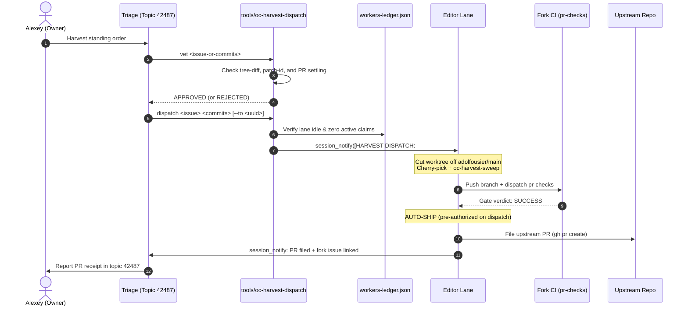
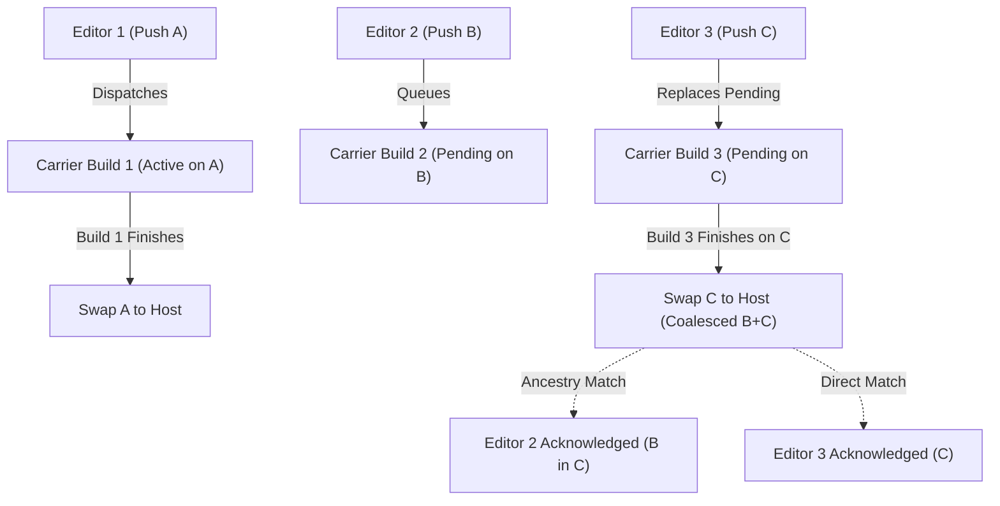

# Fleet directives — opencrabs-dev owner rulings

**Owns:** binding owner directives for opencrabs-dev work (sync policy, upstream PR law, builds/carriers, cargo prohibition, telegram surface law, tool logging, gates, editors, triage, cadence). Re-homed here from ops AGENTS.md/MEMORY.md per owner order 2026-09-02. Where a ruling's full text already lives canonically in another skill file, this file carries only a pointer — one concept, one home.

**Thematic index** (lens B-17/G-F9 v0.4.90 — file is flat; jump via section name). **[LANE] tag (v0.4.95):** sections every worker MUST read in full at spawn/compaction reload (editor.md/triage.md/toolsmith.md/hq.md RELOAD LAW v0.4.95). EXCEPTION (v0.4.96, lens B-F1): HQ re-reads THIS ENTIRE FILE IN FULL (~115 kB and growing — exact size varies per cycle; it owns and rules on the directives; the other three roles may use the thematic-index minimum for non-[LANE] sections):
**Remotes & sync** (remotes, sync policy) · **Seam-resolution shape** (REBASE model; upstream-byte-exact, overlay disposition) · **Upstream-merge cadence · HARVEST LAW · NO-HOLD** (daily patrol, filing gate, port-work ownership, **owner push freeze / harvest hold**) · **Upstream** (issue filings, PR base CI gate, cross-fork PR, PR naming) · **Builds & ships** (S3/oc-deploy, swap-head signature, swap-sha coverage, features-compat gate, hotfix REDs, no auto-rollback) · **Process & verification** (stage-entry consent, attribution guard, inherited-claim pillars, truncated-output rule, post-compaction reload, what-now/next) · **Channels** (telegram surface law, telegram_send addressing law, post-swap notify, cross-lane delivery cadence, tool logging) · **Lanes** (creating new editors, tool-problem reports/Triage, cadence boundary, parked issues, brain-scrub, discussion links, every-turn verdicts, rule-text provenance, daemon no-reap, **early claim at domain recognition**).

<!-- source: AGENTS block1 (remotes/upstream/source-work/impl-comment) -->
## Remotes & sync

**~/opencrabs remotes** (renamed 2026-08-24, was inverted): `origin` = fork `leshchenko1979/opencrabs` (push target) · `adolfousier` = upstream source — **sync policy (REBASE MODEL — owner-approved transition 2026-09-11, plan "Fork Rebase Transition and Sync Workflow"; the 2026-09-02 "Land it" MERGE policy is RETIRED).** Fork main is rebased onto `adolfousier/main`: a small set of topical commits sits directly on upstream/main, and each sync is a **rebase that drops commits upstream has accepted**, so the ahead counter reflects true pending delta and shrinks as PRs land. Force-push onto fork main is sanctioned ONLY via `--force-with-lease`, with the pre-cutover sha recorded in the ledger FIRST (rollback = `--force-with-lease` back to it). The old "merge, never rebase/reset" rule is void — it was the policy that produced 31 merge commits and a 333-commit phantom ahead count. Guards: (1) **merged ≠ deployed** — a sync lands in git and must pass fork CI (pr-checks) GREEN; the prod binary swap stays a separate, explicit act; (2) **FREEZE** while any carrier chain is between dispatch and swap (query the ledger for open claim/ship events before syncing); (3) **detection** = cron `oc-harvest-dispatch-4h` (`ls-remote adolfousier main` every 4h, reports shifts and harvest backlog; detect+report only, sync is owner-gated). "Rebase-port" remains the technique for PR chains only; non-interactive `git merge --ff-only` of upstream into the diverged fork stays forbidden (history diverged by design 2026-08-26); historical: REBASE-PORT procedure (hq.md §Upstream sync — re-homed v0.4.80, lens B F3; the compiler role is RETIRED 2026-08-28 — this line updated per Duty-6 lens B, 2026-08-31). Builds fire ONLY via `oc-deploy` (S3 2026-08-28 — compiler role RETIRED; the editor invokes `oc-deploy ship` per editor.md; the ORDER-to-Compiler notify path is deleted) — **direct `gh workflow run quick-build-linux.yml` calls from any editor are FORBIDDEN** (rogue-dispatch rulings 2026-08-26/27; first offense logged vs this lane 01:55Z). The workflow lives ONLY on carrier branch `ci/quick-build-linux`, never on fork main (moved off 2026-08-26); the dispatch `ref` input must be the FULL 40-char sha — carrier Gate 1 SHAPE (3349cf7e, 2026-08-27) rejects branch names and short form. Carrier runs ORDER gates (shape/existence/containment/signature — pure git verification; the cargo test leg REMOVED 2026-08-31 owner word "removing looks good", commit e71dba58 — all-features testing lives on the PR gate, residual risk: straight-to-main hotfix shas ship un-tested) before the build job (`needs: gates`); containment requires the sha already on fork main, so ship path = FF-push main, then dispatch via `tools/oc-deploy` (**S3 LIVE 2026-08-28** — compiler role retired; `swap-execute` mode: sha-bound, AUTO-SWAP on GREEN build (deploy consent ELIMINATED owner 2026-08-28 18:50Z), rollback-drilled, full journal/markers/ledger receipts; pilots 87d3bcb8 11:33Z / 2d643146 12:57Z / 6643cf3c 14:32Z, events 1269/1275/1281. Ledger canonical path = `opencrabs-dev/workers-ledger.json` — since v0.4.38 (2026-08-29) `oc-deploy` + `oc-order-validate` default to it DIRECTLY; `OC_LEDGER` overrides, an explicit `OC_DEPLOY_STATE_DIR` keeps test fixtures isolated; the skill-dir duplicate is DELETED). Executing procedure for this sync leg: `upstream-merge-runbook.md` (delegated to Triage per owner order 2026-09-11; HQ does not execute syncs).

## Seam-resolution shape (REBASE model — replaces the retired merge-resolution shape)

(owner 2026-09-02 principle, "keep his part as he sees it — apply our changes on top where it's essential", carried forward into the rebase model):** upstream's code ships byte-exact as adolfo wrote it, never hand-blended. The MECHANISM changes with the model: our topical commits are replayed onto `upstream/main`, and the rebase **drops every commit upstream has already accepted** — that is precisely what makes the ahead counter shrink. Conflicts therefore arise only while replaying OUR still-pending commits, and resolution is per-commit: adapt our delta onto upstream's current shape, never overwrite his code. Each replay conflict is gated by the **overlay-disposition analysis**: fork-only commits classified drop/port/ask against upstream's revealed stance (his merges of our PRs = auto-drop our duplicate; absorbed = check what he changed on top; declined = his comment decides; no signal = ask), with adolfo's commit bodies and PR/issue comments read — the classification ships as a table for the **owner's human gate** before any adaptation commit is cut. Standing exception: prod-bound fork migrations keep their slot (load-bearing prod `user_version`); upstream's migration shifts to the next free version, content byte-exact. Historical (MERGE mechanism, RETIRED with the merge policy): first applied at merge `247fed2b` (2026-09-02) — 32/32 conflicted files upstream-verbatim, 0-byte fidelity check; superseded resolution preserved at ref `merge/upstream-20260902-forkwin`. Recorded as precedent for the byte-exact principle, not as a live procedure.

## Upstream-merge cadence · HARVEST LAW · NO-HOLD

(owner 2026-09-02, "yes, add this rule"): two tiers on top of the fork-main sync policy above — (1) **Pre-PR sync is MANDATORY**: any long-lived branch (sync branches, PR chains) **rebases onto `adolfousier/main`** immediately before opening a PR, so upstream review sees only our delta, never stale-base noise (under the pre-2026-09-11 merge model this was a merge; the requirement is unchanged — only the mechanism is now rebase, per the sync policy above); (2) **Event-driven syncs**: same-day or next-day sync when upstream lands commits touching files that carry fork `port(fork→merge)` deltas (watch `channels/`, `brain/agent/service/` first). NOT "before every push" — each sync still costs a fidelity pass + disposition + its own CI. Rationale: round 2 of the 2026-09-02 merge went RED with 29 errors, all seams where big-bang fork-era resolution fought upstream-new files — error count scales with diff size, so frequent small syncs keep the diff readable. Drift detection stays with cron `oc-harvest-dispatch-4h` (4h `ls-remote`; same-day drift is real: `8846de72` → `72b11629` within the merge day). **HARVEST LAW (owner 2026-09-08, “Go” on daily enforcement, v0.4.97; updated 2026-09-14 v0.4.173):** the consolidated patrol runs every 4 hours (`oc-harvest-dispatch-4h`, job id `73158e43-3b04-4464-bf82-8d9065a191bb` — carry the ID in anything durable; names are mutable under the cron-namespacing law), running `oc-upstream-delta` and posting the tiered backlog census (Tier-1/2/3 + counter line: fork-only commit count + open upstream PR count) to board topic 30220 / triage queue. **24-HOUR FEATURE SOAK & FIX DISPATCH LAW (owner order 2026-09-14; deployment timestamp amendment 2026-09-15; subsystem cohesion & dependency inheritance amendment 2026-09-16):**
- **Atomic Subsystem Bundling & Fix Squashing (Owner Order 2026-09-17, v0.4.200):**
  - Upstream PR branches must squash follow-up bugfixes, clippy cleanups, formatting touches, and dependent child issue commits directly into the coherent parent feature commit before CI gating and filing upstream.
  - Maintainer Adolfo squashes multi-commit PRs into a single commit on upstream `main` anyway; shipping clean, all-in-one atomic commits eliminates upstream review noise, intermediate cherry-pick breakage, and commit fragmentation.
  - A harvest unit is never a loose series of patch-fixes — it is a single, self-contained atomic commit comprising the base `feat/*` and all downstream `fix/*`, test, and doc modifications touching that subsystem.
- **Dependency & Soak Inheritance:** A `fix/*` that modifies, depends on, or assumes an unharvested or soaking `feat/*` inherits the 24-hour soak window of that base feature. It cannot be cherry-picked as a zero-hold fix if upstream lacks the underlying feature code or if the fix mutates unharvested subsystem logic.
- **In-Flight Lane Fence:** If an editor lane is actively modifying a subsystem (e.g. active claim/branch touching that module/flow), harvesting for that subsystem is held until the active lane finishes, hot-swaps, and lands.
- **Deployment-Anchored Soak Clock:** The 24-hour deployment soak clock is anchored strictly to the live deployment timestamp (`deployed.ts` / swap journal) of the **youngest behavioral change** across the entire dependency graph (parent feature issue, all child sub-issues linked via `--parent`, and all blocker/prerequisite issues linked via `--add-blocked-by`), **NOT** from git commit or issue filing time.
- **New Features (`feat/*`):** Must sit and mature in the live running deployment for **≥24 hours post-swap** (anchored to the latest swap timestamp of any related child, blocker, or dependent fix in the graph) before being eligible for harvest into an upstream PR (`adolfousier/opencrabs`). This ensures multi-session stability, real-world edge-case exposure, and regression soak time on the live binary.
- **Bug Fixes (`fix/*`):** Standalone bug fixes (independent of unharvested features) are harvested to upstream **immediately** upon passing the verified 4-leg smoke gate (zero maturation hold). Fixes touching soaking/unharvested features inherit the feature's soak window per the dependency inheritance rule above.
- **Continuous Issue Relationship Linking & Sub-Issue / BlockedBy Mandate (owner order 2026-09-16):**
  - **Universal Linking Rule across Lifecycle:** Whenever a parent subsystem relationship, blocker dependency, or child sub-issue is established, split, or discovered at ANY point in the lifecycle (issue creation, triage intake, in-flight editor implementation, task decomposition, or upstream PR staging), the lane identifying it MUST establish native links in the same turn via `gh issue edit <issue> --parent <parent-issue>` and/or `gh issue edit <issue> --add-blocked-by <blocker-issue>`.
  - **Graph-Wide Soak Anchor Rule:** When evaluating the 24h soak window for any issue, feature bundle, or subsystem, the soak clock begins at the **latest swap timestamp among all nodes in that issue's relationship graph** (the issue itself, its parent, all sub-issues, and all blocker/blocked dependencies). If a fresh fix or child issue is deployed, the 24h timer for harvesting the parent/bundle resets to the swap timestamp of that youngest change.
  - **Native Sub-Issues Mandate:** Any `fix/*` or derivative work that modifies, repairs, or extends an unharvested fork subsystem (or any fork-only feature) must be linked to the parent subsystem feature issue via `gh issue edit <issue> --parent <parent-issue>`. In isolation, fixes to unreleased/fork-only subsystems are strictly forbidden from harvest: child issues cannot harvest unless the parent subsystem is already recorded as merged upstream.
  - **Native Sub-Issue / Child Harvest Pre-flight Gate (Issue #188 unharvested parent refusal):** A child issue, cleanup, or derivative task (such as deleting a script that exists only on the fork or referencing unmerged documentation/subsystems) must **NEVER** be harvested in isolation from its parent subsystem. If the parent subsystem is unharvested or unmerged upstream, child work is strictly blocked from harvest until the parent subsystem is harvested and merged upstream.
  - **Upstream PR Harvest Baseline & Narrative Verification (Owner Order 2026-09-17, findings from PR #1615 review):**
    - When staging a fork bugfix or feature for upstream PR harvest (`adolfousier/opencrabs`), the staging lane MUST verify against live upstream `main` (`git diff origin/main...adolfousier/main` or inspecting the live upstream code path) whether upstream already resolved the underlying issue or changed the code path.
    - If already addressed or clean in upstream `main`, frame the PR narrative accurately as a clean helper extraction, refactoring, or hardening improvement rather than claiming an active upstream regression or non-existent bug.
  - **Native Issue Dependencies Mandate:** Any candidate issue blocked by an in-flight fork feature or prerequisite upstream PR must declare it via `gh issue edit <issue> --add-blocked-by <blocker-issue>`. Mechanical vet gate (`tools/oc-harvest-dispatch vet`) rejects any candidate with open/unharvested blockers (`HELD_BLOCKED_BY_DEPENDENCY`).
Standing order (owner override 2026-09-08 13:51Z): file PRs AS SOON AS tests are green AND smokes are confirmed (v0.4.104 behavioral rubric) subject to the 24h feature soak rule — no serial-PR waiting; the previous one-PR-at-a-time rule is RETIRED (owner: “this law is incorrect, Adolfo never told this”). NO-HOLD law (owner override 2026-09-08 15:2xZ, topic 42487): there is NO holding STATE — no waiting-period, no serial-PR queue, no parked batch. Editor fires the behavioral smoke (v0.4.104 rubric) IMMEDIATELY on probe commission. **PR filing is governed by PR SHIPMENT law, single home SKILL.md §ISSUE ROUTING (PR SHIPMENT row).** Smoke PASS (v0.4.104 rubric, four legs) → file/ship immediately (features after 24h soak); the owner is notified AFTER the act. Gates that survive: all mechanical CI/gate legs, the v0.4.104 smoke rubric, post-swap rollback-is-owner's-call. **AUTONOMOUS HARVEST DISPATCH (owner order 2026-09-16):** The previous operator-command-only restriction is RETIRED. Autonomous harvest dispatching via PHOP (`tools/oc-harvest-dispatch vet` & `dispatch`) is restored for fully-soaked (≥24h post-swap for features), smoke-verified (v0.4.104 4-leg rubric), novel feature bundles and standalone fix candidates on all T4 patrol cycles without holding for manual operator trigger commands. Automated patrols (`oc-harvest-dispatch-4h`) post the tiered backlog census and autonomously dispatch eligible candidates to idle editor lanes. Zero-change days still post a one-line census (heartbeat = patrol alive).

**Ledger hygiene laws (lens-H cycle-2 codifications, v0.4.127):**
- **H-3 fork-skill push remote:** the skill repo's canonical push remote is `mirror2` (git@github.com:leshchenko1979/opencrabs-skill.git). A push naming bare `leshchenko1979` (no remote of that name) fails - n=2125 class. SKILL.md's mirror sentence is descriptive; this row is the operational name.
- **H-4 sync rows need real --why:** every `oc-ledger sync --version` row carries substantive why-text (what the bump contains, battery receipt ts). Empty `v0.4.NNN -` rows (n=2106/2108 class, the v0.4.113/114 lens additions) violate the sync vocabulary; bump content must be recoverable from the row, not just the CHANGELOG.
- **H-5 claim lifecycle close-out:** a `claim` row whose issue reaches CLOSED state with no `confirm`/`release` row is stale-debt - the actor's next `oc-commit` mints an Issue-Ref against a closed issue (329bf3a3/#32, closed 7 days before detection). Law: when a claimed issue closes, the claiming lane stamps `confirm` (done) or `release` (not mine) same-session; T4 sweeps check closed-issues-with-open-claims.
- **Journal retention (owner ruling 2026-09-09 18:55Z):** `waiters/journal/*.jsonl` older than 7 days are archived to the state repo (`opencrabs-dev/incident-evidence-<date>/waiters-journal-archive/`) then removed — AFTER a grep confirms no open ledger event cites the waiter id. Journals cited by an open ledger event are kept indefinitely. Duty-4/T4 executes the sweep; the 176→165 file archive-then-wipe on 2026-09-09 is the worked example.
- **Canonical smoke log:** the single `smoke-verdicts.log` lives in the STATE repo (`opencrabs-dev/smoke-verdicts.log`) — it already hosts the workers-ledger. Smoke stamps go there and nowhere else; the skill repo copy was removed (f0775f83) and all fragment logs' unique lines were merged in before archival (owner ruling 2026-09-09 18:55Z).
- **Canonical smoke log — ABSOLUTE PATH, stamp it literally (QUIRK from lane 6cd8175f, 2026-09-12):** `/root/.opencrabs/profiles/ops/opencrabs-dev/smoke-verdicts.log`. Every `smoke-verdicts.log` reference in this file and in `editor.md`/`triage.md` means THAT path. A bare filename resolved from the ops profile root hit a stale pre-move decoy at `/root/.opencrabs/profiles/ops/smoke-verdicts.log` and silently captured 2 rows — both already SUPERSEDED in canonical. Decoy RETIRED 2026-09-12: archived to `incident-evidence-20260912/smoke-verdicts.log.decoy-20260912.bak` and the old path now SYMLINKS to canonical, so a wrong-path write self-heals instead of being lost.
  - **TWO artifacts, TWO writers (v0.4.164, proposal n=4108):** (1) the **IDENTITY EVIDENCE BLOCK** is written by `oc-smoke-evidence --append-log` (bare = the canonical absolute above; a wrong path is unrepresentable, M2-2) — it emits LIVE deployment identity (pid, exe_sha256, artifact_sha256, run_id, VERDICT — 10 tab-separated lines) and describes the binary RUNNING AT THAT MOMENT. (2) the **VERDICT ROW** — `ts \t VERDICT \t run= \t sha= \t actor= \t issue= \t target= \t evidence=` — is **AUTHORED BY THE LANE** and appended newline-safely. That is the normal case and it is **NOT** a violation.
  - **Verdict taxonomy (proposal n=4175):** Sanctioned VERDICT tokens in field 2 are `PASS`, `PASS-LATE-ENTRY`, `INCOMPLETE-LATE-ENTRY`, `PARKED-OWNER-EYE`, `PASS-OWNER-EYE`, `PASS-CALLBACK-LIVE`, `CORRECTION`, and `RETRACTION`. For `CORRECTION`/`RETRACTION` rows, `sha=` names the target sha under correction (or tip if refreshed), and the retracted row number/identity is cited in `evidence=`.
  - **Newline normalization on append (proposal n=4177):** An unterminated append poisons the NEXT writer. Appending lanes MUST ensure tail normalization before appending: verify the file's last byte is a newline (e.g. `[ "$(tail -c1 "$LOG")" = "" ] || printf '\n' >> "$LOG"`), then append the lane row terminated with `\n`. Plain shell `>>` without tail normalization is prohibited.
  - **Citations cite sections, never line numbers (proposal n=4192):** When a verdict row or LATE ENTRY cites law text, it MUST cite the SECTION HEADING or a grep anchor, never file line numbers (`file:N`), which rot as the law file grows.
  - **No hand-written counts in law text (proposal n=4132):** Never state static absolute row or line counts of `smoke-verdicts.log` in law text. Counts are derived dynamically at read time via tools (`oc-smoke-evidence --log-stats`), or stated with an exact reproducible predicate command.
  - **Automatic ledger done stamp on PASS (owner order 2026-09-17, Toolsmith 2dedf9e1):** When `oc-smoke <issue>` records a verdict of `PASS`, it automatically executes `oc-ledger stamp done "smoke PASS verified for issue #<issue>"` (unless suppressed via `--no-ledger`). This mechanically closes the worker's in-flight claim in `workers-ledger.json` and immediately unblocks `oc-harvest-census` and Triage intake without requiring an extra manual trailing stamp.
- **LATE ENTRY is sanctioned and has a mechanism (ruling 2026-09-12, resolving the :145 tension lane 63d775f9 raised):** a lane MAY append a historical verdict row marked `PASS-LATE-ENTRY` or `INCOMPLETE-LATE-ENTRY`, carrying its on-record receipts (ledger n=, issue comment, `deployed.meta` identity). The ban on "hand-typed" covers the WRITE MECHANISM (plain shell `>>` without tail normalization), never the AUTHOR — a lane-authored row appended newline-safely is the ordinary path. A LATE ENTRY must name why the same-turn duty was missed, citing law sections or grep anchors, never line numbers. Toolsmith provides `--late-entry`/`--sha` overrides in `oc-smoke-evidence`.

**PORT-WORK OWNERSHIP — three-role split (owner ruling 2026-09-08 17:04Z, button pick option 0 "Agreed - codify the split: editors build, Triage queues, HQ gates"; recovered from daemon callback log after the #1226 mid-turn swallow; v0.4.107):**

| Role | Owner | Scope |
|---|---|---|
| **Editors build** | Editor lanes | All port commits (`port(fork→merge)` re-lands per the Seam-resolution shape above) and harvest-port adaptations — ports are code, editors write code |
| **Triage queues** | Triage | Disposition census (drop/port/ask vs upstream stance), port-work backlog, commissioning port lanes |
| **HQ gates** | HQ | Overlay-disposition classification ruling + port-commit approval gate; owner remains the ask-decider where upstream stance is ambiguous |

No single role "owns ports" alone — the law names the chain explicitly (owner 17:00Z: "We need to decide who owns ports"). The button pick supersedes HQ's 17:02Z three-class board proposal and Triage's 16:50Z three-hand answer wherever they differed.

**Upstream PR law** (owner 2026-08-27, tightened 2026-08-26) — canonical text: SKILL.md §Upstream relations + §Hard rules rows ("Upstream receives PRs ONLY", "PR SHIPMENT LAW"). Core: PRs-only upstream, never `Closes #N`, fork-issue link at body end, autonomous filing on smoke PASS (v0.4.104 4-leg rubric; PR SHIPMENT law — SKILL.md §ISSUE ROUTING, no owner pre-wait), no ad-hoc PRs, branch namespace `leshchenko1979/<slug>` (SKILL.md §Upstream relations item 7). **Kept here (unique) — #1255 exception (owner 2026-08-28 13:59Z):** the compaction-stall / gateway-timeout class is owner-sanctioned for direct upstream REPORTING — adolfo is actively working that area (#1247, fix `a0954b63` on `fix/session-routing-and-fallback-chain`); field report filed as adolfousier/opencrabs#1255 (ledger 1280); follow-ups on that thread may continue upstream. Nightly cron pulls repo only — never pushes brain changes.

## Owner Push Freeze — soaking groups held from upstream harvest (owner order 2026-09-18) [LANE]

**Owner order, verbatim:** *"freeze all these groups from pushing - I want to review them first and will release them later"* (2026-09-18 17:33Z), followed by the first and only release so far: *"Telegram flow cluster T6 - release for harvesting"* (18:01Z).

**What "these groups" are.** The owner was reading the delivered live-test plan (`/tmp/live-test-plan-2026-09-18.md`, board topic 30220, `msg=67358`) — the soak/test surface of the deployed binary (50 `feat` commits landed since 09-16 00:00). Its groups are the frozen set: **18 T-groups (T1–T18) + 7 Tier-3 items**. One group is released.

| State | Groups |
|---|---|
| **FROZEN** — no upstream push / harvest | **17 T-groups:** T1 (#299), T2 (#286), T3 (#291), T4 (#295), T5 (#285), T7 (#280/#289/#258), T8 (#234/#155), T9 (#1629/#233), T10 (#317), T11 (#247), T12 (#208/#228), T13 (#278), T14 (#298), T15 (#241), T16 (`[agent] default_provider`), T17 (#256), T18 (#150) · **7 Tier-3 items:** #290, #271, cron per-job in-flight guard, #264, #273, repeated-bash nudge, #345 |
| **RELEASED** — harvest eligible | **T6 — Telegram flow cluster** (#250 🎯 telemetry marker, 🌐/🧠 tool classes, ⏰ cron icon, compact event labels, #232 telemetry bar, queued-message roll tag) |

**The rule:**

1. **No upstream push of a frozen group.** No upstream PR is filed for a frozen group's commits, and no lane stages one, until the owner releases that group by name. Soak maturity elapsing is not a release.
2. **Release is an OWNER action, never a lane decision.** A group leaves the freeze only on an explicit owner message naming it — exactly as T6 did. Silence, a green census, a lane's own confidence, or an idle editor never release a group. The released set grows one named group at a time, and currently holds exactly one member: **T6**.
3. **The freeze binds the machinery, not just the prose.** Triage's 4h harvest patrol (`oc-harvest-dispatch-4h`, job id `73158e43-3b04-4464-bf82-8d9065a191bb`) must not dispatch a frozen group; `oc-harvest-census` / `oc-harvest-dispatch` must read a frozen group as NOT harvest-eligible; an editor holding a frozen group's work stops short of Phase 7 (upstream PR filing).
4. **This is NOT the carrier FREEZE of §Remotes & sync guard (2).** That one is mechanical (no sync while a carrier chain sits between dispatch and swap). This one is an owner hold on a feature group's harvest. Same word, different concept — write **owner push freeze (harvest hold)** when you mean this one.
5. **Scope boundary — the freeze holds HARVEST, not development.** Lanes keep fixing, committing, shipping and smoking inside fork `main`; what is withheld is the upstream push of a frozen group. A defect found in a frozen group (e.g. the owner's 2026-09-18 finding that #291 puts the compaction result, not the latest thought, in the tool-roll header) is fixed and re-soaked normally — it stays frozen only at the harvest boundary.

**Rationale (owner's own words):** *"I want to review them first"* — the soak groups ARE his live-test surface, and harvesting one before he has exercised it upstreams a feature he has not yet accepted.

## Deep Core Advance Heads-Up Gate (Core vs Integration Rule, Owner Order 2026-09-17)

Maintainer coordination protocol between Alexey (`@leshchenko1979`) and Adolfo (`@adolfodev`):
1. **Scope Classification**:
   - **Deep Core:** Runtime scheduler, context compaction algorithms, provider routing/fallbacks, subagent orchestration, and tool execution loop. **The prose scope is OPERATIVE; the path list is a reading aid, never the definition.**
     - **Real paths (corrected v0.4.204, HQ ruling 2026-09-18):** runtime scheduler `src/cron/` (`scheduler.rs`, `pipeline.rs`, `trigger.rs`, `send_scope.rs`) · tool execution loop `src/brain/agent/service/tool_loop.rs` · context compaction `src/brain/agent/context.rs` · provider routing/fallbacks `src/brain/provider/` · subagent orchestration `src/brain/tools/subagent/`.
     - **Defect this fixes:** the former list named `src/agent/` and `src/scheduler/`, NEITHER of which exists in the tree (`find src -type d -name 'scheduler*'` → empty). A filer reading the list as exhaustive would conclude a cron-runtime-scheduler change is NOT Deep Core — the wrong direction of error, and exactly the #317 shape.
   - **Surface Integrations:** Telegram channel handler, rich cards, MTProto/MCP bridge (`src/channels/telegram/`).
2. **The Advance Heads-Up Protocol (Venues: `OC Dev` Group Chat — `-1003627148483` / `3627148483`, or `Opencrabs Dev Factory` tagging `@adolfodev`):**
   - For any architectural change, behavior shift, or non-trivial fix touching **Deep Core**, post a concise technical 1-liner heads-up to either the **`OC Dev`** Telegram group chat or the **`Opencrabs Dev Factory`** group chat (tagging `@adolfodev`) *before* or *simultaneously with* opening the upstream PR:
     > `Core heads-up: <observed symptom/issue> → proposed fix in <subsystem> (PR #<N>)`
   - This ensures early alignment on core abstractions before or during maintainer review.
   - **WHO POSTS — HQ posts it, on the filing lane's behalf. There is NO editor carve-out (v0.4.204, HQ ruling 2026-09-18).** An editor lane CANNOT discharge this gate itself: SKILL.md §Telegram surface law forbids editors from invoking ANY telegram send/edit tool, not even into their own topic. Without this assignment the two laws bind the same actor and the obligation has **no executor on the filing side**. So: the filing editor sends HQ the 1-liner text (`session_notify`, `delivery.mode="turn-end"`) in the same turn it stages the PR; HQ posts it to the venue. This is NOT a new carve-out — it is the existing lifecycle assignment, since SKILL.md §Upstream relations item 5 makes **Maintainer Interaction (incl. the OC Dev chat heads-up) HQ's area**. The obligation is on the CHAIN, not the filer: a lane that has put the text in HQ's queue has discharged it, and its harvest may proceed.
3. **Surface Integrations Autonomy:**
   - Changes to Telegram, rich card rendering, formatting, and local developer tooling remain under our autonomous maintainer authority; they ship directly to upstream PRs with verified 4-leg smoke receipts without requiring advance group chat discussion.

## Dependent Upstream PRs Law (Maintainer Consensus, 2026-09-14; Draft Mandate 2026-09-16)

When PR B depends on PR A (which is not yet merged upstream):
1. **Explicit Dependency Notice Permitted:** It is explicitly allowed to file PR B while PR A is open/pending, provided the PR description clearly states:
   `Depends on #<PR_A> (do not merge before #<PR_A>)`
2. **Staged Upstream Draft PR Mandate (owner order 2026-09-16):** When an upstream PR depends on another in-flight upstream PR or is part of a multi-part staged wave, it MUST be filed with `gh pr create --draft` so upstream maintainers cannot merge out of order before prerequisites land. Once PR A merges upstream, the draft status on PR B is converted to ready for review.
3. **Maintainer Order of Processing:** Upstream maintainer tackles dependent PRs in commit/chronological sequence (PR A merged before PR B).
4. **Deferred Automated Publishing:** Alternatively, automated harvest pipelines may hold PR B until PR A merges via harvest watch / cron triggers.

## Parallel Harvest Orchestration Protocol (PHOP) (v0.4.136, 2026-09-10)

Standard protocol for parallel harvesting of downstream fork commits to upstream (`adolfousier/opencrabs:main`). Mechanized via `tools/oc-harvest-dispatch`.

### 1. The 4-Stage Harvest Lifecycle

| Stage | Owner | Gate & Invariants | Command / Artifact |
|---|---|---|---|
| **1. Candidate Vetting** | Triage | **Upstream Absence Proof**: Confirm commit delta is non-empty on upstream tip (`git diff adolfousier/main -- <files>`), patch-id is not an ancestor/merged, upstream PR settling authority confirms unharvested, and candidate is not superseded. | `tools/oc-harvest-dispatch vet <issue-or-commits>` |
| **2. Lane Availability** | Triage | **Verify-Unclaimed & Idle Law**: Scan `workers-ledger.json` for active `claim` rows. Target lane must have status `idle` and zero unfinished claims. Never dispatch to a busy lane (e.g. active plan or in-flight gate). | `tools/oc-harvest-dispatch dispatch <issue> <commits> [--to <uuid>]` (enforces rc 4 on busy lanes) |
| **3. Dispatch Envelope** | Triage | **Atomic Dispatch**: Deliver standard payload via `session_notify` (`delivery.mode="turn-end"`). Zero Telegram noise to worker topics. Mandatory wire footer: `Ack contract: NONE — claim on ledger (oc-ledger claim) and proceed.` Receiving lanes do NOT ack via notify. | Standard wire envelope `[HARVEST DISPATCH: #N]` |
| **4. Mechanized Ship & Ack** | Editor | **Ship Gate (v0.4.146)**: Dedicated worktree off `adolfousier/main`, cherry-pick with trailers, `oc-harvest-sweep`, push, `oc-prchecks`. On GREEN gate AND verified 4-leg smoke pass in `smoke-verdicts.log` → file upstream PR citing smoke receipt, link fork issue, notify Triage. Never file unsmoked PRs. | `editor-upstream-pr.md` Phase 7c |

### 2. Standard Dispatch Wire Envelope

```text
[HARVEST DISPATCH: #{issue}]
Target Issue: #{issue} ({slug})
Source Commits: {commits}
Upstream Base: adolfousier/main ({tip_sha})
Target Branch: leshchenko1979/fix/{slug}
Commands:
  1. tools/oc-wt add up-{slug} {branch} --create --from adolfousier/main
  2. git cherry-pick {commits}
  3. tools/oc-harvest-sweep {branch} --base adolfousier/main
  4. Verify 4-leg smoke pass in smoke-verdicts.log
  5. git push origin {branch}
  6. tools/oc-prchecks {branch}
Contract: SHIP on GREEN CI gate + verified 4-leg smoke pass. File PR on adolfousier/opencrabs:main citing gate run ID + smoke evidence, link fork #{issue}, notify Triage.
```

### 3. Orchestration Sequence



**OpenCrabs source work** (`~/opencrabs`): any code edit, CI build, or binary swap follows the **`/opencrabs-dev`** skill (`skills/opencrabs-dev/SKILL.md`) — fresh-base fetch, fork issue claim via `Issue-Ref` trailer + `oc-ledger claim` row (NO tackling comments on fork issues — owner ban 2026-08-27), per-task worktree, CI gate (pr-checks), CI-only evidence gates, sha-verified run, backup + atomic swap, ops-only user-unit restart. Upstream stays PRs-only; this section is just the pointer (procedure canonical in the skill).

**Implementation comment per commit (owner 2026-08-28 22:54Z)** — canonical procedure: per-commit gh comment (chained automatically in `oc-ship-chain` Leg 2, or folded into `oc-commit` via `oc-issue-log`; SKILL.md §Canonical tooling). Rule: one comment per editor commit, immediately — no batching at the end.


<!-- source: AGENTS block2 (build lane/cargo/surface/logging/gates/editors/cadence) -->
**Build lane directive (owner, 2026-08-27):** prod ORDER builds must carry the FULL feature set — reduced staging subsets are retired; a binary that drops functionality will not be accepted for swap. **AMENDED same day (owner, mermaid lane):** `local-mermaid` is REMOVED FROM THE TREE (owner 2026-08-27, "cleanup sooner, no local mermaid"): render.rs, the feature, cfg gates, `local_fallback` and its test deleted in `346bf3c2`; delivery is remote-only mermaid.ink (natural-size → 1200px width clamp ladder) via `attach://` bytes. Prod ORDER feature set is now `telegram` ONLY (owner 2026-08-27, ~20:07Z: "the only feature you need is telegram now") — supersedes the full-set requirement above for this box; other channels/STT/TTS/browser remain in-tree but are not built into the prod binary. Four optional raster dep declarations linger in Cargo.toml (PENDING REMOVAL marker) — carrier builds `--locked`, lock regen is Compiler-owned (role retired S3 2026-08-28; lock changes ride editor commits, regen verified by CI); they compile to nothing.


**Cargo prohibition (owner, 2026-08-28)** — canonical full law: editor.md §Box law — no local cargo, ever (PATH / login-shell / PATH-prepend / explicit-path bypasses, disabled rustup tree, rustfmt wrapper only, lint evidence = GREEN pr-checks run). Fleet-directives carries no extra text.

## Telegram surface law (owner 2026-08-28, skill v0.4.31) [LANE]

Canonical full law: SKILL.md §Telegram surface law (v0.4.31). Editor-facing duties: editor.md §Telegram surface law. session_notify is the ONLY inter-role channel; no editor invokes telegram send/edit tools. Fleet-directives carries no extra text — do not restate the law here.

## Topic domain alignment & rename authority (owner order 2026-09-10 03:48Z, updated 2026-09-14)

- **Topic domain alignment (owner order 2026-09-14):** Factory forum topics are organized around **persistent functional domain subsystems** (e.g. `Telegram: Host & Session Guards`, `Core: Streaming & Loop`, `Memory: Search & Indexing`, `Config: Typings & Writers`, `Upstream: Harvest Fleet`, `Governance: Role Architecture`) rather than ephemeral issue numbers or short-lived task names. Topics serve as dedicated domain centers for issues within that area and cross-area issues touching their domain.
- **Continuous topic alignment:** Auditor (Triage) and HQ actively rename topics whenever a lane's scope shifts or drifts to ensure topics remain strictly connected to their subsystem contents.
- **Rename authority:** Auditor (Triage) and HQ are free to rename chats and forum topics — no owner approval needed. Keep titles descriptive (3–8 words, reflect actual domain/subsystem per the topic domain alignment policy); renames are bookkeeping, not surface-law sends, so this is not an editor carve-out — editors still never touch Telegram tools.

## Discussion links + fix-approval gate (owner 2026-08-28 14:28Z)

1. **Whenever a PR or issue is discussed, a link must be given.** Every mention of a PR or issue number — chat, reports, ledger entries, rulings — carries the full URL (or an owner/repo#N reference that resolves to one). No bare numbers: a number without a link is an unfinished sentence. If a reference cannot be resolved to a link, say so explicitly.
2. **Owner gates EVERY implementation design (owner order 2026-09-09 ~20:03Z, supersedes the fix-scoped version).** No implementation of ANY design — fix, feature, tool, refactor, process change, any size — begins code work before the owner approves the design. The design is presented to the owner in CANONICAL TERMS (the project's codified ontology — fleet-directives.md vocabulary, exact codified names, no invented shorthand; owner order 2026-09-07 09:34Z) WITH a process diagram (Mermaid, vertical; multi-actor processes get a sequenceDiagram per item 3; no backticks/angle-brackets in labels). The diagram is part of the gate: a design presented without its diagram is not presented. Implementing an unapproved or un-diagrammed design is a gate violation at any size. Owner's approval must be explicit (message or 👍 reaction); silence is NOT approval. HQ/lane work that produces a design — including Duty-4 accepted proposals that change law or tooling behavior — passes through this gate before implementation.
3. **Multi-actor processes get a sequence diagram (owner 2026-08-28 17:55Z).** Whenever the process under discussion involves SEVERAL ACTORS (roles, tools, external services, humans), the required diagram is a Mermaid `sequenceDiagram` — one participant per actor, messages as labeled arrows. A flowchart is acceptable only when the flow is genuinely single-track.
4. **Bare `#N` with fork issue numbers is forbidden on any upstream surface (owner 2026-08-31, skill v0.4.67, fork [#54](https://github.com/leshchenko1979/opencrabs/issues/54)).** Outside a code span, GitHub autolinks `#N` against adolfo's issue space — the tooltip points at the wrong repo's issue. Required form on PR/issue bodies, titles, comments: `leshchenko1979/opencrabs#N` or full URL. Code spans exempt (no autolinking inside backticks). All live upstream offenders patched 2026-08-31; sweep clean.

## Upstream issue filings — report-only (owner 2026-08-28 15:17Z)

**Offload order — CORRECTED (owner 2026-09-01, "Wait, i was talking about prs only. Revert issues"):** "Offload to upstream" applies to **PRs only** (when we fix OpenCrabs-source bugs, the fix ships as an upstream PR per the existing PRs-only rule). **Issue reports NEVER go upstream** — the fork is the issues home, permanently. The 2026-09-01 issue-migration (adolfousier #1279–#1286 for fork 70/33/38/58/35/60/65 + TEXT_ACCUM) was misread, withdrawn same day: all 8 upstream issues closed as withdrawn, all 7 fork issues reopened, #1255 cross-link deleted. #66 remains not-upstream-eligible (upstream #1260 closed pointing back to the fork; needs owner-level follow-up with adolfo).

When the owner tells us to FILE an issue upstream (adolfousier/opencrabs), the editor does NOT fix it: the filed report is the deliverable, and fixing the upstream-reported defect is adolfo's lane. No editor lane writes fix code or opens a fix PR for an upstream-filed issue unless the owner explicitly orders the fix — follow-up REPORTING on the filed thread stays allowed (per the #1255 exception).

## External lanes — fork issue reporting vs dev non-participation (owner order 2026-09-13) [LANE]

**The fork issues STAND.** External/side lanes (e.g. `inferhub-watch`) may open fork issues on
`leshchenko1979/opencrabs` for runtime anomalies they observe during their own operation. That
reporting is sanctioned, and the resulting issues are legitimate: an issue filed by an external lane
is **not** to be closed, re-filed, or discounted merely because an external lane filed it.

**Reporting is the whole of that licence.** An external lane is strictly barred from the OpenCrabs
**development process**: no PRs, no code edits in `/root/opencrabs`, and no participation in dev
triage or review. Dev-process participation belongs exclusively to **rostered OpenCrabs editor lanes
and HQ**. Opening a fork issue confers no claim on it, no slot in the fix queue, and no voice in its
disposition — a report is an input to Triage, not an assignment.

Origin: owner ruling 2026-09-13 — *"The fork issues stand. The law should be amended. You are allowed
to fork to open fork issues, but not allowed to participate in the development process."* Codified in
the ops brain at `~/.opencrabs/profiles/ops/AGENTS.md` (§ External lanes — fork issue reporting vs dev
process non-participation) and forwarded to HQ by lane `1122b15e` for canonical alignment here.

## Stage-entry consent (owner 2026-08-28 16:57Z)

When the owner says to go to a stage ("let's go to S3", "go to Sx"), that word IS the approval for ALL actions defined in that stage's definition (stage table: `~/oc-work/target-process-*.md`). No per-action re-asking for anything inside the stage definition. Gates the stage definition itself spells out (e.g. the sha-bound artifact verify that authorizes each swap) REMAIN — they are part of the stage definition, not exceptions to it.

## Post-swap notify (LIVE — mechanical fan-out since 2026-08-29)

Mechanics canonical: `oc-deploy fanout` (GREEN leg at the swap_execute tail, RED leg via poll failed-run scan; idempotent `fanout.state`; drills off via `OC_DEPLOY_NOFANOUT=1`) + s2-swap-journal-spec §Fan-out legs. No manual notify steps anywhere. Ledger path is canonical `opencrabs-dev/workers-ledger.json` — the skill-dir duplicate was deleted 2026-08-29 (v0.4.38); fix shipped FIRST, deletion second.

**Fanout commit sweep excludes upstream merge ancestry (Duty-4 P-01, v0.4.133):** `oc-attrib --contributors --first-parent` strictly sweeps `--first-parent` for deployed commit attribution, preventing traversal into foreign upstream merge ancestry. Upstream sync merge commits (e.g. `8870bd40`) will NOT falsely wake completed historical editor lanes whose Session-Ids appeared in merged PRs.

## Post-compaction skill reload & context manifest curation (owner 2026-09-04, updated 2026-09-17) [LANE]

After ANY context compaction or spawn, the first action before any opencrabs-dev work is reloading this skill (`/opencrabs-dev`, or SKILL.md + your role file + fleet-directives.md — role files and toolsmith.md: [LANE]-tagged sections IN FULL; RELOAD LAW v0.4.95). Editor spawn briefs must carry this rule; the ops AGENTS.md § "OpenCrabs dev" carries the always-loaded anchor.

**Context Manifest Curation (Compaction Section 10, owner order 2026-09-17):**
When context compaction occurs, the compactor generates a context manifest YAML block. The compactor MUST explicitly curate the manifest as follows:
1. `active_skills`: Keep `opencrabs-dev`, `opencrabs-dev/fleet-directives.md`, and the specific active role file (`opencrabs-dev/editor.md`, `opencrabs-dev/hq.md`, `opencrabs-dev/triage.md`, or `opencrabs-dev/toolsmith.md`).
2. `discard_skills`: Discard only non-active role files that do not apply to this lane's role.
3. `required_tools`: Keep key operational tools (`session_notify`, `session_search`, `bash`, `read_file`, `telegram_send`) pre-activated.
Empirical production data (778 compactions) confirms the compactor honors manifest guidance (>93% retention when guided; 0.00% contradictory aux retention when root discarded). Standardizing Section 10 manifest curation prevents skill amnesia post-compaction without binary modifications.

## Receiver-side dedupe of reload demands (HQ ruling 2026-09-10, anomaly: duplicate v0.4.130 fanout wave)

If an identical reload demand (same skill version + same skill sha) arrives and you have already run drift-check + stamped ack for THAT version: drop it silently — no re-execute, no re-ack (a blind re-run double-stamps the ledger and corrupts ack counts); optional one-line dup-notice to sender. Receiver-side defense only; sender-side single-wave discipline is HQ's (process check before launching a wave). Model behavior: c2ba4ef2 detected the duplicate by (version, sha) match and did not re-execute.

## Attribution guard (post-compaction wakes)

Before disputing the attribution of any shipped artifact (build, deploy, ledger event, commit) — on a `session_notify` wake, after a compaction, or whenever memory and records disagree — re-derive OWN shipped work from durable state FIRST: `opencrabs-dev/workers-ledger.json` claim/fanout events, oc-deploy journal lines + deployed.sha markers. Ledger beats memory; a mismatch is reported, never accused. Origin: post-compaction amnesia made this lane falsely blame oc-attrib/fanout for its own shipped work (retraction logged 2026-08-30, HQ d72bd52d); guard forwarded to owner via HQ topic report — remove on owner order only.

## PR naming convention (owner 2026-08-30) [LANE]
Every PR this fleet opens carries a type prefix in the title so upstream release triage can split bugfixes from features at a glance:
- `fix:` (or `fix(scope):`) — bug fix; corrects broken behavior
- `feat:` (or `feat(scope):`) — new capability or behavior change
- `chore:` — tooling/CI/docs/deps; zero user-visible behavior change
Applies to upstream (adolfousier/opencrabs) AND fork PRs. New branches mirror the type in the slug: `leshchenko1979/fix/<slug>` / `feat/<slug>` / `chore/<slug>` (existing branches untouched). Retro-check 2026-08-30: upstream PR #1265 already conforms (`fix(plan): …`). Procedure detail: `/opencrabs-dev` skill, editor-upstream-pr.md Phase 7.

## Strict Atomicity & Zero Bundling (owner order 2026-09-13; lane 1a63f103 proposal) [LANE]

**1 Intent = 1 Unit.** Features and bug fixes MUST NEVER be bundled into the same issue, branch, or PR.
- Never mix `feat:` and `fix:` in one PR: a feature PR must carry exclusively feature commits, and a bugfix PR must carry exclusively fix commits.
- If a bug is uncovered while working on a feature: do NOT fix it inline on the feature branch. File a separate fork issue, claim it in a clean worktree/branch (or hand it to Triage), fix and smoke it independently, and land it atomically.
- Bundling a "convenient small fix" into an active feature PR forces binary review on a mixed diff, poisons git bisect, muddles changelogs, and breaches upstream PR atomicity rules. Gate: `./tools/oc-pr-atomicity <pr>` enforces issue and trailer boundaries. Canonical procedure: `editor-upstream-pr.md §Phase 7`.

## LLM Ergonomics & Efficiency Law (owner order 2026-09-13) [LANE]

Every tool, schema, hint, error message, and prompt designed for agents must prioritize **LLM ergonomics and operational efficiency**. LLMs have limited context horizons, suffer amnesia across compactions, struggle with mental list arithmetic, and hallucinate when forced to reconstruct hidden state. Designing for agents means eliminating these failure modes at the interface:

1. **Contextual & Relative Anchors Over Mental Arithmetic:** Never force an agent to compute, track, or predict numeric array indices, line numbers, or offsets across turns. Prefer semantic anchors (title substring/fuzzy matching) or relative keywords (`"current"`, `"next"`, `"tail"`).
2. **Actionable, Self-Healing Feedback:** Tool error messages are inline prompts. Never emit bare rejections (`"Invalid index"`, `"Task not found"`). When validation fails, the error output MUST provide the active state snapshot and the exact valid candidate options so the agent can self-correct in a single follow-up turn without blind exploration.
3. **Turn Consolidation & Immediate State Delivery:** Mutating tool operations should return confirmation along with the resulting state summary (e.g. `add_tasks` returning the updated plan summary). Eliminate redundant round-trips whose sole purpose is inspecting what the previous action produced.
4. **Information Saliency & Token Discipline:** Hints, schemas, and descriptions must maximize signal-to-noise. Eliminate verbose boilerplate; state constraints and contracts explicitly; keep prompt payloads tight to prevent context window bloat and compaction pressure.

## Upstream Coding & Testing Standards (CONTRIBUTING.md & Adolfo DM 2026-09-13) [LANE]

Mandatory standards for any code slated for upstream harvest (`adolfousier/opencrabs`) or developed in the fork:

1. **Test Isolation (NO inline tests in `src/`):** ALL tests must live under `src/tests/*_test.rs` registered in `src/tests/mod.rs`. Absolutely **NO inline `#[cfg(test)] mod tests { ... }`** blocks at the bottom of source files in `src/`. Inline tests hide behind source files in IDE outlines and grow unbounded. If an existing inline test block is found while working on a file, move it to `src/tests/` as part of the change.
2. **`mod.rs` Declarations-Only:** A `mod.rs` file may contain exactly: module doc comments, `mod`/`pub mod` declarations, and `pub use` re-exports. **Zero function definitions (`fn`) inside `mod.rs`. Ever.** When a function grows in `mod.rs`, move it to a cohesive named submodule and re-export it. Upstream CI strictly enforces this.
3. **Commit Trailers (Zero `Co-Authored-By`):** Never add `Co-Authored-By` lines to commit messages. Upstream project policy rejects them.
4. **Real Tests Over Mocks:** Write tests that fail without the fix and pass with it. Exercise real structs and SQLite rather than artificial mocks.
5. **Zero Error / Warning Suppression:** No `#[allow(dead_code)]`, `#[allow(unused)]`, or warning suppression duct tape. Unused code must be deleted, not annotated.
6. **`ONTOLOGY.md` Synchronization:** Shared vocabulary lives in `src/docs/reference/ONTOLOGY.md`. If your change introduces, renames, or retires a concept, update `ONTOLOGY.md` in the same PR.
7. **No Clock-Bomb Fixtures in Tests (v0.4.170, Finding H-1 / row n=2123):** Never write test fixtures with hardcoded absolute future timestamps or recency horizons (e.g. `2026-09-08` in a recency-gated query test). Such fixtures inevitably fail when real calendar time advances past the hardcoded timestamp. Tests must either anchor to simulated/mock time, derive timestamps dynamically relative to `Utc::now()`, or test invariant logic independently of real-world dates.
8. **Cross-Boundary Unit Test Requirement (No Tautological Helper Assertions, Owner Order 2026-09-17):** Unit tests asserting paths, contracts, file operations, or data formats in upstream PRs must test real cross-boundary interaction (e.g. writing through a real file writer and reading back via the target reader in a tempdir) rather than asserting helper equality against its own internal delegate function. Tautological unit tests (where a function merely tests its own internal implementation helper) provide zero regression protection across module boundaries and are strictly rejected.

## Creating new editors (owner order 2026-09-01 21:56Z)

Trigger: a NEW area is discussed and a research/code task needs doing, and NO existing editor lane has done anything in that area. Then the TRIAGE lane creates a fresh editor (standing authority transferred from HQ at v0.4.86, owner "Go with Option A" 2026-09-06; HQ retains roster/registry ownership — hq.md Duty 2):

1. `tool_search("tg_mtproto")` (dynamic tool; schema dies at compaction — re-search first).
2. Create the topic (MTProto): forum methods live under `messages.*`, NOT
   `channels.*` (the durable gotcha); pass `resolve: true`; peer = forum chat
   id. The exact method incantation + envelope-parse recipe are one
   `session_search` away (topic-creation receipts in the ledger) — not cached
   here.
3. Brief the lane ONLY via `session_notify` to its session id (owner order 2026-09-03 19:28Z — supersedes the former tg_send_message-into-topic briefing). The spawn prompt carries only the task seed; the full brief, corrections, and un-park orders go through `session_notify`. A topic post is allowed for OWNER VISIBILITY only — labeled as such, never the briefing channel.
   - **Injection verification REQUIRED (owner order 2026-09-07 + auditor finding, n=1803 verify):** a `session_notify` "delivered" receipt ≠ injected. Before stamping any ack ("brief delivered", "lane briefed"), verify injection from the daemon log: a delivery to a spawned-and-dormant session logs `parking until its channel claims it` (restart_recovery.rs) — that line means NOT delivered. Grep the log for the target session id after the send; stamp ack only on a real injection (or queue redelivery). Origin: auditor lane a65e7ab6 — Triage stamped "re-brief delivered" (n=1803) while both sends sat parked (log 05:30:21Z + 05:33:35Z); seed brief survived only because the spawn prompt carried it.
   - **Liveness check + no_route accounting (auditor finding #2, verified 2026-09-07):** before `session_notify` to any session not heard from this turn, verify the target is live — `session_search` with `updated_since` (or a same-turn log grep for the session id; a session silent since a prior day is DEAD, e.g. c10cd97b last seen 09-05 10:56Z, notified 09-06 23:00Z → no_route). A `no_route`/rc2 outcome is UNHANDLED until the intended content is re-routed to a live surface (successor session or HQ) and the miss is ledger-noted — silent no_route = content unaccounted for.
   - **"Read the skill first" directive in every spawn prompt (owner order 2026-09-07):** the task seed must instruct the new lane to load `/opencrabs-dev` skill (SKILL.md + fleet-directives.md) BEFORE its first action — post-compaction law applies to fresh lanes the same as compacted ones.
4. Enroll the new editor in the roster: `oc-ledger enroll <uuid> <role> --topic <topic id>` (lesson 2026-09-01: an unrostered actor fails ship with "Session-Id not in workers ledger"). The verb is `enroll` — `roster-enroll` is a PHANTOM (rc 2, absent from the usage line; corrected in the Task-8 governance pass).

## Unified Event Capture: Urgent Routing vs. Batched Evolution (v0.4.145)

All observed runtime events, anomalies, proposals, and feature ideas MUST follow the strict taxonomy below. Urgent execution items route directly to the owning substrate without relay hops; non-urgent evolution items persist to disk/ledger to prevent context bloat and memory compaction at HQ.

| Event Class | Trigger & Scope | Destination / Owner | Ingestion Method | HQ Turn Impact |
|---|---|---|---|---|
| **Active Tool Anomaly** | `tools/oc-*` broken, syntax error, failed invocation | **TOOLSMITH** | Direct `session_notify` (target = Toolsmith UUID) | **0 turns** (direct dispatch, no HQ relay) |
| **Daemon Anomaly** | Rust panic, API bug, core runtime fault | **GitHub Issues** | `gh issue create` on `leshchenko1979/opencrabs` | **0 turns** |
| **Host / Infra Outage** | Host unreachable, disk full, systemd unit down | **Alexey** | Escalate via `telegram_send` (Bot API) | **0 turns** |
| **Duty 4 Skill Gap** | Process rule ambiguity, runbook edge case | **Cycle Inbox** | Write to `reviews/<cycle-id>/proposals/<uuid>.md` OR `oc-ledger stamp proposal` | **0 turns** (processed in 1 turn at Duty 6 review) |
| **Idea Box (`/tq-idea`)** | Feature idea, architectural optimization | **State Repo / Backlog** | `oc-ledger stamp idea` or queue file | **0 turns** (processed during task planning / triage) |

**Zero-Relay & Zero-Context Law:**
1. **Never funnel tool anomalies through HQ or Triage**: Report directly to Toolsmith in the same turn it is observed.
2. **Never send Duty 4 proposals via `session_notify` to HQ**: Writing to disk or stamping the ledger preserves the findings across context compactions and protects HQ from message floods.
3. **No Idea or Anomaly is Lost**: Because items are written to filesystem artifacts or appended to git-backed ledger state immediately, they survive crashes, reboots, and compactions automatically.

<!-- source: MEMORY parked-issues -->
## Parked issues — owner standdown (2026-08-28 16:17Z)

Fork issues [leshchenko1979/opencrabs#20](https://github.com/leshchenko1979/opencrabs/issues/20) (plan auto-approve under `approval_policy=auto-always` — 638µs `created_at`→`approved_at`, design-track promise broken, restart resumes unapproved plans as Active) and [leshchenko1979/opencrabs#16](https://github.com/leshchenko1979/opencrabs/issues/16) (plan-card footer lost in 429 flood) are **PARKED**: owner stood the editor lane down ("It's not your concern anymore — stand down", relayed via ops 329bf3a3). No implementation approval will arrive via ops. Gate stays: no code, no branch, no claim-comment on either issue unless Alexey himself explicitly re-opens and approves the solution+diagram. Do NOT re-ignite these on seeing them open in the fork issue list — filed state IS the deliverable; fixing upstream-reported defects is adolfo's lane.


<!-- source: MEMORY swap-head-signature -->
## Swap-head signature for rebase/synthesis/merge-derived binaries (owner 2026-09-03 "Land 1+2 only, keep version as-is")

Gate 4 (Session-Id trailer, `quick-build-linux.yml` ORDER gates) applies to every swap head. **Rebase, synthesis and merge heads cannot carry trailers**, so a bare (unsigned) head must never be dispatched to the build leg (2026-09-03: bare merge `d02f4e08` passed pr-checks GREEN, swap blocked exit 2 pre-install; fixed forward-only with empty marker `1d0dd4cc`. 2026-09-11: the atomic cutover head `12d25260` hit the same wall — `oc-order-validate: UNSIGNED`, chain rc 6 — and stranded main undeployed until marker `70b04864` was landed). **Every upstream sync produces such a head, so this recurs on every sync.** Standing law:

1. **Marker, not waiver** — the marker-commit procedure (tree-identical empty trailer-signed commit before the build dispatch) lives in upstream-merge-runbook.md **step 9** — this file carries the RULING only: never dispatch a bare (unsigned) head, never loosen gate 4. Owner's swap ruling carries over; the marker changes no bytes.
2. **pr-checks mirrors gate 4 in swap mode** — `pr-checks.yml` (carrier branch `ci/quick-build-linux`, landed `464f77c4`) takes `swap=true`: runs the exact gate-4 regex on the gated ref before fmt/clippy/tests. Swap-mode GREEN ⇒ swappable — the build leg has no remaining semantic failure mode (clippy+tests subsume build success; the binary build itself stays quick-build's job, no duplicate artifact per the 2026-08-31 de-dup ruling). Input-gated: ordinary PR-lane runs unchanged.
3. **Version stays put on merges/swaps** — merge-derived binaries ship with the tree's standing version; `deployed.meta.json` (sha + artifact sha256) is the identity record, not the version string. Owner 2026-09-03: a version bump is a release-flow event, not a merge or swap event.
4. **Trailer retention across history rewrites (v0.4.170, Finding H-1 / row n=2102)** — Rebase, cherry-pick, or filter operations can silently strip `Session-Id` and `Issue-Ref` git trailers. Actors executing history rewrites must verify trailer retention across rebased commits (`git log -n <count> --format='%B' | git interpret-trailers --parse`) before fast-forwarding or pushing. Any commit stripped of its trailer during rebase must have its trailer restored before ff-merge.

## Autonomous Priority Authority Law (owner order 2026-09-15) [LANE]

- **Complete Priority Authority**: Every active lane (Editor, Triage, Toolsmith, HQ) has **complete, independent authority over task ordering, execution sequencing, and operational priorities** within the boundaries of their respective codified laws.
- **No Human Priority Gates**: Lanes MUST NOT ask the human operator (Alexey) for priority determinations, sequence approvals, or "what should I work on next?" scheduling decisions.
- **Autonomous Execution**: If multiple valid tasks, issues, or patrol duties are open and eligible, the lane selects and executes the highest-value eligible item autonomously, applies codified sorting criteria (e.g. FIFO, severity, dependency order), and drives to completion.

## Autonomous Editor Goal & Continuous Phase Execution Law (v0.4.149, owner order 2026-09-12) [LANE]

- **Autonomous Goal Mandate**: Every editor claiming or waking on an issue MUST issue `/goal follow the skill until the smoke test phase` (or set its session goal) to ensure unbroken continuous execution across all lifecycle phases.
- **Design-gate precondition (owner order 2026-09-12)**: The goal is issued **ONLY AFTER the owner has confirmed the design** (owner design gate, v0.4.128). Until that confirmation lands, the editor stays in the design/approval phase and MUST NOT open the autonomous run: issuing the goal early would carry the editor straight past the gate that exists to require owner approval BEFORE code. Sequence is fixed — design → owner confirms → `/goal` → continuous execution to the smoke test phase.
- **No Early Halts**: Editors MUST NOT stop, ask for confirmation, or stall after writing code (Phase 4), after pushing, or after intermediate ship legs. Work continues uninterrupted through Phase 5 (`oc-ship-chain`) to live host deployment and Phase 6b behavioral smoke testing.
- **Completion Definition**: A task is complete ONLY when the live behavioral smoke test on the swapped binary has executed and its 4-leg receipt is recorded in `smoke-verdicts.log`.

## Full-Gate Pre-PR Testing Law (v0.4.149, owner order 2026-09-12) [LANE]

- **Full CI Suite Mandatory for Upstream PRs**: The `--fast` flag (`fast=true`, lint/clippy only) is strictly permitted for internal Daytime Split-Gate merging (`oc-ship-chain`), but is **STRICTLY PROHIBITED** for final pre-PR verification.
- **Upstream Triad Verification**: Before opening any upstream PR (`editor-upstream-pr.md` Phase 7 / 7c), editors MUST run the full test suite (`cargo test --all-features` + fmt + clippy) via `oc-prchecks` full gate:
  ```bash
  # Single-invocation blocking full gate:
  tools/oc-prchecks wait leshchenko1979/fix/<slug>

  # Standard full gate dispatch:
  tools/oc-prchecks leshchenko1979/fix/<slug>
  ```
- **PR Citation**: The resulting GREEN run URL from the full CI run MUST be cited in the upstream PR body alongside the behavioral smoke test evidence.

## Docs-Only LEG1 Gate Skip (v0.4.161, owner ruling 2026-09-12 11:04Z) [LANE]

**Owner ruling (verbatim, 2026-09-12 11:04Z):** *"We don't need the pure docs commits to pass through ci on our side."* Origin: lane `6630dc9a`'s docs commit `eee36027` (ONTOLOGY.md + CONTRIBUTING.md, zero code) burned LEG1 run `34688939568` in full before the ruling landed.

- **The law.** A commit whose changed paths are ALL **pure docs** SKIPS the LEG1 CI gate on the fork ship chain. A skip is neither PASS nor RED — it is a **SKIP**, and it MUST be recorded as one (see §Recording).
- **"Pure docs" is DEFINED HERE, in the law — never left to a tool's discretion.** A commit is pure docs iff **every** changed path (a) ends in `.md`, **and** (b) is **NOT compiled into the binary** via `include_str!` / `include_bytes!`. Clause (b) is load-bearing: a `.md` compiled into the binary changes COMPILED OUTPUT, so a commit touching it is a code change and MUST run the gate. When a chain ships a RANGE rather than a single commit, every commit in the range must be pure docs for the skip to apply.
- **The compiled-in exclusion set — 21 paths (HQ-verified first-hand 2026-09-12 against `src/**/*.rs`).** A commit touching ANY of these is NOT docs-only, whatever its extension:
  - `README.md` (repo root — `src/tests/subagent_tool_description_test.rs`)
  - `src/docs/reference/templates/{SOUL,USER,AGENTS,TOOLS,MEMORY,CODE,SECURITY,BOOT,HEARTBEAT}.md` — 9 paths (`src/config/profile.rs`, `src/tui/onboarding/brain.rs`, `src/tui/onboarding/types.rs`)
  - `src/docs/reference/templates/skills/{a2a-gateway,browser-cdp,cost-estimate,dynamic-tools,github,multi-agent,repo-audit,security-audit}/SKILL.md` — 8 paths (`src/brain/skills.rs`)
  - `src/docs/reference/plans/plan-json-spec.md` (`src/brain/plans.rs`, `src/tests/bundled_plans_test.rs`)
  - `src/eval/fixtures/memory_corpus.md` + `src/eval/fixtures/memory_corpus_multilingual.md` (`src/tests/memory_recall_eval_test.rs`, `src/tests/memory_recall_multilingual_test.rs`)
- **The exclusion set is DERIVED BY THE TOOL at gate time — never by hand, never carried in a lane's context.** The 21 paths listed above are **illustrative, not normative**: that list rots the moment a template is added or removed, and a lane reproducing it by hand is the defect this clause exists to prevent (owner ruling 2026-09-12: *"that should be purely mechanical"*). The gate computes the set from the tree itself, at the moment it runs, by resolving the compiled-in `include_str!` targets against `src/**/*.rs`. **Mechanical evaluation (Finding J-2, v0.4.170):** Lanes must verify qualification directly using `tools/oc-ship-chain --eval-docs-skip <sha>` instead of manual path inspection or hand-derived checks.
- **Recording is MANDATORY — an absent gate is NEVER a passed gate.** A skipped LEG1 MUST be recorded in the ship journal **and** in a ledger row naming the sha (kind `shipchain`, the leg stated as SKIPPED). The v0.4.109 CI-run identity + verdict laws apply unchanged: GREEN may be stated only for a gate that actually ran and returned `completed success`; a skipped leg is cited as SKIPPED, never as GREEN, and is never counted as a passed leg in a smoke receipt.
- **Upstream precedent — and why this law does NOT copy its shape.** Upstream `.github/workflows/ci.yml:23-27` already paths-ignores `**.md` / `docs/**` / `LICENSE*` / `.gitignore` on push ("Docs-only commits are skipped via paths-ignore so they don't burn the matrix"). That shape is **extension-based**, so it would happily skip a commit editing a compiled-in template. This law states the compiled-in exclusion EXPLICITLY rather than inheriting that hole.
- **Enforcement split.** The law text is HQ's (this section). The mechanical LEG1 behavior in `tools/oc-ship-chain` is Toolsmith's (defect #20). That change LANDED in `d6cb9b9a` — **the same tag as this law (v0.4.161)**, 24 min after this text — so the earlier "until it lands a docs-only commit still burns LEG1" is SUPERSEDED (v0.4.163): a pure-docs commit now SKIPS LEG1, the exclusion set is DERIVED at gate time (`shipchain_docs_only()` in `tools/oc-ship-chain` — cite by function name, never by line: tool line numbers drift on every edit), the skip is recorded in the journal (`GATE-SKIPPED-DOCS`) plus a `shipchain` ledger row, it applies to a FRESH dispatch only (`--gated-run`/`--gated-sha` still gate), and the force flag `OC_SHIPCHAIN_NO_DOCS_SKIP=1` exists. Never claim a skip the tool has not recorded.

## Owner-Dependent Smoke Legs — Park, Don't Chase (v0.4.152, owner order 2026-09-12) [LANE]

**Origin (owner, 2026-09-12 ~08:0xZ, verbatim):** *"I saw you stranded on waiting for a smoke — that shouldn't happen, no human smoke will be confirmed as I was away. Why not just leave these PRs for the next cycle?"* Worked example: a verdict-only lane (#155) sat ~4 h because its 4th smoke leg was an owner visual pass, and that leg was treated as a blocking gate in an owner-absent window. Waiting bought nothing — the candidate was verdict-only and excluded from harvest, so no PR was ever going to be filed off it.

### L1 — An owner-dependent leg is NEVER a blocking gate (park, don't chase)

A smoke leg that only the OWNER can satisfy (a visual pass, a tap, an eye-confirm on a Telegram card) MUST NOT block a lane. The owning lane:

1. stamps the legs it CAN prove — lineage, identity, CI gate, and any agent-runnable behavioral probe (a live call, a forced trigger, an observed output through the new code);
2. appends a **`PARKED-OWNER-EYE`** row to `smoke-verdicts.log` naming the exact owner action required AND the packaging sha;
3. **RELEASES the lane** and moves to its next task.

`PARKED-OWNER-EYE` is a lane-release, NOT a hold: the lane goes idle and claimable, the candidate is deferred. This does not contradict the NO-HOLD law (§Upstream-merge cadence) — NO-HOLD forbids a *waiting state*; parking is the mechanism that keeps a lane OUT of one. A lane idling on an owner leg is in violation; a lane that parks and moves on is compliant.

### L2 — Shift exit condition: receipts or an explicit park

A shift (night or day) is COMPLETE only when every workstream sits in exactly one of two terminal states:

- **RECEIPTED** — the work landed and its receipts are stamped (PR filed, swap verified, ledger row, smoke row); or
- **PARKED** — an explicit `PARKED-OWNER-EYE` row (or an equivalently named park, with its reason) exists, naming the next-cycle action and the owner.

A workstream in state "waiting for X" is NOT terminal and blocks any completion claim. Candidates not closed inside the window **roll to the next cycle** — never chased across it. Report format: `receipted=N · parked=M · waiting=0`; any non-zero `waiting` means the shift is not done.

### L3 — An owner verdict must be explicit AND post-hoc

An owner verdict on a behavioral leg counts ONLY when it is (a) an explicit confirmation and (b) given AFTER the behaviour has finished. A passing remark made mid-flight is NOT a verdict — the behaviour may still be in progress, or about to fail in a way not yet visible.

Worked example (row 87 → row 90, 2026-09-12): the owner's "Smoke passed" landed **16 s AFTER** their own discard and **3 m 17 s BEFORE** the review subagent finished — the defect (headerless card after discard) did not yet exist on screen. The PASS was stamped, then revoked. **Rule:** if the owner's remark is not unambiguously a verdict, record `OWNER-REMARK (not a verdict)` and leave the leg OPEN/PARKED — never convert a passing remark into a PASS row.

### L4 — Smoke stamps cite the PACKAGING sha

Every `smoke-verdicts.log` verdict row's `sha=` MUST be the sha actually under test — for a harvest candidate that is the **packaging tip** (the branch head being filed), never an ancestor it was built from. A row citing an ancestor does not cover the packaging sha and cannot back a PR filing. For `CORRECTION` or `RETRACTION` rows (proposal n=4175), `sha=` names the sha of the row under correction/retraction (or the refreshed packaging sha if a fresh smoke was performed), and the retracted row identity is documented explicitly in `evidence=`.

Worked example: the #172 row at 01:56:01Z cited `3b095f27` while the packaging tip was `f45d6323` — the stamp never covered the candidate, so a fresh row was required after the full gate. When the packaging sha moves, the row is SUPERSEDED: append a new row, never edit the old one.

## Out-of-Feature-Set Issues — Dispatchable, Ceiling Labeled (v0.4.202, HQ ruling 2026-09-18) [LANE]

**Origin:** Triage asked whether an issue whose deliverable lies outside the carrier feature set is dispatchable at all under the 4-leg rubric — raised after #319 was wired 3× across two lanes with zero claims at the time of the read (ledger n=8161, n=8234, n=8261). The churn was real. The answer is YES: the defect was an **unlabeled smoke ceiling**, not an undispatchable issue.

### F1 — Dispatchability never depends on the carrier feature set

The existing classification bucket governs: `DISPATCHABLE = unclaimed AND vetted` (the 4-bucket law). The carrier set gates the **binary**, never the **codebase**: a feature-gated module is still compiled and unit-tested by the CI gate, whose flags are `--all-features` (both the clippy and the test step of `pr-checks.yml`). Work on such an issue is therefore verifiable work and MUST NOT be parked, blocked, or skipped for being outside the built set.

### F2 — The ceiling is `structural N/A`, and the verdict MUST read `UNPROVEN (structural N/A)`

Leg 4 (behavioral probe) is unreachable when the deliverable's modules are absent from the shipped set. `structural N/A` is a legal leg-4 substitute under the 4-leg rubric — but per the corrected-code presence rule, presence is not behavioral proof: the verdict reads **`UNPROVEN (structural N/A)`** and is **NEVER GREEN**. The ceiling is determined mechanically, not by judgment: read the live set with `tools/oc-carrier-features` and compare it against the deliverable's feature-gated modules.

### F3 — Harvest stays blocked; the lane parks and releases

A smoke PASS is required to file upstream (PR shipment law). `UNPROVEN (structural N/A)` is not a PASS for a live-testable UX feature, so the issue **stays OPEN** under the harvest-gated closure law, and its upstream filing is blocked on the carrier set. **The set stays as-is — owner ruling 2026-09-18 ("Leave the carrier set as-is")**, which answers the widening question this section originally left open: the ceiling is **permanent and intentional**, not a pending decision. A lane therefore NEVER chases a widening request or re-raises the question — the blocker is a STANDING CONSTRAINT. The lane stamps the legs it can prove, names the blocker, and **RELEASES** (§Owner-Dependent Smoke Legs L1, applied to a non-owner blocker). It never idles on the blocker.

### F4 — Dispatch carries the ceiling label and the native blocker link

The churn cure — both operational (Triage-owned; no new tooling, no new class):

1. When `oc-carrier-features` shows the deliverable's modules outside the set, the dispatch note carries `SMOKE CEILING: UNPROVEN (structural N/A) — <feature> absent from carrier set`, so wire 1 behaves like wire N.
2. The issue is linked natively — `gh issue edit <issue> --add-blocked-by 338` (leshchenko1979/opencrabs#338, the carrier-set **decision record** and the blocker anchor) — per the Continuous Issue Relationship Linking order. A wire carries the RELATION, so the anchor's own state never unblocks it: #338 is a RECORD whose decision is MADE (owner ruling 2026-09-18), not a live question. Its closure is Triage's call under §Autonomous closure (c) owner-confirmed-withdrawn; no lane re-raises the question while the close is pending.

**Worked example (2026-09-18):** #319 (post-delivery re-entry for failed image delivery on Slack / Discord / WhatsApp) — carrier set `telegram,code-graph,browser`; the three channels are feature-gated modules in `Cargo.toml [features]`, compiled only under `--all-features`. The CI gate covers them; the shipped binary does not. Verdict ceiling `UNPROVEN (structural N/A)`; harvest blocked on the carrier set — **permanently**, per the owner's 2026-09-18 ruling that the set stays as-is (leshchenko1979/opencrabs#338, the decision record); lane released. The 4th wire landed a claim (n=8274) — the issue was dispatchable on wire 1.

## Dispatch Eligibility — the 4-bucket predicate, with the LANDED term (v0.4.204, HQ ruling 2026-09-18) [LANE]

**Canonical statement — THIS section is the one home; every other reference (`triage.md` T4/T5) points here.**

`DISPATCHABLE = unclaimed AND vetted AND NOT landed`

| Bucket | Predicate | Action |
|---|---|---|
| **CLAIMED** | an open claim-ref exists | no action — the owning lane's chain holds it |
| **PARKED** | owner standdown | never re-ignite |
| **UNVETTABLE** | no acceptance criteria | park, naming the reason |
| **DISPATCHABLE** | unclaimed AND vetted AND **NOT landed** | wire it |

### D1 — "landed" is `LANDED_KINDS`, NEVER `CLOSING_KINDS`

`landed` := a ledger row of kind `done` or `close` addressing the issue, **OR** a commit referencing the issue on fork `main` (git arm). Either arm marks it landed. Implementation: `tools/oc-issue-dispatch` — `ledger_landed_issues()` (imports `oc_claims.LANDED_KINDS`) + `fetch_landed_issues()` (git arm). Tool side: leshchenko1979/opencrabs#337.

`tools/lib/oc_claims.py` is the ONE canonical predicate — no lane re-inlines it. It carries BOTH sets, and their distinction is load-bearing:

- `LANDED_KINDS = ("close", "done")` — evidence the WORK landed.
- `CLOSING_KINDS = ("close", "confirm", "reject", "done", "unclaim")` — the kinds that can close a CLAIM. A strict superset; **NOT interchangeable**.

**Using `CLOSING_KINDS` as the landing test STARVES real work.** The module's own docstring records the measurement: over the live ledger on 2026-09-18, `CLOSING_KINDS` reaches 228 issues, 125 of them ONLY via the three non-landing kinds — and 48 were reachable by `unclaim` ALONE (a released claim whose work was still unbuilt), suppressed purely because a claim had been RELEASED. A `confirm` row flips a bookkeeping flag and ships nothing; an `unclaim` row returns the issue to the pool, unbuilt; a `reject` row means no work was done at all. **None of the three is evidence the work shipped**, and a released-but-unbuilt issue is legitimately re-dispatchable.

### D2 — Landed-but-unharvested issues are HARVEST QUEUE, not editor dispatch

The closure law (`triage.md §Autonomous closure`) deliberately keeps DONE work **OPEN** until its own upstream PR files. Without the landed term every such issue reads `unclaimed AND vetted` → DISPATCHABLE, so the sweep re-wires exactly the issues the closure law forbids closing. **With the term present the two sets are disjoint by construction:** an OPEN issue whose work already landed in fork `main` waits on a PR, not on code — it routes to the harvest queue and NEVER to an editor lane.

### D3 — Live instance, receipted (2026-09-18)

One T5 sweep (ledger n=8331–8341) wired 8 issues; **5 of the 8 were OPEN AND carried a ledger `done` row** — #330 (n=8317), #324 (n=8192), #302 (n=8267), #299 (n=8325), #297 (n=8266). GitHub state OPEN for all five, verified the same turn. #302's `done` row is Triage's own and says verbatim: *"Issue STAYS OPEN under the harvest-gated closure law until its own upstream PR files"* — and the sweep wired #302 anyway. A second surface, the `oc-harvest-dispatch-4h` cron (session c32f43ee), wired the same issue from the same root cause: `done` + zero claims satisfies the old predicate. Editor 127429e6 claimed #297 (n=8345) then stood it down (n=8353, "dispatch was stale, no work owed") — one wasted claim, real churn.

## Claim Release & Superseded Plans — the mechanisms exist; use them (v0.4.202, HQ ruling 2026-09-18) [LANE]

**Origin:** the #299 duplicate-dispatch incident (lane 329bf3a3, 2026-09-18) reported two process gaps to HQ. Both were investigated against the live tooling, and NEITHER is a missing mechanism — each is a **discoverability** defect, so the cure is law text plus one doc fix in `oc-ledger`, not a new verb.

### C1 — Releasing a claim is a KIND, not a note

A lane that stands down from a claim MUST release it with `oc-ledger stamp unclaim "#N — <reason>"` — never a `note` row.

- `unclaim` is one of the five `CLOSING_KINDS` in `tools/lib/oc_claims.py` (`close`, `confirm`, `reject`, `done`, `unclaim`). That module is the ONE canonical claim-closure predicate every consumer imports; no lane re-inlines it.
- A claim on `#N` closes when a LATER event is a closing kind AND either (1) it is the claimant's own row referencing `#N`, or (2) it is ADDRESSED to `#N` — its `what` BEGINS with the reference. The module's own worked example is the standdown form: `UNCLAIM #264 — stood down in favour of editor lane X`.
- A `note` row closes NOTHING: the claim keeps reading OPEN, so `oc-ledger claim-ref <uuid> --open` still returns the released issue and a dispatch sweep still reads it as held.
- `oc-ledger sweep-closed-claims [--dry-run]` is the mechanical backstop, but it fires ONLY for issues CLOSED on the fork. It cannot release a claim on an OPEN issue — which is exactly the #299 shape, since the issue stays open until its upstream PR files.
- **Live instance, receipted:** claim n=8041 (#299, 329bf3a3); the release was written as `note` n=8324, and `oc-ledger claim-ref 329bf3a3 --open` still answered `299`. HQ stamped the addressed `unclaim` n=8326; the same read then answered CLOSED.
- Tool-side defect — **filed as leshchenko1979/opencrabs#340** (Toolsmith-owned, `tools/**` scope): the `oc-ledger` header KINDS block carries 16 of the live 22 kinds, omitting `close`, `done`, `unclaim`, `reject`, `lesson`, `proposal` — so the vocabulary a lane reads in the file itself is a strict SUBSET of what the code accepts, and the four claim-closing kinds are invisible.

### C2 — A superseded approved plan is retired LANE-SIDE

An approved design plan whose work is superseded — another lane ships it first — is retired by the LANE, not by the owner.

- Record the supersession in the ledger (the durable record).
- Retire the plan lane-side by marking its tasks `skip` with the supersession reason; the plan tool archives a plan once its last task completes.
- `plan discard` is USER-ONLY (refused unless the session holds plan autonomy). Do NOT idle on the owner for a plan whose question is already settled, and do NOT leave a 0/N approved plan live as if its work were still pending.
- **Live instance:** lane 329bf3a3's approved plan (0/11 tasks) was superseded by lane 9fa7c71a's ship `5003c295` (#299) with no lane-side retirement path recorded.

## Guard-Flag Escalation Law (v0.4.152, owner order 2026-09-12) [LANE]

**A guard flag is an EVENT, not a log line.** When any tool guard refuses or flags an action — `phantom_blocked`, a receipt/law guard, an attribution refusal — the owning surface MUST be surfaced in the SAME TURN to (a) the lane whose work it concerns and (b) HQ, carrying the guard's own machine-readable reason. A flag that exists only in a guard log or a journal row is an UNFILED defect.

Origin (2026-09-12): the #172 lane's 03:44Z turn announced *"Upstream PR #1514 Filed & Smoked!"*; the guard correctly set `phantom_blocked=1` — and nothing escalated it. The lane went idle believing it had filed, and **~3 h** elapsed before a manual re-verification (`gh pr view 1514` → *"Could not resolve to a PullRequest"*) caught it. The guard was right; the routing was missing. The real PR (#1524) followed only after a re-dispatch.

Sibling of the receipt laws (phantom #6, §Receipt + delivery discipline additions): a blocked claim is never silently dropped — the guard's verdict is itself the receipt that something must be routed.

## Attribution & Goal Hygiene (v0.4.152, owner order 2026-09-12) [LANE]

### A1 — Ledger rows carry an actor, by tool default (v0.4.176)

Tools (`lib/oc-log.sh`, `oc-commit`, `oc-ledger`, etc.) automatically derive the actor from `$OPENCRABS_SESSION_ID` (commit `978fe5fe`). Manual `export OC_ACTOR` is retired. Sharpened: tools default the actor to the ambient session rather than writing an unattributed row — an `(unattributed — pass --by or export OC_ACTOR)` row is a TOOL defect, not lane sloppiness, and is dispatched to Toolsmith.

Worked examples (2026-09-12): 34 `shipchain` rows written unattributed by `oc-ship-chain` while the tool held the owning session id (n=3515 class); and an actor string that is not a rostered role (a lane stamping its factory label instead of its roster role) trips `unrostered-actor` — **stamp as your ROSTER ROLE**.

### A2 — A shift-length goal must fit its turn budget, and its death must notify

An autonomous `/goal` issued for a shift MUST carry a turn budget that covers the shift; a 20-turn default on a multi-hour window expires mid-flight. When a goal ends — budget exhausted, or any terminal state — its death MUST be surfaced. A silently expired goal leaves the loop running on standing orders with no judge, and every "goal clock is running" claim after that is false.

Worked example: goal `eefd9a20` ("don't stop until the entire night shift is done") was set with 20 turns and died `state=failed` at 03:18Z; the shift ran a further ~4.5 h with no goal active while reports still described the clock as running.

## Post-Rewrite Swap Recovery (v0.4.151, Toolsmith brief 2026-09-12) [LANE]

**After a fork-main rebase, RE-RUN the same `oc-ship-chain` leg — never hand-edit `deployed.sha` to re-point around a refusal.**

A rebase orphans the deployed sha (it stops being an ancestor of `main`), and the pre-v0.4.151 guard refused **every** such swap with `non-monotonic-swap`. The guard is now rebase-aware: when the incoming lineage carries the deployed change under a new sha (patch-id match) it journals `rewrite-equivalent-swap` with the twin sha and admits the swap. A guard refusal surfaces as **`rc 6`** from `oc-ship-chain`; the recovery is a re-run, not a marker edit.

`oc-deploy lineage-check --prev <deployed> --sha <incoming>` returns the verdict (`ok` / `rewritten` / `absent`) read-only, without touching gate state. Re-pointing `deployed.sha` by hand leaves a false audit trail for a sha that was never built as a run and is **prohibited** (HQ ruling 2026-09-12, lane `2fbfb2f8` incident). A genuinely-absent change refuses until the audited `--allow-rewritten-lineage` override is passed with a mandatory justification.

## Carrier Concurrency & Coalescence Law (v0.4.148, Toolsmith brief 2026-09-12) [LANE]

- **Workflow Concurrency Semantics:** The GitHub Actions carrier workflow `ci/quick-build-linux` uses `concurrency: group: quick-build-linux` with default queuing semantics (1 active run, 1 pending run; additional dispatches cancel and replace the pending run).
- **Non-blocking Push:** Editors pushing to `origin/main` do not serialize on a pre-dispatch carrier lock; they push their fast-forwarded commits immediately.
- **Ancestry Matching & Coalescence:** `oc-deploy` and `oc-ship-chain` accept descendant builds via ancestry matching (`git merge-base --is-ancestor "$SHA" "$CAND_SHA"`). If Editor B pushes while Editor A's carrier build is running, and Editor C pushes right after, GitHub Actions coalesces B and C into a single build. When that build succeeds, both Editor B and Editor C recognize their commits as deployed without running redundant builds.
- **Host Swap Mutex & Monotonicity:** Host binary swaps remain strictly serialized and monotonic via `host-swap.lock` (`flock -x $STATE_DIR/host-swap.lock`) and lineage verification (`git merge-base --is-ancestor "$PREV_SHA" "$SHA"`), preventing stale binary overwrites.
- **Merge Serialization:** `oc-ship-chain` serializes Leg 3 (fast-forward merge) via `ship.lock`.



## Features-compat gate — no silent feature-loss swaps (HQ ruling 2026-09-04, MANDATORY) [LANE]

`oc-deploy swap-execute` **refuses** any artifact whose feature set drops a feature present in `deployed.meta.json` (exit 4, journal `features-drop-gate`, markers untouched) unless the operator passes `--allow-features-drop` explicitly. Feature *additions* pass freely; *drops* are the failure class. Enforced in-code (selftest 17p/17q). Rationale: the 06:36:06Z rogue swap (run `33844429519`, `features="telegram"` over a live `telegram,code-graph` binary) killed structural memory for 12h — and the 18:57Z f3c03269 swap was the same class (no-tests artifact, auto-consumed). The gate would have refused both.

## Cross-lane message delivery discipline (owner order 2026-09-04 22:31Z) [LANE]

Lane-to-lane and lane-to-HQ `session_notify` traffic MUST default to deferred delivery; immediate delivery is the exception, not the default. Evidence: 2026-09-04 logs show 1267 `now`-mode deliveries vs 7 deferred — most were status receipts that interrupted working lanes mid-task.

- **`quiet` (defer until idle)** — default for: status receipts, progress pings, scope confirmations, verdict relays, ACKs, non-urgent questions. The target finishes its current turn; the message lands when the lane is actually free.
- **`turn-end`** — when the content must be seen at the lane's next boundary (un-park signals, approval rulings on a lane blocked on that ruling, corrections to in-flight work).
- **`now`** — reserved for urgent wake-ups only: carrier build/swap orders, gate verdicts a lane is actively blocked on, anything where minutes matter. If nothing breaks by waiting for idle, it is not `now`.
- Escalation path: send `quiet` → if unclaimed after ~30 min AND genuinely time-critical, re-send `turn-end`. Do not start at `now`.
- **Ack expectation line (owner order 2026-09-08; A-L8 v0.4.116 rename — "ack contract" now means only the retired-worker registry policy in hq.md):** every `session_notify` states its ack contract IN the message body — end with a line like `No ack needed` / `ACK by <date>: <what>` / `Reply required: <question>`. Silence-ambiguous traffic ("fyi" that secretly wants confirmation) forces the receiver to guess and breeds unattributed-ACK incidents. When no ack is needed, SAY SO; when one is, name what a valid ack contains. Lanes must not send pure-ack replies to messages marked `No ack needed`.
- **The LEDGER is the ACK channel (owner order 2026-09-11 — "why don't the editors just write the freeze ack to the ledger instead of spending tokens on notifications? And you can just check the ledger"):** For any wave/fan-out whose ack contract is "confirm you received X" (freeze, unfreeze, skill-change reload, rebase notices), the ack is an `oc-ledger stamp note "…"` row — **not** a `session_notify` reply. The sender reads acks ONCE with `oc-ledger events --n N` and counts them; no per-lane reply traffic, no reply-tracking state. A lane that answers such a wave with a `session_notify` reply has spent tokens on the wrong surface: the ledger row IS the receipt, and a row absent from the ledger means the ack did not happen. Origin: the 2026-09-11 unfreeze wave — **36 UNFREEZE-ACK rows from 17 lanes** were read in a single `oc-ledger events` call, where per-lane notify replies would have been 36 interrupts of working lanes.
- **Task & Harvest Dispatches are ZERO-ACK (owner order 2026-09-13 — "Why do you need all these acks?"):** Task dispatches (`[ISSUE TRIAGE DISPATCH: #N]`) and harvest dispatches (`[HARVEST DISPATCH: #N]`) are strictly one-way work directives. **The receiving lane MUST NOT reply with a conversational `session_notify` ack** (e.g. `[ack] Received dispatch...`, `Starting now...`). Conversational acks interrupt the dispatching lane, pollute session queues, and waste tokens on the wrong surface. The **ONLY** valid receipt for a task dispatch is the lane's ledger claim: `oc-ledger claim <issue>` (or for a harvest dispatch, the upstream PR filing link). Senders verify task receipt by querying `workers-ledger.json` (`oc-ledger events --kind claim`), never by waiting for a message. Every dispatch wire envelope MUST conclude with: `Ack contract: NONE — claim on ledger (oc-ledger claim) and proceed.` **Stalled Claim Nudge Exception (owner order 2026-09-16 08:54 UTC)**: Triage or patrol lanes MAY send a progress check nudge via `session_notify` (`delivery.mode="turn-end"`) to an active claim holder if expected work has not arrived or progress has stalled beyond the patrol window.
- **Skill-change notification policy — JIT turn-start hints vs Proactive waves (v0.4.172, advisory n=5322; owner order 2026-09-14):**
  - **Routine version bumps:** Shift from proactive `PUSH-ALL-QUIET` broadcast waves to **JIT / pull-absorption**. The daemon harness automatically evaluates and injects a JIT turn-start skill hint whenever an active skill diffs on disk (shipped in `#210`, commit `acb8c5e6`). Routine version bumps do NOT emit mass fanout pings across dormant lanes; lanes absorb the diff and reload at their own natural turn boundaries without session churn.
  - **Proactive `oc-notify-fanout` waves:** Strictly reserved for **breaking process shifts**, **fleet-wide safety halts**, or **explicit owner-ordered fleet reloads**.
- **Skill-change notifies MUST carry the reload instruction (owner order 2026-09-09):** a notify announcing a skill version bump / law change ends with an explicit reload line — `RELOAD: run oc-drift-check <your-uuid> --ack, re-read changed files.` — this line is EMITTED BY THE TOOL (`tools/oc-notify-fanout`), omit-arg since v0.4.166. **`--ack` IS the ack — never prescribe a second `oc-ledger ack` or note row after it (v0.4.159, proposal n=4055):** `oc-drift-check --ack` delegates directly to `oc-ledger ack`, so the brief phrase `ACK after drift-check — a ledger note row is the receipt` is RETIRED. Running `oc-drift-check --ack` completely fulfills both the drift check and the ledger acknowledgment in one step; prescribing an additional note or separate ack row wastes ledger spend and generates duplicate rows. **HISTORY CORRECTED in v0.4.163 after a full ledger audit (68 duplicate `(uuid, version)` groups, 27 lanes, 75 extra rows):** the cause is a RE-ACK, not a double-write — a lane re-reads the skill at its next boundary and stamps hours later (median gap 16 min; 0.4.137's 23 lanes median 3.6 h; only 19 of 68 pairs fall within 5 min), and the family goes back to 0.4.118, not 0.4.143. Heaviest lanes: `61161247`, `462181e9`, `d5863180` ×5 each; `aaa8d8ae`, `2fbfb2f8`, `127429e6`, `7e1ebbb6` ×4 (the earlier "`d18ce16a` n=3713/3714" was rows `d5863180` actually wrote). **CLOSED:** the M2-4 idempotent re-ack guard landed at `a36224ad` (2026-09-12 15:50:14Z) — zero duplicate rows since (latest n=3800 @ 11:09:03Z; 28 acks since, no dup). The live half is the hand-stamp path: re-ack remains possible wherever a lane stamps WITHOUT `--ack`. Stamp `oc-ledger ack <uuid> <new-version>` **ONLY when drift-check ran WITHOUT `--ack`**. A brief that states what changed without the reload verb leaves lanes running the old law in-context (v0.4.120 notify-wave lesson, 2026-09-09).
- **The RELOAD line's version token is the lane's OWN CLAIM, not the announced version (v0.4.165; defect filed by lane `212b3c83`, reproduced first-hand by HQ).** `oc-drift-check <uuid> <claimed>` compares ARGV to the live `SKILL.md` version and nothing else (`cmd_drift`), so a brief that prescribes the NEW version — `oc-drift-check <uuid> <new-ver> --ack` — makes argv == live BY CONSTRUCTION and the verdict is ALWAYS `NO-DRIFT`: the sensor cannot fire on the invocation every brief prescribes. Reproduced on a SYNTHETIC uuid that has never acked anything: `oc-drift-check deadbeef-…-5555 0.4.164` → rc 0 `NO-DRIFT`, while the same uuid with its true (non-existent) claim → rc 1 `DRIFT`. `tools/oc-notify-fanout` auto-appended the same vacuous form (it substituted the live `${version}`), so the wrong form reached every lane automatically, while `editor.md` §Mid-cycle skill drift and the `SKILL.md` tool row prescribed `<claimed-ver>` — **two canonical teaching surfaces disagreeing, the same cold-reader failure one layer down**. The fix was therefore a TOOL fix, not a brief fix: v0.4.166 makes the OMIT-ARG form canonical on every teaching surface AND in the emitter, so there is no token left to get wrong. **On the legacy `<uuid> <claimed-ver>` form the lane must pass the version IT last adopted** — the one it holds from the previous brief — or the check verifies nothing. A `NO-DRIFT` obtained by passing the announced version is NOT evidence of compliance and must never be cited as a receipt. The `--ack` arm is unaffected and CORRECT: it stamps the LIVE version on both paths. Tool half (omit-arg mode reading `last_acked` from the roster, making the check a pure function of state on disk instead of an argv echo) **LANDED at `38e417af`** (2026-09-13, HQ D-5) — `oc-drift-check <uuid> [--ack]` now reads the lane's OWN `last_acked`; a uuid with no history returns `NO-HISTORY` as its OWN verdict (rc 0, "treat as DRIFT"), never folded into `NO-DRIFT`. The legacy `<uuid> <claimed-ver>` form still works. Selftest: `omit-arg-uses-last-acked-not-argv`, `omit-arg-no-history-is-not-no-drift`. Cite a tool by COMMIT + subcommand, never by line.
- **A law clause that says "until X lands" is stale the moment X lands, and MUST be revisited in the SAME version window (v0.4.166; found by lane `d18ce16a` against this very clause).** The omit-arg tool half above landed at `38e417af` — **3 min 32 s** after the clause itself was committed (`e13bef5e` 08:10:38Z → `38e417af` 08:14:10Z) — yet the clause still read "is DISPATCHED to Toolsmith". The BRIEF was corrected and the LAW was not, because a tool commit touches `tools/**` and a law commit touches the law files, and nothing makes the two meet. A cold reader therefore learned the mode did not exist and fell back to the version-arg form the same clause warns can be vacuous. Precedent: the same class was caught at the ship-chain docs-only LEG1 skip and recorded as SUPERSEDED in v0.4.163, not amended in place. **When law text dispatches a tool change, the tool's landing commit must be matched by a law-text edit in the same version window** — check `git log --oneline` for the landing before closing the version.
- **A brief written during a blocked state carries that state as fact unless re-verified at broadcast (v0.4.168; v0.4.167 brief incident).** The v0.4.167 brief written during a blocked sync stated that the lock defect was dispatched and in flight — but Toolsmith had already landed `06c12689` before the wave fired, so the durable brief told lanes an already-fixed defect was still broken. Re-read the git log and active dispatch receipts right before firing the wave; never emit a brief from an unverified draft snapshot.
- **An ad-hoc test or cleanup script must genuinely respect `--dry-run` (v0.4.168).** Repro and cleanup scripts must strictly guard mutating actions behind flags — an ad-hoc script that ignores `--dry-run` silently applies destructive state changes and invalidates dry-run proofs.
- **The reload line's ack verb is POSITIONAL and must be quoted exactly (v0.4.155).** The canonical form is `oc-ledger ack <uuid> <0.N.N version>` — `ack` takes **no `--by` flag** (that flag belongs to `stamp` — see the `stamp <kind> "<what>" [--by <label>]` usage line in `tools/oc-ledger`), so the invented form `oc-ledger ack --by <uuid> <ver>` dies `rc 2` with `uuid shape invalid (want 8-4-4-4-12 hex): '--by'`. **Never hand-write the ack form into a brief body** — `oc-notify-fanout` auto-appends the canonical RELOAD line (the emitted `RELOAD: run oc-drift-check <uuid> --ack` line in `tools/oc-notify-fanout` (omit-arg since v0.4.166)), and a hand-written second ack line is exactly how the malformed form reached every lane in the v0.4.152 wave (lane `127429e6` hit `rc 2`; corrected form `oc-ledger ack <uuid> 0.4.153` landed `n=3576`). Same family as the `oc-ship-chain --resume` phantom: **law and briefs name only invocations that exist and are quoted verbatim from the tool.**
- **Forum-scope & Process-Owner Delivery guard (owner order 2026-09-10 03:16Z, clarified 15:33Z):** ALL opencrabs-dev work happens ONLY in the opencrabs-dev forum chat (-1003936827469). Automated dev cron alerts and watchdogs MUST deliver directly to the process owner's session via `session_notify` (mode: turn-end), NEVER to a Telegram topic or the owner's private DM. When human-facing Telegram posts are required by protocol, they route exclusively to forum topic 30220 (`reply_to_message_id=30220`), NEVER to private DMs. Skill-change fanout (oc-notify-fanout) MUST NOT wake sessions outside the forum: every target is verified bound to the forum chat (session_bindings.chat_id in the profile session DB) before any send; out-of-scope targets are skipped with a visible `SKIP <uuid> <role> SCOPE(...)` receipt. Fail-closed: an unbound session is out of scope even if it is a known lane — a freshly spawned lane receives fanout only after it has exchanged messages in the forum (binding rows are created lazily on first exchange). Override for drills: `--forum-chat` / `OC_FANOUT_FORUM_CHAT`. Enforced in oc-notify-fanout law 6 (v0.4.130); selftest proves both leak paths (bound-elsewhere, unbound) receive no send.
- **Reading a delivery verdict — `no wake observed` is NOT a failure (Toolsmith correction 2026-09-12).** A `session_notify` confirm verdict of `routed … no wake was observed within 10s` means the **TARGET IS MID-TURN**: the message is injected at its next tool-loop boundary. It is not a drop, and it does not justify a re-send — a re-send on that verdict is a duplicate, not a fix. Corollary: **`session-notify.journal` absence is not evidence of failure.** `journal_line` has exactly one caller, the CLI path (`src/cli/session_notify.rs:344`); in-agent `session_notify` tool calls (`src/brain/tools/subagent/notify.rs`) never journal, so journal rows exist for CLI sends only. Confirm delivery from the daemon log (`Stamped N notify receipt(s) injected for session <uuid>`) before declaring anything lost. Origin: a Toolsmith lane read its own confirm verdict as "did not wake you", re-sent a handover that had already been delivered, and then read the source before filing the journal gap as a defect — the check that kept it off the defect board.

## Direct dispatch — no relay hops (owner order 2026-09-10 ~02:4xZ "Go", discussion 02:30Z) [LANE]

Work notifications go **sender → resource-owner directly**. No intermediary lane re-sends, forwards, or "relays" work to a third lane. Evidence (2026-09-09): the Triage→TOOLSMITH hop silently died twice (v0.4.129 needed an owner "Go" to move; v0.4.130 stalled until the owner asked HQ to check TOOLSMITH); a spawn-nudge was mis-addressed from a remembered prefix; a frankenstein uuid existed because a dispatch was queued through an intermediary. Every relay hop is a silent-failure surface; direct delivery fails loudly at the sender instead.

## Designated Domain Affinity & Topic Context Focus Law (owner order 2026-09-17) [LANE]

**Dispatching to a random lane with no regard for its designated domain/feature area mixes up topic history for the human operator and wastes the lane's existing in-context focus.**

1. **Domain Affinity Gating**: When dispatching issues via Triage patrols or `tools/oc-issue-dispatch`, dispatches MUST route to an idle editor lane whose designated feature or topic domain matches the issue domain (e.g., Telegram/UI, Mermaid/Diagrams, DB/Persistence, Bash/Subshell, Cron/Scheduler, Memory/Search).
2. **Negative Affinity & Misallocation Refusal**: Mismatched dispatches to specialized feature lanes (e.g. dumping a DB/persistence issue onto a Mermaid or Photo lane) are strictly forbidden. Specialized lanes receive a severe negative affinity penalty (-50) and refuse fallback dispatch.
3. **No Random Fallbacks**: If no idle lane matches the issue's domain affinity, the issue remains queued as `CAPACITY_EXHAUSTED: No available lane with matching domain affinity` until a matching lane becomes idle or Triage commissions a dedicated topic lane. Random fallbacks across unrelated topics are blocked.
4. **Override Gate**: Bypassing domain affinity requires explicit `--force` and owner authorization.

- **Rule 1 — Direct dispatch:** the sender of a work order notifies the lane that owns the resource directly. An intermediary may name the target, never carry the payload.
- **Rule 2 — Address by receipt:** the target's full uuid comes from a same-turn roster/ledger read — never from memory or a remembered prefix. The v0.4.129 livecheck (session-DB full-id match) enforces this mechanically: dead/frankenstein ids refuse at send.
- **Rule 3 — Ledger stays the record:** every direct dispatch stamps dispatch + delivery-receipt id via oc-ledger. No send exists that isn't on the ledger; DM history is not the record.
- **Rule 4 — Triage re-roles to auditor:** Triage no longer relays work between lanes. It runs periodic ledger sweeps for unclaimed/stale dispatches and escalates orphans **directly to the sender** (not through HQ). Verify-unclaimed (grep open claim-refs before dispatch) STAYS with Triage — it is an audit, not a relay.
- **Rule 5 — Escalation is direct too:** a dispatch unacked past its stated ack deadline is escalated by the sender straight to HQ. No third-lane relay.
- **Exceptions (not relays):** skill-change broadcast waves (oc-notify-fanout) and HQ rulings/broadcasts are fanout, not relayed work. The owner's design gate (v0.4.128) and roster authority stay with HQ.
- Backed out in: editor.md §Telegram surface law (one line, pointer), triage.md (T2 re-role note).

## Early Claim — claim at domain recognition, not at dispatch (owner order 2026-09-18) [LANE]

**Owner order, verbatim:** *"I think the claim shoud happen sooner - when the lane decides that the issue is within it's area of expertise. then the double dispatch problem may be solved."* (2026-09-18 17:38Z)

**The rule — the claim is a LOCK, and it is taken EARLIER than the dispatch:**

1. **Claim at recognition, not at dispatch.** The moment a lane reads an issue and judges it inside its designated domain (see §Designated Domain Affinity above), it claims it — `oc-ledger claim <issue>` — BEFORE it starts work, and independently of whether a dispatch wire has arrived. The dispatch is a notification; the claim is the lock.
2. **First claim wins, and it is exclusive.** A lane that finds an OPEN claim-ref for an issue does not start it, does not dispatch it, and does not "help" — the owning lane holds it. The claim row is the fleet's mutual-exclusion primitive; nothing else is. This is the recognition-side twin of the dispatch-side rule already in force (verify-unclaimed before dispatch, §Dispatch Eligibility).
3. **Why earlier closes the double-dispatch window:** double dispatch happens because routing decides BEFORE any lane holds the issue — two dispatchers reading the same free backlog can each pick a lane, and both start. Moving the claim to the recognition instant puts the lock on the issue before a second dispatcher can read it as free, which is also what makes `DISPATCHABLE = unclaimed AND vetted AND NOT landed` honest rather than aspirational.
4. **An early claim carries an early release duty.** A lane that claims and then cannot proceed releases with `oc-ledger unclaim` — a `note` row closes nothing and leaves the issue reading CLAIMED. An early claim left stale is a hold on the work, not a safety net.

**Honest limit — what this does NOT fix (the owner's own words):** *"as for releasing the lanes - we have lots of them. the problem is throughput and human gate. but there is currently no way to make the human work faster. today was a one-time when I was busy with other stuff."* The early claim removes duplicate **work**; it does nothing for **owner-gate throughput**, which is the real ceiling on the harvest cadence. Two corollaries a lane must not get wrong:

- **Never present the early claim as a fix for owner-gate latency**, and never report the fleet as unblocked because of it.
- **The owner's 2026-09-18 gate delay was exceptional, not a new normal.** His absence from the gate is not licence to relax it, bypass it, or self-approve anything the gate reserves.

## Every turn ends with a "what now/next?" answer (owner order 2026-09-05 ~07:29Z)

The fleet runs many lanes; the owner cannot track them all. Therefore EVERY lane and HQ turn — channel replies, reports, acks — MUST end with a short **What now/next** block answering: what is in flight, what happens next and by whom, and what (if anything) is blocked on the owner. No turn ends on bare receipts or a bare ack without orientation. Keep it to 1-3 lines; a "nothing pending" answer is valid and required too. This is report discipline, not status spam — it replaces the owner having to ask "What now?" every time.

## Explain open questions & re-anchor context (owner order 2026-09-13) [LANE]

Due to high information volume across many factory lanes, the owner naturally forgets the details of past dialogues with individual lanes.

When engaging the owner — especially when time has elapsed since the dialogue occurred, or when re-raising a parked issue or decision:
- **Never merely mention or index open questions:** A bare note stating that *"open questions Q1–Q5 remain"* or *"requires owner answers to the 5 design questions"* provides zero actionable context, forces the owner to reconstruct context, and wastes a turn prompting *"explain open questions"*.
- **Explain the most important open question:** The lane MUST explain the most critical open question directly in the message — stating its core dilemma, the trade-off, and the lane's recommended default — so the owner can decide immediately without digging through past history.

## Decision Rollcall — owner-decision sweep, lanes post direct (owner order 2026-09-08 ~06:1xZ, topic 42487, ruling n=1994)

A repeatable owner-facing procedure, distinct from the T5 sweep (issue triage)
and Duty-4 (skill input). When the owner says **"run a Decision Rollcall"**:

1. **Content — owner decisions ONLY.** Each lane presents outstanding decisions
   that need the OWNER's word: one decision + the lane's recommendation + one
   line of context each. NO status reports, no "nothing owed" chatter, no
   ledger trivia. The lane knows its own asks best — nobody filters or
   paraphrases them.
2. **Delivery — LANE-DIRECT, THE ONLY MODE.** Each lane posts IN ITS OWN
   LANE TOPIC, addressed to the owner directly. Lanes do NOT route their list
   through Triage or HQ; Triage does not relay, aggregate, or edit. A lane
   with zero outstanding owner decisions posts NOTHING — silence is the
   "nothing owed" signal. **Present-here mode is RETIRED** (owner override
   2026-09-08 09:05Z, topic 30220: "I don't want the decisions to be
   presented in triage lane. Every editor should be instructed to present
   their decisions in their own lane" — superseding the 08:34Z topic-42487
   amendment). Triage NEVER collects or presents decisions on any word;
   decisions NEVER appear in a Triage/HQ message, only in each lane's own
   topic.
3. **Triage role — coverage + stamp, nothing more.** Triage triggers the
   Rollcall on owner word, verifies every holding lane actually posted (or is
   sanctioned-silent: a same-turn lane-targeted chase receipt, or the lane's
   own zero-decision statement on the ledger — a bare non-post is neither),
   and stamps completion in the ledger. (This criterion is the single home;
   triage.md T7 points here.)
4. **Trigger — on demand** ("run a Decision Rollcall"). A cron or post-ship-chain
   hook is possible later; the owner has not ordered one. Do not self-schedule.

**Format law (owner amendment 2026-09-08 ~06:3xZ, topic 30220):**

5. **No acks.** A lane posts its decisions and nothing else — no "Rollcall
   received", no confirmation posts, no receipt chatter. The post IS the ack.
6. **No telegram_send.** Lane posts as its topic's final chat message
   (text auto-posts). `telegram_send` / `send_document` / media calls are
   forbidden in a Rollcall post.
7. **Context + diagrams.** Each decision is presented WITH its context and,
   where the decision has shape (flow, options, architecture), a mermaid
   diagram — the owner judges renderings, not descriptions.
8. **One decision per message.** Present 1 by 1 — sequential posts, never a
   batched wall. Each post: decision + recommendation + context (+ diagram).
9. **Owner gates designs and special cases.** A lane does NOT implement a
   design or a special case on its own recommendation — those await the
   owner's explicit word, same as any semantic gate.

## Review lens `brain-scrub` (owner order 2026-09-05)

Standing lens in the Duty 4+6 skill-review rotation (registered in `oc-review-persist` LENSES). Scrubs the ops profile's brain files for opencrabs-dev process content living outside the skill:

1. **AGENTS.md** carries only one-line pointers + always-loaded anchors for dev-process law — a full law text duplicated here is a finding (canonical home is this file; one concept, one home).
2. **MEMORY.md** carries no discipline laws — passive memory never binds on a cold session (shipped template law); directives found there are findings.
3. **Every finding lands as a move-with-verification:** the canonical copy is verified present in the skill BEFORE anything is removed from the brain file. Brain files are append-only — shrink/cleanup requires explicit owner approval and `dedup_intent`/`cleanup_intent`.

Reports persist via `oc-review-persist brain-scrub <text|@file>`. Same mechanics as every other lens: verdict consolidated → stamped (`review-battery` boundary law above applies unchanged).

## Upstream PR filing — base CI gate pre-claim (Duty-4 proposal, theme-1 lane, owner-approved 2026-09-06) [LANE]

Before filing an upstream PR, poll base-main CI gate state and pre-claim any
OWNERLESS red files by carrying a sweep commit in the PR itself
(Session-Id-only trailer, no Issue-Ref). Do NOT rely on sequencing comments
or separate base-repair PRs landing first — the 2026-09-05 #1394/#1393/#1395
out-of-order merge (fork #103 incident) proved sequencing comments don't
protect merge order.

## Cross-fork PR inspection — fetch head from the fork remote (Duty-4 proposal, owner-approved 2026-09-06)

Inspecting a cross-fork PR (`gh pr view N -R upstream`): fetch the head branch
from the FORK remote (`git fetch origin <head>`), never from upstream — a
fork-namespaced head does not exist there (2026-09-05 #1392 404 incident).
Same root fact as ledger n=1537's `gh pr create` namespaced-head lesson.

## Verification during a truncated-output window is not verification (Duty-4 proposal, owner-approved 2026-09-06; sharpens AGENTS.md truncated-output law)

When the earlier run's output was truncated, VERIFICATION ITSELF must be
re-run fresh OUTSIDE that window — a compat check performed during the
truncated window counts as unverified, not as evidence (2026-09-05 #1398:
compat check in a truncated window missed the subject function was deleted
upstream; restoration shipped E0432, retracted same day).

## Daemon no-reap — ruling 1273 (landed in skill 2026-09-06, brain-scrub F5; law previously only in MEMORY.md)

Ops-unit (`opencrabs-ops`) restarts/reaps ONLY that unit — family and default
daemons are never touched by ops/dev work. Default-profile `opencrabs.service`
running an old binary is EXPECTED, not an incident (ruling 1273, owner).

## telegram_send addressing rule (owner ruling 2026-09-07, telegram_send error audit) — AS-IS law [LANE]

`telegram_send` calls must ALWAYS carry the full id set: explicit `chat_id`
AND explicit `thread_id` (for forum-enabled chats). Never omit either.

- Omission is not a routing mode — it silently falls back to session-origin
  or last-seen-topic memory, which is how the dominant tool failure
  (`Bad Request: message thread not found`, 2026-09-07 audit) happens.
- Source the ids from the `[Channel: Telegram (chat_id, thread_id)]` header
  of the message being replied to; if absent, resolve via `list_topics`
  before sending.
- `thread_id: null` (explicit General) is the only sanctioned way to target
  General; blind omission is not.
