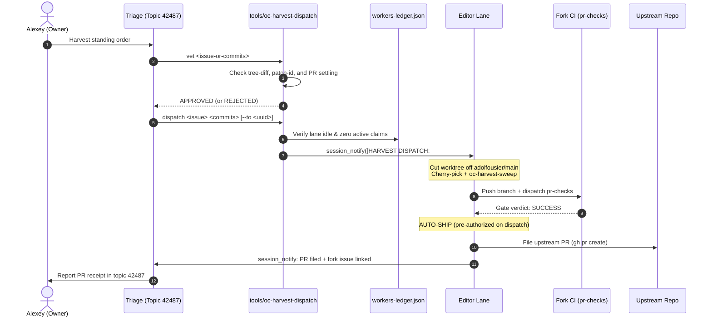
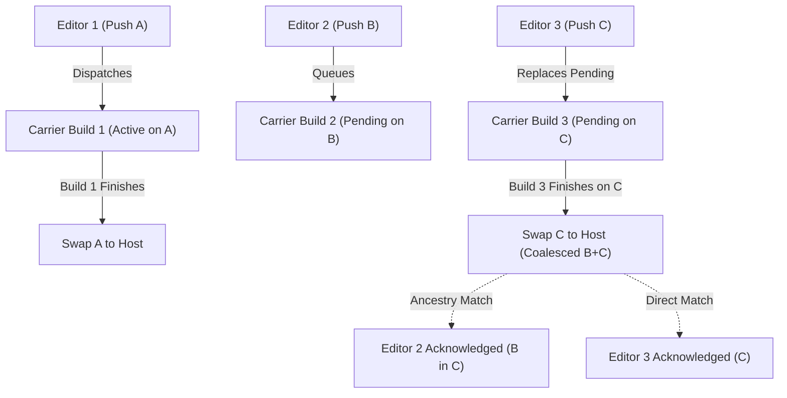

# Fleet directives — opencrabs-dev owner rulings

**Owns:** binding owner directives for opencrabs-dev work (sync policy, upstream PR law, builds/carriers, cargo prohibition, telegram surface law, tool logging, gates, editors, triage, cadence). Re-homed here from ops AGENTS.md/MEMORY.md per owner order 2026-09-02. Where a ruling's full text already lives canonically in another skill file, this file carries only a pointer — one concept, one home.

**Thematic index** (lens B-17/G-F9 v0.4.90 — file is flat; jump via section name). **[LANE] tag (v0.4.95):** sections every worker MUST read in full at spawn/compaction reload (editor.md/triage.md/toolsmith.md/hq.md RELOAD LAW v0.4.95). EXCEPTION (v0.4.96, lens B-F1): HQ re-reads THIS ENTIRE FILE IN FULL (~54 kB and growing — exact size varies per cycle; it owns and rules on the directives; the other three roles may use the thematic-index minimum for non-[LANE] sections):
**Remotes & sync** (remotes, sync policy) · **Seam-resolution shape** (REBASE model; upstream-byte-exact, overlay disposition) · **Upstream-merge cadence · HARVEST LAW · NO-HOLD** (daily patrol, filing gate, port-work ownership) · **Upstream** (issue filings, PR base-Lint, cross-fork PR, PR naming) · **Builds & ships** (S3/oc-deploy, swap-head signature, swap-sha coverage, features-compat gate, hotfix REDs, no auto-rollback) · **Process & verification** (stage-entry consent, attribution guard, inherited-claim pillars, truncated-output rule, post-compaction reload, what-now/next) · **Channels** (telegram surface law, telegram_send addressing law + TO-BE appendix (outside reload path), post-swap notify, cross-lane delivery cadence, tool logging) · **Lanes** (creating new editors, tool-problem reports/Triage, cadence boundary, parked issues, brain-scrub, discussion links, every-turn verdicts, rule-text provenance, daemon no-reap).

<!-- source: AGENTS block1 (remotes/upstream/source-work/impl-comment) -->
## Remotes & sync

**~/opencrabs remotes** (renamed 2026-08-24, was inverted): `origin` = fork `leshchenko1979/opencrabs` (push target) · `adolfousier` = upstream source — **sync policy (REBASE MODEL — owner-approved transition 2026-09-11, plan "Fork Rebase Transition and Sync Workflow"; the 2026-09-02 "Land it" MERGE policy is RETIRED).** Fork main is rebased onto `adolfousier/main`: a small set of topical commits sits directly on upstream/main, and each sync is a **rebase that drops commits upstream has accepted**, so the ahead counter reflects true pending delta and shrinks as PRs land. Force-push onto fork main is sanctioned ONLY via `--force-with-lease`, with the pre-cutover sha recorded in the ledger FIRST (rollback = `--force-with-lease` back to it). The old "merge, never rebase/reset" rule is void — it was the policy that produced 31 merge commits and a 333-commit phantom ahead count. Guards: (1) **merged ≠ deployed** — a sync lands in git and must pass fork CI (pr-checks) GREEN; the prod binary swap stays a separate, explicit act; (2) **FREEZE** while any carrier chain is between dispatch and swap (query the ledger for open claim/ship events before syncing); (3) **detection** = cron `harvest-watch-4h` (`ls-remote adolfousier main` every 4h, reports shifts and harvest backlog; detect+report only, sync is owner-gated). "Rebase-port" remains the technique for PR chains only; non-interactive `git merge --ff-only` of upstream into the diverged fork stays forbidden (history diverged by design 2026-08-26); historical: REBASE-PORT procedure (hq.md §Upstream sync — re-homed v0.4.80, lens B F3; the compiler role is RETIRED 2026-08-28 — this line updated per Duty-6 lens B, 2026-08-31). Builds fire ONLY via `oc-deploy` (S3 2026-08-28 — compiler role RETIRED; the editor invokes `oc-deploy ship` per editor.md; the ORDER-to-Compiler notify path is deleted) — **direct `gh workflow run quick-build-linux.yml` calls from any editor are FORBIDDEN** (rogue-dispatch rulings 2026-08-26/27; first offense logged vs this lane 01:55Z). The workflow lives ONLY on carrier branch `ci/quick-build-linux`, never on fork main (moved off 2026-08-26); the dispatch `ref` input must be the FULL 40-char sha — carrier Gate 1 SHAPE (3349cf7e, 2026-08-27) rejects branch names and short form. Carrier runs ORDER gates (shape/existence/containment/signature — pure git verification; the cargo test leg REMOVED 2026-08-31 owner word "removing looks good", commit e71dba58 — all-features testing lives on the PR gate, residual risk: straight-to-main hotfix shas ship un-tested) before the build job (`needs: gates`); containment requires the sha already on fork main, so ship path = FF-push main, then dispatch via `tools/oc-deploy` (**S3 LIVE 2026-08-28** — compiler role retired; `swap-execute` mode: sha-bound, AUTO-SWAP on GREEN build (deploy consent ELIMINATED owner 2026-08-28 18:50Z), rollback-drilled, full journal/markers/ledger receipts; pilots 87d3bcb8 11:33Z / 2d643146 12:57Z / 6643cf3c 14:32Z, events 1269/1275/1281. Ledger canonical path = `opencrabs-dev/workers-ledger.json` — since v0.4.38 (2026-08-29) `oc-deploy` + `oc-order-validate` default to it DIRECTLY; `OC_LEDGER` overrides, an explicit `OC_DEPLOY_STATE_DIR` keeps test fixtures isolated; the skill-dir duplicate is DELETED). Executing procedure for this sync leg: `upstream-merge-runbook.md` (delegated to Triage per owner order 2026-09-11; HQ does not execute syncs).

## Seam-resolution shape (REBASE model — replaces the retired merge-resolution shape)

(owner 2026-09-02 principle, "keep his part as he sees it — apply our changes on top where it's essential", carried forward into the rebase model):** upstream's code ships byte-exact as adolfo wrote it, never hand-blended. The MECHANISM changes with the model: our topical commits are replayed onto `upstream/main`, and the rebase **drops every commit upstream has already accepted** — that is precisely what makes the ahead counter shrink. Conflicts therefore arise only while replaying OUR still-pending commits, and resolution is per-commit: adapt our delta onto upstream's current shape, never overwrite his code. Each replay conflict is gated by the **overlay-disposition analysis**: fork-only commits classified drop/port/ask against upstream's revealed stance (his merges of our PRs = auto-drop our duplicate; absorbed = check what he changed on top; declined = his comment decides; no signal = ask), with adolfo's commit bodies and PR/issue comments read — the classification ships as a table for the **owner's human gate** before any adaptation commit is cut. Standing exception: prod-bound fork migrations keep their slot (load-bearing prod `user_version`); upstream's migration shifts to the next free version, content byte-exact. Historical (MERGE mechanism, RETIRED with the merge policy): first applied at merge `247fed2b` (2026-09-02) — 32/32 conflicted files upstream-verbatim, 0-byte fidelity check; superseded resolution preserved at ref `merge/upstream-20260902-forkwin`. Recorded as precedent for the byte-exact principle, not as a live procedure.

## Upstream-merge cadence · HARVEST LAW · NO-HOLD

(owner 2026-09-02, "yes, add this rule"): two tiers on top of the fork-main sync policy above — (1) **Pre-PR sync is MANDATORY**: any long-lived branch (sync branches, PR chains) **rebases onto `adolfousier/main`** immediately before opening a PR, so upstream review sees only our delta, never stale-base noise (under the pre-2026-09-11 merge model this was a merge; the requirement is unchanged — only the mechanism is now rebase, per the sync policy above); (2) **Event-driven syncs**: same-day or next-day sync when upstream lands commits touching files that carry fork `port(fork→merge)` deltas (watch `channels/`, `brain/agent/service/` first). NOT "before every push" — each sync still costs a fidelity pass + disposition + its own CI. Rationale: round 2 of the 2026-09-02 merge went RED with 29 errors, all seams where big-bang fork-era resolution fought upstream-new files — error count scales with diff size, so frequent small syncs keep the diff readable. Drift detection stays with cron `harvest-watch-4h` (4h `ls-remote`; same-day drift is real: `8846de72` → `72b11629` within the merge day). **HARVEST LAW (owner 2026-09-08, “Go” on daily enforcement, v0.4.97):** the consolidated patrol runs every 4 hours (`harvest-watch-4h`), running `oc-upstream-delta` and posting the tiered backlog census (Tier-1/2/3 + counter line: fork-only commit count + open upstream PR count) to board topic 30220 / triage queue. Standing order (owner override 2026-09-08 13:51Z): file PRs AS SOON AS tests are green AND smokes are confirmed (v0.4.104 behavioral rubric) — no serial-PR waiting; the previous one-PR-at-a-time rule is RETIRED (owner: “this law is incorrect, Adolfo never told this”). NO-HOLD law (owner override 2026-09-08 15:2xZ, topic 42487): there is NO holding STATE — no waiting-period, no serial-PR queue, no parked batch. Editor fires the behavioral smoke (v0.4.104 rubric) IMMEDIATELY on probe commission. **PR filing is governed by PR SHIPMENT law, single home SKILL.md §ISSUE ROUTING (PR SHIPMENT row).** Smoke PASS (v0.4.104 rubric, four legs) → file/ship immediately; the owner is notified AFTER the act. Gates that survive: all mechanical CI/gate legs, the v0.4.104 smoke rubric, post-swap rollback-is-owner's-call. **OPERATOR COMMAND ONLY (owner order 2026-09-12):** Harvest execution, batch merge/sync windows, probe commissioning, and upstream PR filing waves are triggered **ONLY by explicit operator command** (e.g. `/goal harvest ...` or direct owner directive). Crons and automated patrols (`harvest-watch-4h`) perform reporting and census sweeps only — they NEVER autonomously trigger harvest waves or PR generation. Zero-change days still post a one-line census (heartbeat = patrol alive).

**Ledger hygiene laws (lens-H cycle-2 codifications, v0.4.127):**
- **H-3 fork-skill push remote:** the skill repo's canonical push remote is `mirror2` (git@github.com:leshchenko1979/opencrabs-skill.git). A push naming bare `leshchenko1979` (no remote of that name) fails - n=2125 class. SKILL.md's mirror sentence is descriptive; this row is the operational name.
- **H-4 sync rows need real --why:** every `oc-ledger sync --version` row carries substantive why-text (what the bump contains, battery receipt ts). Empty `v0.4.NNN -` rows (n=2106/2108 class, the v0.4.113/114 lens additions) violate the sync vocabulary; bump content must be recoverable from the row, not just the CHANGELOG.
- **H-5 claim lifecycle close-out:** a `claim` row whose issue reaches CLOSED state with no `confirm`/`release` row is stale-debt - the actor's next `oc-commit` mints an Issue-Ref against a closed issue (329bf3a3/#32, closed 7 days before detection). Law: when a claimed issue closes, the claiming lane stamps `confirm` (done) or `release` (not mine) same-session; T4 sweeps check closed-issues-with-open-claims.
- **Journal retention (owner ruling 2026-09-09 18:55Z):** `waiters/journal/*.jsonl` older than 7 days are archived to the state repo (`opencrabs-dev/incident-evidence-<date>/waiters-journal-archive/`) then removed — AFTER a grep confirms no open ledger event cites the waiter id. Journals cited by an open ledger event are kept indefinitely. Duty-4/T4 executes the sweep; the 176→165 file archive-then-wipe on 2026-09-09 is the worked example.
- **Canonical smoke log:** the single `smoke-verdicts.log` lives in the STATE repo (`opencrabs-dev/smoke-verdicts.log`) — it already hosts the workers-ledger. Smoke stamps go there and nowhere else; the skill repo copy was removed (f0775f83) and all fragment logs' unique lines were merged in before archival (owner ruling 2026-09-09 18:55Z).
- **Canonical smoke log — ABSOLUTE PATH, stamp it literally (QUIRK from lane 6cd8175f, 2026-09-12):** `/root/.opencrabs/profiles/ops/opencrabs-dev/smoke-verdicts.log`. Every `smoke-verdicts.log` reference in this file and in `editor.md`/`triage.md` means THAT path. A bare filename resolved from the ops profile root hit a stale pre-move decoy at `/root/.opencrabs/profiles/ops/smoke-verdicts.log` and silently captured 2 rows (c10cd97b 22:38:00Z; 6cd8175f 09:09:39Z BLOCKED-INFRA) — both already SUPERSEDED in canonical (the BLOCKED-INFRA by a 09:46:44Z PASS; the 22:38:00Z row was a pre-screenshot draft), so neither was merged. Decoy RETIRED 2026-09-12: archived to `incident-evidence-20260912/smoke-verdicts.log.decoy-20260912.bak` and the old path now SYMLINKS to canonical, so a wrong-path write self-heals instead of being lost. `oc-smoke-evidence` PRINTS a leg and never appends — the write is hand-typed, which is why the path must be copied, never resolved.

**PORT-WORK OWNERSHIP — three-role split (owner ruling 2026-09-08 17:04Z, button pick option 0 "Agreed - codify the split: editors build, Triage queues, HQ gates"; recovered from daemon callback log after the #1226 mid-turn swallow; v0.4.107):**

| Role | Owner | Scope |
|---|---|---|
| **Editors build** | Editor lanes | All port commits (`port(fork→merge)` re-lands per the Seam-resolution shape above) and harvest-port adaptations — ports are code, editors write code |
| **Triage queues** | Triage | Disposition census (drop/port/ask vs upstream stance), port-work backlog, commissioning port lanes |
| **HQ gates** | HQ | Overlay-disposition classification ruling + port-commit approval gate; owner remains the ask-decider where upstream stance is ambiguous |

No single role "owns ports" alone — the law names the chain explicitly (owner 17:00Z: "We need to decide who owns ports"). The button pick supersedes HQ's 17:02Z three-class board proposal and Triage's 16:50Z three-hand answer wherever they differed.

**Upstream PR law** (owner 2026-08-27, tightened 2026-08-26) — canonical text: SKILL.md §Upstream relations + §Hard rules rows ("Upstream receives PRs ONLY", "PR SHIPMENT LAW"). Core: PRs-only upstream, never `Closes #N`, fork-issue link at body end, autonomous filing on smoke PASS (v0.4.104 4-leg rubric; PR SHIPMENT law — SKILL.md §ISSUE ROUTING, no owner pre-wait), no ad-hoc PRs, branch namespace `leshchenko1979/<slug>` (SKILL.md §Upstream relations item 7). **Kept here (unique) — #1255 exception (owner 2026-08-28 13:59Z):** the compaction-stall / gateway-timeout class is owner-sanctioned for direct upstream REPORTING — adolfo is actively working that area (#1247, fix `a0954b63` on `fix/session-routing-and-fallback-chain`); field report filed as adolfousier/opencrabs#1255 (ledger 1280); follow-ups on that thread may continue upstream. Nightly cron pulls repo only — never pushes brain changes.

## Parallel Harvest Orchestration Protocol (PHOP) (v0.4.136, 2026-09-10)

Standard protocol for parallel harvesting of downstream fork commits to upstream (`adolfousier/opencrabs:main`). Mechanized via `tools/oc-harvest-dispatch`.

### 1. The 4-Stage Harvest Lifecycle

| Stage | Owner | Gate & Invariants | Command / Artifact |
|---|---|---|---|
| **1. Candidate Vetting** | Triage | **Upstream Absence Proof**: Confirm commit delta is non-empty on upstream tip (`git diff adolfousier/main -- <files>`), patch-id is not an ancestor/merged, upstream PR settling authority confirms unharvested, and candidate is not superseded. | `tools/oc-harvest-dispatch vet <issue-or-commits>` |
| **2. Lane Availability** | Triage | **Verify-Unclaimed & Idle Law**: Scan `workers-ledger.json` for active `claim` rows. Target lane must have status `idle` and zero unfinished claims. Never dispatch to a busy lane (e.g. active plan or in-flight gate). | `tools/oc-harvest-dispatch dispatch <issue> <commits> [--to <uuid>]` (enforces rc 4 on busy lanes) |
| **3. Dispatch Envelope** | Triage | **Atomic Dispatch**: Deliver standard payload via `session_notify` (`delivery.mode="turn-end"`). Zero Telegram noise to worker topics. | Standard wire envelope `[HARVEST DISPATCH: #N]` |
| **4. Mechanized Ship & Ack** | Editor | **Ship Gate (v0.4.146)**: Dedicated worktree off `adolfousier/main`, cherry-pick with trailers, `oc-harvest-sweep`, push, `oc-prchecks`. On GREEN gate AND verified 4-leg smoke pass in `smoke-verdicts.log` → file upstream PR citing smoke receipt, link fork issue, notify Triage. Never file unsmoked PRs. | `editor-upstream-pr.md` Phase 7c |

### 2. Standard Dispatch Wire Envelope

```text
[HARVEST DISPATCH: #{issue}]
Target Issue: #{issue} ({slug})
Source Commits: {commits}
Upstream Base: adolfousier/main ({tip_sha})
Target Branch: leshchenko1979/fix/{slug}
Commands:
  1. tools/oc-wt add up-{slug} {branch} --create --from adolfousier/main
  2. git cherry-pick {commits}
  3. tools/oc-harvest-sweep {branch} --base adolfousier/main
  4. Verify 4-leg smoke pass in smoke-verdicts.log
  5. git push origin {branch}
  6. tools/oc-prchecks {branch}
Contract: SHIP on GREEN CI gate + verified 4-leg smoke pass. File PR on adolfousier/opencrabs:main citing gate run ID + smoke evidence, link fork #{issue}, notify Triage.
```

### 3. Orchestration Sequence



**OpenCrabs source work** (`~/opencrabs`): any code edit, CI build, or binary swap follows the **`/opencrabs-dev`** skill (`skills/opencrabs-dev/SKILL.md`) — fresh-base fetch, fork issue claim via `Issue-Ref` trailer + `oc-ledger claim` row (NO tackling comments on fork issues — owner ban 2026-08-27), per-task worktree, CI lint gate (pr-checks), CI-only evidence gates, sha-verified run, backup + atomic swap, ops-only user-unit restart. Upstream stays PRs-only; this section is just the pointer (procedure canonical in the skill).

**Implementation comment per commit (owner 2026-08-28 22:54Z)** — canonical procedure: per-commit gh comment (chained automatically in `oc-ship-chain` Leg 2, or folded into `oc-commit` via `oc-issue-log`; SKILL.md §Canonical tooling). Rule: one comment per editor commit, immediately — no batching at the end.


<!-- source: AGENTS block2 (build lane/cargo/surface/logging/gates/editors/cadence) -->
**Build lane directive (owner, 2026-08-27):** prod ORDER builds must carry the FULL feature set — reduced staging subsets are retired; a binary that drops functionality will not be accepted for swap. **AMENDED same day (owner, mermaid lane):** `local-mermaid` is REMOVED FROM THE TREE (owner 2026-08-27, "cleanup sooner, no local mermaid"): render.rs, the feature, cfg gates, `local_fallback` and its test deleted in `346bf3c2`; delivery is remote-only mermaid.ink (natural-size → 1200px width clamp ladder) via `attach://` bytes. Prod ORDER feature set is now `telegram` ONLY (owner 2026-08-27, ~20:07Z: "the only feature you need is telegram now") — supersedes the full-set requirement above for this box; other channels/STT/TTS/browser remain in-tree but are not built into the prod binary. Four optional raster dep declarations linger in Cargo.toml (PENDING REMOVAL marker) — carrier builds `--locked`, lock regen is Compiler-owned (role retired S3 2026-08-28; lock changes ride editor commits, regen verified by CI); they compile to nothing.


**Cargo prohibition (owner, 2026-08-28)** — canonical full law: editor.md §Box law — no local cargo, ever (PATH / login-shell / PATH-prepend / explicit-path bypasses, disabled rustup tree, rustfmt wrapper only, lint evidence = GREEN pr-checks run). Fleet-directives carries no extra text.

## Telegram surface law (owner 2026-08-28, skill v0.4.31) [LANE]

Canonical full law: SKILL.md §Telegram surface law (v0.4.31). Editor-facing duties: editor.md §Telegram surface law. session_notify is the ONLY inter-role channel; no editor invokes telegram send/edit tools. Fleet-directives carries no extra text — do not restate the law here.

## Chat/topic rename authority (owner order 2026-09-10 03:48Z, topic 42487)

Auditor (Triage) and HQ are free to rename chats and forum topics — no owner approval needed. Keep titles descriptive (3–8 words, reflect actual work per the session-naming convention); renames are bookkeeping, not surface-law sends, so this is not an editor carve-out — editors still never touch Telegram tools.

## Tool logging rule (owner 2026-08-28)

Every tool/script we build must be debuggable from its logs alone. Each state-changing step writes a timestamped, append-only journal line (input, action, outcome, exit code) to durable storage BEFORE the next step begins — the journal, not memory, is the record. If a crash or restart can leave a run unreconstructable from durable state (journal line + marker file + ledger event), the tool is NOT DONE. Born from the 03:11Z 71e58ce5 swap: the swap succeeded but left zero receipts because the oc-deploy journal vocabulary stops at `dispatch` (no `swap` line type) and the deployed.sha marker was never written — HQ had to reconstruct the audit trail from binary mtimes and artifact shas. Applies to oc-deploy and every future tool; gap list: swap-leg journal lines + marker write land with S2 wiring.

## Discussion links + fix-approval gate (owner 2026-08-28 14:28Z)

1. **Whenever a PR or issue is discussed, a link must be given.** Every mention of a PR or issue number — chat, reports, ledger entries, rulings — carries the full URL (or an owner/repo#N reference that resolves to one). No bare numbers: a number without a link is an unfinished sentence. If a reference cannot be resolved to a link, say so explicitly.
2. **Owner gates EVERY implementation design (owner order 2026-09-09 ~20:03Z, supersedes the fix-scoped version).** No implementation of ANY design — fix, feature, tool, refactor, process change, any size — begins code work before the owner approves the design. The design is presented to the owner in CANONICAL TERMS (the project's codified ontology — fleet-directives.md vocabulary, exact codified names, no invented shorthand; owner order 2026-09-07 09:34Z) WITH a process diagram (Mermaid, vertical; multi-actor processes get a sequenceDiagram per item 3; no backticks/angle-brackets in labels). The diagram is part of the gate: a design presented without its diagram is not presented. Implementing an unapproved or un-diagrammed design is a gate violation at any size. Owner's approval must be explicit (message or 👍 reaction); silence is NOT approval. HQ/lane work that produces a design — including Duty-4 accepted proposals that change law or tooling behavior — passes through this gate before implementation.
3. **Multi-actor processes get a sequence diagram (owner 2026-08-28 17:55Z).** Whenever the process under discussion involves SEVERAL ACTORS (roles, tools, external services, humans), the required diagram is a Mermaid `sequenceDiagram` — one participant per actor, messages as labeled arrows. A flowchart is acceptable only when the flow is genuinely single-track.
4. **Bare `#N` with fork issue numbers is forbidden on any upstream surface (owner 2026-08-31, skill v0.4.67, fork [#54](https://github.com/leshchenko1979/opencrabs/issues/54)).** Outside a code span, GitHub autolinks `#N` against adolfo's issue space — the tooltip points at the wrong repo's issue. Required form on PR/issue bodies, titles, comments: `leshchenko1979/opencrabs#N` or full URL. Code spans exempt (no autolinking inside backticks). All live upstream offenders patched 2026-08-31; sweep clean.

## Upstream issue filings — report-only (owner 2026-08-28 15:17Z)

**Offload order — CORRECTED (owner 2026-09-01, "Wait, i was talking about prs only. Revert issues"):** "Offload to upstream" applies to **PRs only** (when we fix OpenCrabs-source bugs, the fix ships as an upstream PR per the existing PRs-only rule). **Issue reports NEVER go upstream** — the fork is the issues home, permanently. The 2026-09-01 issue-migration (adolfousier #1279–#1286 for fork 70/33/38/58/35/60/65 + TEXT_ACCUM) was misread, withdrawn same day: all 8 upstream issues closed as withdrawn, all 7 fork issues reopened, #1255 cross-link deleted. #66 remains not-upstream-eligible (upstream #1260 closed pointing back to the fork; needs owner-level follow-up with adolfo).

When the owner tells us to FILE an issue upstream (adolfousier/opencrabs), the editor does NOT fix it: the filed report is the deliverable, and fixing the upstream-reported defect is adolfo's lane. No editor lane writes fix code or opens a fix PR for an upstream-filed issue unless the owner explicitly orders the fix — follow-up REPORTING on the filed thread stays allowed (per the #1255 exception).

## Stage-entry consent (owner 2026-08-28 16:57Z)

When the owner says to go to a stage ("let's go to S3", "go to Sx"), that word IS the approval for ALL actions defined in that stage's definition (stage table: `~/oc-work/target-process-*.md`). No per-action re-asking for anything inside the stage definition. Gates the stage definition itself spells out (e.g. the sha-bound artifact verify that authorizes each swap) REMAIN — they are part of the stage definition, not exceptions to it.

## No auto-rollback on smoke FAIL (owner 2026-08-28 18:50Z)

Post-swap smoke FAIL → rollback is the OWNER's call, never mechanical. The swap-chain auto-rollback on post-bounce verify fail (crash-integrity: disk==proc mismatch → restore backup) is UNCHANGED — that one stays automatic. With deploy consent eliminated the same day, this is the only human gate left near the deploy pipeline.

**Smoke-verdict ledger append discipline (owner 2026-09-05, ops relay):** the DRIVING lane appends its verdict to the smoke ledger file (`opencrabs-dev/smoke-verdicts.log` — the canonical state dir; `oc-smoke-evidence` prints the boilerplate row) in the SAME turn as the verdict — posting to topics is visibility, not persistence. Relay/HQ sessions never backfill on the lane's behalf; a late entry is only legal explicitly marked `LATE ENTRY` with the on-record source receipts. Rationale: the theme-3 verdict lived in topics only until a morning audit caught it; the file mtime proved the claimed append never ran.

## Post-swap notify (LIVE — mechanical fan-out since 2026-08-29)

Mechanics canonical: `oc-deploy fanout` (GREEN leg at the swap_execute tail, RED leg via poll failed-run scan; idempotent `fanout.state`; drills off via `OC_DEPLOY_NOFANOUT=1`) + s2-swap-journal-spec §Fan-out legs. No manual notify steps anywhere. Ledger path is canonical `opencrabs-dev/workers-ledger.json` — the skill-dir duplicate was deleted 2026-08-29 (v0.4.38); fix shipped FIRST, deletion second.

**Fanout commit sweep excludes upstream merge ancestry (Duty-4 P-01, v0.4.133):** `oc-attrib --contributors --first-parent` strictly sweeps `--first-parent` for deployed commit attribution, preventing traversal into foreign upstream merge ancestry. Upstream sync merge commits (e.g. `8870bd40`) will NOT falsely wake completed historical editor lanes whose Session-Ids appeared in merged PRs.

## Post-compaction skill reload (owner 2026-09-04) [LANE]

After ANY context compaction or spawn, the first action before any opencrabs-dev work is reloading this skill (`/opencrabs-dev`, or SKILL.md + your role file + fleet-directives.md — role files and toolsmith.md: [LANE]-tagged sections IN FULL; RELOAD LAW v0.4.95). Editor spawn briefs must carry this rule; the ops AGENTS.md § "OpenCrabs dev" carries the always-loaded anchor. Rationale: compaction clears the skill from context but not the obligation to follow it; mechanical laws are tool-enforced (order-validate, features-compat, pr-checks) but process law (scope-confirmation-first, approval gates, PR body rules) exists only here.

## Receiver-side dedupe of reload demands (HQ ruling 2026-09-10, anomaly: duplicate v0.4.130 fanout wave)

If an identical reload demand (same skill version + same skill sha) arrives and you have already run drift-check + stamped ack for THAT version: drop it silently — no re-execute, no re-ack (a blind re-run double-stamps the ledger and corrupts ack counts); optional one-line dup-notice to sender. Receiver-side defense only; sender-side single-wave discipline is HQ's (process check before launching a wave). Model behavior: c2ba4ef2 detected the duplicate by (version, sha) match and did not re-execute.

## Attribution guard (post-compaction wakes)

Before disputing the attribution of any shipped artifact (build, deploy, ledger event, commit) — on a `session_notify` wake, after a compaction, or whenever memory and records disagree — re-derive OWN shipped work from durable state FIRST: `opencrabs-dev/workers-ledger.json` claim/fanout events, oc-deploy journal lines + deployed.sha markers. Ledger beats memory; a mismatch is reported, never accused. Origin: post-compaction amnesia made this lane falsely blame oc-attrib/fanout for its own shipped work (retraction logged 2026-08-30, HQ d72bd52d); guard forwarded to owner via HQ topic report — remove on owner order only.

## PR naming convention (owner 2026-08-30) [LANE]
Every PR this fleet opens carries a type prefix in the title so upstream release triage can split bugfixes from features at a glance:
- `fix:` (or `fix(scope):`) — bug fix; corrects broken behavior
- `feat:` (or `feat(scope):`) — new capability or behavior change
- `chore:` — tooling/CI/docs/deps; zero user-visible behavior change
Applies to upstream (adolfousier/opencrabs) AND fork PRs. New branches mirror the type in the slug: `leshchenko1979/fix/<slug>` / `feat/<slug>` / `chore/<slug>` (existing branches untouched). Retro-check 2026-08-30: upstream PR #1265 already conforms (`fix(plan): …`). Procedure detail: `/opencrabs-dev` skill, editor-upstream-pr.md Phase 7.
## CI-wait discipline & actor attribution (owner 2026-08-30 — fix batch)

**Canonical Waiter Discipline Standards (W1–W6):**
1. **W1 (Detached execution standard):** Long-running commands (>60s) execute detached (`background: true`). Hand-rolled nohup/sleep loops are strictly forbidden.
2. **W2 (Poll floor & ceiling):** Detached CI watchers must respect a ≥30s poll interval floor and a bounded timeout ceiling (default 2700s via `oc-prchecks wait`).
3. **W3 (Invocation verification):** Verify job dispatch identity before entering wait loops; never poll an ambiguous or unverified run ID.
4. **W4 (Notify wiring):** Automated watchers notify directly to the owning session UUID via `session_notify` upon terminal completion.
5. **W5 (Log-window cuts):** Grep and log queries must bound search ranges (`--since` or fixed tail) to avoid context compaction floods.
6. **W6 (Actor attribution):** Every `oc-*` tool call must export `OC_ACTOR=<session-uuid>`.

Procedure detail: `editor.md §CI-wait discipline & actor attribution`.

## Creating new editors (owner order 2026-09-01 21:56Z)

Trigger: a NEW area is discussed and a research/code task needs doing, and NO existing editor lane has done anything in that area. Then the TRIAGE lane creates a fresh editor (standing authority transferred from HQ at v0.4.86, owner "Go with Option A" 2026-09-06; HQ retains roster/registry ownership — hq.md Duty 2):

1. `tool_search("tg_mtproto")` (dynamic tool; schema dies at compaction — re-search first).
2. Create the topic (MTProto): forum methods live under `messages.*`, NOT
   `channels.*` (the durable gotcha); pass `resolve: true`; peer = forum chat
   id. The exact method incantation + envelope-parse recipe are one
   `session_search` away (topic-creation receipts in the ledger) — not cached
   here.
3. Brief the lane ONLY via `session_notify` to its session id (owner order 2026-09-03 19:28Z — supersedes the former tg_send_message-into-topic briefing). The spawn prompt carries only the task seed; the full brief, corrections, and un-park orders go through `session_notify`. A topic post is allowed for OWNER VISIBILITY only — labeled as such, never the briefing channel.
   - **Injection verification REQUIRED (owner order 2026-09-07 + auditor finding, n=1803 verify):** a `session_notify` "delivered" receipt ≠ injected. Before stamping any ack ("brief delivered", "lane briefed"), verify injection from the daemon log: a delivery to a spawned-and-dormant session logs `parking until its channel claims it` (restart_recovery.rs) — that line means NOT delivered. Grep the log for the target session id after the send; stamp ack only on a real injection (or queue redelivery). Origin: auditor lane a65e7ab6 — Triage stamped "re-brief delivered" (n=1803) while both sends sat parked (log 05:30:21Z + 05:33:35Z); seed brief survived only because the spawn prompt carried it.
   - **Liveness check + no_route accounting (auditor finding #2, verified 2026-09-07):** before `session_notify` to any session not heard from this turn, verify the target is live — `session_search` with `updated_since` (or a same-turn log grep for the session id; a session silent since a prior day is DEAD, e.g. c10cd97b last seen 09-05 10:56Z, notified 09-06 23:00Z → no_route). A `no_route`/rc2 outcome is UNHANDLED until the intended content is re-routed to a live surface (successor session or HQ) and the miss is ledger-noted — silent no_route = content unaccounted for.
   - **"Read the skill first" directive in every spawn prompt (owner order 2026-09-07):** the task seed must instruct the new lane to load `/opencrabs-dev` skill (SKILL.md + fleet-directives.md) BEFORE its first action — post-compaction law applies to fresh lanes the same as compacted ones.
4. Enroll the new editor in the roster: `oc-ledger enroll <uuid> <role> --topic <topic id>` (lesson 2026-09-01: an unrostered actor fails ship with "Session-Id not in workers ledger"). The verb is `enroll` — `roster-enroll` is a PHANTOM (rc 2, absent from the usage line; corrected in the Task-8 governance pass).

## Tool-problem reports: direct to TOOLSMITH for tools, issues for core (owner order 2026-09-10 ~02:4xZ & 14:3xZ; v0.4.130 Direct Dispatch Law; Finding BS-01 fix v0.4.133)

**Work orders and anomaly reports follow Direct Dispatch — no relay hops.** Tool-use anomaly reports (failed invocations, wrong args, false journal rows, unbacked persistence claims, CLI quirks) in `tools/oc-*` MUST be dispatched directly to the active **TOOLSMITH** lane (`session_notify`; resolve target dynamically via `oc-ledger roster --live --role <role>` — never hardcode ephemeral UUIDs). Core daemon anomalies (e.g. panic, binary faults) go directly to GitHub fork issues. **Role resolution verb (Task-8 correction 2026-09-11):** `oc-ledger roster --live --role <role>` is the working form. `oc-roster` does NOT resolve roles — its `--role` flag is actively rejected (rc 2, directing callers to `oc-ledger roster`), so role resolution MUST use `oc-ledger roster`. Do not substitute `oc-roster` here.

Triage is an AUDITOR, not a relay hub. Lanes do NOT route tool anomalies through Triage to have Triage forward them to Toolsmith. The HQ of record for semantic rulings and escalating blockers remains **OC DEV HQ**, but executing fixes on CLI tools belongs directly to Toolsmith.

Format for direct quirk dispatch to Toolsmith: `QUIRK: <tool> <observed> BECAUSE <expected>` + evidence (exit code, logs, journal). Toolsmith verifies against disk/tests, fixes in a worktree, verifies selftests, and ships via `oc-ship-chain`.

**Law text may name only commands that EXIST — verified against the tool's own surface before it is written (2026-09-12, two instances in one day).** A runbook row that prescribes an impossible verb is a **defect, not a typo**: lanes follow law literally and collect `rc=2`. Both instances below were found by editors who ran the prescribed command and got a usage error instead of the promised recovery:

| Prescribed (wrong) | Real surface | Where it was written |
|---|---|---|
| `oc-ship-chain --resume` | flag never existed — 0 occurrences; the arg loop's catch-all dies `unknown arg` rc=2. Real recovery = read `deployed.sha`, then re-run the same chain with `--gated-run <id>` | `editor.md` Failure Mode 4 (fixed v0.4.154) |
| `oc-ledger stamp proposal` | `KINDS` enum omitted `proposal` → stamp rc=2, `events --kind proposal` rc=1 empty. **RESOLVED** — kind admitted by Toolsmith `be7bfd09`, verified live on a fixture ledger (v0.4.156; precedent: `shipchain` v1.2, `roster-retire` v1.3) | `editor.md:69`, this file, `hq.md` |

Verification is one line either way: `grep -c -- '<flag>' <tool>` for a flag, or read the tool's `KINDS` / case-arm list for a verb. Do this BEFORE the law ships. Fix ownership splits: **HQ** owns the law text, **Toolsmith** owns the tool surface when the missing verb should exist rather than be removed.

**And law text must be RETIRED when the named defect is fixed (2026-09-12, same day, third instance of this family).** A changelog entry or defect-board row that prescribes a **workaround** becomes actively harmful once the tool is fixed — it recreates the dead channel in the opposite direction. Instance: the v0.4.154/155 text told lanes that `stamp proposal` "can never yield a row" and to mirror Duty-4 proposals as `kind=note` with a `duty4-proposal` prefix; Toolsmith's `be7bfd09` admitted the kind **~1 minute later**, so a lane following that brief would have written proposals where `events --kind proposal` — the audit verb — can never see them. Two lanes (`c2ba4ef2`, `aaa8d8ae`) caught it independently. **Rule:** when a fix ships, the SAME turn marks the prescribing text `RESOLVED` and names the fixing commit sha; a workaround that outlives its defect is itself a defect.

**Staging is not path-safe on an already-dirty path — a path-scoped `git add` stages the WHOLE file, including another actor's in-flight edits (2026-09-12, live incident).** The owner's commit `13cd8423` @09:51:12Z carries Triage's uncommitted v0.4.157 Phase 3 law text because `git add fleet-directives.md` was run while that file was ALREADY dirty: the edit was HQ's (one row), the sweep was not, and provenance is not recoverable after the fact — the commit message and sha name the committer, not the author. The `sync` door is now guarded (stray-guard, `oc-ledger sync` → `rc 7`, v0.4.158); **plain git has no guard.** `git add <path>` and `git commit -a` both stage whatever is in the working tree at that moment, and `git commit --only <path>` limits the commit to named PATHS but does NOT make a dirty PATH safe — foreign edits inside a named file ride along. **Rule:** run `git status --porcelain <path>` in the same turn you stage. If the path was already dirty BEFORE your own edit, do NOT commit it — coordinate with the actor holding it, or commit a file you exclusively own.

## Unified Event Capture: Urgent Routing vs. Batched Evolution (v0.4.145)

All observed runtime events, anomalies, proposals, and feature ideas MUST follow the strict taxonomy below. Urgent execution items route directly to the owning substrate without relay hops; non-urgent evolution items persist to disk/ledger to prevent context bloat and memory compaction at HQ.

| Event Class | Trigger & Scope | Destination / Owner | Ingestion Method | HQ Turn Impact |
|---|---|---|---|---|
| **Active Tool Anomaly** | `tools/oc-*` broken, syntax error, failed invocation | **TOOLSMITH** | Direct `session_notify` (target = Toolsmith UUID) | **0 turns** (direct dispatch, no HQ relay) |
| **Daemon Anomaly** | Rust panic, API bug, core runtime fault | **GitHub Issues** | `gh issue create` on `leshchenko1979/opencrabs` | **0 turns** |
| **Host / Infra Outage** | Host unreachable, disk full, systemd unit down | **Alexey** | Escalate via `telegram_send` (Bot API) | **0 turns** |
| **Duty 4 Skill Gap** | Process rule ambiguity, runbook edge case | **Cycle Inbox** | Write to `reviews/<cycle-id>/proposals/<uuid>.md` OR `oc-ledger stamp proposal` | **0 turns** (processed in 1 turn at Duty 6 review) |
| **Idea Box (`/tq-idea`)** | Feature idea, architectural optimization | **State Repo / Backlog** | `oc-ledger stamp idea` or queue file | **0 turns** (processed during task planning / triage) |

**Zero-Relay & Zero-Context Law:**
1. **Never funnel tool anomalies through HQ or Triage**: Report directly to Toolsmith in the same turn it is observed.
2. **Never send Duty 4 proposals via `session_notify` to HQ**: Writing to disk or stamping the ledger preserves the findings across context compactions and protects HQ from message floods.
3. **No Idea or Anomaly is Lost**: Because items are written to filesystem artifacts or appended to git-backed ledger state immediately, they survive crashes, reboots, and compactions automatically.

## HQ does not execute lane work — refuse and reroute (owner order 2026-09-09 ~10:4xZ: "you should refuse work that should be done by the triage lane and tell the requesting lane to reroute")

When a lane sends HQ work that belongs to an executing lane — editor-lane fixes/rebases/carrier chains, Triage-lane intake verification, TOOLSMITH tool code — HQ REFUSES execution and tells the requesting lane to reroute to the owning lane (`session_notify` back to sender, one line: refused per HQ-no-execute law, reroute to <owning lane>). HQ executes ONLY: rulings, skill authoring (via the Triage intake channel), verdicts/gates with same-turn receipts, dispatch GOs, and its own duties (Duty 4/6, patrols, board reporting). Origin: the #129 carrier rebase landed on HQ via session-notify and was half-executed before the owner order arrived — lane worktree restored byte-exact, chain rerouted. If ownership is genuinely ambiguous, HQ rules on ownership (that IS HQ work), then reroutes.

## Cadence boundary is stamped at review consolidation

`oc-ledger cadence` = count of `skill-bump` events since the last boundary event (`review-battery`; query also accepts legacy `skill-review*` kinds the v1.1 KINDS vocabulary can no longer produce — known drift, do not stamp those). Lesson 2026-09-01: the Duty 4+6 verdict was consolidated but never stamped → counter read 24/5 FIRE on stale data. Rule: every consolidated review verdict ends with `oc-ledger stamp review-battery "<summary>"` BEFORE reporting the cadence state; never narrate a cadence reading without checking the boundary event exists.

<!-- source: MEMORY parked-issues -->
## Parked issues — owner standdown (2026-08-28 16:17Z)

Fork issues [leshchenko1979/opencrabs#20](https://github.com/leshchenko1979/opencrabs/issues/20) (plan auto-approve under `approval_policy=auto-always` — 638µs `created_at`→`approved_at`, design-track promise broken, restart resumes unapproved plans as Active) and [leshchenko1979/opencrabs#16](https://github.com/leshchenko1979/opencrabs/issues/16) (plan-card footer lost in 429 flood) are **PARKED**: owner stood the editor lane down ("It's not your concern anymore — stand down", relayed via ops 329bf3a3). No implementation approval will arrive via ops. Gate stays: no code, no branch, no claim-comment on either issue unless Alexey himself explicitly re-opens and approves the solution+diagram. Do NOT re-ignite these on seeing them open in the fork issue list — filed state IS the deliverable; fixing upstream-reported defects is adolfo's lane.


<!-- source: MEMORY swap-head-signature -->
## Swap-head signature for rebase/synthesis/merge-derived binaries (owner 2026-09-03 "Land 1+2 only, keep version as-is")

Gate 4 (Session-Id trailer, `quick-build-linux.yml` ORDER gates) applies to every swap head. **Rebase, synthesis and merge heads cannot carry trailers**, so a bare (unsigned) head must never be dispatched to the build leg (2026-09-03: bare merge `d02f4e08` passed pr-checks GREEN, swap blocked exit 2 pre-install; fixed forward-only with empty marker `1d0dd4cc`. 2026-09-11: the atomic cutover head `12d25260` hit the same wall — `oc-order-validate: UNSIGNED`, chain rc 6 — and stranded main undeployed until marker `70b04864` was landed). **Every upstream sync produces such a head, so this recurs on every sync.** Standing law:

1. **Marker, not waiver** — the marker-commit procedure (tree-identical empty trailer-signed commit before the build dispatch) lives in upstream-merge-runbook.md **step 9** — this file carries the RULING only: never dispatch a bare (unsigned) head, never loosen gate 4. Owner's swap ruling carries over; the marker changes no bytes.
2. **pr-checks mirrors gate 4 in swap mode** — `pr-checks.yml` (carrier branch `ci/quick-build-linux`, landed `464f77c4`) takes `swap=true`: runs the exact gate-4 regex on the gated ref before fmt/clippy/tests. Swap-mode GREEN ⇒ swappable — the build leg has no remaining semantic failure mode (clippy+tests subsume build success; the binary build itself stays quick-build's job, no duplicate artifact per the 2026-08-31 de-dup ruling). Input-gated: ordinary PR-lane runs unchanged.
3. **Version stays put on merges/swaps** — merge-derived binaries ship with the tree's standing version; `deployed.meta.json` (sha + artifact sha256) is the identity record, not the version string. Owner 2026-09-03: a version bump is a release-flow event, not a merge or swap event.

## Autonomous Editor Goal & Continuous Phase Execution Law (v0.4.149, owner order 2026-09-12) [LANE]

- **Autonomous Goal Mandate**: Every editor claiming or waking on an issue MUST issue `/goal follow the skill until the smoke test phase` (or set its session goal) to ensure unbroken continuous execution across all lifecycle phases.
- **Design-gate precondition (owner order 2026-09-12)**: The goal is issued **ONLY AFTER the owner has confirmed the design** (owner design gate, v0.4.128). Until that confirmation lands, the editor stays in the design/approval phase and MUST NOT open the autonomous run: issuing the goal early would carry the editor straight past the gate that exists to require owner approval BEFORE code. Sequence is fixed — design → owner confirms → `/goal` → continuous execution to the smoke test phase.
- **No Early Halts**: Editors MUST NOT stop, ask for confirmation, or stall after writing code (Phase 4), after pushing, or after intermediate ship legs. Work continues uninterrupted through Phase 5 (`oc-ship-chain`) to live host deployment and Phase 6b behavioral smoke testing.
- **Completion Definition**: A task is complete ONLY when the live behavioral smoke test on the swapped binary has executed and its 4-leg receipt is recorded in `smoke-verdicts.log`.

## Full-Gate Pre-PR Testing Law (v0.4.149, owner order 2026-09-12) [LANE]

- **Full CI Suite Mandatory for Upstream PRs**: The `--fast` flag (`fast=true`, lint/clippy only) is strictly permitted for internal Daytime Split-Gate merging (`oc-ship-chain`), but is **STRICTLY PROHIBITED** for final pre-PR verification.
- **Upstream Triad Verification**: Before opening any upstream PR (`editor-upstream-pr.md` Phase 7 / 7c), editors MUST run the full test suite (`cargo test --all-features` + fmt + clippy) via `oc-prchecks` full gate:
  ```bash
  # Single-invocation blocking full gate:
  tools/oc-prchecks wait leshchenko1979/fix/<slug>

  # Standard full gate dispatch:
  tools/oc-prchecks leshchenko1979/fix/<slug>
  ```
- **PR Citation**: The resulting GREEN run URL from the full CI run MUST be cited in the upstream PR body alongside the behavioral smoke test evidence.

## Owner-Dependent Smoke Legs — Park, Don't Chase (v0.4.152, owner order 2026-09-12) [LANE]

**Origin (owner, 2026-09-12 ~08:0xZ, verbatim):** *"I saw you stranded on waiting for a smoke — that shouldn't happen, no human smoke will be confirmed as I was away. Why not just leave these PRs for the next cycle?"* Worked example: a verdict-only lane (#155) sat ~4 h because its 4th smoke leg was an owner visual pass, and that leg was treated as a blocking gate in an owner-absent window. Waiting bought nothing — the candidate was verdict-only and excluded from harvest, so no PR was ever going to be filed off it.

### L1 — An owner-dependent leg is NEVER a blocking gate (park, don't chase)

A smoke leg that only the OWNER can satisfy (a visual pass, a tap, an eye-confirm on a Telegram card) MUST NOT block a lane. The owning lane:

1. stamps the legs it CAN prove — lineage, identity, CI gate, and any agent-runnable behavioral probe (a live call, a forced trigger, an observed output through the new code);
2. appends a **`PARKED-OWNER-EYE`** row to `smoke-verdicts.log` naming the exact owner action required AND the packaging sha;
3. **RELEASES the lane** and moves to its next task.

`PARKED-OWNER-EYE` is a lane-release, NOT a hold: the lane goes idle and claimable, the candidate is deferred. This does not contradict the NO-HOLD law (§Upstream-merge cadence) — NO-HOLD forbids a *waiting state*; parking is the mechanism that keeps a lane OUT of one. A lane idling on an owner leg is in violation; a lane that parks and moves on is compliant.

### L2 — Shift exit condition: receipts or an explicit park

A shift (night or day) is COMPLETE only when every workstream sits in exactly one of two terminal states:

- **RECEIPTED** — the work landed and its receipts are stamped (PR filed, swap verified, ledger row, smoke row); or
- **PARKED** — an explicit `PARKED-OWNER-EYE` row (or an equivalently named park, with its reason) exists, naming the next-cycle action and the owner.

A workstream in state "waiting for X" is NOT terminal and blocks any completion claim. Candidates not closed inside the window **roll to the next cycle** — never chased across it. Report format: `receipted=N · parked=M · waiting=0`; any non-zero `waiting` means the shift is not done.

### L3 — An owner verdict must be explicit AND post-hoc

An owner verdict on a behavioral leg counts ONLY when it is (a) an explicit confirmation and (b) given AFTER the behaviour has finished. A passing remark made mid-flight is NOT a verdict — the behaviour may still be in progress, or about to fail in a way not yet visible.

Worked example (row 87 → row 90, 2026-09-12): the owner's "Smoke passed" landed **16 s AFTER** their own discard and **3 m 17 s BEFORE** the review subagent finished — the defect (headerless card after discard) did not yet exist on screen. The PASS was stamped, then revoked. **Rule:** if the owner's remark is not unambiguously a verdict, record `OWNER-REMARK (not a verdict)` and leave the leg OPEN/PARKED — never convert a passing remark into a PASS row.

### L4 — Smoke stamps cite the PACKAGING sha

Every `smoke-verdicts.log` row's `sha=` MUST be the sha actually under test — for a harvest candidate that is the **packaging tip** (the branch head being filed), never an ancestor it was built from. A row citing an ancestor does not cover the packaging sha and cannot back a PR filing.

Worked example: the #172 row at 01:56:01Z cited `3b095f27` while the packaging tip was `f45d6323` — the stamp never covered the candidate, so a fresh row was required after the full gate. When the packaging sha moves, the row is SUPERSEDED: append a new row, never edit the old one.

## Guard-Flag Escalation Law (v0.4.152, owner order 2026-09-12) [LANE]

**A guard flag is an EVENT, not a log line.** When any tool guard refuses or flags an action — `phantom_blocked`, a receipt/law guard, an attribution refusal — the owning surface MUST be surfaced in the SAME TURN to (a) the lane whose work it concerns and (b) HQ, carrying the guard's own machine-readable reason. A flag that exists only in a guard log or a journal row is an UNFILED defect.

Origin (2026-09-12): the #172 lane's 03:44Z turn announced *"Upstream PR #1514 Filed & Smoked!"*; the guard correctly set `phantom_blocked=1` — and nothing escalated it. The lane went idle believing it had filed, and **~3 h** elapsed before a manual re-verification (`gh pr view 1514` → *"Could not resolve to a PullRequest"*) caught it. The guard was right; the routing was missing. The real PR (#1524) followed only after a re-dispatch.

Sibling of the receipt laws (phantom #6, §Receipt + delivery discipline additions): a blocked claim is never silently dropped — the guard's verdict is itself the receipt that something must be routed.

## Attribution & Goal Hygiene (v0.4.152, owner order 2026-09-12) [LANE]

### A1 — Ledger rows carry an actor, by tool default

Every `oc-*` invocation MUST export `OC_ACTOR=<session-uuid>` (SKILL.md; `lib/oc-log.sh` stamps `unknown` otherwise). Sharpened: a tool that ALREADY KNOWS the owning session (e.g. `oc-ship-chain` inside a chain) MUST default the actor to that session rather than writing an unattributed row — an `(unattributed — pass --by or export OC_ACTOR)` row is a TOOL defect, not lane sloppiness, and is dispatched to Toolsmith.

Worked examples (2026-09-12): 34 `shipchain` rows written unattributed by `oc-ship-chain` while the tool held the owning session id (n=3515 class); and an actor string that is not a rostered role (a lane stamping its factory label instead of its roster role) trips `unrostered-actor` — **stamp as your ROSTER ROLE**.

### A2 — A shift-length goal must fit its turn budget, and its death must notify

An autonomous `/goal` issued for a shift MUST carry a turn budget that covers the shift; a 20-turn default on a multi-hour window expires mid-flight. When a goal ends — budget exhausted, or any terminal state — its death MUST be surfaced. A silently expired goal leaves the loop running on standing orders with no judge, and every "goal clock is running" claim after that is false.

Worked example: goal `eefd9a20` ("don't stop until the entire night shift is done") was set with 20 turns and died `state=failed` at 03:18Z; the shift ran a further ~4.5 h with no goal active while reports still described the clock as running.

## Post-Rewrite Swap Recovery (v0.4.151, Toolsmith brief 2026-09-12) [LANE]

**After a fork-main rebase, RE-RUN the same `oc-ship-chain` leg — never hand-edit `deployed.sha` to re-point around a refusal.**

A rebase orphans the deployed sha (it stops being an ancestor of `main`), and the pre-v0.4.151 guard refused **every** such swap with `non-monotonic-swap`. The guard is now rebase-aware: when the incoming lineage carries the deployed change under a new sha (patch-id match) it journals `rewrite-equivalent-swap` with the twin sha and admits the swap. A guard refusal surfaces as **`rc 6`** from `oc-ship-chain`; the recovery is a re-run, not a marker edit.

`oc-deploy lineage-check --prev <deployed> --sha <incoming>` returns the verdict (`ok` / `rewritten` / `absent`) read-only, without touching gate state. Re-pointing `deployed.sha` by hand leaves a false audit trail for a sha that was never built as a run and is **prohibited** (HQ ruling 2026-09-12, lane `2fbfb2f8` incident). A genuinely-absent change refuses until the audited `--allow-rewritten-lineage` override is passed with a mandatory justification.

## Swap-sha test coverage & Split-Gate Pipeline (v0.4.145)

To optimize daytime delivery velocity while maintaining binary safety, shipping follows the **Split-Gate Pipeline**:

1. **Pre-Merge Gate (Fast Lint, ~2.2 min)**: `oc-ship-chain` runs fast pre-merge checks (`fmt` + `clippy`) on the topic branch via `oc-prchecks --fast`.
2. **Merge-First & In-Tool Auto-Rebase**: Feature branches merge sequentially to `main`. If a concurrent merge creates a non-fast-forward push rejection, `oc-deploy` auto-fetches, auto-rebases, audits diff safety via `oc-rebase-safety audit`, and retries the push in 3s.
3. **Post-Merge Carrier Compile (~10.4 min)**: Carrier `quick-build-linux.yml` compiles the unified tip of `main`. Compilation verifies Rust types, syntax, and borrow checker safety before producing a binary.
4. **Immediate Live Swap & Smoke Review**: Binary swaps atomically onto the host (`oc-deploy swap-execute`), and editors execute Phase 6b smoke tests (`oc-smoke-evidence`) during active daytime hours.
5. **Asynchronous / Nightly Full Regression**: Full regression suites (`cargo test --all-features`, ~25 min) execute asynchronously in CI on `main` or run in consolidated batches during the nighttime sync. If asynchronous test runs report regressions, a fix issue is queued for triage.

## Carrier Concurrency & Coalescence Law (v0.4.148, Toolsmith brief 2026-09-12) [LANE]

- **Workflow Concurrency Semantics:** The GitHub Actions carrier workflow `ci/quick-build-linux` uses `concurrency: group: quick-build-linux` with default queuing semantics (1 active run, 1 pending run; additional dispatches cancel and replace the pending run).
- **Non-blocking Push:** Editors pushing to `origin/main` do not serialize on a pre-dispatch carrier lock; they push their fast-forwarded commits immediately.
- **Ancestry Matching & Coalescence:** `oc-deploy` and `oc-ship-chain` accept descendant builds via ancestry matching (`git merge-base --is-ancestor "$SHA" "$CAND_SHA"`). If Editor B pushes while Editor A's carrier build is running, and Editor C pushes right after, GitHub Actions coalesces B and C into a single build. When that build succeeds, both Editor B and Editor C recognize their commits as deployed without running redundant builds.
- **Host Swap Mutex & Monotonicity:** Host binary swaps remain strictly serialized and monotonic via `host-swap.lock` (`flock -x $STATE_DIR/host-swap.lock`) and lineage verification (`git merge-base --is-ancestor "$PREV_SHA" "$SHA"`), preventing stale binary overwrites.
- **Merge Serialization:** `oc-ship-chain` serializes Leg 3 (fast-forward merge) via `ship.lock`.



## Features-compat gate — no silent feature-loss swaps (HQ ruling 2026-09-04, MANDATORY) [LANE]

`oc-deploy swap-execute` **refuses** any artifact whose feature set drops a feature present in `deployed.meta.json` (exit 4, journal `features-drop-gate`, markers untouched) unless the operator passes `--allow-features-drop` explicitly. Feature *additions* pass freely; *drops* are the failure class. Enforced in-code (selftest 17p/17q). Rationale: the 06:36:06Z rogue swap (run `33844429519`, `features="telegram"` over a live `telegram,code-graph` binary) killed structural memory for 12h — and the 18:57Z f3c03269 swap was the same class (no-tests artifact, auto-consumed). The gate would have refused both.

## Carrier hotfix gates are build-no-tests — expect BASE-FAULT REDs (harvest, A3 lane 2026-09-03)

A green main gate does **not** prove a test-GREEN base: carrier hotfix gates run build-no-tests, so a lane whose branch base is hotfix-fresh may hit its first full-gate RED from base faults it doesn't own. Mitigation that works: triage with `--fault-scope BASE-FAULT`, park, rebase after the main-side repair. (Supersedes nothing; complements the coverage law above — that fixes the process, this prepares the lanes for the window where it isn't applied yet.)

## Cross-lane message delivery discipline (owner order 2026-09-04 22:31Z) [LANE]

Lane-to-lane and lane-to-HQ `session_notify` traffic MUST default to deferred delivery; immediate delivery is the exception, not the default. Evidence: 2026-09-04 logs show 1267 `now`-mode deliveries vs 7 deferred — most were status receipts that interrupted working lanes mid-task.

- **`quiet` (defer until idle)** — default for: status receipts, progress pings, scope confirmations, verdict relays, ACKs, non-urgent questions. The target finishes its current turn; the message lands when the lane is actually free.
- **`turn-end`** — when the content must be seen at the lane's next boundary (un-park signals, approval rulings on a lane blocked on that ruling, corrections to in-flight work).
- **`now`** — reserved for urgent wake-ups only: carrier build/swap orders, gate verdicts a lane is actively blocked on, anything where minutes matter. If nothing breaks by waiting for idle, it is not `now`.
- Escalation path: send `quiet` → if unclaimed after ~30 min AND genuinely time-critical, re-send `turn-end`. Do not start at `now`.
- **Ack expectation line (owner order 2026-09-08; A-L8 v0.4.116 rename — "ack contract" now means only the retired-worker registry policy in hq.md):** every `session_notify` states its ack contract IN the message body — end with a line like `No ack needed` / `ACK by <date>: <what>` / `Reply required: <question>`. Silence-ambiguous traffic ("fyi" that secretly wants confirmation) forces the receiver to guess and breeds unattributed-ACK incidents. When no ack is needed, SAY SO; when one is, name what a valid ack contains. Lanes must not send pure-ack replies to messages marked `No ack needed`.
- **The LEDGER is the ACK channel (owner order 2026-09-11 — "why don't the editors just write the freeze ack to the ledger instead of spending tokens on notifications? And you can just check the ledger").** For any wave/fan-out whose ack contract is "confirm you received X" (freeze, unfreeze, skill-change reload, rebase notices), the ack is an `oc-ledger stamp note "…"` row — **not** a `session_notify` reply. The sender reads acks ONCE with `oc-ledger events --n N` and counts them; no per-lane reply traffic, no reply-tracking state. A lane that answers such a wave with a `session_notify` reply has spent tokens on the wrong surface: the ledger row IS the receipt, and a row absent from the ledger means the ack did not happen. Origin: the 2026-09-11 unfreeze wave — **36 UNFREEZE-ACK rows from 17 lanes** were read in a single `oc-ledger events` call, where per-lane notify replies would have been 36 interrupts of working lanes.
- **Skill-change notifies MUST carry the reload instruction (owner order 2026-09-09):** a notify announcing a skill version bump / law change ends with an explicit reload line — `RELOAD: run oc-drift-check <your-uuid> <new-ver> --ack, re-read changed role files + fleet-directives.md` — and its ack contract is `ACK after drift-check` unless the sender marks it otherwise. **`--ack` IS the ack — never prescribe a second `oc-ledger ack` after it (v0.4.159):** `oc-drift-check --ack` delegates to `oc-ledger ack` (`tools/oc-drift-check:78`), so the former wording "…then STAMP oc-ledger ack" prescribed a SECOND row for ONE adoption — the fleet-wide duplicate-ack family (lane `1a63f103` n=3717/3718 two seconds apart; `d18ce16a` n=3713/3714; `61161247` and `462181e9` ×3; `127429e6` ×2). Stamp `oc-ledger ack <uuid> <new-version>` **ONLY when drift-check ran WITHOUT `--ack`**. A brief that states what changed without the reload verb leaves lanes running the old law in-context (v0.4.120 notify-wave lesson, 2026-09-09).
- **The reload line's ack verb is POSITIONAL and must be quoted exactly (v0.4.155).** The canonical form is `oc-ledger ack <uuid> <0.N.N version>` — `ack` takes **no `--by` flag** (that flag belongs to `stamp`, `tools/oc-ledger:10`), so the invented form `oc-ledger ack --by <uuid> <ver>` dies `rc 2` with `uuid shape invalid (want 8-4-4-4-12 hex): '--by'`. **Never hand-write the ack form into a brief body** — `oc-notify-fanout` auto-appends the canonical RELOAD line (`tools/oc-notify-fanout:447`, `oc-drift-check <uuid> <ver> --ack`), and a hand-written second ack line is exactly how the malformed form reached every lane in the v0.4.152 wave (lane `127429e6` hit `rc 2`; corrected form `oc-ledger ack <uuid> 0.4.153` landed `n=3576`). Same family as the `oc-ship-chain --resume` phantom: **law and briefs name only invocations that exist and are quoted verbatim from the tool.**
- **Forum-scope & Process-Owner Delivery guard (owner order 2026-09-10 03:16Z, clarified 15:33Z):** ALL opencrabs-dev work happens ONLY in the opencrabs-dev forum chat (-1003936827469). Automated dev cron alerts and watchdogs MUST deliver directly to the process owner's session via `session_notify` (mode: turn-end), NEVER to a Telegram topic or the owner's private DM. When human-facing Telegram posts are required by protocol, they route exclusively to forum topic 30220 (`reply_to_message_id=30220`), NEVER to private DMs. Skill-change fanout (oc-notify-fanout) MUST NOT wake sessions outside the forum: every target is verified bound to the forum chat (session_bindings.chat_id in the profile session DB) before any send; out-of-scope targets are skipped with a visible `SKIP <uuid> <role> SCOPE(...)` receipt. Fail-closed: an unbound session is out of scope even if it is a known lane — a freshly spawned lane receives fanout only after it has exchanged messages in the forum (binding rows are created lazily on first exchange). Override for drills: `--forum-chat` / `OC_FANOUT_FORUM_CHAT`. Enforced in oc-notify-fanout law 6 (v0.4.130); selftest proves both leak paths (bound-elsewhere, unbound) receive no send.
- **Reading a delivery verdict — `no wake observed` is NOT a failure (Toolsmith correction 2026-09-12).** A `session_notify` confirm verdict of `routed … no wake was observed within 10s` means the **TARGET IS MID-TURN**: the message is injected at its next tool-loop boundary. It is not a drop, and it does not justify a re-send — a re-send on that verdict is a duplicate, not a fix. Corollary: **`session-notify.journal` absence is not evidence of failure.** `journal_line` has exactly one caller, the CLI path (`src/cli/session_notify.rs:344`); in-agent `session_notify` tool calls (`src/brain/tools/subagent/notify.rs`) never journal, so journal rows exist for CLI sends only. Confirm delivery from the daemon log (`Stamped N notify receipt(s) injected for session <uuid>`) before declaring anything lost. Origin: a Toolsmith lane read its own confirm verdict as "did not wake you", re-sent a handover that had already been delivered, and then read the source before filing the journal gap as a defect — the check that kept it off the defect board.

## Direct dispatch — no relay hops (owner order 2026-09-10 ~02:4xZ "Go", discussion 02:30Z) [LANE]

Work notifications go **sender → resource-owner directly**. No intermediary lane re-sends, forwards, or "relays" work to a third lane. Evidence (2026-09-09): the Triage→TOOLSMITH hop silently died twice (v0.4.129 needed an owner "Go" to move; v0.4.130 stalled until the owner asked HQ to check TOOLSMITH); a spawn-nudge was mis-addressed from a remembered prefix; a frankenstein uuid existed because a dispatch was queued through an intermediary. Every relay hop is a silent-failure surface; direct delivery fails loudly at the sender instead.

- **Rule 1 — Direct dispatch:** the sender of a work order notifies the lane that owns the resource directly. An intermediary may name the target, never carry the payload.
- **Rule 2 — Address by receipt:** the target's full uuid comes from a same-turn roster/ledger read — never from memory or a remembered prefix. The v0.4.129 livecheck (session-DB full-id match) enforces this mechanically: dead/frankenstein ids refuse at send.
- **Rule 3 — Ledger stays the record:** every direct dispatch stamps dispatch + delivery-receipt id via oc-ledger. No send exists that isn't on the ledger; DM history is not the record.
- **Rule 4 — Triage re-roles to auditor:** Triage no longer relays work between lanes. It runs periodic ledger sweeps for unclaimed/stale dispatches and escalates orphans **directly to the sender** (not through HQ). Verify-unclaimed (grep open claim-refs before dispatch) STAYS with Triage — it is an audit, not a relay.
- **Rule 5 — Escalation is direct too:** a dispatch unacked past its stated ack deadline is escalated by the sender straight to HQ. No third-lane relay.
- **Exceptions (not relays):** skill-change broadcast waves (oc-notify-fanout) and HQ rulings/broadcasts are fanout, not relayed work. The owner's design gate (v0.4.128) and roster authority stay with HQ.
- Backed out in: editor.md §Telegram surface law (one line, pointer), triage.md (T2 re-role note).

## Every turn ends with a "what now/next?" answer (owner order 2026-09-05 ~07:29Z)

The fleet runs many lanes; the owner cannot track them all. Therefore EVERY lane and HQ turn — channel replies, reports, acks — MUST end with a short **What now/next** block answering: what is in flight, what happens next and by whom, and what (if anything) is blocked on the owner. No turn ends on bare receipts or a bare ack without orientation. Keep it to 1-3 lines; a "nothing pending" answer is valid and required too. This is report discipline, not status spam — it replaces the owner having to ask "What now?" every time.

## Decision Rollcall — owner-decision sweep, lanes post direct (owner order 2026-09-08 ~06:1xZ, topic 42487, ruling n=1994)

A repeatable owner-facing procedure, distinct from the T5 sweep (issue triage)
and Duty-4 (skill input). When the owner says **"run a Decision Rollcall"**:

1. **Content — owner decisions ONLY.** Each lane presents outstanding decisions
   that need the OWNER's word: one decision + the lane's recommendation + one
   line of context each. NO status reports, no "nothing owed" chatter, no
   ledger trivia. The lane knows its own asks best — nobody filters or
   paraphrases them.
2. **Delivery — LANE-DIRECT, THE ONLY MODE.** Each lane posts IN ITS OWN
   LANE TOPIC, addressed to the owner directly. Lanes do NOT route their list
   through Triage or HQ; Triage does not relay, aggregate, or edit. A lane
   with zero outstanding owner decisions posts NOTHING — silence is the
   "nothing owed" signal. **Present-here mode is RETIRED** (owner override
   2026-09-08 09:05Z, topic 30220: "I don't want the decisions to be
   presented in triage lane. Every editor should be instructed to present
   their decisions in their own lane" — superseding the 08:34Z topic-42487
   amendment). Triage NEVER collects or presents decisions on any word;
   decisions NEVER appear in a Triage/HQ message, only in each lane's own
   topic.
3. **Triage role — coverage + stamp, nothing more.** Triage triggers the
   Rollcall on owner word, verifies every holding lane actually posted (or is
   sanctioned-silent: a same-turn lane-targeted chase receipt, or the lane's
   own zero-decision statement on the ledger — a bare non-post is neither),
   and stamps completion in the ledger. (This criterion is the single home;
   triage.md T7 points here.)
4. **Trigger — on demand** ("run a Decision Rollcall"). A cron or post-ship-chain
   hook is possible later; the owner has not ordered one. Do not self-schedule.

**Format law (owner amendment 2026-09-08 ~06:3xZ, topic 30220):**

5. **No acks.** A lane posts its decisions and nothing else — no "Rollcall
   received", no confirmation posts, no receipt chatter. The post IS the ack.
6. **No telegram_send.** Lane posts as its topic's final chat message
   (text auto-posts). `telegram_send` / `send_document` / media calls are
   forbidden in a Rollcall post.
7. **Context + diagrams.** Each decision is presented WITH its context and,
   where the decision has shape (flow, options, architecture), a mermaid
   diagram — the owner judges renderings, not descriptions.
8. **One decision per message.** Present 1 by 1 — sequential posts, never a
   batched wall. Each post: decision + recommendation + context (+ diagram).
9. **Owner gates designs and special cases.** A lane does NOT implement a
   design or a special case on its own recommendation — those await the
   owner's explicit word, same as any semantic gate.

## Review lens `brain-scrub` (owner order 2026-09-05)

Standing lens in the Duty 4+6 skill-review rotation (registered in `oc-review-persist` LENSES). Scrubs the ops profile's brain files for opencrabs-dev process content living outside the skill:

1. **AGENTS.md** carries only one-line pointers + always-loaded anchors for dev-process law — a full law text duplicated here is a finding (canonical home is this file; one concept, one home).
2. **MEMORY.md** carries no discipline laws — passive memory never binds on a cold session (shipped template law); directives found there are findings.
3. **Every finding lands as a move-with-verification:** the canonical copy is verified present in the skill BEFORE anything is removed from the brain file. Brain files are append-only — shrink/cleanup requires explicit owner approval and `dedup_intent`/`cleanup_intent`.

Reports persist via `oc-review-persist brain-scrub <text|@file>`. Same mechanics as every other lens: verdict consolidated → stamped (`review-battery` boundary law above applies unchanged).

## Upstream PR filing — base Lint pre-claim (Duty-4 proposal, theme-1 lane, owner-approved 2026-09-06) [LANE]

Before filing an upstream PR, poll base-main Lint state and pre-claim any
OWNERLESS red files by carrying a sweep commit in the PR itself
(Session-Id-only trailer, no Issue-Ref). Do NOT rely on sequencing comments
or separate base-repair PRs landing first — the 2026-09-05 #1394/#1393/#1395
out-of-order merge (fork #103 incident) proved sequencing comments don't
protect merge order.

## Cross-fork PR inspection — fetch head from the fork remote (Duty-4 proposal, owner-approved 2026-09-06)

Inspecting a cross-fork PR (`gh pr view N -R upstream`): fetch the head branch
from the FORK remote (`git fetch origin <head>`), never from upstream — a
fork-namespaced head does not exist there (2026-09-05 #1392 404 incident).
Same root fact as ledger n=1537's `gh pr create` namespaced-head lesson.

## Verification during a truncated-output window is not verification (Duty-4 proposal, owner-approved 2026-09-06; sharpens AGENTS.md truncated-output law)

When the earlier run's output was truncated, VERIFICATION ITSELF must be
re-run fresh OUTSIDE that window — a compat check performed during the
truncated window counts as unverified, not as evidence (2026-09-05 #1398:
compat check in a truncated window missed the subject function was deleted
upstream; restoration shipped E0432, retracted same day).

## Rule-text provenance — CHANGELOG at ship time (F13 resolution, owner "Approve all" 2026-09-06)

Rule text carries NO biography — provenance (date, origin quote, war story)
lives in CHANGELOG.md, written at ship time of the version carrying the
rule. This resolves the Duty-1 "every rule carries its war story" clause in
favor of lens A: rules stay lean, history stays in CHANGELOG.

## Daemon no-reap — ruling 1273 (landed in skill 2026-09-06, brain-scrub F5; law previously only in MEMORY.md)

Ops-unit (`opencrabs-ops`) restarts/reaps ONLY that unit — family and default
daemons are never touched by ops/dev work. Default-profile `opencrabs.service`
running an old binary is EXPECTED, not an incident (ruling 1273, owner).

## Inherited-claim three-pillar verification (landed in skill 2026-09-06, brain-scrub F6; previously only in MEMORY.md)

When adopting another session's claim (branch, gate, fix): (1) the artifact
exists on disk/remote as claimed, (2) the evidence trail (gate run, job-name
sha pin) is live-verified by the adopting session itself, (3) no newer state
invalidates it (main moved, superseded fix). All three or the claim is
treated as unverified input, not as a receipt.

## telegram_send addressing rule (owner ruling 2026-09-07, telegram_send error audit) — AS-IS law [LANE]

`telegram_send` calls must ALWAYS carry the full id set: explicit `chat_id`
AND explicit `thread_id` (for forum-enabled chats). Never omit either.

- Omission is not a routing mode — it silently falls back to session-origin
  or last-seen-topic memory, which is how the dominant tool failure
  (`Bad Request: message thread not found`, 2026-09-07 audit) happens.
- Source the ids from the `[Channel: Telegram (chat_id, thread_id)]` header
  of the message being replied to; if absent, resolve via `list_topics`
  before sending.
- `thread_id: null` (explicit General) is the only sanctioned way to target
  General; blind omission is not.

## telegram_send TO-BE target states — NOT LAW YET (owner rulings 2026-09-07; tool changes, NOT lane law)

Two adopted-but-unshipped tool changes live OUTSIDE the reload path (this
appendix) until they ship: (1) origin-default omission semantics — omitted
chat_id/thread_id sends to the originating topic, never the owner DM;
(2) landing echo — success output names the resolved chat_id + thread_id so
misdelivery becomes visible. Full text of both targets: git history (v0.4.130,
fleet-directives.md) and the ledger ruling trail. The [LANE] AS-IS addressing
rule above governs until these ship.

## Deployed-state markers and state-repo hygiene (owner incident #2066, ruled 2026-09-08 ~16:4xZ)

- **NO `git stash`/`checkout`/`clean` inside the opencrabs-dev STATE repo** without first checking for uncommitted deployed-state files (`deployed.sha`, `deployed.meta.json`, `baseline.json`). oc-deploy writes swap markers as working-tree changes; they are committed only by oc-ledger's next state commit. Stashing reverts deployed-state to a stale sha while the box runs the new binary — smoke-evidence then reports MISMATCH on a CORRECT deploy. Origin: HQ stash at 16:06:54Z during a cleanliness check reverted #134 swap markers (n=2066).
- **`oc-smoke-evidence` MISMATCH is not yet a verdict**: before anyone treats the running binary as wrong, cross-check `/proc/<pid>/exe` sha256 against the swap journal. Mismatch between marker file and disk must be resolved as "stale marker" vs "stale binary" — never assumed.
- State-repo stashes that still hold other lanes' WIP (waiters/, tools.log, fanout locks) are recovered ONLY by the owning lane, deliberately — never bulk-popped by HQ.

## CI-run identity + verdict laws (v0.4.109, owner "Go then duty 4+6" 2026-09-08 — consolidated Duty-4/6 batch; all premises HQ-verified same-turn)

- **Gate-run adoption identity = job-name sha pin, never run headSha** (lane 1a63f103, gap hit 17:45Z; HQ-verified live: run 34258955672 headSha=470494c8=default branch, job pin=d949c4e8=actual tip). Before adopting/attributing any PR-lane gate run, grep its job-name full-sha pin against YOUR tip. Run headSha and checkout ref are NOT identity. Carrier workflow_dispatch runs report headBranch/headSha = carrier branch and are unfindable via `gh run list --branch/--commit` — those filters must never be cited as absence evidence (editor 329bf3a3, two chase cycles + n=2028 phantom adoption).
- **Verdict attribution requires run-existence + head-sha match** (harvest rich-buttons lane aaa8d8ae; HQ-verified: run 34110139 → HTTP 404 both repos). Before claiming a CI verdict on your sha: verify the run EXISTS (404 = no verdict) AND its head_sha/job-pin equals your sha.
- **Gate-verdict staleness** (editor 329bf3a3): a GREEN gate binds to (sha, main-at-dispatch). If main advances between dispatch and verdict, rebase + FULL re-gate before marker/ship; a job-pinned GREEN on a non-main-contained tip does not authorize ship.
- **Watcher timeout = resume, not verdict** (mermaid lane c6b1a539, #65): a watcher dying or timing out with the run still in_progress is neither RED nor drop — resume via one-shot `gh run view` + re-verify job-pin before adopting. **Detached execution law:** CI verdict waits, test batteries, and long-running chains run detached via the bash tool parameter `background: true`; hand-rolled `nohup` scripts, sleep loops, and custom background daemons are forbidden (raw `gh run watch` is NOT banned — it is the sanctioned resume form, `editor.md` §Detached command execution). **A watcher that dies without a verdict is NO-VERDICT, never GREEN** (editor lane 1a63f103, 2026-09-11 ~12:2xZ: `oc-prchecks` died on a `fork: retry: Resource temporarily unavailable` storm and **exited 0 with no verdict** — a false-success shape). Any `fork: retry`, `run view … failed`, or empty-verdict line in watcher output means NO VERDICT WAS OBTAINED: re-verify with a one-shot `gh run view` + job-pin before adopting, and never report a gate result the watcher never received.
- **Rendered-output acceptance** (editor 329bf3a3): an acceptance check over model-visible text must paste the actual rendered output — never a grep/symbol-presence result.
- **Structural-pending-organic smoke leg** (editor d5863180, #135): render-side fixes with no headless probe surface may stamp leg 4 as `structural-pending organic` — the stamp MUST name the surface that will observe it and the evidence class already captured. Distinguisher from silent-skip; forced probing would be false evidence.

## Receipt + delivery discipline additions (v0.4.109, same batch)

- **UI-emit verbs need same-turn tool receipt** (lane 1a63f103, phantom #7 11:10Z): "probe armed / button attached / options under this reply" claims require a same-turn suggest_options/send_buttons receipt naming the call — sibling of the gate/verdict-verb law. Sibling (editor c78e78e0): a misdirected session_notify that self-delivers (from=me receipt) is a REAL delivery failure — re-send to the verified target same turn from session_search output, flag the stray in the next relay.
- **Lane-side verify-unclaimed on owner Go** (aaa8d8ae, #119 near double-implement; commit 9c238a5d pre-existed): before implementing an owner-approved issue in your lane, grep the fork for an existing branch/commit implementing it (trailer sweep) — an owner Go does not void another lane's earlier dispatch. Extends Dispatch=verify-unclaimed-first to the RECEIVING lane.
- **Fork-issue lookup conflicts settle via REST** (1a63f103, #119: `gh issue view` stale vs search; HQ-verified via gh api): when two receipts for issue N contradict, settle with `gh api repos/OWNER/REPO/issues/N` before citing the number.
- **Worktree path resolved before any cd/git -C** (lane 61161247, 4 wrong-path hits 09-02→09-08): `ls /root | grep oc-wt` (or the owning tool's state) BEFORE first git op in any turn touching a worktree.
- **Research Telegram API semantics before rate-limit/transport designs** (61161247, 429-pause narrowed on owner-ordered research): design against sourced provider behavior, never assumed behavior; per-surface enforcement is documented reality.
- **Post-swap live-box proof = /proc/<pid>/exe** (editor facd50af, swap 1593ea5e 07:48Z): deployed.meta.json is INTENT; forward-looking post-swap verification step in editor-upstream-pr.md Phase 7/7b mandates the /proc cross-check (sharpens the n=2066 mismatch law from after-the-fact to at-swap-time).
- **oc-deploy poll target-run pinning** (facd50af, stale GREEN surfaced for 1593ea5e): poll must require the surfaced run's job-name to pin the TARGET sha before GREEN surfaces, else emit "target in-flight, no matching terminal run" — a swap bridged outside the journal path is forbidden.
- **Deployed-state dir is profile-scoped, not repo-scoped** (editor c78e78e0, two failed path guesses): resolve the state dir via the owning tool's source (oc-attrib) before reading deployed.meta.json — never assume/guess; a guessed read = a fabricated identity receipt.

## Verification-discipline additions (Task-8 governance pass, 2026-09-11)

- **Never trust a seam-resolution commit MESSAGE — diff the TREE.** A commit message states an intent ("took upstream's version", "kept ours"); the tree states the outcome. Resolve the actual merge result mechanically against a computed one, before any gate, ledger stamp, or report rests on it: `git merge-tree --write-tree <base> <ours> <theirs>` produces the canonical merged tree for the same three inputs, so `git diff` between the recorded seam commit and that tree isolates every deviation from the declared policy. A message that says upstream-verbatim while the tree carries our bytes is a **silent semantic override** — the exact failure class the Seam-resolution shape and the [GATE] on keep-ours exist to catch. Corollary: this is why the marker commit is checked by `git diff <head> <marker>` being EMPTY rather than by its subject line.
- **Always record the literal COMMAND beside any control hash.** A hash alone is not reproducible evidence: the same input yields different output under a different invocation, and a reader cannot re-derive which was used. Whenever a hash is cited as a control (a probe artifact's md5, a tree-identity check, a fidelity check, a pre-sync rollback sha), the receipt must carry the command that produced it — `md5sum /tmp/probe.txt` and not just `16107875c5026ca891af79f085c78762`. Origin: the `branix`/`brant` read-back family, where a hash was nearly used to "settle" a rendering artifact whose bytes had never been established by an executable check; and the 0-byte fidelity check on merge `247fed2b`, whose value is only meaningful with its diff command attached.
- **A probe against a path that does not exist returns silence, not a verdict.** An empty result from a wrong path is indistinguishable from an empty result from a right one, so it must never be read as absence. Confirm the path exists (`ls` / `find`) before trusting an empty result, and re-derive paths from a live hit rather than from memory. (Twice in one lane: a grep against a nonexistent `src/requests/payloads/` nearly wrote off a *correct* issue path; the crate keeps payloads at `src/payloads/`.)
- **Shell verdicts are read FIRST-HAND, never through a pipe.** The bash tool's shell is `/bin/sh` → **dash**: `${PIPESTATUS[0]}`, `[[ ]]`, arrays and `${var:0:110}` die with `Bad substitution` (rc 2), and `cmd | head; echo $?` reports *head's* rc, not the command's. Redirect and read the tool's own rc — `cmd > /tmp/o 2>/tmp/e; echo rc=$?` — and prefer `grep -E` over bash-isms. Two false verdicts from this in one lane: a `cargo` call reported "compiles clean" off a pipe rc while the stub actually printed `BLOCKED`, and a roster tool was one step from a false defect report when the real fault was the caller's own `${PIPESTATUS}`.
- **Verification is SCOPED BY LOAD-BEARING; its value-add is the CONTRADICTION check.** Re-deriving a fact another lane has already verified and stated — when it is not load-bearing for your own next action or report — is cost without new information. Verify what you will act on or report; accept receipted facts you will not. In a cross-lane verification pass the value is the contradiction: does this claim conflict with what I already verified, with another claim in flight, or with the state on disk? Corollary for tool defaults: an empty result is a verdict only if the invocation was right — the built-in `grep` matches LITERALLY unless `regex=true` is passed, so a regex pattern handed to it returns "no matches" on text that is present.

## In-flight script rewrite is a hazard — write `tools/` atomically (Toolsmith finding 2026-09-11; fork issue #167)

- **NEVER rewrite a `tools/oc-*` file in place while any invocation of it is running.** `bash` does not hold a script in memory: it reads from the file by byte offset as it goes. An in-place rewrite (truncate + write — which is what both `write_file` and `edit_file` do, inode preserved) makes the interpreter's saved offset land in the NEW content, so it resumes mid-line and executes whatever is there. Observed shape: `oc-ship-chain: line 284: g: command not found` — a fragment of a new line executed as a command.
- **It is SILENT and yields a FALSE-SUCCESS rc.** The caller in the incident piped through `tail` and read *tail's* rc, so a dead chain reported as a successful one. Any chain that stops emitting LEG rows without a terminal verdict is DEAD, never done (sibling law: NO-VERDICT is never GREEN, §Verification-discipline additions).
- **Incident:** CHAIN `87ac2aa0` (#150, editor 4b4463d5) reached LEG1 gate pre-verified GREEN (ledger n=2836) and died before LEG2 (ledger n=2846) because `tools/oc-ship-chain` was rewritten in place at 13:00:05Z (shipped 13:08:06Z as `2aaa8d5a`). ~30 min of gate time lost; relaunched on `--gated-run 34600384787`.
- **THE LAW — the exposure window is the RUN LENGTH, so check before you write.** Before writing ANY file under `tools/`, list in-flight invocations:
  ```bash
  ps -eo pid,etime,args | grep -E 'oc-ship-chain|oc-deploy|oc-prchecks|oc-job-verify' | grep -v grep
  ```
  Any hit → do NOT write that file in place. If the write cannot wait, write a temp file **in the same directory** and `mv` it over the target: `mv` replaces the directory entry, so a running interpreter keeps reading the OLD inode and completes safely. The four long-running tools are the exposure — the other ~33 finish in milliseconds.
- **Not only an agent-edit hazard.** Issue #167 notes that `git checkout` / `git pull` write working-tree files in place too, so a lane checking out a different revision mid-chain can kill a sibling's chain. The rename form is the only safe write during a live chain.
- Filed as `leshchenko1979/opencrabs#167` (verified OPEN 2026-09-11T13:23:42Z). The tool-side fix — snapshot the running script to the same directory and re-exec behind an env guard, for the four long-running tools only — is Toolsmith-owned, design signed off, pending a quiet tree.

## Daytime-Editing & Nighttime-Batch-Sync Cadence (v0.4.146)

**Cadence & Trigger Law (owner order 2026-09-12):**
1. **The SOLE trigger for the Night Shift (Batch Merge & Batch Harvest Window) is an explicit operator command.** All automated triggers (quiescence heuristics, census threshold auto-triggers, background auto-batching) are strictly removed. In the absence of an explicit operator command, the fleet remains in standard daytime editing / passive patrol mode.
2. **Daytime (Active Operator Window / Interactive Hours):**
   - Focus is exclusively on **feature editing, design approvals, and smoke verification**.
   - No large upstream merge/rebase synchronization is performed across the fleet during daytime.
   - Editors advance topic branches and smoke-test against the stable deployed fork base.
3. **Nighttime (Batch Merge & Batch Harvest Window — Operator-Initiated ONLY):**
   - Fleet-wide synchronization and rebases against upstream `adolfousier/main` are executed in **one consolidated batch** ONLY when explicitly ordered by the operator.
   - **Batch Harvesting:** Upstream harvest PRs are generated, rebased, and CI-gated in consolidated waves following operator command, with strict 4-leg smoke verification recorded in `smoke-verdicts.log`.
   - **Batch Issue Triage (v0.4.157):** the window CLOSES with every idle editor holding an assigned issue — open issues are swept, classified, and dispatched to idle lanes so the daytime window starts warm. This phase is covered by the window's operator trigger; it is NOT a separate command. Full procedure: §Phase 3 — Idle-Lane Issue Triage.

## Atomic Write Executable Preservation Law (v0.4.142)

When modifying executable scripts (`tools/oc-*`, bash helpers) via temporary staging files (`temp + mv` atomic write pattern), **never assume default permissions**:
- Standard temp file creation (`touch`, `tempfile`) defaults to mode `0644`. `mv` preserves the source inode permissions, stripping the `+x` bit on the target executable.
- **Mandatory rule:** Always explicitly apply `chmod --reference="$target" "$temp"` (or `chmod 755 "$temp"`) prior to moving the temp file over the target.

## Phase 3 — Idle-Lane Issue Triage (v0.4.157; supersedes §Post-Harvest Issue Assignment v0.4.143)

**Position:** the CLOSING phase of the Night Shift window — runs after Phase 2 (Batch Harvest) closes, inside the same operator-initiated window. It is covered by the window's trigger; it is NOT a separate command.

**Owner:** Triage — standing lane-allocation authority (v0.4.143) plus Duty T3 (editor creation) and Duty T5 (issue sweep).

**Purpose:** the daytime window starts warm — every idle editor holds an assigned issue with a design in progress.

**Procedure:**
1. **Census** — `gh issue list -R leshchenko1979/opencrabs --state open`. Fresh receipt every run, never from memory (Duty T5).
2. **Classify** — each open issue lands in exactly ONE bucket:
   - **CLAIMED** — an open claim-ref exists in the workers-ledger → no action; the owning lane's chain owns it.
   - **PARKED** — owner standdown / no-go → never re-ignite.
   - **UNVETTABLE** — no problem statement or acceptance criteria → park with the reason; never guess the work.
   - **DISPATCHABLE** — unclaimed AND vetted.
3. **Capacity** — `oc-ledger roster --live --role editor` → idle editors (zero unfinished claims). **Reuse-first is mandatory** (owner order 2026-09-11: reuse existing lanes over spawning new ones).
4. **Dispatch** — `[ISSUE TRIAGE DISPATCH: #N]` via `session_notify` (turn-end), with a ledger claim stamp. **Verify-unclaimed FIRST** (PHOP stage 2, Verify-Unclaimed & Idle Law): grep the workers-ledger for open claim-refs on that issue before routing — two recorded violations, #106 and #107, were both already held when a fan-out routed them.
5. **Expansion — the exception, never the default** — create new editors ONLY when the dispatchable backlog exceeds idle capacity, and only up to the measured shortfall. Each creation follows Duty T3 (topic FIRST → spawn → brief via `session_notify` → `oc-ledger enroll`), and the phase exit line records the shortfall count that justified it.
6. **Overnight contract — LOAD-BEARING** — an editor dispatched inside the window produces **analysis + design** and **PARKS at the owner design gate**. It MUST NOT open its autonomous `/goal`: the v0.4.149 Autonomous Editor Goal mandate begins only AFTER the owner confirms the design. The park row names the issue, the design artifact, and the owner action required.

**Exit:** `triaged=N · dispatched=M · expanded=K · parked=P · waiting=0` — the L2 shift shape. Any non-zero `waiting` means the phase is not done; unclosed candidates roll to the next cycle, never chased across it.

## Code-Structure Exploration & Scoutgraph Indexing Law (v0.4.143)

- **Per-worktree `.codegraph` indexing is RETIRED**: Worktrees do NOT run `oc-index-worktree` or maintain separate `.codegraph.db` SQLite instances.
- **Centralized `memory_search`**: All structural code queries ("who calls X", "where is X defined", "callees of Y") route through the core OpenCrabs `memory_search` tool with `scope="external"`, indexing `/root/opencrabs/src/**/*.rs`.

## CI Polling & Watcher Throttling Law (v0.4.143)

- **`gh run watch` default interval (3s) is FORBIDDEN**: Any manual or script-driven `gh run watch` execution MUST pass `--interval 30` (or `60`) to protect host 1-vCPU resources and API quotas.
