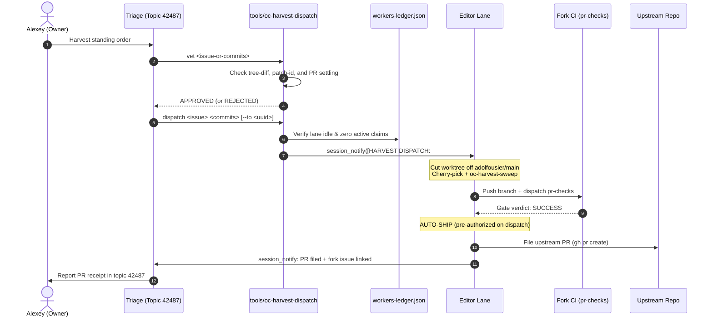

# Upstream sync runbook — fork main ← adolfousier/main

Procedure for the **REBASE sync model** (owner-approved transition 2026-09-11,
plan "Fork Rebase Transition and Sync Workflow"; directive text lives in
`fleet-directives.md`, the `~/opencrabs remotes` paragraph — this file is the
how, that file is the law). Delegated to Triage (owner order 2026-09-11 "You
should not do these merges - delegate to triage"; HQ does NOT execute).
Owner gates are marked **[GATE]**.

**Model:** fork main is a small set of topical commits sitting directly on
`adolfousier/main`. Each sync REPLAYS our still-pending commits onto upstream
and **DROPS the ones upstream has accepted**, so the ahead counter reflects
true pending delta and shrinks as PRs land. The pre-2026-09-11 merge-on-arrival
model is RETIRED — it produced 31 merge commits and a 333-commit phantom ahead
count, and its conflicts were resolved wholesale at merge time instead of
per-commit at replay time.

## Gates (fail closed)

1. **FREEZE check** — query the ledger for any carrier chain between dispatch
   and swap. Chain mid-flight → NO sync; report and wait. (Checkout-ref
   hazard class.)
2. **Automatic sync deployment** — the sync cutover dispatches the carrier build
   leg and auto-swaps on GREEN (owner order 2026-09-15: manual swap gate removed).
3. **Semantic overrides** — any feature pair where OUR version should beat
   upstream's is **[GATE]**: owner decides per pair. Default is upstream-wins.

## Roles

| Actor | Job |
|---|---|
| **Triage** | step-0 roster gate, run the rebase, arbitrate replay conflicts, ledger stamps, seam adaptation dispatch, consolidated report with the per-feature decisions table (delegated owner 2026-09-11) |
| **HQ** | oversight, process/skill updates, review of owner-gated semantic overrides — HQ does NOT execute the sync |
| **Review lens** (one spawn) | audits each semantic pair — diff fork behavior vs upstream's, flag anything upstream's version *loses* |
| **Editor lane** (hosting editor; TOOLSMITH builds no trees per toolsmith.md law) | runs `oc-deploy ship` on the marker commit via the `oc-deploy` lane, runs the battery — HQ never hand-builds |
| **Harvest lane** | unaffected for open PRs, but **pauses new branch creation** off fork main until the sync lands (stale bases). **v0.4.93:** filed upstream PRs stay FROZEN during the window — the sync does NOT trigger re-ports; conflicts on filed PRs are maintainer-side (editor.md Phase 7 PR-freeze law) |
| **Owner** | semantic-pair overrides |

## Process
1. **Step 0 — FREEZE & ROSTER GATE (blocking; nothing else starts first)**.
   **The freeze list IS the roster.** Derive it with a tool; never assemble it by
   hand from a stale registry.
   - `tools/oc-roster live` — the DERIVED in-progress roster, joining four
     independent signals: ledger `events[kind=claim]` (intent), `oc-wt list` dirty
     state (evidence), the session DB live roster (liveness), forum bindings
     (scope). It stores nothing.
   - `tools/oc-roster classify` — ACTIVE / IDLE / ORPHAN / UNKNOWN per row.
   - A claim author whose uuid the session DB has never seen is reported as a
     **PHANTOM** and excluded from the roster — a hand-assembled id can never
     enter a freeze list.
   - **Carrier chain check**: Ensure no carrier build, deploy chain, or `oc-ship-chain` is
     actively running (`oc-deploy status`, no `SHIP-LOCK`).
   - **Fork-main push freeze**: Enforce the freeze on pushing/fast-forwarding to fork `main`.
     Active editor lanes continue in their worktrees, but fork `main` merges are paused
     until sync cutover (Step 7 migrates any pending lane branches).
   - **Pre-sync snapshot**: Record the pre-sync fork `main` SHA in the ledger BEFORE any
     force-push; it is the rollback point.
   - **Role resolution is NOT `oc-roster`.** Use
     `oc-ledger roster --live --role <role>`. `oc-roster`'s `--role` flag is
     accepted and silently ignored (rc 0, no stderr, unfiltered output) — pointing
     role resolution at it breaks dispatch fleet-wide.
   - **`DONE = Carrier deploy chain is idle, fork main push freeze is active, and pre-sync rollback SHA is recorded in ledger.`**
2. Branch `sync/upstream-YYYYMMDD` off `origin/main`.
   - **`DONE = sync/upstream-YYYYMMDD branch created off origin/main.`**
3. `git rebase adolfousier/main` — **rebase, not merge.** Commits upstream has
   already accepted drop out of the replay automatically; that is the point of
   the model. Do not hand-drop them.
   - **`DONE = git rebase adolfousier/main executed on sync branch.`**
4. **Replay conflicts: resolve per the Seam-resolution shape, canonical in
   `fleet-directives.md`** (upstream's code ships byte-exact; our delta adapts
   on top — never overwrite his code). Conflicts arise only while replaying OUR
   still-pending commits, so resolution is per-commit. Shared TEST files union
   both sides' cases — expect the worst overlap in tests, not source.
   - **`DONE = All replay conflict seams resolved adapting fork delta cleanly on top of upstream base.`**
5. **Database migrations — dedicated pass, never drive-by.** Both sides may sit
   at the SAME `MIGRATION_COUNT` with DIFFERENT sets (2026-09-02: fork #37
   `20260828_pending_requests_origin` vs upstream #37
   `20260902_add_pending_followups`). Union to the next free version, keep
   prod's `user_version` as the reference point, and provide a healing path
   for the already-migrated prod DB. Two migrations claiming one version is a
   hard defect.
   - **`DONE = Migration version numbers unioned with distinct sequential IDs and SQLite schema verified.`**
6. **Semantic triage** — every double-implementation pair gets a recorded
   decision: adopt upstream (default), keep fork, or reconcile. Auto-keep with
   no decision: commits adolfo merged from our own harvest PRs. **[GATE]** for
   any keep-ours.
   - **`DONE = Semantic triage table recorded in ledger/report with adopt/keep/reconcile decisions for every overlap.`**
7. **Migrate lane branches onto the new base** — for each roster entry.

   **Measure pending work against the TARGET base, never against the old fork
   main.** After the cutover the old shas are gone from the new history, so a
   range measured from old main counts commits the new base ALREADY HAS: on
   three real branches that read 121 / 105 / 120 where the true pending counts
   were 2 / 0 / 1. **Test the target range first:**
   ```bash
   # 0. is ANY of this branch's unique work genuinely pending? Check the lane's own commits above its base:
   LANE_COMMITS="$(git log --oneline <old-base>..<lane-branch> | awk '{print $1}')"
   # If LANE_COMMITS is empty -> 0 unique commits, SKIP (pointer move only)
   # If non-empty, check per-commit cherry markers against the target base:
   git cherry origin/main <lane-branch> | grep -Ff <(echo "$LANE_COMMITS") | grep -c '^+' # 0 -> absorbed, SKIP
   # 1. how much of this branch is NOT already in the new base?
   git rev-list --count origin/main..<lane-branch>     # 0 -> absorbed, see below
   # 2. cut at the base the branch SITS ON — read it from the branch's own
   #    lineage (<lane-base> = the base the branch was cut from), NEVER from a
   #    range against origin/main: once fork main's lineage is rewritten that
   #    range walks OUT of the branch's history and the derived cut lands far
   #    behind the real fork point (the STALE POINTER case below).
   CUT="$(git merge-base <lane-base> <lane-branch>)"
   git rebase --onto origin/main "$CUT" <lane-branch>
   # UNSAFE once the base's lineage was rewritten — correct ONLY while
   # origin/main is still an ancestor of <lane-base>:
   # CUT="$(git rev-list --reverse origin/main..<lane-branch> | head -1)^"
   ```
   **Zero-pending case — the semantic patch-id test (step 0) comes FIRST, and it is not optional (proposal n=4067, v0.4.170).**
   Do not rely on an aggregate `git cherry ... | grep -c '^+'` without scoping to the lane's unique commits: after an interactive rebase with conflict resolutions, divergence in common ancestor history shifts patch-ids and produces aggregate false-positives. Always test the lane's specific commits against the new base. If `+` count for the lane's own commits is 0, the branch is fully absorbed post-synthesis — skip rebase and fast-forward/move pointer directly. Furthermore, `rev-list --reverse … | head -1` on an EMPTY range yields nothing, so `CUT`
   this: `299d1c72` had 0 pending, the derivation yielded `^`, and the old-sha
   fallback did not apply either.
   **Second skip case — a STALE POINTER on a re-synthesized base (step 0's
   patch-id test is what catches it).** The count test cannot tell "this lane
   has work" from "this lane SITS ON a base whose lineage was replaced". When
   fork main is re-synthesized a SECOND time, a lane still pointing at the
   FIRST new base has a range populated entirely by that base's OWN history,
   so the count reads non-zero while genuinely pending work is ZERO and the
   zero-test never fires. Lane `9fa7c71a` (2026-09-12, branch
   `feat/streaming-empty-finish-guard` @ `b3b3fc9a`, pointer set by the
   v0.4.140 case-0 rule): `origin/main..HEAD` = **15** — zero-test silent —
   while `git cherry origin/main HEAD` returned **15 x `-` / 0 x `+`**, i.e.
   every commit already patch-id-applied. The cut derived from that range
   gave **rc 1 with 10 conflicting files** — the over-replay signature
   above, on a branch with ZERO work. **The cut must be the base the lane
   SITS ON (read from the branch pointer), never derived from a range against
   a base whose lineage was rewritten:** `git rebase --onto origin/main
   b3b3fc9a <branch>` → rc 0, a pure pointer move that replays nothing.
   J-shaped: a migration verb printing `ABSORBED|PENDING` from `git cherry`
   would remove the hand-derivation entirely.
   **Failure signature — an over-replay does NOT error.** It presents as a huge
   commit wall and mass conflicts, so it reads as "the lane is a mess" rather
   than "the cut point is wrong". Lane `facd50af` was offered **220 commits**
   where exactly **1** was pending: their branch-time tip was `ff234125`, and old
   main `7432e538` had already absorbed 5 of their 6 commits. Lane `d18ce16a`
   (2026-09-11) reproduced the same class on a branch with **ZERO** pending
   commits — old-main range 12, target range 0 — where the derived rebase hit 4
   conflicting files. Measuring against the target is what removes both.
   **Fallback (rare):** if the old fork-main sha IS still an ancestor of the new
   base — i.e. the sync did not rewrite history — the two ranges coincide and
   `git rebase --onto origin/main <old-fork-main-sha> <lane-branch>` is
   equivalent; test with `git merge-base --is-ancestor <old-main> origin/main`.
   Lane-local conflicts are isolated to that lane; anything else is a roster
   defect and returns to step 1. Unpause lanes via `session_notify` with the new
   base sha.
   **Verifying "no rebase in progress" — do NOT use `ls .git/rebase-*`.** In a
   LINKED worktree `.git` is a FILE pointing at the real gitdir, so that path is
   not a directory and the naive check reports a FALSE "no rebase". Use
   `git rev-parse --git-path rebase-merge` (correct in both layouts) or the
   `git status` header.
8. Fork CI (`pr-checks`) GREEN on the rebased tree — the only CODE-TESTS locus
   (box law; no local cargo per build-lane directive). Verify trailer retention across
   rebased fork commits (`git log origin/main..<rebased-head> --format='%B' | git interpret-trailers --parse`)
   to prevent silent trailer loss (v0.4.170, Finding H-1 / row n=2102) → force-push
   `--force-with-lease` to `origin/main`, consolidated report with the
   decisions table.
   - **`DONE = tools/oc-prchecks wait <synced-head> returns GREEN, trailers retained, origin/main updated via --force-with-lease.`**
9. **Swap stamp — REBASE heads are UNSIGNED BY CONSTRUCTION.**
   A rebase (like a synthesis or merge) cannot carry a `Session-Id` trailer, so
   the build leg's ORDER gate 4 refuses the head: `oc-order-validate: UNSIGNED
   … attribution mandatory`, and the chain exits **rc 6** (2026-09-03 finding:
   bare merge `d02f4e08` passed this lane GREEN, swap blocked exit 2
   pre-install; 2026-09-11: the atomic cutover head `12d25260` hit exactly
   this and stranded main undeployed). **This is a STANDING artifact of the
   sync sequence, not a one-off fix — it recurs on EVERY sync.**
   Before dispatching the build leg, land an **empty trailer-signed marker
   commit** on the sync head:
   ```bash
   git commit --allow-empty -m "release: swap marker for <synced-sha> tree"
   ```
   carrying a `Session-Id: <uuid>` trailer. Required properties, all four
   verified before use:
   - **tree-identical** to the sync head (`git diff <head> <marker>` empty)
   - **parent = the sync head** (forward-only child, never a rewrite)
   - **trailer present** (`git log -1 --format='%B' <marker> | git interpret-trailers --parse`)
   - **fast-forwardable** onto `origin/main` (no force-push)
   The owner's swap ruling carries over unchanged: the marker changes no bytes.
   Pre-verified in the PR lane by `pr-checks.yml` swap mode (`swap=true`,
   gate-4 mirror — same commit as this rule).
   - **`DONE = Signed empty marker commit on top of synced head passes all 4 properties and fast-forwards onto origin/main.`**
10. **DEPLOY the synced main.** The sync is NOT complete when CI goes green —
    a cutover that stops at the force-push leaves main stranded undeployed
    while the live binary runs an older sha. Dispatch the build leg on the
    marker commit and let the swap complete (or record explicitly why it is
    deferred, with the reason). Verify with `deployed.sha` vs `origin/main`
    after the swap. **No sync step is "done" with main stranded.**
    - **`DONE = oc-deploy ship <marker-sha> finishes carrier build, binary swapped, and deployed.sha matches origin/main.`**
11. Ledger stamps; auto-swap completes on GREEN carrier build.
    - **`DONE = oc-ledger sync records sync event and session_notify notifies active lanes with new base SHA.`**

## Risk register

- Prod behavior shifts in every adopted-upstream feature area even under
  upstream-wins; the lens pass catches functional losses, not cosmetic
  differences.
- Shared test files are the biggest overlap — the suite, not the source, is
  where the seam actually gets welded.
- **Force-push risk** — the rebase rewrites fork main. Mitigations:
  `--force-with-lease` (never bare `--force`), pre-sync sha recorded in the
  ledger first, and lane branches migrated in step 7 rather than abandoned.
  Rollback = `--force-with-lease` back to the recorded pre-sync sha.
- Ancestry no longer proves a lane's work survived a sync (a rebase replaces
  shas). Verify survival by CONTENT: `git show origin/main:<path> | grep -n
  <symbol>`, or ancestry of the HARVEST commit — never of a pre-rebase sha.

## Historical — the MERGE model (RETIRED 2026-09-11)

Kept as precedent, not procedure. The 2026-09-02 backlog-clearing merge
(67 upstream-only commits, 133 fork-only, 68 overlapping files, merge-base
`4776bee2`) was the first and largest application; its conflicts were resolved
upstream-verbatim (32/32 files, 0-byte fidelity check) and the superseded
resolution is preserved at ref `merge/upstream-20260902-forkwin`. Known
semantic pairs from that pass (fork issues adolfo implemented his way): #14
chunk_hash heal, #15 receipt cards (11 commits), #17
refuse-delivery-to-new-owner, #19 redirect-on-claim, #23 `session notify` CLI,
#31 trailer reclaim — plus both sides' independent #1226
compaction/followup patches. Auto-keep: adolfo's merges of harvest PRs
#1258/#1266/#1268/#1269/#1274/#1275.

The byte-exact principle from that pass survives into the rebase model; only
the mechanism changed.

## Port — REBASE-PORT model (RETIRED for fork main 2026-09-02; PR-branch chains only)

1. BACKUP REF FIRST, always: `git -C ~/opencrabs branch backup/pre-port-<date> origin/main`
2. Classify EVERY fork-only commit over `adolfousier/main..origin/main`:

   | Verdict | Test | Action |
   |---|---|---|
   | absorbed | patch-id match OR title-twin inside upstream's new commits | DROP |
   | superseded | upstream reimplemented it better (read his commits) | DROP |
   | survivor | neither test hits | PORT |

3. Temp worktree off `adolfousier/main` → cherry-pick survivors in CHRONOLOGICAL
   order. Conflict on a pick → triage: collides with maintainer's redesign =
   DROP permanently and log why; genuinely additive = resolve keep-both, then
   VERIFY THE SEAM COMPILES (brace-level check — the 2026-08-26 TaskScope seam
   bug shipped a broken concat) before continuing.
4. Port-seam evidence = pr-checks GREEN with zero errors in ported lines
   (modum RETIRED 2026-08-28). Warnings in files no ported commit touches =
   upstream noise; note them, don't chase. Fixup commits carry the EXECUTING
   lane's Session-Id trailer.
5. Force-push WITH LEASE:
   `git push --force-with-lease=main:<old-tip> origin main`
6. Verify carrier dispatch still works and proof-dispatch the ported tip
   before reporting done.
7. Notify each dropped feature's owning editor: SHIPPED UPSTREAM — fork duty
   ended (their Phase 6b item 6). Record verdicts next to `baseline.json`.

Boundary: port-seam conflict fixups only — keep-both resolutions on
genuinely-additive picks + the SEAM-COMPILES brace-level verification; never
feature logic, never new behavior (ex-ROLE_EXCEPTION, bounded the same way).
Anything beyond a port seam → editor work.

<!-- source: AGENTS block1 (remotes/upstream/source-work/impl-comment) -->
## Remotes & sync

**~/opencrabs remotes** (renamed 2026-08-24, was inverted): `origin` = fork `leshchenko1979/opencrabs` (push target) · `adolfousier` = upstream source — **sync policy (REBASE MODEL — owner-approved transition 2026-09-11, plan "Fork Rebase Transition and Sync Workflow"; the 2026-09-02 "Land it" MERGE policy is RETIRED).** Fork main is rebased onto `adolfousier/main`: a small set of topical commits sits directly on upstream/main, and each sync is a **rebase that drops commits upstream has accepted**, so the ahead counter reflects true pending delta and shrinks as PRs land. Force-push onto fork main is sanctioned ONLY via `--force-with-lease`, with the pre-cutover sha recorded in the ledger FIRST (rollback = `--force-with-lease` back to it). The old "merge, never rebase/reset" rule is void — it was the policy that produced 31 merge commits and a 333-commit phantom ahead count. Guards: (1) **merged ≠ deployed** — a sync lands in git and must pass fork CI (pr-checks) GREEN; the prod binary swap stays a separate, explicit act; (2) **FREEZE** while any carrier chain is between dispatch and swap (query the ledger for open claim/ship events before syncing); (3) **detection** = cron `oc-harvest-dispatch-4h` (`ls-remote adolfousier main` every 4h, reports shifts and harvest backlog; detect+report only, sync is owner-gated). "Rebase-port" remains the technique for PR chains only; non-interactive `git merge --ff-only` of upstream into the diverged fork stays forbidden (history diverged by design 2026-08-26); historical: REBASE-PORT procedure (hq.md §Upstream sync — re-homed v0.4.80, lens B F3; the compiler role is RETIRED 2026-08-28 — this line updated per Duty-6 lens B, 2026-08-31). Builds fire ONLY via `oc-deploy` (S3 2026-08-28 — compiler role RETIRED; the editor invokes `oc-deploy ship` per editor.md; the ORDER-to-Compiler notify path is deleted) — **direct `gh workflow run quick-build-linux.yml` calls from any editor are FORBIDDEN** (rogue-dispatch rulings 2026-08-26/27; first offense logged vs this lane 01:55Z). The workflow lives ONLY on carrier branch `ci/quick-build-linux`, never on fork main (moved off 2026-08-26); the dispatch `ref` input must be the FULL 40-char sha — carrier Gate 1 SHAPE (3349cf7e, 2026-08-27) rejects branch names and short form. Carrier runs ORDER gates (shape/existence/containment/signature — pure git verification; the cargo test leg REMOVED 2026-08-31 owner word "removing looks good", commit e71dba58 — all-features testing lives on the PR gate, residual risk: straight-to-main hotfix shas ship un-tested) before the build job (`needs: gates`); containment requires the sha already on fork main, so ship path = FF-push main, then dispatch via `tools/oc-deploy` (**S3 LIVE 2026-08-28** — compiler role retired; `swap-execute` mode: sha-bound, AUTO-SWAP on GREEN build (deploy consent ELIMINATED owner 2026-08-28 18:50Z), rollback-drilled, full journal/markers/ledger receipts; pilots 87d3bcb8 11:33Z / 2d643146 12:57Z / 6643cf3c 14:32Z, events 1269/1275/1281. Ledger canonical path = `opencrabs-dev/workers-ledger.json` — since v0.4.38 (2026-08-29) `oc-deploy` + `oc-order-validate` default to it DIRECTLY; `OC_LEDGER` overrides, an explicit `OC_DEPLOY_STATE_DIR` keeps test fixtures isolated; the skill-dir duplicate is DELETED). Executing procedure for this sync leg: `upstream-merge-runbook.md` (delegated to Triage per owner order 2026-09-11; HQ does not execute syncs).

## Seam-resolution shape (REBASE model — replaces the retired merge-resolution shape)

(owner 2026-09-02 principle, "keep his part as he sees it — apply our changes on top where it's essential", carried forward into the rebase model):** upstream's code ships byte-exact as adolfo wrote it, never hand-blended. The MECHANISM changes with the model: our topical commits are replayed onto `upstream/main`, and the rebase **drops every commit upstream has already accepted** — that is precisely what makes the ahead counter shrink. Conflicts therefore arise only while replaying OUR still-pending commits, and resolution is per-commit: adapt our delta onto upstream's current shape, never overwrite his code. Each replay conflict is gated by the **overlay-disposition analysis**: fork-only commits classified drop/port/ask against upstream's revealed stance (his merges of our PRs = auto-drop our duplicate; absorbed = check what he changed on top; declined = his comment decides; no signal = ask), with adolfo's commit bodies and PR/issue comments read — the classification ships as a table for the **owner's human gate** before any adaptation commit is cut. Standing exception: prod-bound fork migrations keep their slot (load-bearing prod `user_version`); upstream's migration shifts to the next free version, content byte-exact. Historical (MERGE mechanism, RETIRED with the merge policy): first applied at merge `247fed2b` (2026-09-02) — 32/32 conflicted files upstream-verbatim, 0-byte fidelity check; superseded resolution preserved at ref `merge/upstream-20260902-forkwin`. Recorded as precedent for the byte-exact principle, not as a live procedure.

## Upstream-merge cadence · HARVEST LAW · NO-HOLD

(owner 2026-09-02, "yes, add this rule"): two tiers on top of the fork-main sync policy above — (1) **Pre-PR sync is MANDATORY**: any long-lived branch (sync branches, PR chains) **rebases onto `adolfousier/main`** immediately before opening a PR, so upstream review sees only our delta, never stale-base noise (under the pre-2026-09-11 merge model this was a merge; the requirement is unchanged — only the mechanism is now rebase, per the sync policy above); (2) **Event-driven syncs**: same-day or next-day sync when upstream lands commits touching files that carry fork `port(fork→merge)` deltas (watch `channels/`, `brain/agent/service/` first). NOT "before every push" — each sync still costs a fidelity pass + disposition + its own CI. Rationale: round 2 of the 2026-09-02 merge went RED with 29 errors, all seams where big-bang fork-era resolution fought upstream-new files — error count scales with diff size, so frequent small syncs keep the diff readable. Drift detection stays with cron `oc-harvest-dispatch-4h` (4h `ls-remote`; same-day drift is real: `8846de72` → `72b11629` within the merge day). **HARVEST LAW (owner 2026-09-08, “Go” on daily enforcement, v0.4.97; updated 2026-09-14 v0.4.173):** the consolidated patrol runs every 4 hours (`oc-harvest-dispatch-4h`, job id `73158e43-3b04-4464-bf82-8d9065a191bb` — carry the ID in anything durable; names are mutable under the cron-namespacing law), running `oc-upstream-delta` and posting the tiered backlog census (Tier-1/2/3 + counter line: fork-only commit count + open upstream PR count) to board topic 30220 / triage queue. **24-HOUR FEATURE SOAK & FIX DISPATCH LAW (owner order 2026-09-14; deployment timestamp amendment 2026-09-15; subsystem cohesion & dependency inheritance amendment 2026-09-16):**
- **Atomic Subsystem Bundling & Fix Squashing (Owner Order 2026-09-17, v0.4.200):**
  - Upstream PR branches must squash follow-up bugfixes, clippy cleanups, formatting touches, and dependent child issue commits directly into the coherent parent feature commit before CI gating and filing upstream.
  - Maintainer Adolfo squashes multi-commit PRs into a single commit on upstream `main` anyway; shipping clean, all-in-one atomic commits eliminates upstream review noise, intermediate cherry-pick breakage, and commit fragmentation.
  - A harvest unit is never a loose series of patch-fixes — it is a single, self-contained atomic commit comprising the base `feat/*` and all downstream `fix/*`, test, and doc modifications touching that subsystem.
- **Dependency & Soak Inheritance:** A `fix/*` that modifies, depends on, or assumes an unharvested or soaking `feat/*` inherits the 24-hour soak window of that base feature. It cannot be cherry-picked as a zero-hold fix if upstream lacks the underlying feature code or if the fix mutates unharvested subsystem logic.
- **In-Flight Lane Fence:** If an editor lane is actively modifying a subsystem (e.g. active claim/branch touching that module/flow), harvesting for that subsystem is held until the active lane finishes, hot-swaps, and lands.
- **Deployment-Anchored Soak Clock:** The 24-hour deployment soak clock is anchored strictly to the live deployment timestamp (`deployed.ts` / swap journal) of the **youngest behavioral change** across the entire dependency graph (parent feature issue, all child sub-issues linked via `--parent`, and all blocker/prerequisite issues linked via `--add-blocked-by`), **NOT** from git commit or issue filing time.
- **New Features (`feat/*`):** Must sit and mature in the live running deployment for **≥24 hours post-swap** (anchored to the latest swap timestamp of any related child, blocker, or dependent fix in the graph) before being eligible for harvest into an upstream PR (`adolfousier/opencrabs`). This ensures multi-session stability, real-world edge-case exposure, and regression soak time on the live binary.
- **Bug Fixes (`fix/*`):** Standalone bug fixes (independent of unharvested features) are harvested to upstream **immediately** upon passing the verified 4-leg smoke gate (zero maturation hold). Fixes touching soaking/unharvested features inherit the feature's soak window per the dependency inheritance rule above.
- **Continuous Issue Relationship Linking & Sub-Issue / BlockedBy Mandate (owner order 2026-09-16):**
  - **Universal Linking Rule across Lifecycle:** Whenever a parent subsystem relationship, blocker dependency, or child sub-issue is established, split, or discovered at ANY point in the lifecycle (issue creation, triage intake, in-flight editor implementation, task decomposition, or upstream PR staging), the lane identifying it MUST establish native links in the same turn via `gh issue edit <issue> --parent <parent-issue>` and/or `gh issue edit <issue> --add-blocked-by <blocker-issue>`.
  - **Graph-Wide Soak Anchor Rule:** When evaluating the 24h soak window for any issue, feature bundle, or subsystem, the soak clock begins at the **latest swap timestamp among all nodes in that issue's relationship graph** (the issue itself, its parent, all sub-issues, and all blocker/blocked dependencies). If a fresh fix or child issue is deployed, the 24h timer for harvesting the parent/bundle resets to the swap timestamp of that youngest change.
  - **Native Sub-Issues Mandate:** Any `fix/*` or derivative work that modifies, repairs, or extends an unharvested fork subsystem (or any fork-only feature) must be linked to the parent subsystem feature issue via `gh issue edit <issue> --parent <parent-issue>`. In isolation, fixes to unreleased/fork-only subsystems are strictly forbidden from harvest: child issues cannot harvest unless the parent subsystem is already recorded as merged upstream.
  - **Native Sub-Issue / Child Harvest Pre-flight Gate (Issue #188 unharvested parent refusal):** A child issue, cleanup, or derivative task (such as deleting a script that exists only on the fork or referencing unmerged documentation/subsystems) must **NEVER** be harvested in isolation from its parent subsystem. If the parent subsystem is unharvested or unmerged upstream, child work is strictly blocked from harvest until the parent subsystem is harvested and merged upstream.
  - **Upstream PR Harvest Baseline & Narrative Verification (Owner Order 2026-09-17, findings from PR #1615 review):**
    - When staging a fork bugfix or feature for upstream PR harvest (`adolfousier/opencrabs`), the staging lane MUST verify against live upstream `main` (`git diff origin/main...adolfousier/main` or inspecting the live upstream code path) whether upstream already resolved the underlying issue or changed the code path.
    - If already addressed or clean in upstream `main`, frame the PR narrative accurately as a clean helper extraction, refactoring, or hardening improvement rather than claiming an active upstream regression or non-existent bug.
  - **Native Issue Dependencies Mandate:** Any candidate issue blocked by an in-flight fork feature or prerequisite upstream PR must declare it via `gh issue edit <issue> --add-blocked-by <blocker-issue>`. Mechanical vet gate (`tools/oc-harvest-dispatch vet`) rejects any candidate with open/unharvested blockers (`HELD_BLOCKED_BY_DEPENDENCY`).
Standing order (owner override 2026-09-08 13:51Z): file PRs AS SOON AS tests are green AND smokes are confirmed (v0.4.104 behavioral rubric) subject to the 24h feature soak rule — no serial-PR waiting; the previous one-PR-at-a-time rule is RETIRED (owner: “this law is incorrect, Adolfo never told this”). NO-HOLD law (owner override 2026-09-08 15:2xZ, topic 42487): there is NO holding STATE — no waiting-period, no serial-PR queue, no parked batch. Editor fires the behavioral smoke (v0.4.104 rubric) IMMEDIATELY on probe commission. **PR filing is governed by PR SHIPMENT law, single home SKILL.md §ISSUE ROUTING (PR SHIPMENT row).** Smoke PASS (v0.4.104 rubric, four legs) → file/ship immediately (features after 24h soak); the owner is notified AFTER the act. Gates that survive: all mechanical CI/gate legs, the v0.4.104 smoke rubric, post-swap rollback-is-owner's-call. **AUTONOMOUS HARVEST DISPATCH (owner order 2026-09-16):** The previous operator-command-only restriction is RETIRED. Autonomous harvest dispatching via PHOP (`tools/oc-harvest-dispatch vet` & `dispatch`) is restored for fully-soaked (≥24h post-swap for features), smoke-verified (v0.4.104 4-leg rubric), novel feature bundles and standalone fix candidates on all T4 patrol cycles without holding for manual operator trigger commands. Automated patrols (`oc-harvest-dispatch-4h`) post the tiered backlog census and autonomously dispatch eligible candidates to idle editor lanes. Zero-change days still post a one-line census (heartbeat = patrol alive).

**Ledger hygiene laws (lens-H cycle-2 codifications, v0.4.127):**
- **H-3 fork-skill push remote:** the skill repo's canonical push remote is `mirror2` (git@github.com:leshchenko1979/opencrabs-skill.git). A push naming bare `leshchenko1979` (no remote of that name) fails - n=2125 class. SKILL.md's mirror sentence is descriptive; this row is the operational name.
- **H-4 sync rows need real --why:** every `oc-ledger sync --version` row carries substantive why-text (what the bump contains, battery receipt ts). Empty `v0.4.NNN -` rows (n=2106/2108 class, the v0.4.113/114 lens additions) violate the sync vocabulary; bump content must be recoverable from the row, not just the CHANGELOG.
- **H-5 claim lifecycle close-out:** a `claim` row whose issue reaches CLOSED state with no `confirm`/`release` row is stale-debt - the actor's next `oc-commit` mints an Issue-Ref against a closed issue (329bf3a3/#32, closed 7 days before detection). Law: when a claimed issue closes, the claiming lane stamps `confirm` (done) or `release` (not mine) same-session; T4 sweeps check closed-issues-with-open-claims.
- **Journal retention (owner ruling 2026-09-09 18:55Z):** `waiters/journal/*.jsonl` older than 7 days are archived to the state repo (`opencrabs-dev/incident-evidence-<date>/waiters-journal-archive/`) then removed — AFTER a grep confirms no open ledger event cites the waiter id. Journals cited by an open ledger event are kept indefinitely. Duty-4/T4 executes the sweep; the 176→165 file archive-then-wipe on 2026-09-09 is the worked example.
- **Canonical smoke log:** the single `smoke-verdicts.log` lives in the STATE repo (`opencrabs-dev/smoke-verdicts.log`) — it already hosts the workers-ledger. Smoke stamps go there and nowhere else; the skill repo copy was removed (f0775f83) and all fragment logs' unique lines were merged in before archival (owner ruling 2026-09-09 18:55Z).
- **Canonical smoke log — ABSOLUTE PATH, stamp it literally (QUIRK from lane 6cd8175f, 2026-09-12):** `/root/.opencrabs/profiles/ops/opencrabs-dev/smoke-verdicts.log`. Every `smoke-verdicts.log` reference in this file and in `editor.md`/`triage.md` means THAT path. A bare filename resolved from the ops profile root hit a stale pre-move decoy at `/root/.opencrabs/profiles/ops/smoke-verdicts.log` and silently captured 2 rows — both already SUPERSEDED in canonical. Decoy RETIRED 2026-09-12: archived to `incident-evidence-20260912/smoke-verdicts.log.decoy-20260912.bak` and the old path now SYMLINKS to canonical, so a wrong-path write self-heals instead of being lost.
  - **TWO artifacts, TWO writers (v0.4.164, proposal n=4108):** (1) the **IDENTITY EVIDENCE BLOCK** is written by `oc-smoke-evidence --append-log` (bare = the canonical absolute above; a wrong path is unrepresentable, M2-2) — it emits LIVE deployment identity (pid, exe_sha256, artifact_sha256, run_id, VERDICT — 10 tab-separated lines) and describes the binary RUNNING AT THAT MOMENT. (2) the **VERDICT ROW** — `ts \t VERDICT \t run= \t sha= \t actor= \t issue= \t target= \t evidence=` — is **AUTHORED BY THE LANE** and appended newline-safely. That is the normal case and it is **NOT** a violation.
  - **Verdict taxonomy (proposal n=4175):** Sanctioned VERDICT tokens in field 2 are `PASS`, `PASS-LATE-ENTRY`, `INCOMPLETE-LATE-ENTRY`, `PARKED-OWNER-EYE`, `PASS-OWNER-EYE`, `PASS-CALLBACK-LIVE`, `CORRECTION`, and `RETRACTION`. For `CORRECTION`/`RETRACTION` rows, `sha=` names the target sha under correction (or tip if refreshed), and the retracted row number/identity is cited in `evidence=`. **Post-lineage-rewrite re-verification is a `CORRECTION` (HQ ruling 2026-09-19, filed by lane aff7ff41):** when a fan-out credits a re-sha'd commit whose BYTES are unchanged (`git cherry` MINUS marker, empty `diff --stat`), the re-verifying lane writes `CORRECTION` — the token already carries the sha=/evidence= semantics — and names the earlier row it corrects. Improvised tokens (`RE-VERIFY` was written by 12 lanes in one wave) are off-taxonomy; a genuinely NEW token needs the owner's word via the poll format.
  - **Newline normalization on append (proposal n=4177):** An unterminated append poisons the NEXT writer. Appending lanes MUST ensure tail normalization before appending: verify the file's last byte is a newline (e.g. `[ "$(tail -c1 "$LOG")" = "" ] || printf '\n' >> "$LOG"`), then append the lane row terminated with `\n`. Plain shell `>>` without tail normalization is prohibited.
  - **Citations cite sections, never line numbers (proposal n=4192):** When a verdict row or LATE ENTRY cites law text, it MUST cite the SECTION HEADING or a grep anchor, never file line numbers (`file:N`), which rot as the law file grows.
  - **No hand-written counts in law text (proposal n=4132):** Never state static absolute row or line counts of `smoke-verdicts.log` in law text. Counts are derived dynamically at read time via tools (`oc-smoke-evidence --log-stats`), or stated with an exact reproducible predicate command.
  - **Automatic ledger done stamp on PASS (owner order 2026-09-17, Toolsmith 2dedf9e1):** When `oc-smoke <issue>` records a verdict of `PASS`, it automatically executes `oc-ledger stamp done "smoke PASS verified for issue #<issue>"` (unless suppressed via `--no-ledger`). This mechanically closes the worker's in-flight claim in `workers-ledger.json` and immediately unblocks `oc-harvest-census` and Triage intake without requiring an extra manual trailing stamp.
- **LATE ENTRY is sanctioned and has a mechanism (ruling 2026-09-12, resolving the :145 tension lane 63d775f9 raised):** a lane MAY append a historical verdict row marked `PASS-LATE-ENTRY` or `INCOMPLETE-LATE-ENTRY`, carrying its on-record receipts (ledger n=, issue comment, `deployed.meta` identity). The ban on "hand-typed" covers the WRITE MECHANISM (plain shell `>>` without tail normalization), never the AUTHOR — a lane-authored row appended newline-safely is the ordinary path. A LATE ENTRY must name why the same-turn duty was missed, citing law sections or grep anchors, never line numbers. Toolsmith provides `--late-entry`/`--sha` overrides in `oc-smoke-evidence`.

**PORT-WORK OWNERSHIP — three-role split (owner ruling 2026-09-08 17:04Z, button pick option 0 "Agreed - codify the split: editors build, Triage queues, HQ gates"; recovered from daemon callback log after the #1226 mid-turn swallow; v0.4.107):**

| Role | Owner | Scope |
|---|---|---|
| **Editors build** | Editor lanes | All port commits (`port(fork→merge)` re-lands per the Seam-resolution shape above) and harvest-port adaptations — ports are code, editors write code |
| **Triage queues** | Triage | Disposition census (drop/port/ask vs upstream stance), port-work backlog, commissioning port lanes |
| **HQ gates** | HQ | Overlay-disposition classification ruling + port-commit approval gate; owner remains the ask-decider where upstream stance is ambiguous |

No single role "owns ports" alone — the law names the chain explicitly (owner 17:00Z: "We need to decide who owns ports"). The button pick supersedes HQ's 17:02Z three-class board proposal and Triage's 16:50Z three-hand answer wherever they differed.

**Upstream PR law** (owner 2026-08-27, tightened 2026-08-26) — canonical text: SKILL.md §Upstream relations + §Hard rules rows ("Upstream receives PRs ONLY", "PR SHIPMENT LAW"). Core: PRs-only upstream, never `Closes #N`, fork-issue link at body end, autonomous filing on smoke PASS (v0.4.104 4-leg rubric; PR SHIPMENT law — SKILL.md §ISSUE ROUTING, no owner pre-wait), no ad-hoc PRs, branch namespace `leshchenko1979/<slug>` (SKILL.md §Upstream relations item 7). **Kept here (unique) — #1255 exception (owner 2026-08-28 13:59Z):** the compaction-stall / gateway-timeout class is owner-sanctioned for direct upstream REPORTING — adolfo is actively working that area (#1247, fix `a0954b63` on `fix/session-routing-and-fallback-chain`); field report filed as adolfousier/opencrabs#1255 (ledger 1280); follow-ups on that thread may continue upstream. Nightly cron pulls repo only — never pushes brain changes.

## Parallel Harvest Orchestration Protocol (PHOP) (v0.4.136, 2026-09-10)

Standard protocol for parallel harvesting of downstream fork commits to upstream (`adolfousier/opencrabs:main`). Mechanized via `tools/oc-harvest-dispatch`.

### 1. The 4-Stage Harvest Lifecycle

| Stage | Owner | Gate & Invariants | Command / Artifact |
|---|---|---|---|
| **1. Candidate Vetting** | Triage | **Upstream Absence Proof**: Confirm commit delta is non-empty on upstream tip (`git diff adolfousier/main -- <files>`), patch-id is not an ancestor/merged, upstream PR settling authority confirms unharvested, and candidate is not superseded. | `tools/oc-harvest-dispatch vet <issue-or-commits>` |
| **2. Lane Availability** | Triage | **Verify-Unclaimed & Idle Law**: Scan `workers-ledger.json` for active `claim` rows. Target lane must have status `idle` and zero unfinished claims. Never dispatch to a busy lane (e.g. active plan or in-flight gate). | `tools/oc-harvest-dispatch dispatch <issue> <commits> [--to <uuid>]` (enforces rc 4 on busy lanes) |
| **3. Dispatch Envelope** | Triage | **Atomic Dispatch**: Deliver standard payload via `session_notify` (`delivery.mode="turn-end"`). Zero Telegram noise to worker topics. Mandatory wire footer: `Ack contract: NONE — claim on ledger (oc-ledger claim) and proceed.` Receiving lanes do NOT ack via notify. | Standard wire envelope `[HARVEST DISPATCH: #N]` |
| **4. Mechanized Ship & Ack** | Editor | **Ship Gate (v0.4.146)**: Dedicated worktree off `adolfousier/main`, cherry-pick with trailers, `oc-harvest-sweep`, push, `oc-prchecks`. On GREEN gate AND verified 4-leg smoke pass in `smoke-verdicts.log` → file upstream PR citing smoke receipt, link fork issue, notify Triage. Never file unsmoked PRs. | `editor-upstream-pr.md` Phase 7c |

### 2. Standard Dispatch Wire Envelope

```text
[HARVEST DISPATCH: #{issue}]
Target Issue: #{issue} ({slug})
Source Commits: {commits}
Upstream Base: adolfousier/main ({tip_sha})
Target Branch: leshchenko1979/fix/{slug}
Commands:
  1. tools/oc-wt add up-{slug} {branch} --create --from adolfousier/main
  2. git cherry-pick {commits}
  3. tools/oc-harvest-sweep {branch} --base adolfousier/main
  4. Verify 4-leg smoke pass in smoke-verdicts.log
  5. git push origin {branch}
  6. tools/oc-prchecks {branch}
Contract: SHIP on GREEN CI gate + verified 4-leg smoke pass. File PR on adolfousier/opencrabs:main citing gate run ID + smoke evidence, link fork #{issue}, notify Triage.
```

### 3. Orchestration Sequence



**OpenCrabs source work** (`~/opencrabs`): any code edit, CI build, or binary swap follows the **`/opencrabs-dev`** skill (`skills/opencrabs-dev/SKILL.md`) — fresh-base fetch, fork issue claim via `Issue-Ref` trailer + `oc-ledger claim` row (NO tackling comments on fork issues — owner ban 2026-08-27), per-task worktree, CI gate (pr-checks), CI-only evidence gates, sha-verified run, backup + atomic swap, ops-only user-unit restart. Upstream stays PRs-only; this section is just the pointer (procedure canonical in the skill).

**Implementation comment per commit (owner 2026-08-28 22:54Z)** — canonical procedure: per-commit gh comment (chained automatically in `oc-ship-chain` Leg 2, or folded into `oc-commit` via `oc-issue-log`; SKILL.md §Canonical tooling). Rule: one comment per editor commit, immediately — no batching at the end.


<!-- source: AGENTS block2 (build lane/cargo/surface/logging/gates/editors/cadence) -->
**Build lane directive (owner, 2026-08-27):** prod ORDER builds must carry the FULL feature set — reduced staging subsets are retired; a binary that drops functionality will not be accepted for swap. **AMENDED same day (owner, mermaid lane):** `local-mermaid` is REMOVED FROM THE TREE (owner 2026-08-27, "cleanup sooner, no local mermaid"): render.rs, the feature, cfg gates, `local_fallback` and its test deleted in `346bf3c2`; delivery is remote-only mermaid.ink (natural-size → 1200px width clamp ladder) via `attach://` bytes. Prod ORDER feature set is now `telegram` ONLY (owner 2026-08-27, ~20:07Z: "the only feature you need is telegram now") — supersedes the full-set requirement above for this box; other channels/STT/TTS/browser remain in-tree but are not built into the prod binary. Four optional raster dep declarations linger in Cargo.toml (PENDING REMOVAL marker) — carrier builds `--locked`, lock regen is Compiler-owned (role retired S3 2026-08-28; lock changes ride editor commits, regen verified by CI); they compile to nothing.


**Cargo prohibition (owner, 2026-08-28)** — canonical full law: editor.md §Box law — no local cargo, ever (PATH / login-shell / PATH-prepend / explicit-path bypasses, disabled toolchain tree, no local fmt either — the rustfmt wrapper was RETIRED 2026-09-19, lint evidence = GREEN pr-checks run). Fleet-directives carries no extra text.

<!-- source: MEMORY swap-head-signature -->