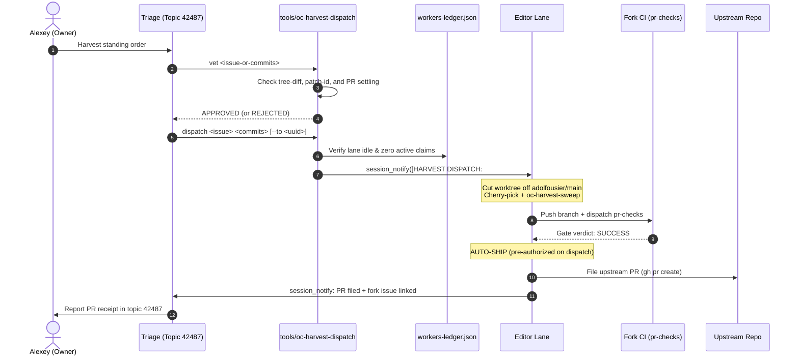

# Upstream sync runbook — fork main ← adolfousier/main

Procedure for the **REBASE sync model** (owner-approved transition 2026-09-11,
plan "Fork Rebase Transition and Sync Workflow"; directive text lives in
`fleet-directives.md`, the `~/opencrabs remotes` paragraph — this file is the
how, that file is the law). Delegated to Triage (owner order 2026-09-11 "You
should not do these merges - delegate to triage"; HQ does NOT execute).
Owner gates are marked **[GATE]**.

**Model:** fork main is a small set of topical commits sitting directly on
`adolfousier/main`. Each sync REPLAYS our still-pending commits onto upstream
and **DROPS the ones upstream has accepted**, so the ahead counter reflects
true pending delta and shrinks as PRs land. The pre-2026-09-11 merge-on-arrival
model is RETIRED — it produced 31 merge commits and a 333-commit phantom ahead
count, and its conflicts were resolved wholesale at merge time instead of
per-commit at replay time.

## Gates (fail closed)

1. **FREEZE check** — query the ledger for any carrier chain between dispatch
   and swap. Chain mid-flight → NO sync; report and wait. (Checkout-ref
   hazard class.)
2. **Automatic sync deployment** — the sync cutover dispatches the carrier build
   leg and auto-swaps on GREEN (owner order 2026-09-15: manual swap gate removed).
3. **Semantic overrides** — any feature pair where OUR version should beat
   upstream's is **[GATE]**: owner decides per pair. Default is upstream-wins.

## Roles

| Actor | Job |
|---|---|
| **Triage** | step-0 roster gate, run the rebase, arbitrate replay conflicts, ledger stamps, seam adaptation dispatch, consolidated report with the per-feature decisions table (delegated owner 2026-09-11) |
| **HQ** | oversight, process/skill updates, review of owner-gated semantic overrides — HQ does NOT execute the sync |
| **Review lens** (one spawn) | audits each semantic pair — diff fork behavior vs upstream's, flag anything upstream's version *loses* |
| **Editor lane** (hosting editor; TOOLSMITH builds no trees per toolsmith.md law) | runs `oc-deploy ship` on the marker commit via the `oc-deploy` lane, runs the battery — HQ never hand-builds |
| **Harvest lane** | **owns the upstream contribution: port → CI gate → file → follow** (procedure `harvest.md`; owner order 2026-09-24 centralising harvest — editors stop at smoke evidence, Triage surfaces and counts but never ports or files). During a sync window it is unaffected for open PRs, but **pauses new branch creation** off fork main until the sync lands (stale bases). **v0.4.93:** filed upstream PRs stay FROZEN during the window — the sync does NOT trigger re-ports; conflicts on filed PRs are maintainer-side (harvest.md Phase 7 PR-freeze law) |
| **Owner** | semantic-pair overrides |

## Process
1. **Step 0 — FREEZE & ROSTER GATE (blocking; nothing else starts first)**.
   **The freeze list IS the roster.** Derive it with a tool; never assemble it by
   hand from a stale registry.
   - `tools/oc-roster live` — the DERIVED in-progress roster, joining four
     independent signals: ledger `events[kind=claim]` (intent), `oc-wt list` dirty
     state (evidence), the session DB live roster (liveness), forum bindings
     (scope). It stores nothing.
   - `tools/oc-roster classify` — ACTIVE / IDLE / ORPHAN / UNKNOWN per row.
   - A claim author whose uuid the session DB has never seen is reported as a
     **PHANTOM** and excluded from the roster — a hand-assembled id can never
     enter a freeze list.
   - **Carrier chain check**: Ensure no carrier build, deploy chain, or `oc-ship-chain` is
     actively running (`oc-deploy status`, no `SHIP-LOCK`).
   - **Fork-main push freeze**: Enforce the freeze on pushing/fast-forwarding to fork `main`.
     Active editor lanes continue in their worktrees, but fork `main` merges are paused
     until sync cutover (Step 7 migrates any pending lane branches).
   - **Pre-sync snapshot**: Record the pre-sync fork `main` SHA in the ledger BEFORE any
     force-push; it is the rollback point.
   - **Role resolution is NOT `oc-roster`.** Use
     `oc-ledger roster --live --role <role>`. `oc-roster`'s `--role` flag is
     accepted and silently ignored (rc 0, no stderr, unfiltered output) — pointing
     role resolution at it breaks dispatch fleet-wide.
   - **`DONE = Carrier deploy chain is idle, fork main push freeze is active, and pre-sync rollback SHA is recorded in ledger.`**
2. Branch `sync/upstream-YYYYMMDD` off `origin/main`.
   - **`DONE = sync/upstream-YYYYMMDD branch created off origin/main.`**
3. `git rebase adolfousier/main` — **rebase, not merge.** Commits upstream has
   already accepted drop out of the replay automatically; that is the point of
   the model. Do not hand-drop them.
   - **`DONE = git rebase adolfousier/main executed on sync branch.`**
4. **Replay conflicts: resolve per the Seam-resolution shape, canonical in
   `fleet-directives.md`** (upstream's code ships byte-exact; our delta adapts
   on top — never overwrite his code). Conflicts arise only while replaying OUR
   still-pending commits, so resolution is per-commit. Shared TEST files union
   both sides' cases — expect the worst overlap in tests, not source.
   - **`DONE = All replay conflict seams resolved adapting fork delta cleanly on top of upstream base.`**
5. **Database migrations — dedicated pass, never drive-by.** Both sides may sit
   at the SAME `MIGRATION_COUNT` with DIFFERENT sets (2026-09-02: fork #37
   `20260828_pending_requests_origin` vs upstream #37
   `20260902_add_pending_followups`). Union to the next free version, keep
   prod's `user_version` as the reference point, and provide a healing path
   for the already-migrated prod DB. Two migrations claiming one version is a
   hard defect.
   - **`DONE = Migration version numbers unioned with distinct sequential IDs and SQLite schema verified.`**
6. **Semantic triage** — every double-implementation pair gets a recorded
   decision: adopt upstream (default), keep fork, or reconcile. Auto-keep with
   no decision: commits adolfo merged from our own harvest PRs. **[GATE]** for
   any keep-ours.
   - **`DONE = Semantic triage table recorded in ledger/report with adopt/keep/reconcile decisions for every overlap.`**
7. **Migrate lane branches onto the new base** — for each roster entry.

   **Measure pending work against the TARGET base, never against the old fork
   main.** After the cutover the old shas are gone from the new history, so a
   range measured from old main counts commits the new base ALREADY HAS: on
   three real branches that read 121 / 105 / 120 where the true pending counts
   were 2 / 0 / 1. **Test the target range first:**
   ```bash
   # 0. is ANY of this branch's unique work genuinely pending? Check the lane's own commits above its base:
   LANE_COMMITS="$(git log --oneline <old-base>..<lane-branch> | awk '{print $1}')"
   # If LANE_COMMITS is empty -> 0 unique commits, SKIP (pointer move only)
   # If non-empty, check per-commit cherry markers against the target base:
   git cherry origin/main <lane-branch> | grep -Ff <(echo "$LANE_COMMITS") | grep -c '^+' # 0 -> absorbed, SKIP
   # 1. how much of this branch is NOT already in the new base?
   git rev-list --count origin/main..<lane-branch>     # 0 -> absorbed, see below
   # 2. cut at the base the branch SITS ON — read it from the branch's own
   #    lineage (<lane-base> = the base the branch was cut from), NEVER from a
   #    range against origin/main: once fork main's lineage is rewritten that
   #    range walks OUT of the branch's history and the derived cut lands far
   #    behind the real fork point (the STALE POINTER case below).
   CUT="$(git merge-base <lane-base> <lane-branch>)"
   git rebase --onto origin/main "$CUT" <lane-branch>
   # UNSAFE once the base's lineage was rewritten — correct ONLY while
   # origin/main is still an ancestor of <lane-base>:
   # CUT="$(git rev-list --reverse origin/main..<lane-branch> | head -1)^"
   ```
   **Zero-pending case — the semantic patch-id test (step 0) comes FIRST, and it is not optional (proposal n=4067, v0.4.170).**
   Do not rely on an aggregate `git cherry ... | grep -c '^+'` without scoping to the lane's unique commits: after an interactive rebase with conflict resolutions, divergence in common ancestor history shifts patch-ids and produces aggregate false-positives. Always test the lane's specific commits against the new base. If `+` count for the lane's own commits is 0, the branch is fully absorbed post-synthesis — skip rebase and fast-forward/move pointer directly. Furthermore, `rev-list --reverse … | head -1` on an EMPTY range yields nothing, so `CUT`
   **The converse does NOT hold — a non-zero `+` is not proof of pending work (v0.4.214, Triage lane 530c29ec).** Patch-id matching is blind to a change already present by another route, so landed work still reports `+`. Measured 2026-09-19 on `origin/main` @ `2dc302fc6`: 10 of 10 lane-scoped `+` markers on two lanes were content-present (`record_tap_binding`, `BindingOrigin::Callback`, `PREVALIDATE_TIMEOUT_SECS`, `neutralize_prose_media_html`, `format_mermaid_plan_error`, and migration `20260912160000_session_bindings_last_origin.sql` all resolve in `origin/main`). A lane obeying step 0 literally therefore rebases already-landed work — the over-replay class this section warns about, reached from the opposite direction. **Add a CONTENT leg before treating `+` as pending:** `git grep <symbol> origin/main -- <paths>`, and `git cat-file -e origin/main:<path>` for files. Any future `ABSORBED|PENDING` verb needs this leg, not `git cherry` alone.
   this: `299d1c72` had 0 pending, the derivation yielded `^`, and the old-sha
   fallback did not apply either.
   **Second skip case — a STALE POINTER on a re-synthesized base (step 0's
   patch-id test is what catches it).** The count test cannot tell "this lane
   has work" from "this lane SITS ON a base whose lineage was replaced". When
   fork main is re-synthesized a SECOND time, a lane still pointing at the
   FIRST new base has a range populated entirely by that base's OWN history,
   so the count reads non-zero while genuinely pending work is ZERO and the
   zero-test never fires. Lane `9fa7c71a` (2026-09-12, branch
   `feat/streaming-empty-finish-guard` @ `b3b3fc9a`, pointer set by the
   v0.4.140 case-0 rule): `origin/main..HEAD` = **15** — zero-test silent —
   while `git cherry origin/main HEAD` returned **15 x `-` / 0 x `+`**, i.e.
   every commit already patch-id-applied. The cut derived from that range
   gave **rc 1 with 10 conflicting files** — the over-replay signature
   above, on a branch with ZERO work. **The cut must be the base the lane
   SITS ON (read from the branch pointer), never derived from a range against
   a base whose lineage was rewritten:** `git rebase --onto origin/main
   b3b3fc9a <branch>` → rc 0, a pure pointer move that replays nothing.
   J-shaped: a migration verb printing `ABSORBED|PENDING` from `git cherry`
   would remove the hand-derivation entirely.
   **Failure signature — an over-replay does NOT error.** It presents as a huge
   commit wall and mass conflicts, so it reads as "the lane is a mess" rather
   than "the cut point is wrong". Lane `facd50af` was offered **220 commits**
   where exactly **1** was pending: their branch-time tip was `ff234125`, and old
   main `7432e538` had already absorbed 5 of their 6 commits. Lane `d18ce16a`
   (2026-09-11) reproduced the same class on a branch with **ZERO** pending
   commits — old-main range 12, target range 0 — where the derived rebase hit 4
   conflicting files. Measuring against the target is what removes both.
   **Fallback (rare):** if the old fork-main sha IS still an ancestor of the new
   base — i.e. the sync did not rewrite history — the two ranges coincide and
   `git rebase --onto origin/main <old-fork-main-sha> <lane-branch>` is
   equivalent; test with `git merge-base --is-ancestor <old-main> origin/main`.
   Lane-local conflicts are isolated to that lane; anything else is a roster
   defect and returns to step 1. Unpause lanes via `session_notify` with the new
   base sha.
   **Verifying "no rebase in progress" — do NOT use `ls .git/rebase-*`.** In a
   LINKED worktree `.git` is a FILE pointing at the real gitdir, so that path is
   not a directory and the naive check reports a FALSE "no rebase". Use
   `git rev-parse --git-path rebase-merge` (correct in both layouts) or the
   `git status` header.
8. Fork CI (`pr-checks`) GREEN on the rebased tree — the only CODE-TESTS locus
   (box law; no local cargo per build-lane directive). Verify trailer retention across
   rebased fork commits (`git log origin/main..<rebased-head> --format='%B' | git interpret-trailers --parse`)
   to prevent silent trailer loss (v0.4.170, Finding H-1 / row n=2102) → force-push
   `--force-with-lease` to `origin/main`, consolidated report with the
   decisions table.
   - **`DONE = tools/oc-prchecks wait <synced-head> returns GREEN, trailers retained, origin/main updated via --force-with-lease.`**
   - **Reconcile the local `~/opencrabs` main worktree (v0.4.214, Triage lane 530c29ec).** The force-push rewrites `origin/main`; a local `main` left behind is no longer an ancestor of the new tip, so `oc-ship-chain` LEG3 runs its bare `git merge --ff-only $TIP` against the STALE local main and reports **NON-FF** for a lane correctly based on the new `origin/main` — its rc-5 text then points that lane at a rebase it does not need. Measured 2026-09-19: two LEG3 NON-FF failures inside one minute, both a stale local main. Step: `git -C ~/opencrabs fetch origin && git -C ~/opencrabs checkout main && git -C ~/opencrabs merge --ff-only origin/main` (the main worktree mirrors fork main; lane work lives in worktrees — if it refuses, STOP and report, never force). **No sync is complete while local `main` trails `origin/main`.**
9. **Swap stamp — REBASE heads are UNSIGNED BY CONSTRUCTION.**
   A rebase (like a synthesis or merge) cannot carry a `Session-Id` trailer, so
   the build leg's ORDER gate 4 refuses the head: `oc-order-validate: UNSIGNED
   … attribution mandatory`, and the chain exits **rc 6** (2026-09-03 finding:
   bare merge `d02f4e08` passed this lane GREEN, swap blocked exit 2
   pre-install; 2026-09-11: the atomic cutover head `12d25260` hit exactly
   this and stranded main undeployed). **This is a STANDING artifact of the
   sync sequence, not a one-off fix — it recurs on EVERY sync.**
   Before dispatching the build leg, land an **empty trailer-signed marker
   commit** on the sync head:
   ```bash
   git commit --allow-empty -m "release: swap marker for <synced-sha> tree"
   ```
   carrying a `Session-Id: <uuid>` trailer. Required properties, all four
   verified before use:
   - **tree-identical** to the sync head (`git diff <head> <marker>` empty)
   - **parent = the sync head** (forward-only child, never a rewrite)
   - **trailer present** (`git log -1 --format='%B' <marker> | git interpret-trailers --parse`)
   - **fast-forwardable** onto `origin/main` (no force-push)
   The owner's swap ruling carries over unchanged: the marker changes no bytes.
   Pre-verified in the PR lane by `pr-checks.yml` swap mode (`swap=true`,
   gate-4 mirror — same commit as this rule).
   - **`DONE = Signed empty marker commit on top of synced head passes all 4 properties and fast-forwards onto origin/main.`**
10. **DEPLOY the synced main.** The sync is NOT complete when CI goes green —
    a cutover that stops at the force-push leaves main stranded undeployed
    while the live binary runs an older sha. Dispatch the build leg on the
    marker commit and let the swap complete (or record explicitly why it is
    deferred, with the reason). Verify with `deployed.sha` vs `origin/main`
    after the swap. **No sync step is "done" with main stranded.**
    - **`DONE = oc-deploy ship <marker-sha> finishes carrier build, binary swapped, and deployed.sha matches origin/main.`**
11. Ledger stamps; auto-swap completes on GREEN carrier build.
    - **`DONE = oc-ledger sync records sync event and session_notify notifies active lanes with new base SHA.`**

## Risk register

- Prod behavior shifts in every adopted-upstream feature area even under
  upstream-wins; the lens pass catches functional losses, not cosmetic
  differences.
- Shared test files are the biggest overlap — the suite, not the source, is
  where the seam actually gets welded.
- **Force-push risk** — the rebase rewrites fork main. Mitigations:
  `--force-with-lease` (never bare `--force`), pre-sync sha recorded in the
  ledger first, and lane branches migrated in step 7 rather than abandoned.
  Rollback = `--force-with-lease` back to the recorded pre-sync sha.
- Ancestry no longer proves a lane's work survived a sync (a rebase replaces
  shas). Verify survival by CONTENT: `git show origin/main:<path> | grep -n
  <symbol>`, or ancestry of the HARVEST commit — never of a pre-rebase sha.

## Historical — the MERGE model (RETIRED 2026-09-11)

Kept as precedent, not procedure. The 2026-09-02 backlog-clearing merge
(67 upstream-only commits, 133 fork-only, 68 overlapping files, merge-base
`4776bee2`) was the first and largest application; its conflicts were resolved
upstream-verbatim (32/32 files, 0-byte fidelity check) and the superseded
resolution is preserved at ref `merge/upstream-20260902-forkwin`. Known
semantic pairs from that pass (fork issues adolfo implemented his way): #14
chunk_hash heal, #15 receipt cards (11 commits), #17
refuse-delivery-to-new-owner, #19 redirect-on-claim, #23 `session notify` CLI,
#31 trailer reclaim — plus both sides' independent #1226
compaction/followup patches. Auto-keep: adolfo's merges of harvest PRs
#1258/#1266/#1268/#1269/#1274/#1275.

The byte-exact principle from that pass survives into the rebase model; only
the mechanism changed.

## Port — REBASE-PORT model (RETIRED for fork main 2026-09-02; PR-branch chains only)

1. BACKUP REF FIRST, always: `git -C ~/opencrabs branch backup/pre-port-<date> origin/main`
2. Classify EVERY fork-only commit over `adolfousier/main..origin/main`:

   | Verdict | Test | Action |
   |---|---|---|
   | absorbed | patch-id match OR title-twin inside upstream's new commits | DROP |
   | superseded | upstream reimplemented it better (read his commits) | DROP |
   | survivor | neither test hits | PORT |

3. Temp worktree off `adolfousier/main` → cherry-pick survivors in CHRONOLOGICAL
   order. Conflict on a pick → triage: collides with maintainer's redesign =
   DROP permanently and log why; genuinely additive = resolve keep-both, then
   VERIFY THE SEAM COMPILES (brace-level check — the 2026-08-26 TaskScope seam
   bug shipped a broken concat) before continuing.
4. Port-seam evidence = pr-checks GREEN with zero errors in ported lines
   (modum RETIRED 2026-08-28). Warnings in files no ported commit touches =
   upstream noise; note them, don't chase. Fixup commits carry the EXECUTING
   lane's Session-Id trailer.
5. Force-push WITH LEASE:
   `git push --force-with-lease=main:<old-tip> origin main`
6. Verify carrier dispatch still works and proof-dispatch the ported tip
   before reporting done.
7. Notify each dropped feature's owning editor: SHIPPED UPSTREAM — fork duty
   ended (their Phase 6b item 6). Record verdicts next to `baseline.json`.
   **Discharge by self-discovery (HQ ruling 2026-09-19).** When the owning lane
   discovers the merge itself and reports it to HQ, the duty is DISCHARGED — the
   notify must NOT then be sent back to the lane that just reported the fact (a
   duplicate report to the same owner is noise, not diligence). Record the verdict
   next to `baseline.json` either way. Worked instance: the #1230/#233 lane
   self-discovered the [adolfousier/opencrabs#1629](https://github.com/adolfousier/opencrabs/pull/1629)
   merge on 2026-09-19 and stamped ledger `n=9589`; no HQ notify was owed.

Boundary: port-seam conflict fixups only — keep-both resolutions on
genuinely-additive picks + the SEAM-COMPILES brace-level verification; never
feature logic, never new behavior (ex-ROLE_EXCEPTION, bounded the same way).
Anything beyond a port seam → editor work.

<!-- source: AGENTS block1 (remotes/upstream/source-work/impl-comment) -->
## Remotes & sync

**~/opencrabs remotes** (renamed 2026-08-24, was inverted): `origin` = fork `leshchenko1979/opencrabs` (push target) · `adolfousier` = upstream source — **sync policy (REBASE MODEL — owner-approved transition 2026-09-11, plan "Fork Rebase Transition and Sync Workflow"; the 2026-09-02 "Land it" MERGE policy is RETIRED).** Fork main is rebased onto `adolfousier/main`: a small set of topical commits sits directly on upstream/main, and each sync is a **rebase that drops commits upstream has accepted**, so the ahead counter reflects true pending delta and shrinks as PRs land. Force-push onto fork main is sanctioned ONLY via `--force-with-lease`, with the pre-cutover sha recorded in the ledger FIRST (rollback = `--force-with-lease` back to it). The old "merge, never rebase/reset" rule is void — it was the policy that produced 31 merge commits and a 333-commit phantom ahead count. Guards: (1) **merged ≠ deployed** — a sync lands in git and must pass fork CI (pr-checks) GREEN; the prod binary swap stays a separate, explicit act; (2) **FREEZE** while any carrier chain is between dispatch and swap (query the ledger for open claim/ship events before syncing); (3) **detection** = cron `oc-harvest-dispatch-4h` (`ls-remote adolfousier main` every 4h, reports shifts and harvest backlog; detect+report only, sync is owner-gated) -- **currently OFF under the owner's 2026-09-18T20:41:30Z pacemakers-off order; see the Harvest patrol suspension & resume idiom section below**. "Rebase-port" remains the technique for PR chains only; non-interactive `git merge --ff-only` of upstream into the diverged fork stays forbidden (history diverged by design 2026-08-26); historical: REBASE-PORT procedure (hq.md §Upstream sync — re-homed v0.4.80, lens B F3; the compiler role is RETIRED 2026-08-28 — this line updated per Duty-6 lens B, 2026-08-31). Builds fire ONLY via `oc-deploy` (S3 2026-08-28 — compiler role RETIRED; the editor invokes `oc-deploy ship` per editor.md; the ORDER-to-Compiler notify path is deleted) — **direct `gh workflow run quick-build-linux.yml` calls from any editor are FORBIDDEN** (rogue-dispatch rulings 2026-08-26/27; first offense logged vs this lane 01:55Z). The workflow lives ONLY on carrier branch `ci/quick-build-linux`, never on fork main (moved off 2026-08-26); the dispatch `ref` input must be the FULL 40-char sha — carrier Gate 1 SHAPE (3349cf7e, 2026-08-27) rejects branch names and short form. Carrier runs ORDER gates (shape/existence/containment/signature — pure git verification; the cargo test leg REMOVED 2026-08-31 owner word "removing looks good", commit e71dba58 — all-features testing lives on the PR gate, residual risk: straight-to-main hotfix shas ship un-tested) before the build job (`needs: gates`); containment requires the sha already on fork main, so ship path = FF-push main, then dispatch via `tools/oc-deploy` (**S3 LIVE 2026-08-28** — compiler role retired; `swap-execute` mode: sha-bound, AUTO-SWAP on GREEN build (deploy consent ELIMINATED owner 2026-08-28 18:50Z), rollback-drilled, full journal/markers/ledger receipts; pilots 87d3bcb8 11:33Z / 2d643146 12:57Z / 6643cf3c 14:32Z, events 1269/1275/1281. Ledger canonical path = `opencrabs-dev/workers-ledger.json` — since v0.4.38 (2026-08-29) `oc-deploy` + `oc-order-validate` default to it DIRECTLY; `OC_LEDGER` overrides, an explicit `OC_DEPLOY_STATE_DIR` keeps test fixtures isolated; the skill-dir duplicate is DELETED). Executing procedure for this sync leg: `upstream-merge-runbook.md` (delegated to Triage per owner order 2026-09-11; HQ does not execute syncs).

## Seam-resolution shape (REBASE model — replaces the retired merge-resolution shape)

(owner 2026-09-02 principle, "keep his part as he sees it — apply our changes on top where it's essential", carried forward into the rebase model):** upstream's code ships byte-exact as adolfo wrote it, never hand-blended. The MECHANISM changes with the model: our topical commits are replayed onto `upstream/main`, and the rebase **drops every commit upstream has already accepted** — that is precisely what makes the ahead counter shrink. Conflicts therefore arise only while replaying OUR still-pending commits, and resolution is per-commit: adapt our delta onto upstream's current shape, never overwrite his code. Each replay conflict is gated by the **overlay-disposition analysis**: fork-only commits classified drop/port/ask against upstream's revealed stance (his merges of our PRs = auto-drop our duplicate; absorbed = check what he changed on top; declined = his comment decides; no signal = ask), with adolfo's commit bodies and PR/issue comments read — the classification ships as a table for the **owner's human gate** before any adaptation commit is cut. Standing exception: prod-bound fork migrations keep their slot (load-bearing prod `user_version`); upstream's migration shifts to the next free version, content byte-exact. Historical (MERGE mechanism, RETIRED with the merge policy): first applied at merge `247fed2b` (2026-09-02) — 32/32 conflicted files upstream-verbatim, 0-byte fidelity check; superseded resolution preserved at ref `merge/upstream-20260902-forkwin`. Recorded as precedent for the byte-exact principle, not as a live procedure.

## Upstream-merge cadence · HARVEST LAW · NO-HOLD

(owner 2026-09-02, "yes, add this rule"): two tiers on top of the fork-main sync policy above — (1) **Pre-PR sync is MANDATORY**: any long-lived branch (sync branches, PR chains) **rebases onto `adolfousier/main`** immediately before opening a PR, so upstream review sees only our delta, never stale-base noise (under the pre-2026-09-11 merge model this was a merge; the requirement is unchanged — only the mechanism is now rebase, per the sync policy above); (2) **Event-driven syncs**: same-day or next-day sync when upstream lands commits touching files that carry fork `port(fork→merge)` deltas (watch `channels/`, `brain/agent/service/` first). NOT "before every push" — each sync still costs a fidelity pass + disposition + its own CI. Rationale: round 2 of the 2026-09-02 merge went RED with 29 errors, all seams where big-bang fork-era resolution fought upstream-new files — error count scales with diff size, so frequent small syncs keep the diff readable. Drift detection stays with cron `oc-harvest-dispatch-4h` (4h `ls-remote` -- **that patrol is currently OFF under the owner's 2026-09-18T20:41:30Z pacemakers-off order, so drift detection is lane-driven until the order is lifted; see the Harvest patrol suspension & resume idiom section below**; same-day drift is real: `8846de72` → `72b11629` within the merge day). **HARVEST LAW (owner 2026-09-08, “Go” on daily enforcement, v0.4.97; updated 2026-09-14 v0.4.173):** the consolidated patrol runs every 4 hours (`oc-harvest-dispatch-4h`, job id `73158e43-3b04-4464-bf82-8d9065a191bb` — carry the ID in anything durable; names are mutable under the cron-namespacing law), running `oc-upstream-delta` and posting the tiered backlog census (Tier-1/2/3 + counter line: fork-only commit count + open upstream PR count) on **the Triage lane's OWN topic** — the `board topic 30220 / triage queue` target is SUPERSEDED by the owner ruling of 2026-09-19 (subject-matter owner posts on its own surface; HQ is `session_notify`d only for HQ-specific dimensions). Canonical text: `triage.md §Duty T4` Harvest backlog patrol (v0.4.225). **24-HOUR FEATURE SOAK & FIX DISPATCH LAW (owner order 2026-09-14; deployment timestamp amendment 2026-09-15; subsystem cohesion & dependency inheritance amendment 2026-09-16):**
- **Atomic Subsystem Bundling & Fix Squashing (Owner Order 2026-09-17, v0.4.200):**
  - Upstream PR branches must squash follow-up bugfixes, clippy cleanups, formatting touches, and dependent child issue commits directly into the coherent parent feature commit before CI gating and filing upstream.
  - Maintainer Adolfo squashes multi-commit PRs into a single commit on upstream `main` anyway; shipping clean, all-in-one atomic commits eliminates upstream review noise, intermediate cherry-pick breakage, and commit fragmentation.
  - A harvest unit is never a loose series of patch-fixes — it is a single, self-contained atomic commit comprising the base `feat/*` and all downstream `fix/*`, test, and doc modifications touching that subsystem.
- **Dependency & Soak Inheritance:** A `fix/*` that modifies, depends on, or assumes an unharvested or soaking `feat/*` inherits the 24-hour soak window of that base feature. It cannot be cherry-picked as a zero-hold fix if upstream lacks the underlying feature code or if the fix mutates unharvested subsystem logic.
- **In-Flight Lane Fence:** If an editor lane is actively modifying a subsystem (e.g. active claim/branch touching that module/flow), harvesting for that subsystem is held until the active lane finishes, hot-swaps, and lands.
- **Deployment-Anchored Soak Clock:** The 24-hour deployment soak clock is anchored strictly to the live deployment timestamp (`deployed.ts` / swap journal) of the **youngest behavioral change** across the entire dependency graph (parent feature issue, all child sub-issues linked via `--parent`, and all blocker/prerequisite issues linked via `--add-blocked-by`), **NOT** from git commit or issue filing time.
- **The census `age` is a CLAIM about the anchor, not a receipt of it — verify provenance before consuming it (v0.4.218, filed by lane facd50af).** `oc-harvest-census` composes the soak anchor from up to three sources (the swap lineage, `twin_deploy_ts`, and a `smoke-verdicts.log` fallback, #292) and prints only the resulting `age`, disclosing which source produced it to nobody. The law's required anchor is the deployment timestamp (`deployed.ts` / swap journal), so a printed age is authoritative ONLY once its provenance is confirmed against that source. A lane whose harvest ETA turns on the number MUST reproduce it from the swap journal entry for the commit's deploying sha (`git merge-base --is-ancestor <commit> <swap-sha>` across the swap lineage) rather than trust the printed figure. A refusal whose `age` cannot be reproduced from the swap journal is a TOOL defect to file, never a soak to wait out.
- **No deployment timestamp yet = NO clock running — `age: 0.0h` is not a fresh soak (v0.4.218, filed by lane facd50af).** For a `feat/*` committed to fork `main` but not yet swapped into the live binary there is no deployment timestamp to anchor on. `oc-harvest-census` clamps the age to `0.0h` in that state, which is the WORST available reading: `age: 0.0h < 24h` is indistinguishable from "this feature deployed seconds ago", so a lane reads the hold as a soak that will clear in 24 h when in fact no clock is running and none will start until the feature ships. A `0.0h` age therefore means **PRE-ANCHOR — the harvest ETA is the next swap, not a time 24 h from now**; confirm the deploying swap exists before treating any age as elapsed soak.
- **New Features (`feat/*`):** Must sit and mature in the live running deployment for **≥24 hours post-swap** (anchored to the latest swap timestamp of any related child, blocker, or dependent fix in the graph) before being eligible for harvest into an upstream PR (`adolfousier/opencrabs`). This ensures multi-session stability, real-world edge-case exposure, and regression soak time on the live binary.
- **Bug Fixes (`fix/*`):** Standalone bug fixes (independent of unharvested features) are harvested to upstream **immediately** upon passing the verified 4-leg smoke gate (zero maturation hold). Fixes touching soaking/unharvested features inherit the feature's soak window per the dependency inheritance rule above.
- **Continuous Issue Relationship Linking & Sub-Issue / BlockedBy Mandate (owner order 2026-09-16):**
  - **Universal Linking Rule across Lifecycle:** Whenever a parent subsystem relationship, blocker dependency, or child sub-issue is established, split, or discovered at ANY point in the lifecycle (issue creation, triage intake, in-flight editor implementation, task decomposition, or upstream PR staging), the lane identifying it MUST establish native links in the same turn via `gh issue edit <issue> --parent <parent-issue>` and/or `gh issue edit <issue> --add-blocked-by <blocker-issue>`.
  - **Graph-Wide Soak Anchor Rule:** When evaluating the 24h soak window for any issue, feature bundle, or subsystem, the soak clock begins at the **latest swap timestamp among all nodes in that issue's relationship graph** (the issue itself, its parent, all sub-issues, and all blocker/blocked dependencies). If a fresh fix or child issue is deployed, the 24h timer for harvesting the parent/bundle resets to the swap timestamp of that youngest change.
  - **Native Sub-Issues Mandate:** Any `fix/*` or derivative work that modifies, repairs, or extends an unharvested fork subsystem (or any fork-only feature) must be linked to the parent subsystem feature issue via `gh issue edit <issue> --parent <parent-issue>`. In isolation, fixes to unreleased/fork-only subsystems are strictly forbidden from harvest: child issues cannot harvest unless the parent subsystem is already recorded as merged upstream.
  - **Native Sub-Issue / Child Harvest Pre-flight Gate (Issue #188 unharvested parent refusal):** A child issue, cleanup, or derivative task (such as deleting a script that exists only on the fork or referencing unmerged documentation/subsystems) must **NEVER** be harvested in isolation from its parent subsystem. If the parent subsystem is unharvested or unmerged upstream, child work is strictly blocked from harvest until the parent subsystem is harvested and merged upstream.
  - **Upstream PR Harvest Baseline & Narrative Verification (Owner Order 2026-09-17, findings from PR #1615 review):**
    - When staging a fork bugfix or feature for upstream PR harvest (`adolfousier/opencrabs`), the staging lane MUST verify against live upstream `main` (`git diff origin/main...adolfousier/main` or inspecting the live upstream code path) whether upstream already resolved the underlying issue or changed the code path.
    - If already addressed or clean in upstream `main`, frame the PR narrative accurately as a clean helper extraction, refactoring, or hardening improvement rather than claiming an active upstream regression or non-existent bug.
  - **Native Issue Dependencies Mandate:** Any candidate issue blocked by an in-flight fork feature or prerequisite upstream PR must declare it via `gh issue edit <issue> --add-blocked-by <blocker-issue>`. Mechanical vet gate (`tools/oc-harvest-dispatch vet`) rejects any candidate with open/unharvested blockers (`HELD_BLOCKED_BY_DEPENDENCY`).
Standing order (owner override 2026-09-08 13:51Z): file PRs AS SOON AS tests are green AND smokes are confirmed (v0.4.104 behavioral rubric) subject to the 24h feature soak rule — no serial-PR waiting; the previous one-PR-at-a-time rule is RETIRED (owner: “this law is incorrect, Adolfo never told this”). NO-HOLD law (owner override 2026-09-08 15:2xZ, topic 42487): there is NO holding STATE — no waiting-period, no serial-PR queue, no parked batch. Editor fires the behavioral smoke (v0.4.104 rubric) IMMEDIATELY on probe commission. **PR filing is governed by PR SHIPMENT law, single home SKILL.md §ISSUE ROUTING (PR SHIPMENT row).** Smoke PASS (v0.4.104 rubric, four legs) → file/ship immediately (features after 24h soak); the owner is notified AFTER the act. Gates that survive: all mechanical CI/gate legs, the v0.4.104 smoke rubric, post-swap rollback-is-owner's-call. **AUTONOMOUS HARVEST DISPATCH (owner order 2026-09-16):** The previous operator-command-only restriction is RETIRED. Autonomous harvest dispatching via PHOP (`tools/oc-harvest-dispatch vet` & `dispatch`) is restored for fully-soaked (≥24h post-swap for features), smoke-verified (v0.4.104 4-leg rubric), novel feature bundles and standalone fix candidates on all T4 patrol cycles without holding for manual operator trigger commands. Automated patrols (`oc-harvest-dispatch-4h`) post the tiered backlog census and autonomously dispatch eligible candidates to idle editor lanes. Zero-change days still post a one-line census (heartbeat = patrol alive). **THIS PATROL IS CURRENTLY OFF**: the owner ordered every ops-profile pacemaker switched off on 2026-09-18T20:41:30Z ("Turn off all of your pacemakers for now") and the order has not been lifted, so harvest pickup is lane-driven until it is. The suspension record and the resume idiom below govern.

## Harvest patrol suspension & resume idiom — **RETIRED 2026-09-24; kept as history**

> **RETIRED — do not create or re-arm a per-lane `oc-harvest-<issue>-resume` job.** The owner ordered harvest centralised on 2026-09-24 (OC DEV Factory): harvesting left the editor lanes, and the per-lane daily resume idiom went with it. **All 15 resume jobs were disabled the same day** (ledger `n=10828`: 12 clock-driven re-askers disabled, `oc-harvest-18/396/402-resume` already off, and `oc-harvest-403-resume` left ARMED because it is event-driven — it reads the MODE register and exits 0 silently while DEGRADED, waking only on a mode change). **The replacement is `oc-harvest-tiers`** (Triage's mechanised tier/cluster surfacer) plus the HARVEST lane, which owns port → gate → file → follow (`harvest.md`). The text below is retained as the historical record of the suspension and of the idiom's own traps — several of which (the tracked-state-file rule, the date-keyed one-shot, the ~24 h floor) remain general law for ANY resume job, harvest or not.


- **Patrol suspended (owner order 2026-09-18T20:41:30Z, still standing).** In *Opencrabs Dev Factory*, in the same breath as "Until I lift the freeze" and "We are drowning in slop", the owner ordered: **"Turn off all of your pacemakers for now"**. Executed the same evening -- every ops-profile pacemaker OFF, the consolidated harvest patrol `oc-harvest-dispatch-4h` (id `73158e43-3b04-4464-bf82-8d9065a191bb`) included. **The order has not been lifted. Do not re-enable it on a lane's own initiative** -- a re-enable is an owner decision.
  - **Partial lift, triage only:** on 2026-09-19T03:01:53Z the owner re-authorised the TRIAGE cron alone ("you may reactivate your triage cron - triage only the internal..."). That authorises `oc-triage-factory-patrol` and `oc-triage-owner-digest` and says nothing about the harvest patrol.
- **The disable is NOT the cadence order's collateral.** The owner's separate 2026-09-18T21:15:10Z order ("Pace them all to every 6h or less frequent") is a *frequency cap*. All four ops patrols already sat AT the 6h floor, so the repace only rewrote `cron_expr` and bumped `updated_at` (21:49:36-56Z). **The disable PREDATES that sweep.** A row whose `updated_at` falls in the 21:49Z window is not evidence the repace disabled it -- read the enable state, never infer it from the timestamp.
- **`$STATE/pacemakers-off` marker lifecycle.** `oc-health` class 5 reads `<state dir>/pacemakers-off` to choose its direction: marker PRESENT -> a law-carrying patrol found ENABLED is the finding (`cron-enabled-against-order`); marker ABSENT -> a DISABLED patrol is the finding (`cron-disabled`). **The marker must exist for as long as the order stands, and be removed the moment the owner lifts it.** With it missing, class 5 re-reports the owner's own order back to him as a finding on every run (measured 2026-09-19: `oc-health --class schedulers` -> `8 QUIRK cron-disabled`).
- **Resume idiom (previously codified nowhere).** A parked harvest resumes only if a lane remembers, so the mechanism is written down here:
  - **State file:** `<state dir>/<issue>-harvest-state.md` -- the owning lane's resume record. **IT MUST BE GIT-TRACKED, in the same turn it is created (v0.4.237 amendment; raised by the #341 lane, verified first-hand).** **Nothing tracks it for you.** `oc-ledger stamp` stages **only** `workers-ledger.json` (`tools/oc-ledger:200`), and the `commit-pending --bundle` sweep whitelists exactly `tools.log baseline.json orders.json journal deployed.sha deployed.meta.json fanout.state oc-deploy oc-deploy-shadow.log oc-deploy-shadow.archive.log` (`tools/oc-ledger:1009`) -- `*-harvest-state.md` is on NEITHER list, and **no cron invokes the bundle verb at all**, so there is no mechanism-side cover to wait for. An untracked resume record is therefore not merely uncommitted: it has **NO git history**, and a `git: state commit ok` receipt proves nothing about it -- measured 2026-09-22T00:5xZ, `git show --stat bcc12a81` = **1 file changed (workers-ledger.json only)** while the stamp reported success. **Measured census at 2026-09-22T08:59Z (predicate: `*-harvest-state.md` in the state dir): 20 on disk, 3 tracked, 17 untracked** -- and every untracked one was a LIVE record (real headings, mtimes within 3 days), not residue, so this is silent loss rather than garbage. **The consequence is exactly the class this idiom exists to prevent:** for a parked harvest the state file is the ONLY resume record, its cron keeps firing a prompt that READS it, and the file dies with the disk while its lane believes it is safe. **Ownership is split, and the split is the point:** the file's CONTENT belongs to the owning lane (never edit another lane's record), while the TRACKING is owed by the lane that CREATES the file, in that turn -- verify with `git ls-files --error-unmatch <file>` (rc 0 = tracked), never by reading a stamp receipt. **The pre-amendment residue was swept by HQ (state commit `960bec99`, 19 files = 17 untracked + 2 tracked-but-dirty, 2026-09-22T08:59Z)** -- a one-time hygiene act, not a transfer of content authorship, taken because a parked harvest's lane may never return to track its own file. The mechanism-side belt (adding this class to the bundle whitelist) is `tools/**` CODE and routes to the **Toolsmith** -- never to a law edit.
  - **Cron naming:** `oc-harvest-<issue>-resume`, per the cron-namespacing law. Carry the job **id** in anything durable; names are mutable.
  - **Wake target:** the OWNING lane (`deliver_to` = that lane's session), never the board.
  - **A 5-field cron has NO one-shot form** -- a resume job re-fires annually on the same date. **A disable-after-harvest step is therefore MANDATORY**, and it belongs in BOTH places: the state file must instruct the lane to disable the resume job once the harvest completes, and the job's own prompt must carry the same instruction (the prompt fires even if the file is not re-read).
  - **A date-keyed resume job is the WRONG SHAPE AT CREATION -- and a PENDING wake that neither re-arms nor disables parks the harvest for a YEAR, silently (v0.4.233 amendment; raised by the #341 lane, verified first-hand).** The one-shot bullet above mandates disable-after-harvest for a harvest that COMPLETES or is ABANDONED; it was SILENT on the third case -- a wake that finds the harvest still PENDING and reports "still blocked", which neither disables the job (nothing is finished) nor re-arms it. A **date-keyed** `cron_expr` (a literal day-of-month AND month, e.g. `45 15 20 9 *`) then rolls straight to the SAME DATE NEXT YEAR while the row still reads `enabled=1` with a plausible `next_run_at` -- **a parked job and a healthy one are indistinguishable from the schedule field alone.** **Measured live 2026-09-20T16:0xZ** (predicate `select name, enabled, cron_expr, next_run_at, trigger_cmd from cron_jobs where name like 'oc-harvest-%-resume'`): population **16 rows, 16 enabled** -- **11 daily** (`dom == *`) and **5 date-keyed**; FOUR date-keyed jobs fired that day and rolled to `2027-09-20` (issues 18, 225, 345, 396), every one a `NULL`-trigger fail-open job whose wake SUCCEEDED -- each produced a "still blocked / parked" report, so the turns did not die; the re-arm step was simply never taken. **Therefore: author the resume job DAILY (`M H * * *`, or an explicit day-of-week) -- a date-keyed 5-field form is wrong AT CREATION, not merely at re-arm, and it CANNOT be repaired by moving the date: a re-arm obeying a "next daily boundary" instruction is exactly what moved DOM 20 -> 21 and bought a year of dormancy** -- and instruct the job's prompt that EVERY wake ends in exactly one of two terminal acts: **re-arm** to the next daily boundary, or **DISABLE** (harvest complete / abandoned). A job that must run ONCE is DISABLED after it fires. **The discriminator between a parked job and a dead one is `cron_job_runs.status`/`.error`, NEVER `next_run_at`** -- the CHANGELOG v0.4.233 ruling covers DIAGNOSIS (a future date is not a failure signal) and is the ADJACENT rule, not the same one: THIS clause is PREVENTION (create it daily; terminate each wake), and neither supersedes the other. **Read the population as a dated datum, never a target** -- within the same hour `225` re-armed itself to daily, `396` was DISABLED by its own lane citing a peer's report, `341` re-armed itself, and `345` stayed parked (its lane notified, not yet acted); issue `326` at `30 14 21 9 *` is LATENT -- it fires 2026-09-21 and then parks until 2027-09-21.
  - **Known instances -- DERIVE them, never trust an enumerated list here.** Canonical read: `select name, id, enabled, cron_expr from cron_jobs where name like 'oc-harvest-%-resume'`. A list hand-written into this file is stale before it is committed, and this line is its own proof: it named TWO instances at 19:07Z, FOUR at 19:10Z, and by 19:38Z the live table held **FOURTEEN**, every one enabled -- the last several created while the census was being written. **State the POPULATION, never the names:** a count carries its predicate and dies honestly, while a name list survives the commit that wrote it and misleads the next reader (a peer lane filed a gap report off a 3-name list that was already 4). Live read 2026-09-19T19:38Z, predicate `name like 'oc-harvest-%-resume'`: **14 rows, 14 enabled**, issues 18/225/250/321/326/341/344/345/346/348/396/402/403/421 -- and the count was **15** (issue 318 added) by 20:15Z the same evening, under an hour later. The NUMBER moves; only the PREDICATE is stable. That is why the derived read is canonical and the figure written here is a dated datum, never a target to match. Issue NUMBERS are carried so the population stays auditable; the job NAMES are deliberately NOT written here -- they are the thing that went stale.
  - **Sweep by PROPERTY, never by token.** The compliance question is *does this job's prompt instruct disabling itself after harvest, in ANY wording* -- the prompt must carry that instruction even when the state file is not re-read. A token grep for one phrasing (`RETIRE THIS JOB`) flags a fully compliant job whose prompt says `DISABLE THIS JOB` and files a false defect against it. That false positive happened on 2026-09-19 and is the reason this clause exists.
  - **The PROMPT is not a schedule table and not a tracker mirror (v0.4.243, cycle `20260922-c22`; converged from lanes `a5b34466` and `afe476f8`).** Three ways a resume job's own prose becomes a SECOND source of truth, each measured 2026-09-22: **(a) it must NOT restate its own `cron_expr` or next-run time** -- the `cron_jobs` row is the SOLE source of truth for the schedule, and the prose is a copy that the mandated re-arm never updates. Live: the `oc-harvest-225-resume` prompt carried a `CADENCE:` line naming a cadence the row did not have, the lane took the PROSE as authoritative and rewrote the ROW to match it, then had to revert. **(b) it must NOT assert the tracker's state** ("issue N stays open", "do not close #N") -- assert only what the census RETURNS, or refresh the tracker at every fire. The bullet below makes the GATE tracker-independent and says nothing about the PROSE, and the pair drifted: **7 of 16 live resume jobs name a CLOSED fork issue** (own read 2026-09-23: predicate = ANY `#N` token in the prompt that resolves to a CLOSED issue via `gh issue list -R leshchenko1979/opencrabs --state all`; the proposing lane reported 4 of 16 under its NARROWER *asserts-the-state* predicate — different predicates, both correct, which is why the predicate travels with the number and incidental references are not the same finding as a stale assertion) while durable lane artifacts still asserted an OPEN one. A stale claim here is not cosmetic -- an OPEN-test is satisfied *permanently* by a premature close. **(c) a REPACE must re-read the job's `prompt`, not only its `cron_expr`** -- the prompt carries a schedule claim AND a terminal-act instruction, so a repace that edits only the expression leaves the prose falsified. Live: one row stores a daily `cron_expr` beside a prompt asserting an ANNUAL re-fire and forbidding the terminal act, and no law required the prompt to be re-read after the expression changed.

  - **The gate SIGNAL must be tracker-state-INDEPENDENT (v0.4.223; raised by the #321 lane, verified first-hand).** A resume job's `trigger_cmd` must key on a signal that does not depend on the TRACKER's state -- canonically `oc-harvest-census check <issue>` -- because an OPEN-test is satisfied **permanently** by a premature close, so the job goes silent forever and the harvest is lost with no signal at all. **Worked failure (2026-09-19, #321):** the issue closed at 07:43:34Z on the merge commit `7e637c4e3a`, eleven seconds after the ff-merge landed, and the close keyword sat inside a **NEGATION** -- `B5 budget honesty -- Part B alone does NOT fix #321`. GitHub's parser cannot read negation, so the honest-limit prose the process REQUIRES is what closed the tracker. Any job gating on `gh issue view 321 --json state | grep -qx CLOSED` would have gone silent at that instant, with the work complete-but-unharvested. **The `#346` resume job carried exactly that exposed form, and its owning lane re-keyed it at 19:59:02Z citing THIS version -- two minutes after the law was committed and before any HQ dispatch could have reached it.** That is the intended mechanism working: the law is the artifact that travels, and the fleet applies it faster than a hand-carried warning can land. Write the rule; do not rely on the dispatch. **The exposed set is DERIVED from the LIVE CRON TABLE -- never listed, and never read off a state file:** `select name, coalesce(trigger_cmd,'<NULL>') from cron_jobs where name like 'oc-harvest-%-resume'`. The gate that actually runs lives in `cron_jobs.trigger_cmd`; a state file is documentation that can lag it or omit it entirely. **Receipted counter-example (2026-09-19, lane 61161247, verified first-hand):** `oc-harvest-421-resume` carries a live census gate while `421-harvest-state.md` has ZERO `trigger_cmd` hits -- 250 is the same shape -- so a state-file sweep cannot see those gates at all and returns a FALSE CLEAN. A state-file grep is a documentation cross-check, never the sweep. **`NULL` is NOT exposure:** `src/cron/pipeline.rs:38` returns `NoTrigger` for None/empty and `src/cron/scheduler.rs:480`'s empty arm falls through to `resolve_or_create_cron_session` + `execute_job`, so an ungated job fires UNCONDITIONALLY -- fail-open by construction, which is why 326 and 341 record their absent trigger as a deliberate satisfaction of this law, not a gap. **Fail-open is part of the law:** an unreadable or bogus signal must WAKE the lane, never silence it (`check 999999` -> fires); a gate that fails closed recreates the very silent-loss it exists to prevent.
  - **The trigger ceiling is 30 s and a timeout is TERMINAL -- so the AUTHORITATIVE census goes in the BODY, never in `trigger_cmd` (v0.4.233; raised by the #326 lane, verified first-hand).** `TriggerRunner::default()` hard-codes `Duration::from_secs(30)` (`src/cron/trigger.rs:95-100`) and production constructs it NO OTHER WAY: the only construction is `let runner = TriggerRunner::default();` (`src/cron/pipeline.rs:45`), `TriggerRunner::new(timeout)` has ZERO call sites in `src/`, and no config key reaches it -- so a job author CANNOT raise the ceiling. On timeout the outcome is terminal, not retried and not fallen through: `src/cron/scheduler.rs:446-461` logs, inserts a run row, completes it `error`, and `return Ok(())`. **The census does not fit:** measured 53-65 s (three runs of `check 326`: 53/56/65 s; `check 318`: 56 s) against #385's own distribution (p50 3.2 s / p90 47.1 s / max 199.4 s over 964 invocations) -- the variance is the trap, because a gate that fits at p50 dies at p90. **Damage receipted live 2026-09-20:** six enabled census-gated resume jobs errored on the trigger -- 318, 346, 348, 364, 403, 421, each carrying `Trigger error: Trigger command timed out after 30s` in `cron_job_runs` -- and because the body never ran, NOTHING re-armed them: a 5-field cron has no one-shot form, so all six burned their slot and now read `next_run_at = 2027-09-20`. **The v0.4.223 fail-open clause does NOT save it:** fail-open is a SHELL property (`check 999999` -> fires) and the PROCESS ceiling kills the shell before it can print -- `oc-harvest-403-resume` carries exactly that compliant shape and still timed out at 09:31:14Z. **Therefore:** a resume job's `trigger_cmd` is EITHER absent (`NULL` -> fires unconditionally, the blessed fail-open form above) OR a CHEAP probe completing in well under 30 s; the authoritative census is the BODY's FIRST step, where no ceiling applies and its result can be acted on. Mechanism: fork #457. #385 is prior art ONLY for the TRIGGER side -- the 300 s figure is unreachable there. **Beside the 30 s trigger ceiling stands the BODY-side budget, and the two must be read together: a body census gets `>= 300 s` (v0.4.243, cycle `20260922-c22`; converged from lanes `212b3c83`, `aaa8d8ae`, `a5b34466`).** The figure is not invented -- `tools/docs/RC-CONTRACT.md` §`oc-harvest-census` RUNTIME carries the measured distribution (p50 3.2 s / p90 47.1 s / p99 133.1 s / max 199.4 s over 964 invocations) together with the rule *budget `>= 300 s` for a check and never wrap it in `timeout 60`*. **The trap is that the two ceilings are read apart, so a lane budgets the BODY from the TRIGGER's headroom:** measured 2026-09-22, one lane wrapped the body census in `timeout 90` and a peer in `timeout -s KILL 240`, and BOTH were truncated by a legitimate run -- `rc=124`, output `Terminated`, and **no refusal token**, so the outcome was UNCLASSIFIED, nothing was filed, and the resume job stayed enabled. A truncated census is therefore not a WAIT and not a failure; it is an UNREAD result, and it must never be read as either.
  - **A REFUSED census is classified by whether its token carries an EXPIRY -- and the no-expiry class re-arms at the NEXT DAILY BOUNDARY, never sooner (v0.4.233; raised by the #326 lane).** A REFUSED census is not filable and not a failure: it is a WAIT, and the wait's length is a property of the TOKEN, so a job prompt that branches on one token is wrong by construction. Three classes, taken from the census's own vocabulary: **expiry-carrying** -- `SOAK` (`tools/oc-harvest-census:998`) and `HELD_DEPENDENT_SOAK` (`:1021`), which PRINT their window end (`age: %.1fh < 24h`) -> re-arm ~30 min past that expiry. **Event-cleared, NO expiry** -- `HELD_IN_FLIGHT_LANE` (`:1051`, a PEER lane's open claim) and `HELD_PARENT_UNHARVESTED` (`:1133`, an unharvested parent), both of which clear only on ANOTHER lane's action -> re-arm at the next daily boundary (+24 h); polling sooner buys no information and burns a turn per attempt. **Terminal** -- `UPSTREAM_VOID` (`:1109`, subject absent upstream) and the already-MERGED / already-filed forms (`:926`) -> the job's purpose is SPENT: DISABLE it and record, never re-arm. A token the prompt does not enumerate must be DISCLOSED as unclassified, never resolved by picking a silent interval. **A MIXED refusal set is governed by the SLOWEST-CLEARING leg present — the classes COMPOSE, they do not compete (v0.4.236, HQ ruling 2026-09-22; raised by the #232 lane, verified first-hand).** #493 made the census print its FULL refusal set instead of one token, and the tool states the consequence in its own NOTE (`tools/oc-harvest-census:1116`): *"eligible_at … binds the SOAK leg ONLY … it is NOT total clearance … returning at that instant will be refused again."* A set carrying BOTH an expiry-carrying leg and a no-expiry leg therefore takes the SLOWER rule: **if ANY non-terminal leg is no-expiry, re-arm at the NEXT DAILY BOUNDARY; only when EVERY refusing leg is expiry-carrying is `expiry + 30 min` correct.** The no-expiry leg carries NO clock at all — it clears on another lane's action and cannot be bounded — so returning at the expiry instant is refused again by that other leg, and the turn is spent for nothing. **And a re-arm is FLOORED at ~24 h after the job's own last ATTEMPT: a repace must never SHORTEN the cadence.** The floor is read from the job's own `cron_job_runs.started_at`, never from the clock time you pick — a job on a 15:15 daily slot repaced to `58 7 * * *` fires only **16 h 42 m** after its last attempt (7.3 h short), and one on 15:45 repaced the same way fires at 16 h 13 m (7.8 h short); both measured live 2026-09-22 on `oc-harvest-250-resume` and `oc-harvest-341-resume`. **Two lanes agreeing on a time is NOT a convention:** 341's own daily slot was 15:45, so its agreement with 250 on 07:58 is two lanes making the same error independently — a convention is established by the LAW, never by a peer's imitation. When a mixed set forces a daily re-arm, move to the next occurrence of the job's EXISTING daily slot; choose a different clock time only when the cadence still clears ~24 h from the last attempt.
  - **The ~24 h floor is a property of the SCHEDULE, not of execution timestamps -- a stall-delayed run is NOT a violation (v0.4.241, HQ ruling 2026-09-22; raised by the #341 lane, verified first-hand).** The floor exists so that a REPACE never shortens the cadence, so it constrains the job's SLOT, and `started_at` is only a PROXY for the slot. Two cases, and they must not be conflated. **(a) The repace leaves the slot unchanged -> no floor question arises at all:** the cadence is unchanged by construction, however late the last attempt ran, and NO re-arm is owed, because execution lateness is not a cadence change. **(b) The repace MOVES the slot -> measure the interval as the new nominal slot minus the PREVIOUS nominal slot.** `started_at` is a FALLBACK for when the previous slot is unrecoverable (the `cron_expr` is overwritten in place), and a late last attempt makes that fallback UNDERSTATE the interval by exactly the lateness -- so a reading taken off a late attempt must be labelled lateness-contaminated before it is called a violation. **Worked false positive, measured live 2026-09-22T20:1xZ (predicate: `next_run_at` vs the job's own latest `cron_job_runs.started_at`, over all 16 `oc-harvest-*-resume` rows):** the #504 stall (ZERO `cron_job_runs` rows in hours 16/17/18, last `cron::scheduler` line 15:30:17Z, daemon alive with `NRestarts=0`) delayed the 15:xx slot of EIGHT resume jobs into the 19:49-19:51 catch-up burst (#511, 16 runs in that ten-minute window), so on the `started_at` predicate they read **19.67 h to 22.15 h** against a ~24 h floor -- while every one of their slot-to-slot cadences was exactly 24 h and NO repace had occurred. Read strictly, the floor would have re-armed all eight ~4 h later, permanently moving eight clocks to ~19:5x to accommodate a transient outage, and redoing it on every recurrence. **A fleet-wide clock shift is the wrong artifact for an infrastructure fault: a stall or restart that DELAYS an execution does not license a re-arm -- the job catches back up to its own unchanged slot, and the short interval IS the catch-up, not a shortened cadence.**
  - #233 needs none -- its harvest is COMPLETE and upstream PR adolfousier#1629 was MERGED by the maintainer on 2026-09-19T16:18:50Z (merge commit 0d9beb2b), so no resume cron is owed or useful.

**Ledger hygiene laws (lens-H cycle-2 codifications, v0.4.127):**
- **H-3 fork-skill push remote:** the skill repo's canonical push remote is `mirror2` (git@github.com:leshchenko1979/opencrabs-skill.git). A push naming bare `leshchenko1979` (no remote of that name) fails - n=2125 class. SKILL.md's mirror sentence is descriptive; this row is the operational name.
- **H-4 sync rows need real --why:** every `oc-ledger sync --version` row carries substantive why-text (what the bump contains, battery receipt ts). Empty `v0.4.NNN -` rows (n=2106/2108 class, the v0.4.113/114 lens additions) violate the sync vocabulary; bump content must be recoverable from the row, not just the CHANGELOG.
- **H-5 claim lifecycle close-out:** a `claim` row whose issue reaches CLOSED state with no `confirm`/`release` row is stale-debt - the actor's next `oc-commit` mints an Issue-Ref against a closed issue (329bf3a3/#32, closed 7 days before detection). Law: when a claimed issue closes, the claiming lane stamps `confirm` (done) or `release` (not mine) same-session; T4 sweeps check closed-issues-with-open-claims.
- **Journal retention (owner ruling 2026-09-09 18:55Z):** `waiters/journal/*.jsonl` older than 7 days are archived to the state repo (`opencrabs-dev/incident-evidence-<date>/waiters-journal-archive/`) then removed — AFTER a grep confirms no open ledger event cites the waiter id. Journals cited by an open ledger event are kept indefinitely. Duty-4/T4 executes the sweep; the 176→165 file archive-then-wipe on 2026-09-09 is the worked example.
- **Canonical smoke log:** the single `smoke-verdicts.log` lives in the STATE repo (`opencrabs-dev/smoke-verdicts.log`) — it already hosts the workers-ledger. Smoke stamps go there and nowhere else; the skill repo copy was removed (f0775f83) and all fragment logs' unique lines were merged in before archival (owner ruling 2026-09-09 18:55Z).
- **Canonical smoke log — ABSOLUTE PATH, stamp it literally (QUIRK from lane 6cd8175f, 2026-09-12):** `/root/.opencrabs/profiles/ops/opencrabs-dev/smoke-verdicts.log`. Every `smoke-verdicts.log` reference in this file and in `editor.md`/`triage.md` means THAT path. A bare filename resolved from the ops profile root hit a stale pre-move decoy at `/root/.opencrabs/profiles/ops/smoke-verdicts.log` and silently captured 2 rows — both already SUPERSEDED in canonical. Decoy RETIRED 2026-09-12: archived to `incident-evidence-20260912/smoke-verdicts.log.decoy-20260912.bak` and the old path now SYMLINKS to canonical, so a wrong-path write self-heals instead of being lost.
  - **TWO artifacts, TWO writers (v0.4.164, proposal n=4108):** (1) the **IDENTITY EVIDENCE BLOCK** is written by `oc-smoke-evidence --append-log` (bare = the canonical absolute above; a wrong path is unrepresentable, M2-2) — it emits LIVE deployment identity (pid, exe_sha256, artifact_sha256, run_id, VERDICT — 10 tab-separated lines) and describes the binary RUNNING AT THAT MOMENT. (2) the **VERDICT ROW** — `ts \t VERDICT \t <key=value fields…>` — is **AUTHORED BY THE LANE** and appended newline-safely. That is the normal case and it is **NOT** a violation. **Field ORDER is not enforced (v0.4.214, filed by lane c78e78e0):** field 2 carries the TOKEN and nothing else; fields 3+ are `key=value` and may appear in ANY order — measured 2026-09-19, 146 rows use `issue= sha= run= target= actor=` and 65 the older `run= sha= actor= issue= target=`. Consumers read by KEY, so match the majority order rather than a positional schema; either order is valid.
  - **`target=` carries the DEPLOYMENT UNIT — one meaning, no drift (v0.4.218, filed by lane 2fbfb2f8; HQ ruling 2026-09-19, adjudicating the 2fbfb2f8 / c10cd97b collision).** Of the six keys in the canonical order, `target=` is the only one the law never defined, and both tools that write it agree on the meaning: `tools/oc-smoke-evidence` writes `target=${LATE_TARGET:-live-ops}` and `tools/oc-smoke` writes `target=${TARGET}` — *the unit the verdict is about*, defaulting to the live ops unit. It is **NOT** the subject of the smoke and **NOT** the sha a fan-out row discharges; the subject goes in `evidence=`, and for `CORRECTION`/`RETRACTION` rows the corrected row's identity also goes in `evidence=` per the taxonomy bullet below. A lane that writes free prose into `target=` has not misrecorded its verdict (no consumer reads the key) but has made the field unqueryable — measured 2026-09-19: 217 of 251 token-bearing rows carry `target=`, across 121 distinct values, and 72.8% of those are free text rather than the tool's own default.
  - **A lane-authored row is ONE LINE — tail normalization protects the DESTINATION, flattening protects the PAYLOAD (v0.4.218, filed by lane c6b1a539).** The newline-normalization bullet below verifies only that the FILE's last byte is a newline; it says nothing about the text being appended, so an embedded newline splits the row and every later reader sees a malformed record. Flatten before appending (`printf '%s' "$ROW" | tr '\n\r\t' '   '`), or route the append through `tools/oc-smoke`'s `flatten` + `append_log_safe`, which already do both. **Repairing a malformed row: edit IN PLACE — never by rename or truncate.** The log is appended to concurrently by other lanes; a rename replaces the inode and orphans the file descriptors held by their `>>` writes, silently dropping their rows. Verify the target bytes immediately before writing (a concurrent append may have moved your row off the tail), then shift bytes in place on the same inode.
  - **Verdict taxonomy (proposal n=4175; completed v0.4.213):** Sanctioned VERDICT tokens in field 2 are `PASS`, `PASS-LATE-ENTRY`, `INCOMPLETE-LATE-ENTRY`, `FAIL`, `PARKED-OWNER-EYE`, `PASS-OWNER-EYE`, `PASS-CALLBACK-LIVE`, `UNPROVEN`, `UNPROVEN (presence-only)`, `UNPROVEN (structural N/A)`, `CORRECTION`, and `RETRACTION`. `FAIL` and the `UNPROVEN` family are **not** optional additions — other law MANDATES them: `SKILL.md §Hard rules` makes `FAIL` the formal negative verdict, `SKILL.md §Test ontology` mandates `UNPROVEN (presence-only)` for presence-only evidence, and `fleet-directives.md §Out-of-Feature-Set Issues — Dispatchable, Ceiling Labeled` F2 mandates `UNPROVEN (structural N/A)`. A lane whose honest verdict is one of these MUST write it; the list describes the vocabulary, it does not forbid a mandated label. Field 2 carries a TOKEN and nothing else — a sha, session uuid, or branch name in that field is a lane error, not a token (5 such rows were measured 2026-09-19). `OWNER-EYE-CONFIRM` is **off-taxonomy**: it drifted in from an `oc-ledger stamp note` convention (origin lane `2fbfb2f8`, 2026-09-12), not from this surface — the sanctioned form for that row shape is `PASS-OWNER-EYE`. For `CORRECTION`/`RETRACTION` rows, `sha=` names the target sha under correction (or tip if refreshed), and the retracted row number/identity is cited in `evidence=`. **Post-lineage-rewrite re-verification is a `CORRECTION` (HQ ruling 2026-09-19, filed by lane aff7ff41):** when a fan-out credits a re-sha'd commit whose BYTES are unchanged (`git cherry` MINUS marker, empty `diff --stat`), the re-verifying lane writes `CORRECTION` — the token already carries the sha=/evidence= semantics — and names the earlier row it corrects. **`CORRECTION` governs the CORRECTING row for a prior row whose verdict is UNCHANGED — whether the correction is a re-verification or an administrative/form fix; it does not displace the verdict on the ORIGINAL row (HQ ruling 2026-09-19, answering lane 4b0990b7; scope widened v0.4.218, filed by lane 40427d4f).** An administrative case — a citation defect, a mislabeled field, a wrong `target=` — needs no re-verification (same binary, same sha, same probe), so it is neither a re-verification nor a withdrawal; `sha=` names the target row's sha and the corrected row's identity is cited in `evidence=`, exactly as for a re-verification. `RETRACTION` remains the token for WITHDRAWING a verdict — the wrong shape for a form fix. A ceiling row keeps `UNPROVEN (structural N/A)` for its whole life; the later re-verification of that same evidence is a NEW row stamped `CORRECTION`. Both rows stand. Improvised tokens (`RE-VERIFY` was written by 14 lanes in one wave — measured 2026-09-19, 14 rows / 14 distinct lanes) are off-taxonomy; a genuinely NEW token needs the owner's word via the poll format.
  - **Newline normalization on append (proposal n=4177):** An unterminated append poisons the NEXT writer. Appending lanes MUST ensure tail normalization before appending: verify the file's last byte is a newline (e.g. `[ "$(tail -c1 "$LOG")" = "" ] || printf '\n' >> "$LOG"`), then append the lane row terminated with `\n`. Plain shell `>>` without tail normalization is prohibited.
  - **Citations cite sections, never line numbers (proposal n=4192):** When a verdict row or LATE ENTRY cites law text, it MUST cite the SECTION HEADING or a grep anchor, never file line numbers (`file:N`), which rot as the law file grows.
  - **No hand-written counts in law text (proposal n=4132):** Never state static absolute row or line counts of `smoke-verdicts.log` in law text. Counts are derived dynamically at read time via tools (`oc-smoke-evidence --log-stats`), or stated with an exact reproducible predicate command.
  - **Automatic ledger done stamp on PASS (owner order 2026-09-17, Toolsmith 2dedf9e1):** When `oc-smoke <issue>` records a verdict of `PASS`, it automatically executes `oc-ledger stamp done "smoke PASS verified for issue #<issue>"` (unless suppressed via `--no-ledger`). This mechanically closes the worker's in-flight claim in `workers-ledger.json`, so Triage intake needs no extra manual trailing stamp.
  - **The PASS done stamp clears the LANE fence only — the census fences are independent (v0.4.218, filed by lane 52058a75).** `oc-smoke <issue>` PASS closes the worker's OWN in-flight claim; it does **NOT** make `oc-harvest-census check <issue>` return ELIGIBLE. The census carries four independent rc=1 fences: already MERGED / IN_FLIGHT; the unit's own 24 h feature soak; `HELD_DEPENDENT_SOAK` (the unit touches files of an unharvested or soaking feature); and `HELD_IN_FLIGHT_LANE` (the unit touches files of an **active in-flight lane** — by construction often a PEER lane's claim, which no stamp of the worker's own can ever clear). A refusal after a green PASS is the EXPECTED state for a `fix/*` that inherits a parent feature's soak window: read the token and its named feature, do not re-stamp, and do not treat the refusal as a defect in the stamp leg. The harvest ETA for such a unit is the soak clock (deployment-anchored, per §24-Hour Feature Soak), not the stamp time.
  - **The census evaluates its fences IN ORDER and EXITS on the FIRST refusal — so a token names only the FIRST gate that fired, and a CHANGED token is NOT evidence any other fence cleared (v0.4.233, filed by lane 63d775f9, verified first-hand).** `tools/oc-harvest-census` evaluates gate 1 (the unit's own 24 h soak) -> gate 2 (`HELD_DEPENDENT_SOAK`) -> gate 3 (`HELD_IN_FLIGHT_LANE`) -> gate 4 (upstream subject existence), and `sys.exit(1)` on the FIRST refusal — so every LATER gate is never evaluated and cannot be observed from that run. A lane that reads a DIFFERENT token than last time as "that fence resolved" can believe it is clear to harvest while a later gate still refuses. **Worked case (2026-09-19/20, #232):** `check 232` returned `HELD_DEPENDENT_SOAK` and the lane recorded "the claim fence is gone". It was not gone — it was MASKED. The `HELD_IN_FLIGHT_LANE` fence (lane `127429e6`'s open claim on #344, substantive overlap in `src/channels/telegram/resume.rs` alone) fired again the moment the soak cleared at 2026-09-20T14:37:50Z. **Therefore: re-measure the SPECIFIC fence you care about; never infer a cleared fence from a DIFFERENT refusal token.** This is the tool behaving as designed — a gate-order property, not a defect to file.
- **LATE ENTRY is sanctioned and has a mechanism (ruling 2026-09-12, resolving the :145 tension lane 63d775f9 raised):** a lane MAY append a historical verdict row marked `PASS-LATE-ENTRY` or `INCOMPLETE-LATE-ENTRY`, carrying its on-record receipts (ledger n=, issue comment, `deployed.meta` identity). The ban on "hand-typed" covers the WRITE MECHANISM (plain shell `>>` without tail normalization), never the AUTHOR — a lane-authored row appended newline-safely is the ordinary path. A LATE ENTRY must name why the same-turn duty was missed, citing law sections or grep anchors, never line numbers. Toolsmith provides `--late-entry`/`--sha` overrides in `oc-smoke-evidence`.

**PORT-WORK OWNERSHIP — three-role split (owner ruling 2026-09-08 17:04Z, button pick option 0 "Agreed - codify the split: editors build, Triage queues, HQ gates"; recovered from daemon callback log after the #1226 mid-turn swallow; v0.4.107):**

| Role | Owner | Scope |
|---|---|---|
| **Editors build** | Editor lanes | All port commits (`port(fork→merge)` re-lands per the Seam-resolution shape above) and harvest-port adaptations — ports are code, editors write code |
| **Triage queues** | Triage | Disposition census (drop/port/ask vs upstream stance), port-work backlog, commissioning port lanes |
| **HQ gates** | HQ | Overlay-disposition classification ruling + port-commit approval gate; owner remains the ask-decider where upstream stance is ambiguous |

No single role "owns ports" alone — the law names the chain explicitly (owner 17:00Z: "We need to decide who owns ports"). The button pick supersedes HQ's 17:02Z three-class board proposal and Triage's 16:50Z three-hand answer wherever they differed.

**Upstream PR law** (owner 2026-08-27, tightened 2026-08-26) — canonical text: SKILL.md §Upstream relations + §Hard rules rows ("Upstream receives PRs ONLY", "PR SHIPMENT LAW"). Core: PRs-only upstream, never `Closes #N`, fork-issue link at body end, autonomous filing on smoke PASS (v0.4.104 4-leg rubric; PR SHIPMENT law — SKILL.md §ISSUE ROUTING, no owner pre-wait), no ad-hoc PRs, branch namespace `leshchenko1979/<slug>` (SKILL.md §Upstream relations item 7). **Kept here (unique) — #1255 exception (owner 2026-08-28 13:59Z):** the compaction-stall / gateway-timeout class is owner-sanctioned for direct upstream REPORTING — adolfo is actively working that area (#1247, fix `a0954b63` on `fix/session-routing-and-fallback-chain`); field report filed as adolfousier/opencrabs#1255 (ledger 1280); follow-ups on that thread may continue upstream. Nightly cron pulls repo only — never pushes brain changes.

## Parallel Harvest Orchestration Protocol (PHOP) (v0.4.136, 2026-09-10)

Standard protocol for parallel harvesting of downstream fork commits to upstream (`adolfousier/opencrabs:main`). Mechanized via `tools/oc-harvest-dispatch`.

### 1. The 4-Stage Harvest Lifecycle

| Stage | Owner | Gate & Invariants | Command / Artifact |
|---|---|---|---|
| **1. Candidate Vetting** | Triage | **Upstream Absence Proof**: Confirm commit delta is non-empty on upstream tip (`git diff adolfousier/main -- <files>`), patch-id is not an ancestor/merged, upstream PR settling authority confirms unharvested, and candidate is not superseded. | `tools/oc-harvest-dispatch vet <issue-or-commits>` |
| **2. Lane Availability** | Triage | **Verify-Unclaimed & Idle Law**: Scan `workers-ledger.json` for active `claim` rows. Target lane must have status `idle` and zero unfinished claims. Never dispatch to a busy lane (e.g. active plan or in-flight gate). | `tools/oc-harvest-dispatch dispatch <issue> <commits> [--to <uuid>]` (enforces rc 4 on busy lanes) |
| **3. Dispatch Envelope** | Triage | **Atomic Dispatch**: Deliver standard payload via `session_notify` (`delivery.mode="turn-end"`). Zero Telegram noise to worker topics. Mandatory wire footer: `Ack contract: NONE — claim on ledger (oc-ledger claim) and proceed.` Receiving lanes do NOT ack via notify. | Standard wire envelope `[HARVEST DISPATCH: #N]` |
| **4. Mechanized Ship & Ack** | HARVEST | **Ship Gate (v0.4.146)**: Dedicated worktree off `adolfousier/main`, cherry-pick with trailers, `oc-harvest-sweep`, push, `oc-prchecks`. On GREEN gate AND verified 4-leg smoke pass in `smoke-verdicts.log` → file upstream PR citing smoke receipt, link fork issue, notify Triage. Never file unsmoked PRs. **Owner order 2026-09-24 centralising harvest: this stage is the HARVEST lane's; the EDITOR's obligation ends at smoke evidence.** | `harvest.md` Phase 7c |

### 2. Standard Dispatch Wire Envelope

```text
[HARVEST DISPATCH: #{issue}]
Target Issue: #{issue} ({slug})
Source Commits: {commits}
Upstream Base: adolfousier/main ({tip_sha})
Target Branch: leshchenko1979/fix/{slug}
Commands:
  1. tools/oc-wt add up-{slug} {branch} --create --from adolfousier/main
  2. git cherry-pick {commits}
  3. tools/oc-harvest-sweep {branch} --base adolfousier/main
  4. Verify 4-leg smoke pass in smoke-verdicts.log
  5. git push origin {branch}
  6. tools/oc-prchecks {branch}
Contract: SHIP on GREEN CI gate + verified 4-leg smoke pass. File PR on adolfousier/opencrabs:main citing gate run ID + smoke evidence, link fork #{issue}, notify Triage.
```

### 3. Orchestration Sequence



**OpenCrabs source work** (`~/opencrabs`): any code edit, CI build, or binary swap follows the **`/opencrabs-dev`** skill (`skills/opencrabs-dev/SKILL.md`) — fresh-base fetch, fork issue claim via `Issue-Ref` trailer + `oc-ledger claim` row (NO tackling comments on fork issues — owner ban 2026-08-27), per-task worktree, CI gate (pr-checks), CI-only evidence gates, sha-verified run, backup + atomic swap, ops-only user-unit restart. Upstream stays PRs-only; this section is just the pointer (procedure canonical in the skill).

**Implementation comment per commit (owner 2026-08-28 22:54Z)** — canonical procedure: per-commit gh comment (chained automatically in `oc-ship-chain` Leg 2, or folded into `oc-commit` via `oc-issue-log`; SKILL.md §Canonical tooling). Rule: one comment per editor commit, immediately — no batching at the end.


<!-- source: AGENTS block2 (build lane/cargo/surface/logging/gates/editors/cadence) -->
**Build lane directive (owner, 2026-08-27):** prod ORDER builds must carry the FULL feature set — reduced staging subsets are retired; a binary that drops functionality will not be accepted for swap. **AMENDED same day (owner, mermaid lane):** `local-mermaid` is REMOVED FROM THE TREE (owner 2026-08-27, "cleanup sooner, no local mermaid"): render.rs, the feature, cfg gates, `local_fallback` and its test deleted in `346bf3c2`; delivery is remote-only mermaid.ink (natural-size → 1200px width clamp ladder) via `attach://` bytes. Prod ORDER feature set is now `telegram` ONLY (owner 2026-08-27, ~20:07Z: "the only feature you need is telegram now") — supersedes the full-set requirement above for this box; other channels/STT/TTS/browser remain in-tree but are not built into the prod binary. Four optional raster dep declarations linger in Cargo.toml (PENDING REMOVAL marker) — carrier builds `--locked`, lock regen is Compiler-owned (role retired S3 2026-08-28; lock changes ride editor commits, regen verified by CI); they compile to nothing.


**Cargo prohibition (owner, 2026-08-28)** — canonical full law: editor.md §Box law — no local cargo, ever (PATH / login-shell / PATH-prepend / explicit-path bypasses, disabled toolchain tree, no local fmt either — the rustfmt wrapper was RETIRED 2026-09-19, lint evidence = GREEN pr-checks run). Fleet-directives carries no extra text.

<!-- source: MEMORY swap-head-signature -->